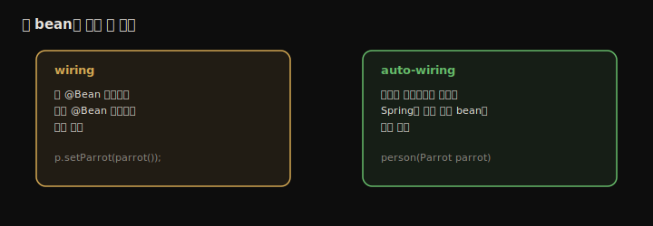
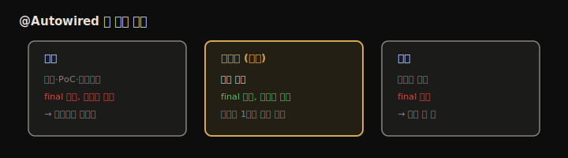

# Bean 와이어링과 의존성 주입
---
> 2장에서 Context에 bean을 올렸다면, 이 장은 그 bean들끼리 관계를 맺는 법을 다룹니다. 객체는 책임을 수행하며 다른 객체에 일을 위임하므로(has-A), Spring 앱에서도 bean이 다른 bean을 참조하게 만들어야 합니다. 직접 메서드를 호출하는 wiring, 메서드 파라미터로 받는 auto-wiring, 그리고 `@Autowired`를 쓰는 의존성 주입(DI)까지 정리하고, 순환 의존과 같은 타입 다중 bean 선택 문제도 함께 봅니다.


## 핵심 요약

bean 사이 관계를 맺는 방법은 크게 셋입니다. 첫째, 설정 클래스에서 한 `@Bean` 메서드가 다른 `@Bean` 메서드를 직접 호출하는 **wiring**입니다. 둘째, `@Bean` 메서드에 파라미터를 두면 Spring이 그 타입의 bean을 찾아 넣어 주는 **auto-wiring**입니다. 셋째, 클래스 안에서 `@Autowired`로 주입 지점을 표시하는 방식이며, 필드·생성자·세터 셋 중 **생성자 주입이 실무 권장**입니다. 이 모든 방식은 IoC 원리에 기반한 의존성 주입(DI)으로, 프레임워크가 객체의 필드나 파라미터에 값을 대신 설정해 줍니다. 주의할 점은 두 bean이 서로를 필요로 하면 **순환 의존**으로 교착에 빠지고, 같은 타입 bean이 여럿이면 이름·`@Primary`·`@Qualifier`로 골라야 한다는 것입니다.


## 학습 목표

> 이 내용을 읽고 나면 다음을 할 수 있습니다.

1. wiring과 auto-wiring의 차이를 설명하고 각각 구현할 수 있습니다.
2. `@Bean` 메서드끼리 호출해도 인스턴스가 하나만 생기는 이유를 설명할 수 있습니다.
3. `@Autowired`의 세 방식(필드·생성자·세터)을 비교하고 생성자 주입을 권장 이유와 함께 고를 수 있습니다.
4. 순환 의존이 왜 생기고 어떻게 피하는지 설명할 수 있습니다.
5. 같은 타입 bean이 여럿일 때 이름·`@Primary`·`@Qualifier`로 선택할 수 있습니다.


## 본문 정리


### 1. 관계 맺기 — has-A 만들기

예제는 Context에 `Person`과 `Parrot` 두 bean을 올린 뒤, 사람이 앵무새를 소유하게(`Person` has-A `Parrot`) 연결하는 상황입니다. 관계를 맺기 전에는 `person.getParrot()`이 `null`입니다.

```java
@Configuration
public class ProjectConfig {
  @Bean public Parrot parrot() { var p = new Parrot(); p.setName("Koko"); return p; }
  @Bean public Person person() { var p = new Person(); p.setName("Ella"); return p; }
}
// 출력: Person's parrot: null  ← 아직 관계 없음
```




### 2. 방법 1 — wiring (직접 메서드 호출)

`person()` 메서드 안에서 `parrot()` 메서드를 직접 호출해 연결합니다.

```java
@Bean
public Person person() {
  Person p = new Person();
  p.setName("Ella");
  p.setParrot(parrot());   // parrot() 직접 호출 → has-A 성립
  return p;
}
// 출력: Person's parrot: Parrot : Koko
```

> ⚠️ 헷갈리는 지점: `parrot()`을 직접 부르면 Parrot 인스턴스가 두 개(컨텍스트용 1 + 호출용 1) 생기지 않을까요? **아닙니다. 전체에서 단 하나입니다.** `@Bean`으로 정의된 메서드는 Spring이 호출을 가로채(6장 AOP), 해당 bean이 이미 Context에 있으면 메서드를 다시 실행하지 않고 기존 인스턴스를 반환합니다.

```
// 검증: Parrot 생성자에 출력문을 넣고 실행하면
Parrot created      ← 단 한 번만 찍힘
Person's name: Ella
Person's parrot: Parrot : Koko
```


### 3. 방법 2 — auto-wiring (메서드 파라미터)

`@Bean` 메서드에 파라미터를 두면, Spring이 그 타입의 bean을 Context에서 찾아 주입합니다. wiring과 달리 대상 bean이 `@Bean`이든 `@Component`든 상관없어 조금 더 유연합니다.

```java
@Bean
public Person person(Parrot parrot) {   // Spring이 parrot bean을 주입
  Person p = new Person();
  p.setName("Ella");
  p.setParrot(parrot);
  return p;
}
```

여기서 Spring이 파라미터에 값을 넣어 주는 동작이 **의존성 주입(DI)**입니다. DI는 IoC 원리의 한 적용으로, 프레임워크가 실행 시점에 객체의 필드·파라미터에 값을 설정해 줍니다. IoC 개념도는 [1장의 IoC 도식](./01.Spring과%20프레임워크.md)을 참고하면 됩니다(Without IoC는 앱이 의존성을 제어, With IoC는 프레임워크가 앱을 제어).


### 4. 방법 3 — @Autowired (클래스 안에서 주입)

`@Autowired`는 클래스를 수정할 수 있을 때(라이브러리 클래스가 아닐 때) 주입 지점을 클래스 안에 직접 표시하는 방식입니다. 관계가 가장 눈에 잘 띕니다. 세 가지 위치에 붙일 수 있습니다.



#### 필드 주입 — 예제용

```java
@Component
public class Person {
  private String name = "Ella";

  @Autowired               // 필드에 직접 주입
  private Parrot parrot;
}
```

간단하지만 운영 코드에서는 피합니다. 필드를 `final`로 만들 수 없어 초기화 후 값 변경을 막지 못하고, 초기화 시점에 값을 직접 관리하기 어려워 테스트가 불편합니다.

#### 생성자 주입 — 실무 권장

```java
@Component
public class Person {
  private String name = "Ella";
  private final Parrot parrot;   // final 가능

  @Autowired                     // 생성자에 주입
  public Person(Parrot parrot) {
    this.parrot = parrot;
  }
}
```

생성자 주입은 필드를 `final`로 만들어 초기화 후 불변을 보장하고, Spring 없이도 생성자 호출로 값을 넣어 단위 테스트하기 쉽습니다. Spring 4.3부터 **생성자가 하나뿐이면 `@Autowired`를 생략**할 수 있습니다.

#### 세터 주입 — 거의 안 씀

```java
@Autowired
public void setParrot(Parrot parrot) { this.parrot = parrot; }
```

읽기 어렵고 `final`도 못 쓰며 테스트에도 도움이 안 돼 운영 코드에서는 보기 드뭅니다. 존재만 알아 두면 됩니다.


### 5. 순환 의존 (circular dependency)

A를 만들려면 B가 필요한데 B를 만들려면 다시 A가 필요한 교착 상태입니다. Spring은 A도 B도 만들지 못하고 예외로 실패합니다.

```java
@Component class Person { @Autowired Person(Parrot p){...} }   // Person은 Parrot 필요
@Component class Parrot { @Autowired Parrot(Person p){...} }   // Parrot은 Person 필요
```

```
BeanCurrentlyInCreationException: Error creating bean with name 'parrot':
    Requested bean is currently in creation: Is there an unresolvable circular reference?
```

> 순환 의존은 클래스 설계가 잘못됐다는 신호입니다. 한쪽 의존을 끊도록 코드를 다시 짜야 합니다. 예외 메시지가 원인 클래스를 알려 주므로, 그 클래스로 가서 순환을 제거합니다.


### 6. 같은 타입 bean이 여럿일 때 선택

Context에 같은 타입 bean이 여럿이면 Spring이 어느 것을 주입할지 다음 순서로 정합니다.

| 우선순위 | 조건 | 동작 |
|---------|------|------|
| ① 이름 일치 | 파라미터 이름 = bean 이름 | 그 bean 주입 |
| ② @Primary | 이름이 안 맞고 `@Primary` 지정된 bean 있음 | primary bean 주입 |
| ③ @Qualifier | `@Qualifier("이름")`으로 명시 | 지정한 bean 주입 |
| ④ 실패 | 위 어느 것도 없음 | 예외 (어느 것인지 모름) |

```java
// ① 파라미터 이름으로 — parrot2 bean이 주입됨 (Miki)
@Bean public Person person(Parrot parrot2) { ... }

// ③ @Qualifier로 명시 — 권장
@Bean public Person person(@Qualifier("parrot2") Parrot parrot) { ... }
```

> 저자는 파라미터 *이름*에 의존하는 방식을 권하지 않습니다. 다른 개발자가 변수명을 리팩토링하다 실수로 동작을 바꿀 수 있기 때문입니다. 의도를 분명히 드러내는 `@Qualifier`가 더 안전합니다. 이는 `@Autowired` 생성자 파라미터에도 똑같이 적용됩니다.


## 심화 학습

> 책은 Spring 5 기준입니다. 이후 변화와 실무 맥락을 보강합니다.

- **생성자 주입과 Lombok**: Spring 4.3의 "생성자 1개면 `@Autowired` 생략" 규칙 덕에, 실무에서는 Lombok `@RequiredArgsConstructor`로 `final` 필드를 받는 생성자를 자동 생성하는 패턴이 표준처럼 쓰입니다. 코드가 짧아지면서도 생성자 주입의 장점(불변·테스트 용이)을 유지합니다.
- **필드 주입을 피하는 또 다른 이유**: 필드 주입은 순환 의존을 *런타임까지 숨깁니다*. 생성자 주입은 순환 의존이 있으면 기동 시점에 바로 실패해 문제를 일찍 드러냅니다. 그래서 생성자 주입이 설계 결함을 빨리 잡는 데 유리합니다.
- **`@Qualifier` vs `@Primary` 선택**: `@Primary`는 "기본값이 명확한 하나"가 있을 때(예: 주 데이터소스), `@Qualifier`는 "주입 지점마다 다른 걸 골라야 할 때" 맞습니다. 둘을 함께 두면 `@Qualifier`가 우선합니다.


## 실무 적용 포인트

### 이런 상황에서 사용하세요

- 내 서비스·리포지토리 클래스 간 의존 연결 → `@Autowired` 생성자 주입 (또는 Lombok `@RequiredArgsConstructor`)
- 라이브러리 객체를 다른 bean에 연결 → `@Bean` 메서드 파라미터(auto-wiring)
- 같은 타입 구현체가 여럿(예: 결제 수단별 전략) → `@Qualifier`로 주입 지점마다 명시

### 주의할 점

- ⚠️ 필드 주입은 예제·테스트에만. 운영 코드는 생성자 주입으로 `final`을 보장합니다.
- ⚠️ 순환 의존은 설계 결함입니다. `@Lazy`로 회피하기보다 의존 방향을 다시 설계합니다.
- ⚠️ 파라미터/변수 이름에 의존한 bean 선택은 리팩토링에 깨지기 쉽습니다. `@Qualifier`로 의도를 고정합니다.


## 면접 대비

### 한 줄 정의

"의존성 주입(DI)이란 객체가 필요한 의존성을 스스로 만들지 않고, 프레임워크가 외부에서 필드·생성자·세터를 통해 넣어 주는 기법이며, IoC 원리의 한 적용입니다."

### 핵심 포인트 3가지

1. bean 관계는 wiring(직접 호출)·auto-wiring(파라미터)·`@Autowired`(클래스 내 표시) 세 방식으로 맺습니다.
2. `@Autowired`는 필드·생성자·세터 중 **생성자 주입이 권장**되며, `final`·테스트 용이성이 이유입니다.
3. 같은 타입 다중 bean은 이름·`@Primary`·`@Qualifier` 순으로 선택하고, `@Qualifier`가 가장 안전합니다.

### 자주 묻는 질문

Q: `@Bean` 메서드끼리 호출하면 인스턴스가 두 개 생기지 않나요?
A: 아닙니다. Spring이 `@Bean` 메서드 호출을 가로채, 이미 Context에 bean이 있으면 메서드를 다시 실행하지 않고 기존 인스턴스를 반환합니다. 전체에서 하나만 생성됩니다.

Q: 왜 필드 주입보다 생성자 주입을 권장하나요?
A: 생성자 주입은 필드를 `final`로 만들어 불변을 보장하고, Spring 없이 생성자만 호출해 테스트하기 쉬우며, 순환 의존을 기동 시점에 바로 드러냅니다.

Q: 순환 의존은 어떻게 해결하나요?
A: 근본적으로 설계 결함이므로 한쪽 의존을 끊도록 클래스를 다시 짭니다. 예외 메시지가 원인 클래스를 알려 주므로 그 지점의 의존 방향을 재설계합니다.


## 핵심 개념 체크리스트

- [ ] wiring과 auto-wiring의 차이를 설명할 수 있는가?
- [ ] `@Bean` 메서드 상호 호출이 인스턴스를 하나만 만드는 이유를 아는가?
- [ ] `@Autowired` 세 방식의 장단점과 생성자 주입 권장 이유를 말할 수 있는가?
- [ ] DI가 IoC의 한 적용이라는 점을 설명할 수 있는가?
- [ ] 순환 의존의 원인과 해결책을 아는가?
- [ ] 다중 bean 선택 4단계(이름·@Primary·@Qualifier·실패)를 아는가?


## 참고 자료

- 공식 문서: [Spring Framework Reference — Dependencies & DI](https://docs.spring.io/spring-framework/reference/core/beans/dependencies.html)
- 연관 노트: [Spring Context와 Bean 등록](./02.Spring%20Context와%20Bean%20등록.md) · [객체지향 원리 적용 — DI와 IoC](../../01_core/01-01.객체지향%20원리%20적용%20—%20DI와%20IoC.md)
- 다음 장: 4장 — 추상화를 적용한 실전에 가까운 클래스 설계
