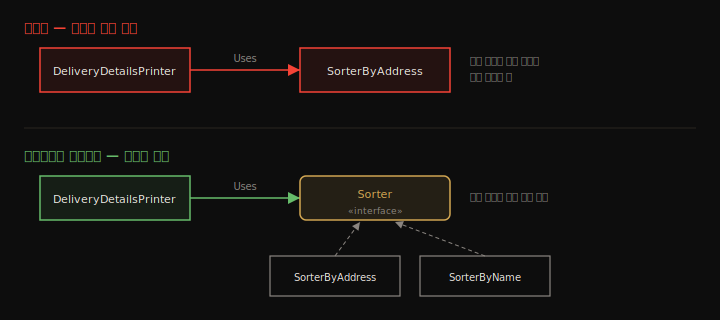
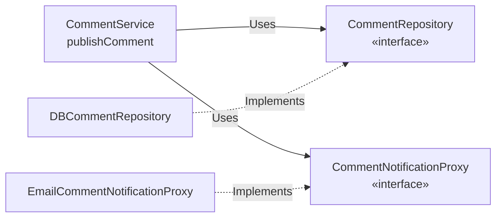
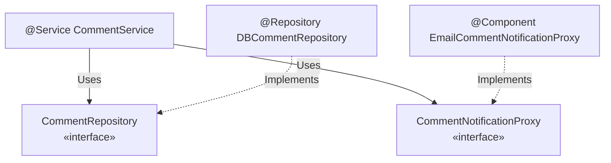

# 추상화와 의존성 주입
---
> 실전 프로젝트는 구현을 분리하기 위해 추상화(인터페이스)를 씁니다. 이 장은 인터페이스로 계약을 정의해 객체를 디커플링하는 법, 그 추상화에 Spring DI를 적용하는 법, 같은 인터페이스 구현체가 여럿일 때 고르는 법(`@Primary`·`@Qualifier`), 그리고 객체 책임을 드러내는 `@Service`·`@Repository` 스테레오타입을 정리합니다.


## 핵심 요약

인터페이스는 "무엇이 필요한가(what)"만 선언하고, 구현 클래스가 "어떻게 하는가(how)"를 정의합니다. 객체가 구체 클래스가 아니라 인터페이스에 의존하면, 구현을 바꿔도 그 구현을 쓰는 객체는 고치지 않아도 되어 앱이 유지보수·테스트하기 쉬워집니다. Spring DI는 추상화도 이해해서, 인터페이스 타입의 의존성을 선언하면 그 인터페이스를 구현한 bean을 Context에서 찾아 주입합니다. 같은 인터페이스 구현체가 여럿이면 `@Primary`(기본 하나)나 `@Qualifier`(이름으로 지정)로 고릅니다. 스테레오타입은 인스턴스화되는 클래스에만 붙이고 인터페이스에는 붙이지 않으며, 책임을 드러내려 서비스에는 `@Service`, 영속화에는 `@Repository`를 씁니다.


## 학습 목표

> 이 내용을 읽고 나면 다음을 할 수 있습니다.

1. 인터페이스가 "what"을, 구현이 "how"를 맡는다는 계약 개념을 설명할 수 있습니다.
2. 강결합 설계의 문제와 인터페이스 디커플링의 이점을 말할 수 있습니다.
3. 어떤 객체를 Context에 올릴지(의존성이거나 의존성을 갖는 객체) 판단할 수 있습니다.
4. 추상화에 DI를 적용하고, 다중 구현체를 `@Primary`·`@Qualifier`로 선택할 수 있습니다.
5. `@Component`·`@Service`·`@Repository`를 책임에 맞게 구분해 쓸 수 있습니다.


## 본문 정리


### 1. 인터페이스로 계약 정의하기

인터페이스는 책임을 선언하는 추상 구조입니다. 인터페이스를 구현하는 객체는 그 책임을 정의해야 하고, 여러 객체가 같은 인터페이스를 서로 다르게 구현할 수 있습니다. 인터페이스는 "무엇이 일어나야 하는가"를, 구현체는 "어떻게 일어나는가"를 명세합니다.

> 💬 **비유**: 차량 호출 앱은 인터페이스와 같습니다. 승객은 특정 차나 기사를 지목하는 게 아니라 *이동*을 요청합니다. 차를 가진 어떤 기사든 그 요청에 응할 수 있고, 승객과 기사는 앱(인터페이스)을 통해 분리됩니다. 승객은 어떤 차가 올지 모르고, 기사도 누구를 태울지 미리 몰라도 됩니다.

강결합이 왜 문제인지 봅시다. 배송 상세를 주소순으로 정렬해 출력하는 `DeliveryDetailsPrinter`가 `SorterByAddress`를 직접 사용하면, 정렬 기준을 이름순으로 바꾸려 할 때 정렬 객체뿐 아니라 *그것을 쓰는 출력 객체까지* 고쳐야 합니다. 출력 객체가 "무엇이 필요한가(정렬)"와 "어떻게(주소순)"를 둘 다 알고 있기 때문입니다.




### 2. 프레임워크 없이 구현하기 — 댓글 발행 use case

실전에 가까운 예제로 넘어갑니다. 팀 작업 관리 앱에서 "사용자가 댓글을 발행하면 저장하고 이메일 알림을 보낸다"는 기능을 설계합니다. 역할을 이름으로 드러내는 관례를 따릅니다.

| 역할 | 이름 관례 | 책임 |
|------|----------|------|
| use case 구현 | `~Service` | 댓글 발행 흐름 조율 |
| DB 작업 | `~Repository` (DAO) | 댓글 저장 |
| 앱 외부 통신 | `~Proxy` | 이메일 알림 전송 |
| 데이터 모델 | model (POJO) | 댓글 데이터 표현 |



`CommentService`는 구체 클래스가 아니라 두 *인터페이스*(`CommentRepository`·`CommentNotificationProxy`)에 의존합니다. 저장 기술을 DB에서 다른 것으로, 알림을 이메일에서 다른 채널로 바꿔도 서비스 코드는 그대로입니다.

```java
public class CommentService {
  private final CommentRepository commentRepository;
  private final CommentNotificationProxy commentNotificationProxy;

  public CommentService(CommentRepository r, CommentNotificationProxy p) {
    this.commentRepository = r;
    this.commentNotificationProxy = p;
  }

  public void publishComment(Comment comment) {
    commentRepository.storeComment(comment);        // 저장 위임
    commentNotificationProxy.sendComment(comment);  // 알림 위임
  }
}
```


### 3. 추상화에 DI 적용하기

이제 Spring을 얹습니다. 먼저 **어떤 객체를 Context에 올릴지** 정합니다. 기준은 "이 객체를 프레임워크가 관리해야 하는가"입니다. 여기서 쓰는 기능은 DI뿐이므로, **의존성을 주입받거나 그 자신이 의존성인 객체**만 올립니다.

| 객체 | Context에 올림? | 이유 |
|------|----------------|------|
| CommentService | ✅ | 두 의존성을 주입받음 |
| DBCommentRepository | ✅ | CommentService의 의존성 |
| EmailCommentNotificationProxy | ✅ | CommentService의 의존성 |
| Comment (model) | ❌ | 의존성도 아니고 갖지도 않음 |

> ⚠️ 필요 없는 객체를 Context에 올리면 복잡도만 늘고 성능에 손해입니다(over-engineering). `Comment` 같은 POJO 모델은 올리지 않습니다.

구현 클래스에 `@Component`(나중에 `@Service`·`@Repository`로 세분)를 붙이고, **인터페이스에는 절대 붙이지 않습니다** — 인터페이스는 인스턴스화할 수 없기 때문입니다.

```java
@Component
public class CommentService {
  private final CommentRepository commentRepository;
  private final CommentNotificationProxy commentNotificationProxy;

  // 생성자 1개라 @Autowired 생략 가능.
  // Spring은 필드 타입이 인터페이스임을 보고, 그 인터페이스를 구현한 bean을 찾아 주입
  public CommentService(CommentRepository r, CommentNotificationProxy p) {
    this.commentRepository = r;
    this.commentNotificationProxy = p;
  }
  public void publishComment(Comment comment) { /* 위임 */ }
}

@Configuration
@ComponentScan(basePackages = {"proxies", "services", "repositories"})
public class ProjectConfiguration { }   // model 패키지는 스캔 안 함
```

핵심은 Spring이 인터페이스 타입의 의존성을 보고 *그 구현체 bean*을 알아서 찾아 준다는 점입니다. 3장에서 배운 모든 DI 방식(필드·생성자·세터, `@Bean` 파라미터)이 추상화에도 똑같이 동작합니다.

> `@ComponentScan`의 `basePackages`(패키지명)와 `basePackageClasses`(클래스 직접 지정) 중 어느 쪽도 더 낫지 않습니다. 패키지명은 한 줄로 끝나지만 리네임 시 놓치기 쉽고, 클래스 지정은 길지만 컴파일 에러로 변경을 강제합니다.


### 4. 같은 인터페이스 구현체가 여럿일 때

한 인터페이스에 구현체가 둘 이상이면, 타입만으로 주입할 때 `NoUniqueBeanDefinitionException`("expected single matching bean but found 2")이 납니다. 3장과 같은 두 방법으로 해결합니다.

#### @Primary — 기본 구현 지정

라이브러리가 제공하는 구현 대신 내 커스텀 구현을 기본으로 쓰고 싶을 때 가장 간단합니다.

```java
@Component
@Primary   // 이름 없이 주입하면 이 구현이 기본 선택
public class CommentPushNotificationProxy implements CommentNotificationProxy {
  @Override public void sendComment(Comment c) { /* push */ }
}
```

#### @Qualifier — 주입 지점마다 다른 구현

서로 다른 객체가 같은 인터페이스의 *다른* 구현을 써야 할 때 이름으로 지목합니다.

```java
@Component @Qualifier("PUSH")
public class CommentPushNotificationProxy implements CommentNotificationProxy { }

@Component @Qualifier("EMAIL")
public class EmailCommentNotificationProxy implements CommentNotificationProxy { }

@Component
public class CommentService {
  public CommentService(
      CommentRepository r,
      @Qualifier("PUSH") CommentNotificationProxy p) {   // PUSH 구현 주입
    this.commentRepository = r;
    this.commentNotificationProxy = p;
  }
}
```

| 상황 | 선택 |
|------|------|
| 기본값이 명확한 하나 (예: 라이브러리 구현 대신 내 구현) | `@Primary` |
| 주입 지점마다 다른 구현을 골라야 함 | `@Qualifier` |


### 5. 책임을 드러내는 스테레오타입 — @Service·@Repository

`@Component`는 일반적이라 객체 책임을 알려 주지 않습니다. Spring은 책임을 명시하는 두 스테레오타입을 제공합니다. 셋(`@Component`·`@Service`·`@Repository`) 모두 인스턴스를 만들어 Context에 올린다는 동작은 같지만, 이름으로 설계 의도를 드러냅니다.



| 애너테이션 | 책임 | 대상 |
|-----------|------|------|
| `@Service` | use case 구현 | 서비스 객체 |
| `@Repository` | 데이터 영속화 | 리포지토리 객체 |
| `@Component` | 그 외 (Spring이 전용 애너테이션을 안 주는 책임) | 프록시 등 |

```java
@Service     public class CommentService { }
@Repository  public class DBCommentRepository implements CommentRepository { }
@Component   public class EmailCommentNotificationProxy implements CommentNotificationProxy { }
```


## 심화 학습

> 책은 Spring 5 기준입니다. 실무 맥락과 이후 동향을 보강합니다.

- **`@Repository`의 숨은 기능**: 책은 셋이 "동작은 같다"고 설명하지만, `@Repository`는 추가로 **영속성 예외 변환**(persistence exception translation)을 켭니다. JPA·JDBC가 던지는 벤더별 예외를 Spring의 `DataAccessException` 계층으로 번역해, 데이터 접근 기술을 바꿔도 상위 코드가 같은 예외 추상화를 보게 합니다. 단순 마커가 아니라는 점이 실무에서 중요합니다.
- **`@Controller`·`@RestController`**: 4장은 `@Service`·`@Repository`까지 다루지만, 웹 계층에는 `@Controller`(7장)와 `@RestController`가 더해집니다. 넷 다 `@Component`의 특수화입니다.
- **인터페이스 디커플링과 테스트**: 추상화의 진짜 이득은 테스트에서 드러납니다. `CommentService`가 인터페이스에 의존하므로, 단위 테스트에서 `CommentRepository`를 Mockito mock으로 갈아끼워 DB 없이 발행 흐름만 검증할 수 있습니다(15장 주제와 연결).


## 실무 적용 포인트

### 이런 상황에서 사용하세요

- 저장 기술·외부 연동처럼 *바뀔 수 있는* 의존성 → 인터페이스로 추상화하고 구현을 갈아끼움
- 결제 수단·알림 채널처럼 같은 계약의 여러 구현 → `@Qualifier`로 주입 지점마다 지목
- 라이브러리 기본 구현을 내 것으로 덮어쓰기 → 내 구현에 `@Primary`

### 주의할 점

- ⚠️ 인터페이스·추상 클래스에는 스테레오타입을 붙이지 않습니다(인스턴스화 불가).
- ⚠️ 관리 이득이 없는 POJO 모델은 Context에 올리지 않습니다.
- ⚠️ 다중 구현체에서 아무 표시도 안 하면 기동 시 `NoUniqueBeanDefinitionException`으로 실패합니다.


## 면접 대비

### 한 줄 정의

"추상화(인터페이스)란 객체가 '무엇이 필요한가'만 선언하고 '어떻게 하는가'는 구현체에 맡기는 계약이며, 이를 통해 구현 교체가 사용처에 영향을 주지 않게 디커플링합니다."

### 핵심 포인트 3가지

1. 인터페이스는 what을, 구현체는 how를 맡아 구현 교체 시 사용처를 보호합니다.
2. Spring DI는 추상화를 이해해, 인터페이스 타입 의존성에 그 구현체 bean을 주입합니다.
3. 책임은 `@Service`·`@Repository`로 드러내고, 다중 구현체는 `@Primary`·`@Qualifier`로 고릅니다.

### 자주 묻는 질문

Q: 인터페이스에 `@Component`를 붙이면 안 되나요?
A: 안 됩니다. 스테레오타입은 Spring이 인스턴스를 만들어 올릴 클래스에 붙입니다. 인터페이스는 인스턴스화할 수 없어 의미가 없습니다.

Q: `@Service`·`@Repository`·`@Component`는 무슨 차이인가요?
A: 모두 `@Component`의 특수화로 bean 등록 동작은 같지만, 이름으로 책임을 드러냅니다. 특히 `@Repository`는 영속성 예외를 `DataAccessException`으로 번역하는 기능이 추가됩니다.

Q: 구현체가 둘인데 하나만 주입되면 다른 하나는 왜 두나요?
A: 주입 지점마다 다른 구현이 필요하거나(`@Qualifier`), 라이브러리 기본 구현과 내 커스텀 구현이 공존하는 경우(`@Primary`)처럼, 상황에 따라 둘 다 필요하기 때문입니다.


## 핵심 개념 체크리스트

- [ ] 인터페이스의 what/how 분리와 디커플링 이점을 설명할 수 있는가?
- [ ] 어떤 객체를 Context에 올릴지(의존성 여부) 판단할 수 있는가?
- [ ] 인터페이스에 스테레오타입을 안 붙이는 이유를 아는가?
- [ ] 추상화에 DI가 동작하는 원리를 설명할 수 있는가?
- [ ] `@Primary`와 `@Qualifier`의 선택 기준을 아는가?
- [ ] `@Service`·`@Repository`·`@Component`를 책임에 맞게 구분할 수 있는가?


## 참고 자료

- 공식 문서: [Spring Framework Reference — Classpath Scanning & Stereotype](https://docs.spring.io/spring-framework/reference/core/beans/classpath-scanning.html)
- 연관 노트: [Bean 와이어링과 의존성 주입](./03.Bean%20와이어링과%20의존성%20주입.md) · [Spring Boot 레이어드 아키텍처와 패키지 구조](../../../03_architecture/02_application/01-01.Spring%20Boot%20레이어드%20아키텍처와%20패키지%20구조.md)
- 다음 장: 5장 — bean 스코프와 생애주기
