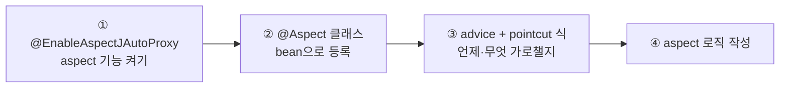
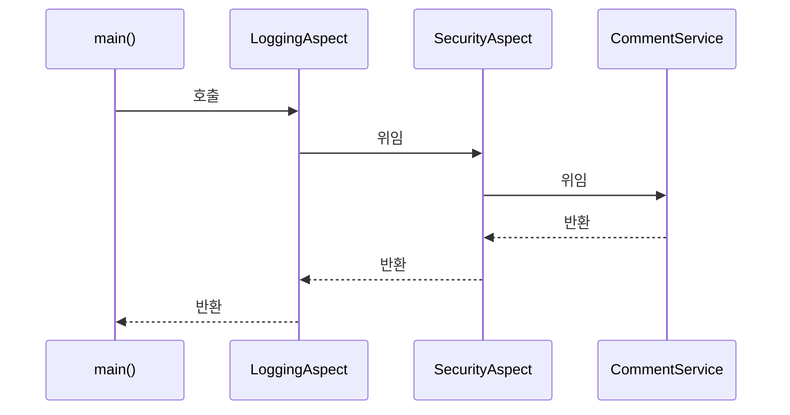

# Spring AOP와 Aspect
---
> Aspect는 IoC가 받쳐 주는 또 하나의 기법으로, 프레임워크가 메서드 호출을 가로채 실행을 바꿀 수 있게 합니다. 비즈니스 로직과 무관한 코드(로깅·보안 등)를 본문에서 떼어 내 가독성을 높입니다. 이 장은 aspect 용어와 프록시 동작, 구현 4단계, 파라미터·반환값 조작, 애너테이션 인터셉트, advice 5종, 그리고 여러 aspect의 실행 순서(@Order)를 정리합니다.


## 핵심 요약

AOP는 특정 메서드 호출을 가로채(intercept) 그 전·후·대신에 로직을 끼워 넣는 기법입니다. 가로챌 로직이 **aspect**, 언제 실행할지가 **advice**, 어느 메서드를 가로챌지가 **pointcut**, 가로채는 대상 bean이 **target object**입니다. Spring은 target을 직접 주지 않고 **프록시 객체**를 대신 주어, 프록시가 aspect 로직을 실행한 뒤 실제 메서드로 위임합니다(weaving). 이 때문에 aspect 대상 bean은 반드시 Context의 bean이어야 합니다. 구현은 ①`@EnableAspectJAutoProxy` ②`@Aspect` 클래스를 bean으로 등록 ③advice 애너테이션 + AspectJ pointcut 식 ④로직 작성의 4단계입니다. advice는 `@Around`(가장 강력)·`@Before`·`@After`·`@AfterReturning`·`@AfterThrowing` 다섯이며, 여러 aspect가 한 메서드를 가로채면 `@Order`로 실행 순서를 정합니다. Spring의 트랜잭션·보안이 모두 aspect 위에 서 있어, AOP를 알면 프레임워크 내부를 이해하게 됩니다.


## 학습 목표

> 이 내용을 읽고 나면 다음을 할 수 있습니다.

1. aspect·advice·pointcut·join point·target object 용어를 설명할 수 있습니다.
2. Spring이 프록시로 메서드를 가로채는 weaving 원리를 설명할 수 있습니다.
3. aspect 구현 4단계를 따라 로깅 aspect를 작성할 수 있습니다.
4. aspect가 파라미터·반환값을 읽고 바꾸는 동작을 구현할 수 있습니다.
5. advice 5종을 구분하고, 여러 aspect의 실행 순서를 `@Order`로 제어할 수 있습니다.


## 본문 정리


### 1. AOP가 동작하는 원리 — 용어와 프록시

aspect를 설계할 때 정하는 것은 셋입니다.

| 용어 | 의미 |
|------|------|
| aspect | 가로챌 때 실행할 로직 |
| advice | 그 로직을 언제 실행하나 (전·후·대신) |
| pointcut | 어느 메서드를 가로채나 |
| join point | aspect 실행을 촉발하는 사건 — Spring에서는 *항상 메서드 호출* |
| target object | 가로채지는 메서드를 가진 bean |

DI와 마찬가지로, aspect를 적용하려면 대상 객체가 Context의 bean이어야 합니다. 그런데 그 bean을 aspect 대상으로 만들면, Spring은 요청 시 **실제 인스턴스가 아니라 프록시 객체**를 줍니다. `getBean()`이든 DI든 가로채지는 bean을 받을 때는 늘 프록시를 받습니다. 이를 **weaving**이라 합니다.

<svg viewBox="0 0 720 300" font-family="'Pretendard', -apple-system, 'Noto Sans KR', sans-serif" role="img" aria-label="aspect weaving 프록시 동작">
  <rect x="0" y="0" width="720" height="300" fill="#0d0d0d"/>

  <text x="24" y="32" fill="rgb(138,133,128)" font-size="13" font-weight="bold">Without aspect — 직접 호출</text>
  <text x="40" y="62" fill="#e8e4df" font-size="11">caller</text>
  <line x1="90" y1="58" x2="240" y2="58" stroke="rgb(138,133,128)" stroke-width="1.5" marker-end="url(#ar6)"/>
  <text x="120" y="50" fill="rgb(138,133,128)" font-size="10">publishComment</text>
  <rect x="240" y="40" width="160" height="40" fill="#0d0d0d" stroke="rgb(138,133,128)" stroke-width="1.2"/>
  <text x="320" y="65" fill="#e8e4df" font-size="11" text-anchor="middle">CommentService</text>

  <line x1="24" y1="108" x2="696" y2="108" stroke="rgb(42,37,32)" stroke-width="1"/>

  <text x="24" y="140" fill="rgb(212,168,83)" font-size="13" font-weight="bold">With aspect — 프록시 경유</text>
  <text x="40" y="178" fill="#e8e4df" font-size="11">caller</text>
  <line x1="90" y1="174" x2="210" y2="174" stroke="rgb(212,168,83)" stroke-width="1.5" marker-end="url(#ar6g)"/>
  <text x="110" y="166" fill="rgb(212,168,83)" font-size="10">publishComment</text>
  <rect x="210" y="150" width="200" height="80" rx="6" fill="rgba(212,168,83,0.12)" stroke="rgb(212,168,83)" stroke-width="2"/>
  <text x="310" y="178" fill="rgb(212,168,83)" font-size="12" font-weight="bold" text-anchor="middle">Proxy</text>
  <text x="310" y="200" fill="#e8e4df" font-size="10" text-anchor="middle">aspect 로직 실행</text>
  <text x="310" y="216" fill="rgb(138,133,128)" font-size="10" text-anchor="middle">후 위임</text>
  <line x1="410" y1="190" x2="510" y2="190" stroke="rgb(212,168,83)" stroke-width="1.5" marker-end="url(#ar6g)"/>
  <text x="430" y="182" fill="rgb(138,133,128)" font-size="10">Delegates</text>
  <rect x="510" y="170" width="160" height="40" fill="#0d0d0d" stroke="rgb(138,133,128)" stroke-width="1.2"/>
  <text x="590" y="195" fill="#e8e4df" font-size="11" text-anchor="middle">CommentService</text>
  <text x="40" y="266" fill="rgb(138,133,128)" font-size="11">caller는 프록시를 받지만, 실제 메서드를 부른다고 여깁니다(type에 EnhancerBySpringCGLIB 표시)</text>

  <defs>
    <marker id="ar6" markerWidth="8" markerHeight="8" refX="6" refY="3" orient="auto"><path d="M0,0 L6,3 L0,6 Z" fill="rgb(138,133,128)"/></marker>
    <marker id="ar6g" markerWidth="8" markerHeight="8" refX="6" refY="3" orient="auto"><path d="M0,0 L6,3 L0,6 Z" fill="rgb(212,168,83)"/></marker>
  </defs>
</svg>

> aspect는 강력한 만큼 위험합니다. 본문에서 *드러나야 할* 로직까지 숨기면 앱이 오히려 이해하기 어려워집니다. 중복되거나 무관한 코드만 떼어 내고, "이 코드를 읽는 사람이 무슨 일이 일어나는지 쉽게 알 수 있는가"를 늘 자문해야 합니다.


### 2. aspect 구현 4단계

로깅 aspect를 예로 4단계를 따릅니다. `spring-aspects` 의존성이 추가로 필요합니다.



```java
// ① 설정 클래스에서 aspect 활성화
@Configuration
@ComponentScan(basePackages = "services")
@EnableAspectJAutoProxy
public class ProjectConfig {
  @Bean public LoggingAspect aspect() { return new LoggingAspect(); }  // ② bean 등록
}

// ②③④ aspect 클래스
@Aspect
public class LoggingAspect {
  private Logger logger = Logger.getLogger(LoggingAspect.class.getName());

  @Around("execution(* services.*.*(..))")   // ③ pointcut 식
  public void log(ProceedingJoinPoint joinPoint) throws Throwable {
    logger.info("Method will execute");       // ④ 메서드 전
    joinPoint.proceed();                       //    실제 메서드 호출
    logger.info("Method executed");            //    메서드 후
  }
}
```

> ⚠️ **`@Aspect`는 스테레오타입이 아닙니다.** `@Aspect`만 붙이면 Spring이 bean을 만들어 주지 않으므로, 반드시 `@Bean`이나 `@Component`로 따로 bean을 등록해야 합니다. 이를 잊는 게 흔한 실수입니다.

pointcut 식 `execution(* services.*.*(..))`은 AspectJ pointcut 언어입니다. 의미는 "services 패키지의 어떤 클래스든, 반환 타입·메서드명·파라미터와 무관하게 모든 메서드를 가로챈다"입니다.

| 토큰 | 의미 |
|------|------|
| `execution(...)` | 메서드가 호출될 때 |
| 첫 `*` | 반환 타입 무관 |
| `services` | services 패키지 |
| 두 번째 `*` | 어느 클래스든 |
| 세 번째 `*` | 어느 메서드명이든 |
| `(..)` | 파라미터 무관 |

`ProceedingJoinPoint.proceed()`가 실제 메서드를 호출합니다. **`proceed()`를 부르지 않으면 실제 메서드는 실행되지 않습니다** — 인가(authorization) aspect가 조건 미충족 시 위임하지 않는 식으로 활용합니다. `proceed()`는 `Throwable`을 던지므로, 필요하면 try-catch로 다룹니다.


### 3. 파라미터와 반환값 조작

`ProceedingJoinPoint`로 가로챈 메서드의 이름·파라미터를 읽고, 반환값까지 다룰 수 있습니다.

```java
@Around("execution(* services.*.*(..))")
public Object log(ProceedingJoinPoint joinPoint) throws Throwable {
  String methodName = joinPoint.getSignature().getName();   // 메서드명
  Object[] arguments = joinPoint.getArgs();                 // 파라미터

  logger.info("Method " + methodName + " with " + Arrays.asList(arguments));
  Object returnedByMethod = joinPoint.proceed();            // 호출 + 반환값
  logger.info("returned " + returnedByMethod);
  return returnedByMethod;                                  // 반환값 전달
}
```

aspect는 읽기를 넘어 **바꿀** 수도 있습니다.

```java
// 파라미터를 다른 값으로 바꿔 호출
Object[] newArgs = { otherComment };
Object returned = joinPoint.proceed(newArgs);   // 원본 대신 newArgs 전달

return "FAILED";   // 실제 메서드가 SUCCESS를 반환해도 caller엔 FAILED를 줌
```

aspect는 ① 메서드에 넘기는 파라미터 변경 ② caller가 받는 반환값 변경 ③ 예외를 던지거나 가로챈 메서드의 예외를 잡아 처리까지 할 수 있습니다.

> ⚠️ 이만큼 강력하므로 *반드시 조심*해야 합니다. aspect로 로직을 바꾸면 그 부분이 투명해집니다(보이지 않게 됩니다). 본문에서 명백하지 않으면 안 될 것을 숨기지 않도록 주의해야 합니다.


### 4. 애너테이션으로 가로챌 메서드 표시

복잡한 AspectJ 식 대신, 커스텀 애너테이션을 만들어 표시한 메서드만 가로채는 방식이 실무에서 흔합니다.

```java
// 커스텀 애너테이션 — RUNTIME 보존 필수 (없으면 런타임에 가로챌 수 없음)
@Retention(RetentionPolicy.RUNTIME)
@Target(ElementType.METHOD)
public @interface ToLog { }

@Service
public class CommentService {
  public void publishComment(Comment c) { /* ... */ }

  @ToLog                                    // 이 메서드만 가로채짐
  public void deleteComment(Comment c) { /* ... */ }

  public void editComment(Comment c) { /* ... */ }
}

// pointcut을 애너테이션 기준으로
@Aspect
public class LoggingAspect {
  @Around("@annotation(ToLog)")             // @ToLog 붙은 메서드만 weaving
  public Object log(ProceedingJoinPoint joinPoint) throws Throwable { /* ... */ }
}
```

> `@Retention(RUNTIME)`이 핵심입니다. 자바 애너테이션은 기본적으로 런타임에 가로챌 수 없으므로, RUNTIME으로 명시해야 aspect가 인식합니다. `@Target(METHOD)`로 적용 대상을 메서드로 제한합니다.


### 5. advice 5종

지금까지 쓴 `@Around`가 가장 강력합니다(전·후·대신 모두 가능, `proceed()` 제어). 하지만 단순한 경우엔 더 단순한 advice를 골라 구현을 간결하게 유지하는 편이 낫습니다.

| advice | 실행 시점 | ProceedingJoinPoint |
|--------|----------|---------------------|
| `@Around` | 전·후·대신 (가장 강력) | 받음, `proceed()` 직접 제어 |
| `@Before` | 가로챈 메서드 *전* | 안 받음 |
| `@AfterReturning` | 정상 반환 후 (반환값 받기 가능) | 안 받음 |
| `@AfterThrowing` | 예외 발생 시 (예외 인스턴스 받기 가능) | 안 받음 |
| `@After` | 실행 후 (성공·예외 무관) | 안 받음 |

`@Around` 외 advice는 `ProceedingJoinPoint`를 받지 않고, 위임 시점을 스스로 정하지 않습니다 — 애너테이션 성격대로 자동 결정됩니다.

```java
@AfterReturning(value = "@annotation(ToLog)", returning = "returnedValue")
public void log(Object returnedValue) {     // 파라미터명 = returning 속성값
  logger.info("returned " + returnedValue);
}
```


### 6. aspect 실행 체인 — @Order

한 메서드를 여러 aspect가 가로채면 실행 순서가 생깁니다. 예로 `SecurityAspect`(조건 미충족 시 위임 안 함)와 `LoggingAspect`가 같은 메서드에 걸리면, 순서에 따라 결과가 달라집니다.



> **순서가 중요합니다.** `SecurityAspect`가 먼저 실행되고 위임을 거부하면 `LoggingAspect`가 실행되지 않습니다. 거부된 호출까지 로깅하려면 `LoggingAspect`가 *먼저* 실행돼야 합니다.

Spring은 기본적으로 두 aspect의 순서를 보장하지 않습니다. 순서가 중요하면 `@Order`(작을수록 먼저)를 씁니다.

```java
@Aspect @Order(1)   // 먼저 실행
public class SecurityAspect { /* ... */ }

@Aspect @Order(2)   // 나중 실행
public class LoggingAspect { /* ... */ }
```


## 심화 학습

> 책은 Spring 5 기준입니다. 실무 맥락과 내부 동작을 보강합니다.

- **프록시 두 종류 — JDK 동적 프록시 vs CGLIB**: 책의 출력에 보이는 `EnhancerBySpringCGLIB`는 CGLIB 프록시입니다. Spring은 대상이 인터페이스를 구현하면 JDK 동적 프록시를, 아니면 CGLIB(클래스 상속 기반)를 씁니다. Spring Boot 2 이후로는 CGLIB가 기본입니다. CGLIB는 상속 기반이라 `final` 클래스·메서드는 프록시를 못 만든다는 한계가 있습니다.
- **자기 호출(self-invocation) 함정**: 프록시 기반 AOP의 가장 흔한 실수입니다. 같은 빈 안에서 `this.otherMethod()`로 부르면 프록시를 거치지 않아 aspect가 동작하지 않습니다. 트랜잭션 `@Transactional`이 내부 호출에서 안 먹는 고전적 버그가 바로 이것입니다. AspectJ 위빙(load-time/compile-time)으로 가면 해결되지만 설정이 무거워집니다.
- **트랜잭션·보안이 AOP 위에 있다**: 6장의 진짜 가치는 13장(트랜잭션)·Spring Security 이해에 있습니다. `@Transactional`은 메서드를 `@Around`로 감싸 시작 시 트랜잭션을 열고 정상 반환이면 커밋, 예외면 롤백하는 aspect입니다. AOP를 알면 이 동작이 자연스럽게 보입니다.


## 실무 적용 포인트

### 이런 상황에서 사용하세요

- 여러 서비스에 공통인 횡단 관심사(로깅·감사·성능 측정) → `@Around` aspect + 커스텀 애너테이션
- 메서드 호출 전 인가 검사 → `@Before`나 `@Around`로 조건 미충족 시 위임 거부
- 정상 반환 결과만 후처리 → `@AfterReturning`, 예외만 처리 → `@AfterThrowing`

### 주의할 점

- ⚠️ `@Aspect`만으로는 bean이 안 됩니다. `@Bean`/`@Component`로 반드시 등록합니다.
- ⚠️ 같은 빈 내부 메서드 호출(self-invocation)은 프록시를 거치지 않아 aspect가 안 먹습니다.
- ⚠️ aspect로 너무 많은 로직을 숨기면 유지보수가 어려워집니다. 무관한 코드만 떼어 냅니다.


## 면접 대비

### 한 줄 정의

"AOP란 메서드 호출을 가로채 그 전·후·대신에 횡단 관심사 로직을 끼워 넣는 기법이며, Spring은 프록시 객체로 이를 구현합니다."

### 핵심 포인트 3가지

1. aspect(로직)·advice(시점)·pointcut(대상)으로 구성되며, Spring은 프록시로 weaving합니다.
2. advice 5종 중 `@Around`가 가장 강력하고, 단순한 경우엔 더 간단한 advice를 고릅니다.
3. 여러 aspect가 한 메서드에 걸리면 `@Order`로 실행 순서를 제어합니다.

### 자주 묻는 질문

Q: Spring AOP는 어떻게 메서드를 가로채나요?
A: 대상 bean을 직접 주는 대신 프록시 객체를 줍니다. 프록시가 aspect 로직을 실행한 뒤 실제 메서드로 위임하며, 이를 weaving이라 합니다.

Q: `@Transactional`이 같은 클래스 내부 호출에서 안 먹는 이유는?
A: 프록시 기반 AOP라서, 같은 빈 안에서 `this.method()`로 부르면 프록시를 거치지 않아 트랜잭션 aspect가 적용되지 않습니다(self-invocation 함정).

Q: `@Around`와 다른 advice의 차이는?
A: `@Around`만 `ProceedingJoinPoint`를 받아 `proceed()`로 위임 시점과 여부를 직접 제어합니다. 나머지(`@Before`·`@After` 등)는 시점이 애너테이션 성격으로 고정됩니다.


## 핵심 개념 체크리스트

- [ ] aspect·advice·pointcut·target object 용어를 설명할 수 있는가?
- [ ] Spring이 프록시로 메서드를 가로채는 weaving을 설명할 수 있는가?
- [ ] aspect 구현 4단계를 말할 수 있는가?
- [ ] `@Aspect`만으로는 bean이 안 된다는 점을 아는가?
- [ ] advice 5종을 구분하고 `@Around`가 가장 강력한 이유를 아는가?
- [ ] `@Order`로 실행 순서를 제어하는 법과 self-invocation 함정을 아는가?


## 참고 자료

- 공식 문서: [Spring Framework Reference — AOP](https://docs.spring.io/spring-framework/reference/core/aop.html)
- 연관 노트: [Bean 스코프와 생애주기](./05.Bean%20스코프와%20생애주기.md) · `11_spring/05_aop` 카테고리
- 다음 장: 7장 — Spring MVC로 웹 앱 시작하기
