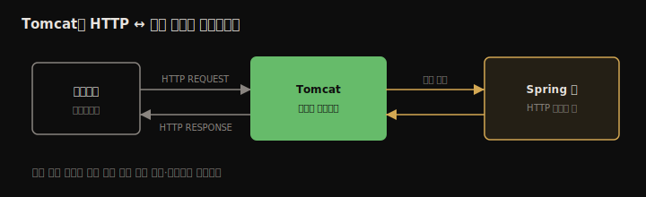
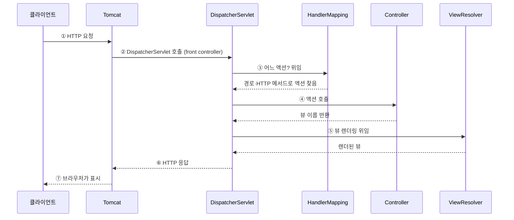

# Spring Boot와 Spring MVC
---
> 1~6장의 Spring 기초(Context·DI·AOP) 위에서, 이제 웹 앱을 짓습니다. 이 장은 웹 앱이 무엇인지, 서블릿 컨테이너(Tomcat)가 왜 필요한지, Spring Boot가 어떤 설정 고통을 덜어 주는지, 그리고 HTTP 요청이 들어와 응답이 나가기까지 Spring MVC 컴포넌트들이 어떻게 협력하는지를 정리합니다.


## 핵심 요약

웹 앱은 브라우저로 접근하는 앱이며, 사용자가 보는 프론트엔드(클라이언트)와 데이터를 처리·저장하는 백엔드(서버)로 나뉩니다. 구현 방식은 백엔드가 화면(HTML)까지 만들어 주는 방식과, 백엔드는 raw 데이터(JSON 등)만 주고 별도 프론트엔드 앱이 화면을 그리는 **프론트-백 분리** 방식 둘입니다. 자바 백엔드는 HTTP를 직접 다루지 않고 **서블릿 컨테이너(Tomcat)**가 HTTP ↔ 자바 객체를 번역합니다. **Spring Boot**는 ①프로젝트 초기화 ②의존성 스타터 ③자동 설정(convention over configuration) 세 기능으로 설정 코드를 거의 없애 줍니다. HTTP 요청이 들어오면 Tomcat이 **DispatcherServlet**(front controller)을 부르고, 이 서블릿이 handler mapping으로 컨트롤러 액션을 찾고, 액션이 반환한 뷰 이름을 view resolver로 렌더링해 응답합니다. 우리가 직접 쓰는 건 컨트롤러뿐이고 나머지는 Spring Boot가 자동 구성합니다.


## 학습 목표

> 이 내용을 읽고 나면 다음을 할 수 있습니다.

1. 웹 앱의 프론트엔드·백엔드 구조와 두 가지 구현 방식을 설명할 수 있습니다.
2. 서블릿 컨테이너와 서블릿이 왜 필요한지 설명할 수 있습니다.
3. Spring Boot의 세 가지 핵심 기능을 말할 수 있습니다.
4. `@Controller`·`@RequestMapping`으로 정적 페이지를 띄우는 컨트롤러를 작성할 수 있습니다.
5. HTTP 요청이 Spring MVC 컴포넌트를 거치는 7단계 흐름을 설명할 수 있습니다.


## 본문 정리


### 1. 웹 앱이란 — 프론트엔드와 백엔드

웹 앱은 브라우저로 접근하는 앱입니다. 설치가 필요 없고 인터넷이 되는 어떤 기기에서든 쓸 수 있어, 예전의 데스크톱 앱 대부분이 웹 앱으로 옮겨 왔습니다. 두 부분으로 나뉩니다.

| 부분 | 다른 이름 | 역할 |
|------|----------|------|
| 클라이언트 측 | 프론트엔드 | 사용자가 직접 상호작용. 브라우저가 요청을 보내고 응답을 받아 표시 |
| 서버 측 | 백엔드 | 요청을 받아 로직 실행, 데이터 처리·저장 후 응답 |

> ⚠️ 백엔드는 **여러 클라이언트를 동시에** 처리합니다. 같은 자원을 읽고 바꾸는 코드를 짜면 race condition으로 잘못 동작할 수 있습니다(5장 singleton 동시성과 같은 맥락).

#### 두 가지 구현 방식

| 방식 | 백엔드가 주는 것 | 화면을 그리는 주체 | 적합 |
|------|----------------|-------------------|------|
| 화면까지 제공 | HTML·CSS·이미지 등 브라우저가 바로 표시할 형식 | 백엔드 | 작은 앱 (이 장 다룸) |
| 프론트-백 분리 | raw 데이터(JSON·XML) | 브라우저가 돌리는 별도 프론트 앱 | 큰 앱 (9장, "모던 방식") |

프론트-백 분리는 팀을 나눠 협업하고 배포를 독립적으로 관리할 수 있어 큰 앱에 유리합니다.


### 2. 서블릿 컨테이너 — HTTP 번역기

브라우저와 서버는 **HTTP**로 통신합니다. 자바 앱이 HTTP 메시지를 직접 파싱할 수도 있지만, 보통은 이미 HTTP를 이해하는 컴포넌트를 씁니다. 그게 **서블릿 컨테이너**(웹 서버)이며, HTTP 요청·응답을 자바 앱이 다룰 객체로 번역합니다. 대표 구현이 **Tomcat**입니다(대안: Jetty·JBoss·Payara).



**서블릿**은 서블릿 컨테이너와 직접 상호작용하는 자바 객체입니다. 컨테이너가 HTTP 요청을 받으면 서블릿 메서드를 호출하며 요청·응답을 파라미터로 넘깁니다. 예전엔 경로(`/home/profile/edit`)마다 서블릿을 만들어 컨테이너에 등록·매핑해야 했습니다. 서블릿 컨테이너는 Spring이 bean을 관리하듯 서블릿 인스턴스를 담은 컨텍스트를 관리하기에 "컨테이너"라 부릅니다.

> 다행히 우리는 서블릿을 직접 만들지 않습니다. 다만 서블릿이 **앱 로직의 진입점**(요청이 앱으로 들어오고 응답이 나가는 통로)이라는 점은 기억해야 합니다.


### 3. Spring Boot의 마법 — 세 가지 핵심 기능

예전엔 서블릿 컨테이너 설정·서블릿 생성·매핑을 손으로 다 써야 했습니다. Spring Boot가 이 고통을 덜어 줍니다.

| 기능 | 내용 |
|------|------|
| 프로젝트 초기화 | `start.spring.io`(Spring Initializr)로 설정된 빈 골격 앱을 생성 |
| 의존성 스타터 | 목적별로 호환되는 의존성 묶음. 개별 의존성·버전 호환을 신경 쓸 필요 없음 |
| 자동 설정 | 추가한 의존성에 맞춰 기본 설정을 제공(convention over configuration) |

#### Spring Initializr가 만드는 것

`@SpringBootApplication`이 붙은 메인 클래스, `spring-boot-starter-parent`(의존성 버전 호환 관리), Spring Boot Maven 플러그인, 그리고 빈 `application.properties`입니다.

```java
@SpringBootApplication
public class Main {
  public static void main(String[] args) {
    SpringApplication.run(Main.class, args);
  }
}
```

#### 의존성 스타터 — 의존성이 아니라 "능력"을 요청

스타터는 `spring-boot-starter-web`처럼 `spring-boot-starter-` 접두사를 가지며, 버전을 명시하지 않습니다(parent가 호환 버전 선택). `spring-boot-starter-web` 하나만 넣어도 Tomcat·Spring Context·AOP 등 웹에 필요한 의존성이 호환 버전으로 함께 딸려 옵니다.

```xml
<dependency>
   <groupId>org.springframework.boot</groupId>
   <artifactId>spring-boot-starter-web</artifactId>
</dependency>
```

#### 자동 설정 — convention over configuration

아무것도 안 써도 앱을 띄우면 Tomcat이 기본 8080 포트로 뜹니다. 웹 의존성을 보고 Spring Boot가 "서블릿 컨테이너가 필요하겠다 → 관례인 Tomcat을 구성"한다고 판단하기 때문입니다. 관례와 다른 부분만 바꾸면 되므로 설정 코드가 거의 없습니다.

```
Tomcat started on port(s): 8080 (http) with context path ''
```


### 4. Spring MVC로 정적 페이지 띄우기

웹 페이지 추가는 두 단계입니다. ①표시할 HTML 작성 ②그 페이지로 연결되는 컨트롤러 작성.

```html
<!-- resources/static/home.html -->
<!DOCTYPE html>
<html lang="en">
<head><title>Home Page</title></head>
<body><h1>Welcome!</h1></body>
</html>
```

```java
@Controller                       // 스테레오타입 — bean으로 등록됨
public class MainController {

  @RequestMapping("/home")        // 이 경로 요청에 액션 연결
  public String home() {
    return "home.html";           // 응답으로 보낼 뷰 이름
  }
}
```

`@Controller`는 `@Component`·`@Service`처럼 스테레오타입이라 bean으로 등록됩니다. 액션 메서드는 `@RequestMapping`으로 HTTP 경로에 매핑하고, 반환할 뷰 문서 이름을 문자열로 돌려줍니다. `http://localhost:8080/home`에 접속하면 "Welcome!"이 보입니다. 경로를 빼먹으면 `404 Not Found`가 납니다.


### 5. Spring MVC 아키텍처 — HTTP 요청 7단계 흐름

요청이 들어와 응답이 나가기까지 Spring MVC 컴포넌트들이 협력합니다. **우리가 직접 쓰는 건 컨트롤러뿐**이고 나머지는 Spring Boot가 자동 구성합니다.



| 단계 | 컴포넌트 | 역할 |
|------|----------|------|
| ① | 클라이언트 | HTTP 요청 전송 |
| ② | Tomcat → DispatcherServlet | Tomcat이 모든 요청을 DispatcherServlet(front controller)에 넘김 |
| ③ | HandlerMapping | 경로·HTTP 메서드로 호출할 컨트롤러 액션을 찾음 (못 찾으면 404) |
| ④ | Controller | 액션 실행 후 뷰 이름(+데이터) 반환 |
| ⑤ | ViewResolver | 뷰 이름으로 실제 뷰를 찾아 렌더링 |
| ⑥⑦ | Tomcat → 클라이언트 | 렌더된 뷰를 HTTP 응답으로 돌려보냄, 브라우저가 표시 |

> **DispatcherServlet**이 7장 figure 7.8에서 말한 그 서블릿입니다. Spring 웹 앱의 진입점이자 front controller로, 모든 요청을 받아 내부 흐름을 조율합니다. HandlerMapping은 경로뿐 아니라 HTTP 메서드로도 액션을 찾는데, 메서드 부분은 8장에서 다룹니다.


## 심화 학습

> 책은 Spring Boot 2 / Spring 5 기준입니다. 이후 변화와 내부 동작을 보강합니다.

- **내장 Tomcat과 실행 가능 JAR**: 이 장의 Tomcat은 외부 설치본이 아니라 앱에 **내장된(embedded)** Tomcat입니다. `spring-boot-maven-plugin`이 의존성을 한 JAR에 말아 넣어(`java -jar app.jar`로 실행), WAS에 배포하던 전통 방식과 달리 앱이 자기 서버를 들고 다닙니다. 이것이 컨테이너·마이크로서비스 시대에 Spring Boot가 표준이 된 핵심 이유입니다.
- **`@SpringBootApplication`의 정체**: 이 한 애너테이션은 `@Configuration` + `@ComponentScan`(메인 클래스 패키지 하위 자동 스캔) + `@EnableAutoConfiguration`(의존성 기반 자동 설정)의 합성입니다. 2장에서 손으로 쓰던 `@ComponentScan`을 Boot가 가려 주는 것이 여기서 드러납니다.
- **Spring Boot 3 변화**: 베이스라인이 Java 17·Jakarta EE 9+로 올라가 서블릿 패키지가 `javax.servlet`에서 `jakarta.servlet`으로 바뀌었습니다. 책의 코드를 최신에서 돌리면 import가 달라집니다.
- **JSP·Thymeleaf와 정적 페이지의 차이**: 이 장은 `resources/static`의 정적 HTML을 그대로 반환합니다. 동적 데이터를 끼운 뷰는 8장에서 Thymeleaf 같은 템플릿 엔진으로 다루며, 그때 ViewResolver의 역할이 본격적으로 드러납니다.


## 실무 적용 포인트

### 이런 상황에서 사용하세요

- 새 Spring 웹 프로젝트 시작 → `start.spring.io`에서 `Spring Web` 스타터로 골격 생성
- 화면까지 서버가 그리는 소규모 앱(관리자 페이지 등) → `@Controller` + 템플릿/정적 페이지
- API만 제공하는 큰 앱 → 프론트-백 분리(`@RestController`, 9장 주제)

### 주의할 점

- ⚠️ 백엔드는 다중 클라이언트를 동시 처리하므로 공유 상태의 동시성에 주의합니다.
- ⚠️ `@RequestMapping` 경로를 빼먹거나 오타 나면 404가 납니다.
- ⚠️ 의존성에 버전을 직접 박지 말고 Boot parent가 고른 버전을 쓰는 편이 호환에 안전합니다.


## 면접 대비

### 한 줄 정의

"Spring MVC란 HTTP 요청을 DispatcherServlet이 받아 컨트롤러 액션을 찾아 실행하고 뷰를 렌더링해 응답하는 웹 계층 프레임워크이며, Spring Boot가 그 컴포넌트와 서블릿 컨테이너를 자동 구성합니다."

### 핵심 포인트 3가지

1. 자바 백엔드는 서블릿 컨테이너(Tomcat)가 HTTP를 자바 객체로 번역해 줘야 동작합니다.
2. Spring Boot의 세 기능(초기화·스타터·자동 설정)이 설정 코드를 거의 없앱니다.
3. 요청은 Tomcat → DispatcherServlet → HandlerMapping → Controller → ViewResolver 순으로 흐르고, 우리가 쓰는 건 컨트롤러뿐입니다.

### 자주 묻는 질문

Q: DispatcherServlet은 무엇인가요?
A: Spring 웹 앱의 진입점이자 front controller입니다. Tomcat이 모든 HTTP 요청을 여기로 넘기면, HandlerMapping으로 컨트롤러 액션을 찾고 ViewResolver로 뷰를 렌더링해 응답을 조율합니다.

Q: 서블릿 컨테이너가 왜 필요한가요?
A: 자바 앱이 HTTP를 직접 다루지 않도록, HTTP 요청·응답을 자바 객체로 번역해 주기 때문입니다. 덕분에 통신 계층을 신경 쓰지 않고 자바 코드만 작성하면 됩니다.

Q: `@SpringBootApplication`은 무엇을 하나요?
A: `@Configuration`·`@ComponentScan`·`@EnableAutoConfiguration`을 합친 애너테이션으로, 컴포넌트 스캔과 의존성 기반 자동 설정을 한 번에 켭니다.


## 핵심 개념 체크리스트

- [ ] 웹 앱의 프론트엔드·백엔드와 두 구현 방식을 설명할 수 있는가?
- [ ] 서블릿 컨테이너와 서블릿의 역할을 아는가?
- [ ] Spring Boot 세 기능(초기화·스타터·자동 설정)을 말할 수 있는가?
- [ ] `@Controller`·`@RequestMapping`으로 페이지를 매핑할 수 있는가?
- [ ] MVC 7단계 흐름과 각 컴포넌트 역할을 설명할 수 있는가?
- [ ] `@SpringBootApplication`이 무엇의 합성인지 아는가?


## 참고 자료

- 공식 문서: [Spring Web MVC](https://docs.spring.io/spring-framework/reference/web/webmvc.html) · [Spring Boot Reference](https://docs.spring.io/spring-boot/reference/)
- 연관 노트: [Spring AOP와 Aspect](./06.Spring%20AOP와%20Aspect.md) · [Spring MVC — FrontController에서 DispatcherServlet까지](../../01_core/03-01.Spring%20MVC%20—%20FrontController에서%20DispatcherServlet까지.md) · [WAS와 서블릿](../../01_core/02-01.WAS와%20서블릿%20—%20HTTP%20처리의%20토대.md) · [내장 톰캣과 SpringApplication](../../01_core/02-02.내장%20톰캣과%20SpringApplication%20—%20JAR로%20WAS를%20품다.md)
- 다음 장: 8장 — Spring MVC 컨트롤러로 동적 뷰·요청 데이터 다루기
