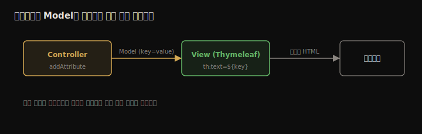

# 동적 뷰와 HTTP 데이터
---
> 7장의 정적 페이지에서 한 걸음 나아가, 요청마다 내용이 달라지는 동적 뷰를 만듭니다. 템플릿 엔진(Thymeleaf)으로 컨트롤러가 보낸 데이터를 화면에 끼우고, 클라이언트가 요청 파라미터·경로 변수로 서버에 값을 보내며, HTTP 메서드(GET/POST)로 의도를 구분하고, HTML 폼으로 데이터를 제출하는 흐름까지 정리합니다.


## 핵심 요약

오늘날 웹 페이지는 대부분 동적입니다 — 같은 경로라도 요청에 따라 다른 내용을 보여 줍니다. 컨트롤러가 뷰 이름만 반환하던 데서 나아가, `Model`에 데이터를 담아 뷰로 보내면 **템플릿 엔진(Thymeleaf)**이 그 값을 HTML에 끼워 렌더링합니다. 클라이언트가 서버로 데이터를 보내는 주요 방법은 **요청 파라미터**(`?key=value`, 선택적 값에 적합)와 **경로 변수**(`/path/{value}`, 필수 값에 적합)이며, 컨트롤러는 `@RequestParam`·`@PathVariable`로 받습니다. HTTP 요청은 경로뿐 아니라 **HTTP 메서드**(GET 조회·POST 추가·PUT 전체수정·PATCH 부분수정·DELETE 삭제)로 의도를 표현하고, `@GetMapping`·`@PostMapping` 같은 전용 애너테이션으로 매핑합니다. HTML 폼은 `method="post"`로 데이터를 제출하며, 브라우저 폼은 GET·POST만 직접 지원합니다.


## 학습 목표

> 이 내용을 읽고 나면 다음을 할 수 있습니다.

1. 동적 뷰가 무엇이고 왜 필요한지 설명할 수 있습니다.
2. Thymeleaf와 `Model`로 컨트롤러 데이터를 뷰에 표시할 수 있습니다.
3. 요청 파라미터와 경로 변수의 차이를 알고 상황에 맞게 고를 수 있습니다.
4. HTTP 메서드 5종의 의도를 구분하고 `@GetMapping`·`@PostMapping`으로 매핑할 수 있습니다.
5. HTML 폼으로 POST 요청을 보내 서버에 데이터를 추가할 수 있습니다.


## 본문 정리


### 1. 동적 뷰 — 같은 페이지, 다른 내용

온라인 쇼핑몰의 장바구니(`/cart`)는 사용자마다, 또 같은 사용자라도 그때그때 다른 내용을 보여 줍니다. 같은 경로라도 백엔드가 처리한 데이터에 따라 응답이 달라지는 것이 **동적 뷰**입니다.

7장 MVC 흐름에서 컨트롤러는 *뷰 이름*만 반환했습니다. 동적 뷰를 만들려면 여기에 **데이터도 함께** 보내야 합니다. 컨트롤러가 상품 1개를 보내면 1개가, 2개를 보내면 2개가 같은 뷰에 표시됩니다.



#### Thymeleaf로 데이터 표시

`spring-boot-starter-thymeleaf` 의존성을 추가하고, 컨트롤러 액션에 `Model` 파라미터를 받아 `addAttribute(key, value)`로 값을 담습니다. 동적 뷰 HTML은 `resources/static`이 아니라 **`resources/templates`**에 둡니다.

```java
@Controller
public class MainController {
  @RequestMapping("/home")
  public String home(Model page) {              // Model로 데이터 전달
    page.addAttribute("username", "Katy");
    page.addAttribute("color", "red");
    return "home.html";
  }
}
```

```html
<!-- resources/templates/home.html -->
<html lang="en" xmlns:th="http://www.thymeleaf.org">   <!-- th 접두사 import -->
  <body>
    <h1>Welcome
      <span th:style="'color:' + ${color}"             <!-- ${key}로 값 참조 -->
            th:text="${username}"></span>!</h1>
  </body>
</html>
```

`${attribute_key}` 문법으로 컨트롤러가 보낸 속성을 참조합니다. `th:text`는 텍스트를, `th:style`은 스타일을 동적으로 채웁니다.

> ⚠️ `localhost:8080`에 경로 없이 접속하면 `/`를 가리키는데, 거기에 매핑된 액션이 없으면 404가 나는 게 정상입니다.


### 2. 클라이언트 → 서버 데이터 전송 방법

클라이언트가 서버로 값을 보내는 방법은 넷입니다.

| 방법 | 형식 | 용도 |
|------|------|------|
| 요청 파라미터(query) | URI에 `?key=value` | 소량·선택적 값 (~2000자) |
| 요청 헤더 | HTTP 헤더 | 소량, URI에 안 보임 |
| 경로 변수 | 경로 자체 `/path/{value}` | 소량·필수 값 |
| 요청 본문(body) | HTTP body | 대량 데이터·파일 (10장 REST) |


### 3. 요청 파라미터 — @RequestParam

요청 파라미터는 키-값 쌍을 URI 쿼리(`?`)에 붙여 보냅니다. 검색·필터처럼 **선택적** 값에 적합합니다. 컨트롤러 액션 파라미터에 `@RequestParam`을 붙이면 같은 이름의 요청 파라미터 값을 받습니다.

```java
@RequestMapping("/home")
public String home(
    @RequestParam(required = false) String name,    // 선택적 파라미터
    @RequestParam(required = false) String color,
    Model page) {
  page.addAttribute("username", name);
  page.addAttribute("color", color);
  return "home.html";
}
```

```
http://localhost:8080/home?color=blue&name=Jane
```

`?`로 시작해 `key=value`를 `&`로 이어 붙입니다.

> ⚠️ 요청 파라미터는 **기본적으로 필수**입니다. 클라이언트가 안 보내면 `400 Bad Request`가 납니다. 선택적으로 만들려면 `@RequestParam(required = false)`를 씁니다.


### 4. 경로 변수 — @PathVariable

경로 변수는 키 없이 경로의 특정 위치에서 값을 꺼냅니다. **필수** 값에 적합하며, 경로 정의에 `{name}` 중괄호를 넣고 `@PathVariable`로 받습니다.

```java
@RequestMapping("/home/{color}")          // 중괄호로 경로 변수 정의
public String home(
    @PathVariable String color,           // 파라미터명 = 변수명
    Model page) {
  page.addAttribute("color", color);
  return "home.html";
}
```

```
http://localhost:8080/home/blue   →   http://localhost:8080/home/red
```

#### 요청 파라미터 vs 경로 변수

| | 요청 파라미터 | 경로 변수 |
|---|--------------|----------|
| 선택적 값 | 가능 | 쓰지 말 것(필수만) |
| 개수 권장 | 많으면 본문(body) 권장 | 최대 2개 |
| 가독성 | 쿼리식이 다소 읽기 어려움 | 읽기 쉬움, 검색엔진 색인·북마크 유리 |

핵심이 되는 한두 값은 경로에 직접 쓰면 URL이 읽기 쉽고, 선택적이거나 많은 값은 요청 파라미터를 씁니다.


### 5. HTTP 메서드 — 의도를 표현하는 동사

HTTP 요청은 **경로 + HTTP 메서드(동사)**로 식별됩니다. 지금까지 무의식적으로 GET만 썼습니다. 메서드는 클라이언트가 자원에 어떤 동작을 할지를 나타냅니다.

| 메서드 | 의도 |
|--------|------|
| GET | 데이터 조회 (변경 없음) |
| POST | 새 데이터 추가 |
| PUT | 레코드 전체 수정 |
| PATCH | 레코드 부분 수정 |
| DELETE | 데이터 삭제 |

> ⚠️ 메서드를 설계 의도와 다르게 쓰면 안 됩니다. GET으로 데이터를 바꾸는 기능을 만드는 것은 기술적으로 가능하지만 나쁜 선택입니다. 같은 경로라도 HTTP 메서드가 다르면 다른 액션에 매핑할 수 있습니다.


### 6. 실전 — 상품 목록 조회(GET) + 추가(POST)

상품 목록을 보여 주고(GET) HTML 폼으로 추가하는(POST) 앱을 만듭니다. 계층은 model(`Product`) → service(`ProductService`) → controller로 나눕니다.

```java
@Service
public class ProductService {
  private List<Product> products = new ArrayList<>();
  public void addProduct(Product p) { products.add(p); }
  public List<Product> findAll() { return products; }
}
```

> ⚠️ 이 `List`는 학습용 단순화입니다. bean은 기본 singleton이고 웹은 요청마다 스레드를 쓰므로, 여러 클라이언트가 동시에 추가하면 race condition이 납니다(5장). 12장부터 DB로 대체하면 해소됩니다 — 실무에선 이렇게 쓰면 안 됩니다.

컨트롤러는 service를 생성자 주입으로 받고, GET·POST 두 액션을 둡니다. `@RequestMapping(method=...)` 대신 **전용 애너테이션** `@GetMapping`·`@PostMapping`을 쓰면 경로와 메서드가 한눈에 드러납니다.

```java
@Controller
public class ProductsController {
  private final ProductService productService;
  public ProductsController(ProductService s) { this.productService = s; }

  @GetMapping("/products")                     // 조회
  public String viewProducts(Model model) {
    model.addAttribute("products", productService.findAll());
    return "products.html";
  }

  @PostMapping("/products")                     // 추가
  public String addProduct(
      @RequestParam String name,
      @RequestParam double price,
      Model model) {
    Product p = new Product();
    p.setName(name); p.setPrice(price);
    productService.addProduct(p);
    model.addAttribute("products", productService.findAll());
    return "products.html";
  }
}
```

뷰에서는 `th:each`로 목록을 순회해 표를 그리고, HTML 폼으로 POST 요청을 보냅니다.

```html
<table>
  <tr><th>PRODUCT NAME</th><th>PRODUCT PRICE</th></tr>
  <tr th:each="p: ${products}">                 <!-- 컬렉션 순회 -->
    <td th:text="${p.name}"></td>
    <td th:text="${p.price}"></td>
  </tr>
</table>

<form action="/products" method="post">         <!-- 제출 시 POST /products -->
  Name:  <input type="text" name="name"><br/>    <!-- name 파라미터 -->
  Price: <input type="number" step="any" name="price"><br/>
  <button type="submit">Add product</button>
</form>
```

#### 모델 객체를 직접 받기

요청 파라미터 이름이 클래스 속성명과 같으면, 컨트롤러 액션이 `Product`를 직접 파라미터로 받아 Spring이 자동으로 객체를 만들어 채웁니다(기본 생성자 필요).

```java
@PostMapping("/products")
public String addProduct(Product p, Model model) {   // Spring이 자동 매핑
  productService.addProduct(p);
  model.addAttribute("products", productService.findAll());
  return "products.html";
}
```

> 코드는 줄지만, 입문자에겐 `Product`가 어디서 왔는지 불분명할 수 있습니다. Spring은 코드를 숨기는 문법이 많으니, 모르는 문법을 만나면 프레임워크 명세를 찾아보는 편이 좋습니다.


## 심화 학습

> 책은 Spring Boot 2 / Spring 5 기준입니다. 실무 맥락과 이후 동향을 보강합니다.

- **모델 직접 바인딩과 `@ModelAttribute`**: 책이 보여 준 "Product 직접 받기"는 내부적으로 `@ModelAttribute`가 동작하는 것입니다. 폼 데이터를 객체로 묶을 때 표준이며, `@Valid`와 함께 쓰면 9장의 입력 검증(Bean Validation)으로 자연스럽게 이어집니다.
- **PRG 패턴(Post/Redirect/Get)**: 이 장의 POST 액션은 곧바로 뷰를 반환하는데, 그러면 사용자가 새로고침할 때 폼이 재전송되는 문제가 있습니다. 실무에선 POST 후 `redirect:/products`로 GET을 다시 부르게 해 중복 제출을 막습니다.
- **PUT·DELETE와 브라우저 폼의 한계**: 브라우저 HTML 폼은 GET·POST만 직접 보냅니다. PUT·DELETE를 쓰려면 JavaScript(fetch/Axios)로 호출하거나, 서버 측 `HiddenHttpMethodFilter`로 우회합니다. 그래서 프론트-백 분리(REST, 10장)에서 이들 메서드가 본격적으로 쓰입니다.
- **Thymeleaf의 서버 사이드 렌더링 위치**: Thymeleaf는 서버에서 HTML을 완성해 보내는 SSR 방식입니다. React 같은 CSR(클라이언트 렌더링)과 대비되며, 관리자 페이지·SEO가 중요한 페이지엔 SSR이, 풍부한 상호작용엔 CSR이 맞습니다.


## 실무 적용 포인트

### 이런 상황에서 사용하세요

- 서버가 화면까지 그리는 페이지(관리자·간단한 CRUD) → Thymeleaf + `@Controller` + `Model`
- 검색·필터처럼 선택적 다중 조건 → `@RequestParam(required=false)`
- 리소스 식별자(예: `/products/{id}`)처럼 필수 단일 값 → `@PathVariable`

### 주의할 점

- ⚠️ singleton bean 안의 가변 컬렉션은 동시성 문제를 일으킵니다. 실제로는 DB를 씁니다.
- ⚠️ HTTP 메서드를 의도와 다르게 쓰지 않습니다(GET으로 데이터 변경 금지).
- ⚠️ POST 후 바로 뷰 반환은 새로고침 재전송을 부르니 PRG 패턴(redirect)을 고려합니다.


## 면접 대비

### 한 줄 정의

"동적 뷰란 같은 경로라도 컨트롤러가 보낸 데이터에 따라 다른 내용을 보여 주는 화면이며, 템플릿 엔진이 그 데이터를 HTML에 끼워 렌더링합니다."

### 핵심 포인트 3가지

1. 컨트롤러가 `Model`에 데이터를 담아 보내면 Thymeleaf가 `${key}`로 받아 화면을 그립니다.
2. 선택적·소량 값은 요청 파라미터(`@RequestParam`), 필수 단일 값은 경로 변수(`@PathVariable`)로 받습니다.
3. HTTP 요청은 경로 + 메서드로 식별되며, `@GetMapping`·`@PostMapping`으로 의도를 명확히 매핑합니다.

### 자주 묻는 질문

Q: `@RequestParam`과 `@PathVariable`은 언제 무엇을 쓰나요?
A: 선택적이거나 개수가 많은 값(검색 조건 등)은 `@RequestParam`, 필수이며 리소스를 식별하는 단일 값(`/products/{id}`)은 `@PathVariable`을 씁니다.

Q: 정적 페이지와 동적 페이지의 HTML 위치가 왜 다른가요?
A: 정적은 `resources/static`에서 그대로 반환되고, 템플릿 엔진으로 렌더링하는 동적 페이지는 `resources/templates`에 두어야 Spring Boot가 처리합니다.

Q: 브라우저 폼으로 PUT·DELETE를 보낼 수 있나요?
A: 직접은 GET·POST만 가능합니다. PUT·DELETE는 JavaScript로 호출하거나 `HiddenHttpMethodFilter`로 우회해야 하며, REST API에서 본격적으로 쓰입니다.


## 핵심 개념 체크리스트

- [ ] 동적 뷰가 무엇이고 왜 필요한지 설명할 수 있는가?
- [ ] `Model` + Thymeleaf `${key}`로 데이터를 표시할 수 있는가?
- [ ] 요청 파라미터와 경로 변수의 선택 기준을 아는가?
- [ ] HTTP 메서드 5종의 의도를 구분할 수 있는가?
- [ ] `@GetMapping`·`@PostMapping`으로 같은 경로를 메서드별로 매핑할 수 있는가?
- [ ] singleton bean의 가변 컬렉션이 왜 위험한지 아는가?


## 참고 자료

- 공식 문서: [Spring Web MVC](https://docs.spring.io/spring-framework/reference/web/webmvc.html) · [Thymeleaf](https://www.thymeleaf.org/documentation.html)
- 연관 노트: [Spring Boot와 Spring MVC](./07.Spring%20Boot와%20Spring%20MVC.md) · [Bean 스코프와 생애주기](./05.Bean%20스코프와%20생애주기.md)
- 다음 장: 9장 — Spring 웹 스코프와 프론트-백 분리(REST 예고)
