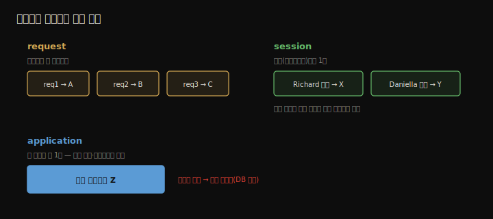

# 웹 스코프와 로그인
---
> 5장의 singleton·prototype에 더해, 웹 앱에서만 의미 있는 세 가지 웹 스코프(request·session·application)를 다룹니다. 이들은 HTTP 요청을 기준점으로 bean 생애주기를 관리합니다. 로그인 기능을 단계별로 구현하며 request 스코프로 자격 증명을 처리하고, session 스코프로 로그인 상태를 유지하며, application 스코프로 로그인 횟수를 세고, 페이지 간 리다이렉트까지 정리합니다.


## 핵심 요약

웹 스코프는 HTTP 요청·세션을 기준으로 bean을 관리합니다. **request 스코프**(`@RequestScope`)는 HTTP 요청마다 새 인스턴스를 만들어 그 요청 안에서만 씁니다 — 자격 증명처럼 오래 두면 안 되는 민감 데이터에 적합하고 동시성 걱정이 없습니다. **session 스코프**(`@SessionScope`)는 클라이언트의 HTTP 세션 동안 인스턴스를 유지해 여러 요청이 공유합니다 — 로그인 상태·장바구니에 적합합니다. **application 스코프**(`@ApplicationScope`)는 앱 전체에 하나뿐이라 모든 요청이 공유하며, singleton과 비슷해 동시성 문제가 있어 실무에서는 권하지 않습니다(대신 DB 사용). 컨트롤러 액션이 `"redirect:/경로"`를 반환하면 다른 페이지로 리다이렉트합니다. session·application 스코프는 요청을 서로 의존하게 만들어(stateful) 아키텍처 문제를 부르므로 신중히 씁니다.


## 학습 목표

> 이 내용을 읽고 나면 다음을 할 수 있습니다.

1. request·session·application 세 웹 스코프의 차이를 설명할 수 있습니다.
2. request 스코프로 민감 데이터를 요청 단위로 안전하게 처리할 수 있습니다.
3. session 스코프로 로그인 상태를 여러 요청에 걸쳐 유지할 수 있습니다.
4. application 스코프의 동작과 왜 권장하지 않는지 설명할 수 있습니다.
5. `redirect:`로 페이지 간 이동을 구현할 수 있습니다.


## 본문 정리


### 1. 세 가지 웹 스코프 한눈에

5장의 singleton·prototype은 모든 Spring 앱에서 쓰지만, 다음 셋은 웹 앱에서만 의미가 있어 **웹 스코프**라 부릅니다.

| 스코프 | 인스턴스 생성 단위 | 생존 기간 | 쓰임 |
|--------|------------------|----------|------|
| request | HTTP 요청마다 | 그 요청 동안만 | 민감·일시 데이터(자격 증명) |
| session | HTTP 세션마다 | 세션 동안 | 로그인 상태·장바구니 |
| application | 앱 전체 1개 | 앱 실행 내내 | (권장 안 함 — DB 사용) |




### 2. request 스코프 — 요청마다 새 인스턴스

`@RequestScope`를 붙이면 HTTP 요청마다 새 인스턴스가 생기고, 그 요청 안에서만 쓰입니다. 자격 증명처럼 **오래 두면 안 되는 민감 데이터**와, 동시 로그인 시 격리가 필요한 경우에 맞습니다.

| 사실 | 결과 | 고려 / 회피 |
|------|------|------------|
| 요청마다 새 인스턴스 생성 | 메모리에 많은 인스턴스 | 수명이 짧아 GC됨 — 단 생성자·`@PostConstruct`에 무거운 로직(DB·네트워크) 금지 |
| 한 인스턴스는 한 요청만 사용 | 멀티스레드 이슈 없음 | 속성에 데이터 저장 OK — 동기화는 불필요(성능만 해침) |

```java
@Component
@RequestScope            // HTTP 요청마다 새 인스턴스
public class LoginProcessor {
  private String username;
  private String password;

  public boolean login() {
    return "natalie".equals(username) && "password".equals(password);
  }
  // getters/setters
}
```

로그인 폼(`login.html`)은 POST로 자격 증명을 보내고, 컨트롤러는 GET(폼 표시)·POST(검증) 두 액션을 둡니다.

```java
@Controller
public class LoginController {
  @GetMapping("/")  public String loginGet() { return "login.html"; }

  @PostMapping("/")
  public String loginPost(@RequestParam String username,
                          @RequestParam String password, Model model) {
    loginProcessor.setUsername(username);
    loginProcessor.setPassword(password);
    boolean loggedIn = loginProcessor.login();
    model.addAttribute("message", loggedIn ? "You are now logged in." : "Login failed!");
    return "login.html";
  }
}
```

> ⚠️ 실무에서는 인증·인가를 직접 짜지 말고 **Spring Security**를 씁니다. 직접 구현하면 취약점을 넣기 쉽습니다. 이 예제는 학습용 단순화(자격 증명 하드코딩, 평문)입니다.


### 3. session 스코프 — 세션 동안 유지

`@SessionScope`는 클라이언트의 HTTP 세션 동안 인스턴스를 유지해, 같은 클라이언트의 여러 요청이 공유합니다. 로그인 상태·장바구니에 적합합니다. Spring이 각 요청을 올바른 세션에 연결하므로 사용자별로 인스턴스가 분리됩니다.

| 사실 | 결과 | 고려 / 회피 |
|------|------|------------|
| 세션 내내 유지 | request보다 오래 살고 GC 덜 됨 | 데이터를 오래 보관 — 단 너무 많이 담지 말고 민감 정보(비밀번호·키) 저장 금지 |
| 여러 요청이 공유 | 동시 요청이 데이터 변경 시 race condition 가능 | 필요시 동기화하되 최후 수단으로 |
| 서버 측 상태 공유 | 요청이 서로 의존(stateful) | 대안(DB 저장)으로 요청 독립성 유지 고려 |

```java
@Service
@SessionScope            // 세션 동안 유지
public class LoggedUserManagementService {
  private String username;   // 로그인한 사용자명 보관
  // getters/setters
}
```

`LoginProcessor`(request)가 검증 성공 시 이 session bean에 username을 저장합니다. `LoginProcessor`는 여전히 request 스코프 — 자격 증명은 요청 동안만 필요하기 때문입니다.

```java
public boolean login() {
  boolean ok = "natalie".equals(username) && "password".equals(password);
  if (ok) loggedUserManagementService.setUsername(username);  // 세션에 저장
  return ok;
}
```

#### 로그인 보호 + 리다이렉트

`/main`은 로그인한 사용자만 접근하게 합니다. session bean에 username이 없으면 로그인 페이지로 리다이렉트합니다. 컨트롤러 액션이 `"redirect:/경로"`를 반환하면 그 경로로 리다이렉트됩니다.

```java
@GetMapping("/main")
public String home(@RequestParam(required = false) String logout, Model model) {
  if (logout != null) loggedUserManagementService.setUsername(null);  // 로그아웃

  String username = loggedUserManagementService.getUsername();
  if (username == null) return "redirect:/";   // 미로그인 → 로그인 페이지로

  model.addAttribute("username", username);
  return "main.html";
}
```

로그인 성공 시 `LoginController`도 `return "redirect:/main"`으로 메인 페이지로 보냅니다. 로그아웃은 session bean의 username을 `null`로 두면 됩니다.


### 4. application 스코프 — 앱 전체 1개

`@ApplicationScope`는 앱 전체에 인스턴스 하나뿐이며 모든 클라이언트의 모든 요청이 공유합니다. singleton과 비슷하지만, 웹 스코프라 HTTP 요청을 기준점으로 생애주기를 봅니다. 5장 singleton과 같은 동시성 문제가 있어 속성을 불변으로 두는 게 좋은데, 불변이면 그냥 singleton을 쓰면 됩니다.

```java
@Service
@ApplicationScope        // 앱 전체 1개
public class LoginCountService {
  private int count;
  public void increment() { count++; }
  public int getCount() { return count; }
}
```

`LoginProcessor`가 로그인 시도마다 `increment()`를 부르고, 컨트롤러가 `Model`로 count를 뷰에 보냅니다.

> 저자는 application 스코프를 **피하라**고 권합니다. 모든 요청이 공유해 쓰기 작업마다 동기화가 필요해 병목이 생기고, 앱 수명 내내 살아 GC되지 않습니다. 카운트 같은 값도 **DB에 저장**하는 편이 낫습니다.


### 5. stateful의 함정

session·application 스코프는 모두 요청을 서로 덜 독립적으로 만듭니다. 서버가 요청에 필요한 상태를 들고 있으면(stateful) 클라이언트가 특정 앱 인스턴스에 묶입니다. 어떤 기능을 이들 스코프로 구현하기 전에, 공유할 데이터를 **세션 대신 DB에 저장**해 요청을 독립적으로 두는 대안을 먼저 고려해야 합니다.


## 심화 학습

> 책은 Spring Boot 2 / Spring 5 기준입니다. 실무 맥락과 이후 동향을 보강합니다.

- **수평 확장과 세션의 문제**: 세션 bean은 그 인스턴스가 사는 *특정 서버 메모리*에 묶입니다. 인스턴스를 여러 대로 늘리면(scale-out) 로드밸런서가 다른 서버로 요청을 보낼 때 세션이 사라집니다. 해법은 sticky session, 세션을 Redis 같은 외부 저장소에 두는 **Spring Session**, 또는 아예 무상태(JWT 토큰)로 가는 것입니다. 저자가 "DB에 저장하라"고 한 조언의 클라우드 버전입니다.
- **무상태(stateless) 인증**: 세션 기반 로그인 대신 클라이언트가 JWT를 들고 매 요청에 보내면 서버가 상태를 안 들고도 인증할 수 있어, scale-out에 유리합니다. 프론트-백 분리(REST)에서 표준처럼 쓰입니다.
- **`@RequestScope`와 프록시**: request·session bean을 singleton bean에 주입하면, Spring은 실제 인스턴스 대신 **스코프 프록시**를 주입해 매 요청·세션마다 올바른 인스턴스로 위임합니다(`proxyMode`). 6장 AOP 프록시와 같은 원리이며, 5장에서 본 "prototype을 singleton에 직접 주입" 함정의 웹 스코프 해법입니다.
- **CSR과 웹 스코프**: 이 장의 session 기반 로그인은 SSR(서버 렌더링) 전제입니다. React 같은 CSR + REST API에서는 서버 세션보다 토큰 기반 무상태 인증을 선호합니다.


## 실무 적용 포인트

### 이런 상황에서 사용하세요

- 요청 동안만 필요한 민감 데이터(자격 증명 처리) → `@RequestScope`
- 한 사용자의 여러 페이지에 걸친 상태(로그인·장바구니, 소규모) → `@SessionScope`
- 전역 카운트·통계 → application 스코프 대신 **DB**

### 주의할 점

- ⚠️ request bean의 생성자·`@PostConstruct`에 무거운 로직을 넣지 않습니다(요청마다 실행).
- ⚠️ session에 민감 정보(비밀번호·키)를 저장하지 않고, 너무 많이 담지 않습니다.
- ⚠️ application 스코프는 동시성 병목·GC 불가 문제로 피하고, scale-out 환경에서 세션도 신중히 씁니다.


## 면접 대비

### 한 줄 정의

"웹 스코프란 HTTP 요청·세션을 기준으로 bean 생애주기를 관리하는 방식이며, request는 요청마다, session은 세션마다, application은 앱 전체에 하나의 인스턴스를 둡니다."

### 핵심 포인트 3가지

1. request 스코프는 요청마다 새 인스턴스라 민감·일시 데이터에 안전하고 동시성 걱정이 없습니다.
2. session 스코프는 세션 동안 유지돼 로그인 상태를 여러 요청이 공유하지만, 민감 정보 저장과 과다 적재는 피합니다.
3. application 스코프는 동시성 병목·stateful 문제로 권장하지 않으며 DB가 대안입니다.

### 자주 묻는 질문

Q: request 스코프와 prototype 스코프의 차이는?
A: prototype은 *참조할 때마다* 새 인스턴스를 주지만, request 스코프는 *HTTP 요청 단위*로 새 인스턴스를 만들어 그 요청 안에서는 같은 인스턴스를 공유합니다.

Q: 로그인 상태는 왜 session 스코프로 두나요?
A: 사용자가 여러 페이지를 오가며 보내는 여러 요청에 걸쳐 로그인 정보를 유지해야 하기 때문입니다. session bean은 세션 동안 인스턴스를 유지해 요청 간 데이터를 공유합니다.

Q: application 스코프를 왜 피하라고 하나요?
A: 모든 요청이 공유해 쓰기마다 동기화가 필요해 병목이 생기고, 앱 수명 내내 살아 GC되지 않으며, 요청을 stateful하게 묶기 때문입니다. 전역 데이터는 DB에 두는 편이 낫습니다.


## 핵심 개념 체크리스트

- [ ] request·session·application 세 스코프의 생성 단위와 생존 기간을 아는가?
- [ ] request 스코프가 민감 데이터에 적합한 이유를 설명할 수 있는가?
- [ ] session 스코프로 로그인 상태를 유지하는 흐름을 아는가?
- [ ] application 스코프를 권장하지 않는 이유를 아는가?
- [ ] `redirect:`로 페이지 이동을 구현할 수 있는가?
- [ ] stateful이 scale-out에서 왜 문제인지 아는가?


## 참고 자료

- 공식 문서: [Spring Bean Scopes](https://docs.spring.io/spring-framework/reference/core/beans/factory-scopes.html)
- 연관 노트: [동적 뷰와 HTTP 데이터](./08.동적%20뷰와%20HTTP%20데이터.md) · [Bean 스코프와 생애주기](./05.Bean%20스코프와%20생애주기.md)
- 다음 장: 10장 — REST 서비스로 프론트-백 분리 구현
