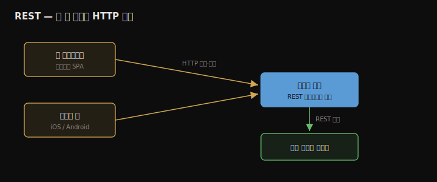
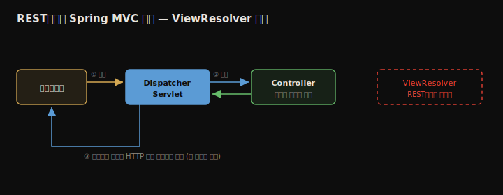

# REST 서비스
---
> 7~9장에서 웹 앱과 함께 다룬 REST를 본격적으로 정리합니다. REST는 두 앱 사이의 통신 방법이며, 웹 클라이언트와 백엔드뿐 아니라 모바일 앱과 백엔드, 또는 두 백엔드 서비스 사이에서도 씁니다. Spring은 7~9장에서 배운 것과 똑같은 Spring MVC 메커니즘으로 REST를 지원하되, 뷰를 찾지 않는다는 점만 다릅니다. `@RestController`로 엔드포인트를 만들고, `ResponseEntity`로 상태·헤더를 조정하며, `@RestControllerAdvice`로 예외를 한곳에 모으고, `@RequestBody`로 클라이언트 데이터를 받는 흐름을 정리합니다.


## 핵심 요약

REST 서비스는 두 앱 사이의 통신을 HTTP로 구현하는 방법입니다. Spring에서 REST 엔드포인트는 결국 HTTP 메서드·경로에 매핑된 컨트롤러 액션이며, 7~9장의 Spring MVC 메커니즘을 그대로 씁니다. 차이는 단 하나, dispatcher servlet에게 **뷰를 찾지 말라**고 알리는 것입니다 — 그러면 컨트롤러 액션의 반환값이 HTTP 응답 본문으로 곧장 나갑니다. 메서드마다 `@ResponseBody`를 붙이는 대신 클래스에 `@RestController`(= `@Controller` + `@ResponseBody`)를 한 번 붙입니다. 객체를 반환하면 Spring이 기본으로 JSON 문자열로 직렬화합니다. 응답 상태·헤더를 바꾸려면 `ResponseEntity`를 반환하고, 예외는 컨트롤러 안에서 직접 처리하거나 `@RestControllerAdvice` + `@ExceptionHandler`로 한곳에 모읍니다. 클라이언트가 보내는 큰 데이터는 `@RequestBody`로 받으며, 기본 형식은 JSON입니다.


## 학습 목표

> 이 내용을 읽고 나면 다음을 할 수 있습니다.

1. REST 서비스가 무엇이고 어디에서 쓰이는지 설명할 수 있습니다.
2. `@ResponseBody`와 `@RestController`의 관계를 설명하고 REST 엔드포인트를 만들 수 있습니다.
3. 객체·컬렉션을 JSON 응답 본문으로 반환할 수 있습니다.
4. `ResponseEntity`로 응답 상태·헤더를 조정할 수 있습니다.
5. 엔드포인트 수준에서 예외를 두 가지 방식으로 처리할 수 있습니다.
6. `@RequestBody`로 클라이언트 데이터를 받을 수 있습니다.


## 본문 정리


### 1. REST로 두 앱 사이 데이터 주고받기

REST 엔드포인트는 두 앱 사이의 통신을 구현하는 한 방법입니다. 서버가 기능을 엔드포인트로 노출하면 클라이언트가 HTTP로 그 엔드포인트를 호출합니다. 웹 프로토콜로 서비스를 노출하므로 이런 엔드포인트를 **웹 서비스**라 부릅니다. 오늘날 많은 곳에서 만나기 때문에 모든 Spring 개발자가 익혀야 하는 주제입니다.



Spring에서 REST 엔드포인트는 여전히 HTTP 메서드·경로에 매핑된 컨트롤러 액션입니다. 7~9장에서 웹 앱에 쓴 메커니즘을 똑같이 씁니다. 단 하나 다른 점은 REST에서는 dispatcher servlet에게 뷰를 찾지 말라고 알린다는 것입니다. 7장의 Spring MVC 흐름에서 **ViewResolver가 사라지고**, 서버는 컨트롤러 액션의 반환값을 HTTP 응답으로 클라이언트에게 곧장 돌려줍니다.



REST는 쓰기 편하고 구현이 단순해 널리 쓰이지만, 통신상의 한계도 함께 알아 둬야 합니다. 액션이 오래 걸리면 호출이 타임아웃돼 통신이 끊길 수 있고, 한 번에 큰 데이터(보통 수 MB 이상)를 보내도 타임아웃이 날 수 있습니다. 동시 호출이 너무 많으면 앱에 과부하가 걸려 실패할 수 있고, HTTP를 떠받치는 네트워크는 100% 신뢰할 수 없어 호출이 실패할 가능성이 늘 존재합니다. 그래서 두 앱을 REST로 연결할 때는 호출이 실패하면 무슨 일이 일어나는지, 데이터 정합성이 깨지지는 않는지, 사용자에게 오류를 어떻게 보여줄지를 항상 함께 설계해야 합니다.


### 2. REST 엔드포인트 구현 — @ResponseBody와 @RestController

REST 엔드포인트의 핵심은 `@ResponseBody`입니다. `@Controller`로 표시한 클래스의 액션에 `@ResponseBody`를 붙이면, dispatcher servlet에게 "이 메서드는 뷰 이름이 아니라 HTTP 응답에 직접 담을 데이터를 반환한다"고 알립니다.

```java
@Controller
public class HelloController {

  @GetMapping("/hello")
  @ResponseBody              // 반환값을 뷰 이름이 아닌 응답 본문으로
  public String hello() {
    return "Hello!";
  }
}
```

문제는 메서드가 늘면 `@ResponseBody`를 매번 반복해야 한다는 점입니다. 중복을 없애기 위해 Spring은 `@RestController`를 제공합니다. 이것은 `@Controller`와 `@ResponseBody`를 합친 애너테이션이며, 클래스에 한 번 붙이면 모든 액션이 REST 엔드포인트가 됩니다.

```java
@RestController              // @Controller + @ResponseBody
public class HelloController {

  @GetMapping("/hello")
  public String hello() { return "Hello!"; }

  @GetMapping("/ciao")
  public String ciao() { return "Ciao!"; }
}
```

엔드포인트가 제대로 도는지 검증하는 도구는 두 가지를 자주 씁니다. **Postman**은 GUI를 제공해 편하고, **cURL**은 GUI가 없는 환경(SSH로 접속한 VM, 배치 스크립트)에서 쓰는 명령줄 도구입니다. 둘 다 개발자가 익혀야 할 도구이며, 15장에서는 통합 테스트로 검증하는 세 번째 방법을 배웁니다. Spring Boot 앱은 기본으로 Tomcat 서블릿 컨테이너를 8080 포트로 띄웁니다.

```bash
curl http://localhost:8080/hello
# 응답 본문: Hello!

curl -X GET http://localhost:8080/hello    # 메서드 명시 (GET이면 생략 가능)
curl -v http://localhost:8080/hello        # -v로 상태·헤더까지 상세 출력
```


### 3. HTTP 응답 관리

HTTP 응답은 백엔드가 클라이언트 요청에 대한 데이터를 돌려주는 통로이며, 세 가지를 담습니다. 짧은 데이터인 **응답 헤더**, 큰 데이터인 **응답 본문**, 요청 결과를 짧게 나타내는 **응답 상태**입니다.

#### 객체·컬렉션을 응답 본문으로 보내기

객체를 클라이언트에 보내려면 컨트롤러 액션이 그 객체를 반환하기만 하면 됩니다. 두 앱 사이에 주고받는 데이터를 모델링한 객체를 **DTO(data transfer object)**라 부릅니다.

```java
@RestController
public class CountryController {

  @GetMapping("/france")
  public Country france() {
    return Country.of("France", 67);    // DTO 인스턴스 반환
  }
}
```

기본으로 Spring은 객체를 **JSON 문자열**로 직렬화합니다. `/france`를 호출하면 응답 본문은 다음과 같습니다.

```json
{
    "name": "France",
    "population": 67
}
```

컬렉션도 같은 방식으로 반환합니다. `List<Country>`를 반환하면 JSON 배열(`[...]`)이 됩니다.

```java
@GetMapping("/all")
public List<Country> countries() {
  return List.of(Country.of("France", 67), Country.of("Spain", 47));
}
```

JSON이 REST에서 객체를 표현하는 가장 흔한 방식입니다. XML이나 YAML로 바꾸려면 커스텀 컨버터를 끼울 수 있지만, 실무에서 그럴 일은 거의 없습니다.

#### 응답 상태와 헤더 설정 — ResponseEntity

Spring은 기본 상태를 자동으로 매깁니다. 예외가 없으면 `200 OK`, 자원이 없으면 `404 Not Found`, 요청이 서버 기대와 안 맞으면 `400 Bad Request`, 서버에서 예외가 나면 `500`을 보냅니다. 상태나 헤더를 직접 정하려면 `ResponseEntity`를 반환합니다. 이 클래스로 응답 본문·상태·헤더를 한 번에 지정합니다.

```java
@GetMapping("/france")
public ResponseEntity<Country> france() {
  Country c = Country.of("France", 67);
  return ResponseEntity
          .status(HttpStatus.ACCEPTED)              // 202 Accepted로 변경
          .header("continent", "Europe")            // 커스텀 헤더 3개
          .header("capital", "Paris")
          .header("favorite_food", "cheese and wine")
          .body(c);                                 // 응답 본문
}
```

#### 엔드포인트 수준 예외 처리 — 두 가지 방식

비즈니스 로직이 특정 상황을 예외로 알릴 때(예: 결제 시 잔액 부족) 클라이언트에게 그 상황을 응답에 담아 전달해야 합니다. 첫 번째 방식은 컨트롤러 액션 안에서 예외를 `try-catch`로 잡고 `ResponseEntity`로 상황별 응답을 보내는 것입니다.

```java
@PostMapping("/payment")
public ResponseEntity<?> makePayment() {
  try {
    PaymentDetails details = paymentService.processPayment();
    return ResponseEntity.status(HttpStatus.ACCEPTED).body(details);
  } catch (NotEnoughMoneyException e) {
    ErrorDetails error = new ErrorDetails();
    error.setMessage("Not enough money to make the payment.");
    return ResponseEntity.badRequest().body(error);      // 400 + 오류 본문
  }
}
```

이 방식도 흔히 쓰지만, 복잡한 앱에서는 예외 처리 책임을 분리하는 편이 낫습니다. 같은 예외를 여러 엔드포인트에서 처리하면 코드가 중복되고, 예외 로직이 흩어지면 흐름을 파악하기 어렵기 때문입니다. 두 번째 방식은 **REST 컨트롤러 어드바이스**입니다. 이것은 컨트롤러 액션이 던지는 예외를 가로채는 aspect로, `@RestControllerAdvice`로 클래스를 표시하고 `@ExceptionHandler`로 어떤 예외에 어떤 로직을 실행할지 지정합니다.

```java
@RestControllerAdvice
public class ExceptionControllerAdvice {

  @ExceptionHandler(NotEnoughMoneyException.class)
  public ResponseEntity<ErrorDetails> handleNotEnoughMoney() {
    ErrorDetails error = new ErrorDetails();
    error.setMessage("Not enough money to make the payment.");
    return ResponseEntity.badRequest().body(error);
  }
}
```

이렇게 하면 컨트롤러는 정상 흐름만 다루고, 예외 처리는 어드바이스 한곳에 모입니다. 예외 정보를 어드바이스로 넘기려면 핸들러 메서드에 그 예외 타입의 파라미터를 추가하면 됩니다. Spring이 컨트롤러에서 던진 예외 참조를 핸들러로 전달해 주므로, 그 안에서 예외의 세부 정보를 활용할 수 있습니다.


### 4. 요청 본문으로 클라이언트 데이터 받기 — @RequestBody

8장에서 배운 요청 파라미터·경로 변수는 REST에서도 똑같이 씁니다. 더해서 HTTP 요청에는 **요청 본문**이 있어, 클라이언트가 서버로 큰 데이터를 보낼 때(권장 기준 50~100자 이상) 씁니다. 컨트롤러 액션의 파라미터에 `@RequestBody`를 붙이면 됩니다. 기본으로 Spring은 그 파라미터가 JSON이라고 가정하고, JSON 문자열을 해당 타입 인스턴스로 디코딩합니다. 디코딩에 실패하면 `400 Bad Request`를 돌려줍니다.

```java
@PostMapping("/payment")
public ResponseEntity<PaymentDetails> makePayment(
    @RequestBody PaymentDetails paymentDetails) {     // 요청 본문 → 객체
  logger.info("Received payment " + paymentDetails.getAmount());
  return ResponseEntity.status(HttpStatus.ACCEPTED).body(paymentDetails);
}
```

```bash
curl -v -X POST http://127.0.0.1:8080/payment \
  -d '{"amount": 1000}' -H "Content-Type: application/json"
```

> HTTP GET도 요청 본문을 쓸 수 있을까요? 2014년 이전 HTTP 명세는 GET에 본문을 허용하지 않았지만, 2014년 명세(RFC 7231)가 바뀌어 이제는 허용합니다. 다만 갱신 안 된 옛 자료 때문에 혼동이 남아 있을 뿐입니다.


## 심화 학습

> 책은 Spring Boot 2 / Spring 5 기준입니다. 실무 맥락과 이후 동향을 보강합니다.

- **`@ControllerAdvice`로 전역 예외 처리 표준화**: 어드바이스에 핸들러를 여러 개 두면 앱 전체 예외를 한곳에서 일관된 형식으로 응답할 수 있습니다. Spring 6 / Boot 3에서는 RFC 7807 **Problem Details**(`ProblemDetail`)를 표준 오류 응답 포맷으로 지원해, `ErrorDetails` 같은 자작 모델 대신 표준 구조(`type`·`title`·`status`·`detail`)를 쓸 수 있습니다.
- **HTTP 메서드와 의미**: 이 장은 GET·POST만 다루지만, REST에서는 자원 수정에 PUT·PATCH, 삭제에 DELETE를 의미에 맞게 씁니다. `@PutMapping`·`@DeleteMapping` 등이 대응합니다.
- **직렬화는 Jackson이 담당**: Spring Boot는 `spring-boot-starter-web`에 Jackson을 포함해, 객체↔JSON 변환을 `HttpMessageConverter`로 처리합니다. `@JsonProperty`·`@JsonIgnore` 같은 Jackson 애너테이션으로 직렬화 형태를 조정합니다.
- **검증과 함께 쓰는 `@RequestBody`**: 실무에서는 `@Valid @RequestBody`로 들어온 본문을 Bean Validation으로 검증하고, 실패 시 `MethodArgumentNotValidException`을 어드바이스로 잡아 일관된 오류를 돌려줍니다.
- **비동기·논블로킹 대안**: 이 장의 Spring MVC는 요청당 스레드를 점유하는 동기 모델입니다. 고동시성에서는 Spring WebFlux(`Mono`·`Flux`)로 논블로킹 REST를 구현하는 선택지가 있습니다.


## 실무 적용 포인트

### 이런 상황에서 사용하세요

- 프론트-백 분리(SPA·모바일) 또는 백엔드 간 통신 → REST 엔드포인트
- 응답 상태·헤더를 세밀히 제어해야 할 때 → `ResponseEntity`
- 같은 예외를 여러 엔드포인트에서 일관되게 처리 → `@RestControllerAdvice`
- 클라이언트가 구조화된 데이터(객체)를 보낼 때 → `@RequestBody`

### 주의할 점

- ⚠️ 한 호출에 수 MB 이상을 보내거나 오래 걸리는 작업을 동기로 두면 타임아웃 위험이 있습니다.
- ⚠️ 네트워크 실패를 전제로, 호출 실패 시 데이터 정합성과 사용자 오류 표시를 함께 설계합니다.
- ⚠️ 예외 처리를 컨트롤러마다 흩뿌리면 중복이 쌓입니다 — 어드바이스로 모읍니다.
- ⚠️ `@RequestBody` 디코딩 실패는 `400`이 됩니다. 입력 검증(`@Valid`)을 함께 두면 원인을 명확히 돌려줄 수 있습니다.


## 면접 대비

### 한 줄 정의

"REST 서비스란 두 앱 사이의 통신을 HTTP로 구현하는 방법이며, Spring에서는 HTTP 메서드·경로에 매핑된 컨트롤러 액션이 뷰 대신 데이터를 응답 본문으로 직접 반환하는 형태입니다."

### 핵심 포인트 3가지

1. `@RestController`는 `@Controller` + `@ResponseBody`이며, dispatcher servlet이 뷰를 찾지 않고 반환값을 응답 본문으로 보냅니다.
2. `ResponseEntity`로 응답 본문·상태·헤더를 한 번에 제어하고, 객체는 기본으로 JSON으로 직렬화됩니다.
3. 예외는 컨트롤러 안에서 직접 처리하거나 `@RestControllerAdvice` + `@ExceptionHandler`로 한곳에 모읍니다.

### 자주 묻는 질문

Q: `@Controller`와 `@RestController`의 차이는?
A: `@Controller`의 액션은 기본으로 뷰 이름을 반환해 ViewResolver가 뷰를 찾습니다. `@RestController`는 `@ResponseBody`가 합쳐져 있어, 반환값을 HTTP 응답 본문으로 곧장 보냅니다. `@Controller`에 메서드마다 `@ResponseBody`를 붙이는 것과 같은 효과입니다.

Q: 응답 상태를 202로 바꾸고 헤더를 추가하려면?
A: 컨트롤러 액션이 객체 대신 `ResponseEntity`를 반환하고, `status(HttpStatus.ACCEPTED)`로 상태를, `header(...)`로 헤더를, `body(...)`로 본문을 지정합니다.

Q: 예외를 어드바이스로 처리할 때의 이점은?
A: 같은 예외를 여러 엔드포인트에서 처리할 때 중복을 없애고, 예외 로직을 한곳에 모아 흐름 파악을 쉽게 합니다. 컨트롤러는 정상 흐름만 다루게 됩니다.


## 핵심 개념 체크리스트

- [ ] REST가 두 앱 사이의 통신 방법임을 설명할 수 있는가?
- [ ] REST에서 ViewResolver가 사라지는 이유를 아는가?
- [ ] `@ResponseBody`와 `@RestController`의 관계를 아는가?
- [ ] 객체·컬렉션이 JSON으로 직렬화되는 동작을 아는가?
- [ ] `ResponseEntity`로 상태·헤더를 조정할 수 있는가?
- [ ] 예외 처리 두 방식(컨트롤러 내 try-catch vs 어드바이스)을 비교할 수 있는가?
- [ ] `@RequestBody`로 JSON 본문을 객체로 받을 수 있는가?


## 참고 자료

- 공식 문서: [Spring MVC — ResponseEntity](https://docs.spring.io/spring-framework/reference/web/webmvc/mvc-controller/ann-methods/responseentity.html)
- 추천 도서: J. J. Geewax, *API Design Patterns* (Manning, 2021) — API 설계 모범 사례
- 연관 노트: [Spring Boot와 Spring MVC](./07.Spring%20Boot와%20Spring%20MVC.md) · [동적 뷰와 HTTP 데이터](./08.동적%20뷰와%20HTTP%20데이터.md)
- 다음 장: 11장 — 데이터 소스와 JDBC
