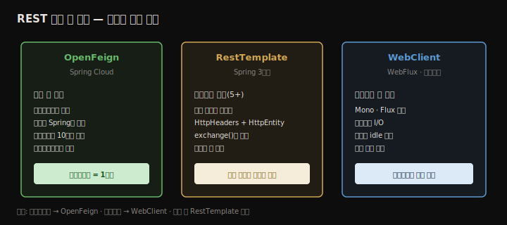
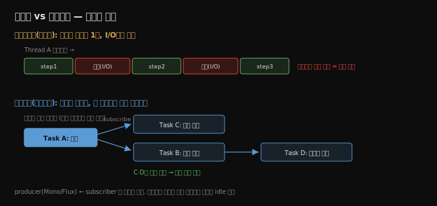

# REST 엔드포인트 소비
---
> 10장이 REST 엔드포인트를 *노출*하는 쪽이었다면, 11장은 그 엔드포인트를 *호출*하는 쪽입니다. 백엔드 앱이 다른 백엔드의 엔드포인트를 부르는 일은 여러 서비스로 나뉜 시스템에서 흔합니다. Spring에서 REST를 호출하는 세 가지 방법(OpenFeign·RestTemplate·WebClient)을 결제 서비스 호출 예제로 비교하고, WebClient가 전제하는 리액티브 모델까지 정리합니다.


## 핵심 요약

한 백엔드 앱이 다른 백엔드의 REST 엔드포인트를 호출하는 일은 흔하며, Spring은 세 가지 방법을 제공합니다. **OpenFeign**(Spring Cloud)은 인터페이스만 선언하면 구현을 Spring이 채워 주고, 10장에서 쓴 애너테이션(`@PostMapping`·`@RequestHeader`·`@RequestBody`)을 그대로 재사용해 신규 앱에 권장합니다. **RestTemplate**은 Spring 3부터 쓰인 전통적 도구로, Spring 5부터 유지보수 모드라 신규 앱에는 권하지 않지만 기존 앱에 여전히 많아 알아 둬야 합니다 — `HttpHeaders`·`HttpEntity`를 만들고 `exchange()`로 호출합니다. **WebClient**는 리액티브(논블로킹) 방식이며 `Mono`·`Flux`로 작업의 의존 관계를 선언합니다. 공식 문서는 WebClient를 RestTemplate 대안으로 권하지만, 이는 **리액티브 앱일 때만** 맞습니다. 비리액티브 앱이면 OpenFeign이 정답입니다.


## 학습 목표

> 이 내용을 읽고 나면 다음을 할 수 있습니다.

1. 백엔드 간 REST 호출이 왜 필요한지 설명할 수 있습니다.
2. OpenFeign으로 인터페이스만 선언해 REST 클라이언트를 만들 수 있습니다.
3. RestTemplate으로 헤더·본문을 구성해 엔드포인트를 호출할 수 있습니다.
4. 리액티브 모델이 블로킹 모델과 어떻게 다른지 설명할 수 있습니다.
5. WebClient를 언제 쓰고 언제 OpenFeign을 써야 하는지 판단할 수 있습니다.


## 본문 정리


### 1. 왜 REST 엔드포인트를 호출하는가

REST는 두 시스템 구성 요소 사이의 통신 방법입니다. 웹 앱의 클라이언트가 백엔드를 부를 수도 있고, 한 백엔드가 다른 백엔드를 부를 수도 있습니다. 여러 서비스로 구성된 백엔드에서는 구성 요소끼리 데이터를 주고받아야 하므로, Spring으로 서비스를 만들 때 다른 서비스가 노출한 REST 엔드포인트를 호출하는 법을 알아야 합니다. 이 장에서는 세 가지 방법을 다룹니다.



예제는 결제 시나리오입니다. 결제 서비스(`sq-ch11-payments`)가 `/payment` 엔드포인트를 HTTP POST로 노출하고, 요청 헤더(`requestId`)와 본문(`Payment`)을 받아 임의 ID를 매긴 뒤 돌려줍니다. 이 서비스를 세 방식으로 각각 호출하는 앱을 만들어 비교합니다.

```java
@RestController
public class PaymentsController {
  @PostMapping("/payment")
  public ResponseEntity<Payment> createPayment(
      @RequestHeader String requestId,
      @RequestBody Payment payment) {
    payment.setId(UUID.randomUUID().toString());
    return ResponseEntity.status(HttpStatus.OK)
        .header("requestId", requestId)
        .body(payment);
  }
}
```


### 2. OpenFeign — 인터페이스만 선언하면 끝

OpenFeign은 Spring Cloud가 제공하며, 신규 구현에 권장하는 방식입니다. 핵심은 **인터페이스만 선언하면 구현을 도구가 채워 준다**는 점입니다. 의존성은 `spring-cloud-starter-openfeign`을 추가합니다.

인터페이스를 OpenFeign 용어로 **OpenFeign 클라이언트**라 부릅니다. `@FeignClient`로 클라이언트를 표시하고 이름과 기준 URI를 지정하며, 각 메서드는 10장에서 컨트롤러 액션에 쓴 애너테이션을 그대로 써서 호출을 선언합니다.

```java
@FeignClient(name = "payments", url = "${name.service.url}")
public interface PaymentsProxy {
  @PostMapping("/payment")
  Payment createPayment(
      @RequestHeader String requestId,
      @RequestBody Payment payment);
}
```

> ⚠️ URI처럼 환경마다 달라지는 값은 항상 properties 파일에 두고 `${property_name}`으로 참조합니다. 코드에 하드코딩하면 환경을 바꿀 때마다 재컴파일해야 합니다.

OpenFeign이 클라이언트 인터페이스를 어디서 찾을지 알려면 설정 클래스에 `@EnableFeignClients(basePackages = "...")`를 붙입니다. 그 뒤에는 4·5장에서 배운 대로, 추상화(인터페이스)를 주입하면 Spring이 컨텍스트의 bean을 넣어 줍니다. 구현 코드를 한 줄도 쓰지 않고 컨트롤러에서 프록시를 주입해 호출합니다.

```java
@Configuration
@EnableFeignClients(basePackages = "com.example.proxy")
public class ProjectConfig { }
```

```java
@RestController
public class PaymentsController {
  private final PaymentsProxy paymentsProxy;
  public PaymentsController(PaymentsProxy paymentsProxy) {
    this.paymentsProxy = paymentsProxy;
  }
  @PostMapping("/payment")
  public Payment createPayment(@RequestBody Payment payment) {
    String requestId = UUID.randomUUID().toString();
    return paymentsProxy.createPayment(requestId, payment);
  }
}
```

애너테이션을 재사용한다는 점이 이 방식의 큰 장점입니다. OpenFeign만의 새 문법을 익힐 필요 없이, 엔드포인트를 노출할 때 쓰던 애너테이션을 호출할 때도 그대로 씁니다.


### 3. RestTemplate — 전통적이지만 유지보수 모드

RestTemplate은 Spring 3부터 REST 호출에 써 온 도구입니다. 문제가 있어서가 아니라, 앱이 진화하며 더 많은 기능(동기·비동기 호출, 보일러플레이트 제거, 재시도·폴백)이 필요해져 Spring 5부터 유지보수 모드로 들어갔고 결국 deprecated될 예정입니다. 그래도 기존 프로젝트 다수가 이 도구를 쓰고, 교체 비용이 크거나 기능이 충분해 바꿀 이유가 없는 경우가 많아 여전히 익혀야 합니다.

> "deprecated"나 "legacy"라는 말이 "배우지 말라"는 뜻은 아닙니다. deprecated 선언 후에도 수년간 쓰이는 기술이 있습니다(RestTemplate, Spring Security OAuth 프로젝트가 그 예입니다).

호출은 세 단계입니다. `HttpHeaders`로 헤더를 만들고, `HttpEntity`로 요청 데이터(헤더+본문)를 묶고, `exchange()`로 보냅니다. `exchange()` 인자는 URI·HTTP 메서드·`HttpEntity`·응답 본문 기대 타입 순입니다.

```java
@Component
public class PaymentsProxy {
  private final RestTemplate rest;
  @Value("${name.service.url}")
  private String paymentsServiceUrl;

  public PaymentsProxy(RestTemplate rest) { this.rest = rest; }

  public Payment createPayment(Payment payment) {
    String uri = paymentsServiceUrl + "/payment";

    HttpHeaders headers = new HttpHeaders();
    headers.add("requestId", UUID.randomUUID().toString());

    HttpEntity<Payment> httpEntity = new HttpEntity<>(payment, headers);

    ResponseEntity<Payment> response =
        rest.exchange(uri, HttpMethod.POST, httpEntity, Payment.class);

    return response.getBody();
  }
}
```

OpenFeign 예제(2절)와 비교하면, 같은 호출을 위해 RestTemplate은 헤더·엔티티 객체를 직접 만들고 응답을 풀어내는 코드가 더 필요합니다.


### 4. WebClient와 리액티브 모델

WebClient는 **리액티브** 방식 위에 만들어진 도구입니다. 공식 문서는 RestTemplate 대안으로 WebClient를 권하지만, 이는 리액티브 앱일 때만 유효합니다. 리액티브 앱이 아니라면 OpenFeign을 쓰는 편이 낫습니다 — WebClient 선택은 앱을 리액티브로 만드는 결정과 강하게 묶입니다.

#### 블로킹 모델의 두 가지 문제

비리액티브 앱에서는 한 스레드가 한 비즈니스 흐름의 모든 단계를 처음부터 끝까지 실행합니다. 은행 앱이 사용자의 총 부채를 계산하려고 여러 서비스(사용자 정보·내부 부채·외부 부채)를 차례로 호출하는 시나리오를 보면 문제가 드러납니다.



첫째, **스레드가 I/O 대기 중에 논다**는 점입니다. 스레드는 응답을 기다리며 메모리만 차지하고 일은 하지 않습니다. 동시에 10개 요청이 와서 모든 스레드가 동시에 대기만 하는 상황이 생길 수 있습니다. 둘째, **서로 무관한 작업도 순서대로 실행**한다는 점입니다. 내부 부채 조회와 외부 부채 조회는 서로 의존하지 않는데도, 블로킹 모델은 앞 단계가 끝나야 다음을 시작합니다.

#### 리액티브의 발상

리액티브 앱은 "한 스레드가 한 흐름을 끝까지"라는 생각을 바꿉니다. 작업을 독립적으로 보고, 여러 스레드가 협력해 흐름을 완성합니다. 작업 백로그가 있고 개발자 팀이 그것을 푸는 모습에 비유하면, **개발자가 스레드, 백로그의 작업이 흐름의 단계**입니다. 두 작업이 서로 무관하면 두 개발자가 동시에 처리하고, 한 작업이 외부 의존으로 막히면 잠시 두고 다른 작업을 하다가 풀리면 누구든 이어서 끝냅니다. 그래서 요청마다 스레드 하나를 둘 필요 없이, 더 적은 스레드로 더 많은 요청을 처리합니다.

기술적으로 리액티브 앱은 작업과 작업 사이 의존을 선언해 흐름을 짭니다. 리액티브 명세는 두 구성 요소를 줍니다. 작업은 **producer**를 반환해 다른 작업이 자신에게 구독(subscribe)하게 하고, **subscriber**로 다른 작업의 producer에 붙어 그 결과를 소비합니다.

#### WebClient로 호출하기

WebClient는 리액티브를 전제하므로 표준 web 의존성 대신 `spring-boot-starter-webflux`를 씁니다. WebClient 인스턴스는 2장에서 배운 대로 `@Bean`으로 컨텍스트에 등록합니다.

```java
@Configuration
public class ProjectConfig {
  @Bean
  public WebClient webClient() {
    return WebClient.builder().build();
  }
}
```

프록시는 RestTemplate과 흐름이 비슷합니다. 기준 URL을 properties에서 가져오고, HTTP 메서드·헤더·본문을 지정해 호출합니다. 다만 입력을 직접 받지 않고 `Mono`로 받으며, 반환도 값이 아니라 `Mono`입니다. `Mono`는 producer를 정의하는 클래스로, 요청 본문 값을 제공하는 독립 작업을 만들고 WebClient가 거기에 구독해 의존을 맺습니다.

```java
@Component
public class PaymentsProxy {
  private final WebClient webClient;
  @Value("${name.service.url}")
  private String url;

  public PaymentsProxy(WebClient webClient) { this.webClient = webClient; }

  public Mono<Payment> createPayment(String requestId, Payment payment) {
    return webClient.post()
              .uri(url + "/payment")
              .header("requestId", requestId)
              .body(Mono.just(payment), Payment.class)
              .retrieve()
              .bodyToMono(Payment.class);
  }
}
```

컨트롤러도 `Mono<Payment>`를 반환합니다. 흐름을 스레드에 엮는 대신, producer·subscriber로 작업 간 의존을 연결해 짜는 것이 핵심입니다.


## 심화 학습

> 책은 Spring Boot 2 / Spring 5 기준입니다. 실무 맥락과 이후 동향을 보강합니다.

- **RestClient의 등장**: Spring 6.1 / Boot 3.2에서 동기 호출용 **RestClient**가 나왔습니다. WebClient의 플루언트 API를 블로킹 환경에 가져온 것으로, 비리액티브 앱에서 RestTemplate을 대체할 현대적 선택지입니다. 책 시점(2021)에는 없던 기능이라, 오늘이라면 "비리액티브 = OpenFeign 또는 RestClient"로 보면 됩니다.
- **HTTP Interface 클라이언트**: Spring 6은 `@HttpExchange` 애너테이션으로 선언형 HTTP 클라이언트를 프레임워크 자체에 내장했습니다. OpenFeign과 같은 "인터페이스만 선언" 방식을 Spring Cloud 없이 씁니다.
- **OpenFeign + 회복탄력성**: OpenFeign은 Resilience4j와 결합해 재시도·서킷 브레이커·폴백을 선언적으로 붙일 수 있습니다. RestTemplate으로 직접 짜기 번거롭던 기능들입니다.
- **리액티브의 적용 범위**: 리액티브는 I/O 바운드 고동시성에서 빛납니다. 다만 디버깅·학습 곡선·생태계 호환(블로킹 JDBC와 섞이면 이점 상쇄) 때문에 무조건 우월하지 않습니다. 가상 스레드(Java 21 Loom)는 블로킹 코드를 그대로 두고도 스레드 비용을 낮춰, 리액티브의 대안으로 주목받습니다.


## 실무 적용 포인트

### 이런 상황에서 사용하세요

- 신규 비리액티브 앱에서 다른 서비스 호출 → OpenFeign(또는 Spring 6.1+의 RestClient)
- 이미 RestTemplate으로 짜였고 잘 도는 기존 코드 → 굳이 바꾸지 않음
- 앱 전체를 리액티브(WebFlux)로 설계 → WebClient

### 주의할 점

- ⚠️ 신규 앱에 RestTemplate을 새로 도입하지 않습니다(유지보수 모드).
- ⚠️ 리액티브가 아닌 앱에 WebClient만 끌어오면 복잡도만 늘고 이점이 없습니다.
- ⚠️ 호출 URI·자격 증명은 properties로 외부화하고 하드코딩하지 않습니다.
- ⚠️ 리액티브는 깊이 이해한 뒤 도입합니다 — 블로킹 코드(JDBC 등)와 섞이면 이점이 사라집니다.


## 면접 대비

### 한 줄 정의

"REST 클라이언트란 다른 서비스가 노출한 REST 엔드포인트를 호출하는 코드이며, Spring은 OpenFeign(선언형)·RestTemplate(전통적 동기)·WebClient(리액티브) 세 방식을 제공합니다."

### 핵심 포인트 3가지

1. OpenFeign은 인터페이스만 선언하면 Spring이 구현을 채워 주고, 10장 애너테이션을 재사용해 신규 비리액티브 앱에 권장됩니다.
2. RestTemplate은 Spring 5부터 유지보수 모드라 신규 앱엔 비권장이지만, 기존 앱에 많아 `HttpHeaders`+`HttpEntity`+`exchange()` 패턴을 알아야 합니다.
3. WebClient는 리액티브(논블로킹·`Mono`/`Flux`) 앱일 때만 적합하며, 비리액티브면 OpenFeign이 낫습니다.

### 자주 묻는 질문

Q: 공식 문서가 RestTemplate 대안으로 WebClient를 권하던데, 항상 그게 맞나요?
A: 아닙니다. WebClient는 리액티브 앱 전제입니다. 비리액티브 앱이라면 WebClient를 쓰는 게 오히려 복잡도를 키웁니다. 그런 앱에는 OpenFeign(또는 Spring 6.1+ RestClient)이 적합합니다.

Q: OpenFeign이 RestTemplate보다 나은 점은?
A: 인터페이스만 선언하면 구현을 Spring이 제공해 보일러플레이트가 줄고, 10장 컨트롤러 애너테이션을 그대로 재사용하며, Resilience4j와 결합해 재시도·폴백을 선언적으로 붙이기 쉽습니다.

Q: 리액티브 모델이 블로킹보다 무엇을 개선하나요?
A: 스레드가 I/O 대기로 노는 시간을 없애고, 서로 무관한 작업을 동시에 실행합니다. 그래서 더 적은 스레드로 더 많은 요청을 처리해 I/O 바운드 고동시성에서 자원 효율이 좋습니다.


## 핵심 개념 체크리스트

- [ ] 백엔드 간 REST 호출이 필요한 상황을 설명할 수 있는가?
- [ ] OpenFeign이 인터페이스만으로 동작하는 원리(`@FeignClient`+`@EnableFeignClients`)를 아는가?
- [ ] RestTemplate의 3단계(`HttpHeaders`→`HttpEntity`→`exchange()`)를 아는가?
- [ ] 블로킹 모델의 두 문제(idle 스레드, 순차 실행)를 설명할 수 있는가?
- [ ] 리액티브의 producer·subscriber 의존 선언을 이해하는가?
- [ ] WebClient를 언제 쓰고 언제 OpenFeign을 쓰는지 판단할 수 있는가?


## 참고 자료

- 공식 문서: [Spring Cloud OpenFeign](https://docs.spring.io/spring-cloud-openfeign/reference/) · [WebClient](https://docs.spring.io/spring-framework/reference/web/webflux-webclient.html)
- 추천 도서: Craig Walls, *Spring in Action* 6th ed. (Manning, 2021) — 리액티브는 12~13장
- 연관 노트: [REST 서비스](./10.REST%20서비스.md) · [추상화와 의존성 주입](./04.추상화와%20의존성%20주입.md)
- 다음 장: 12장 — 데이터 소스와 JDBC로 데이터 영속화
