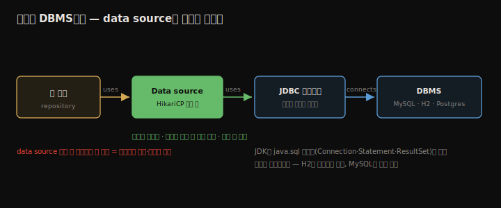
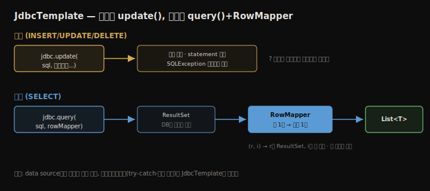

# 데이터 소스와 JdbcTemplate
---
> 거의 모든 앱은 데이터를 저장하며, 흔히 관계형 데이터베이스를 씁니다. Spring 앱이 DB와 연결하려면 **data source**가 필요합니다 — DBMS 연결을 관리해 재사용함으로써 성능을 지키는 구성 요소입니다. 이 장은 data source가 무엇인지, JDBC 드라이버와 어떻게 맞물리는지, 그리고 Spring이 제공하는 가장 단순한 도구인 **JdbcTemplate**으로 데이터를 저장·조회하는 법을 정리합니다. 마지막으로 data source를 직접 커스터마이징하는 경우도 다룹니다.


## 핵심 요약

**data source**는 앱을 위해 DB 서버 연결을 관리하는 객체입니다. 연산마다 새 연결을 맺으면 네트워크 왕복·재인증으로 성능이 나빠지므로, data source가 연결을 재사용하고 필요할 때만 새로 요청하며 해제 시 닫습니다. Java가 관계형 DB에 연결하는 능력을 **JDBC**라 부르는데, JDK는 추상화(`Connection`·`Statement`·`ResultSet`)만 주고 실제 구현은 벤더별 **JDBC 드라이버**(런타임 의존성)가 제공합니다. Spring Boot는 기본 data source로 **HikariCP**(연결 풀)를 자동 설정합니다. **JdbcTemplate**은 JDBC를 단순화한 Spring 도구로, 데이터 변경은 `update()`, 조회는 `query()`로 처리하며, 조회 시 행을 객체로 바꾸는 **RowMapper**를 함께 넘깁니다. DB 작업 클래스는 관례상 **repository**라 부르고 `@Repository`로 표시합니다. Spring Boot가 만든 기본 data source로 충분치 않으면(다중 DB, 런타임 조건부 설정 등) `@Bean`으로 `DataSource`를 직접 정의합니다.


## 학습 목표

> 이 내용을 읽고 나면 다음을 할 수 있습니다.

1. data source가 무엇이고 왜 필요한지 설명할 수 있습니다.
2. JDK의 JDBC 추상화와 JDBC 드라이버의 역할을 구분할 수 있습니다.
3. JdbcTemplate의 `update()`로 데이터를 저장할 수 있습니다.
4. `query()`와 RowMapper로 데이터를 객체로 조회할 수 있습니다.
5. `application.properties` 또는 `@Bean`으로 data source를 설정·커스터마이징할 수 있습니다.


## 본문 정리


### 1. data source란 무엇인가

data source는 DBMS 연결을 관리하는 구성 요소입니다. DBMS(database management system)는 영속 데이터를 효율적·안전하게 관리하는 소프트웨어이고, database는 영속 데이터의 모음입니다. data source가 없으면 앱은 연산마다 새 연결을 요청해야 하는데, 연결 수립은 네트워크 통신이라 매번 하면 앱이 크게 느려집니다.



Java가 관계형 DB에 연결하는 능력을 **JDBC**(Java Database Connectivity)라 부릅니다. JDK는 `java.sql.Connection`·`Statement`·`ResultSet` 같은 추상화만 제공하고, 특정 기술(MySQL·Postgres·Oracle)의 구현은 주지 않습니다. 그 구현을 얻으려면 벤더가 제공하는 **JDBC 드라이버**를 런타임 의존성으로 추가합니다. 드라이버는 JDK나 Spring이 주는 게 아니라 기술 벤더가 줍니다.

드라이버로 연결을 얻는 가장 단순한 방법은 `DriverManager.getConnection(url, username, password)`를 매번 호출하는 것입니다. Java 입문 튜토리얼에서 흔히 보는 방식이지만, 연산마다 재인증하는 것은 자원·시간 낭비입니다. 바에서 맥주를 시킬 때마다 신분증을 다시 보여 달라는 격입니다. 그래서 연결을 맺는 대신 **data source**가 연결을 관리하게 합니다. Java에서 가장 널리 쓰이는 구현은 **HikariCP**(Hikari connection pool)이며, Spring Boot의 기본 data source 구현도 이것입니다.


### 2. JdbcTemplate으로 데이터 다루기

JDK의 JDBC 클래스를 직접 쓰면 단순한 INSERT 하나에도 `PreparedStatement` 생성·파라미터 바인딩·`SQLException` try-catch 같은 장황한 코드가 필요합니다. **JdbcTemplate**은 이 보일러플레이트를 줄여 줍니다. Spring이 제공하는 관계형 DB 도구 중 가장 단순하며, 다른 영속성 프레임워크를 강제하지 않아 작은 앱과 학습 시작점에 적합합니다.

예제는 `purchase` 테이블(`id` 자동 증가 PK, `product`, `price`)에 구매 기록을 저장·조회하는 백엔드입니다. 의존성은 `spring-boot-starter-web` + `spring-boot-starter-jdbc` + H2(런타임 스코프)를 추가합니다. H2는 인메모리 DB이자 JDBC 드라이버를 함께 제공해, 별도 DB 서버 없이 예제를 돌릴 수 있습니다.

테이블 구조는 `resources/schema.sql`에 DDL로 적으면 앱 시작 시 Spring이 실행합니다.

```sql
CREATE TABLE IF NOT EXISTS purchase (
    id INT AUTO_INCREMENT PRIMARY KEY,
    product varchar(50) NOT NULL,
    price double NOT NULL
);
```

> ⚠️ `schema.sql`은 학습용입니다. 실무에서는 DB 스크립트를 버전 관리하는 **Flyway**·**Liquibase**를 씁니다. 입문 직후 익히길 권합니다.

모델 클래스 `Purchase`의 `price`는 `double`이 아니라 **`BigDecimal`**로 둡니다. `double`·`float`는 메모리 저장 방식 때문에 덧셈·뺄셈 같은 단순 연산에서도 정밀도를 잃을 수 있어, 가격처럼 민감한 값에는 부적합합니다. Spring의 핵심 기능들은 모두 `BigDecimal`을 다룰 줄 압니다.

```java
public class Purchase {
  private int id;
  private String product;
  private BigDecimal price;
  // getters/setters
}
```

DB 작업 클래스는 관례상 **repository**라 부릅니다. 3장에서 배운 `@Service`처럼, repository에는 전용 스테레오타입 `@Repository`를 붙여 bean으로 등록합니다. Spring Boot는 H2 의존성을 보고 data source와 JdbcTemplate을 자동 설정하므로, 생성자 주입으로 바로 받아 씁니다.

```java
@Repository
public class PurchaseRepository {
  private final JdbcTemplate jdbc;
  public PurchaseRepository(JdbcTemplate jdbc) { this.jdbc = jdbc; }
}
```

#### 데이터 변경 — update()

`update()`는 INSERT·UPDATE·DELETE 같은 데이터 변경 쿼리를 실행합니다. SQL과 파라미터를 넘기면 연결 획득·statement 생성·예외 처리를 JdbcTemplate이 대신합니다. `?` 자리에 파라미터가 순서대로 들어가고, ID는 DBMS가 생성하므로 `NULL`을 둡니다.

```java
public void storePurchase(Purchase purchase) {
  String sql = "INSERT INTO purchase VALUES (NULL, ?, ?)";
  jdbc.update(sql, purchase.getProduct(), purchase.getPrice());
}
```

#### 데이터 조회 — query() + RowMapper

조회는 SELECT 쿼리를 보내고, 행을 객체로 바꾸는 방법을 **RowMapper**로 알려 줍니다. RowMapper는 `ResultSet`의 한 행을 특정 객체로 변환하는 책임을 집니다.



```java
public List<Purchase> findAllPurchases() {
  String sql = "SELECT * FROM purchase";

  RowMapper<Purchase> purchaseRowMapper = (r, i) -> {
    Purchase rowObject = new Purchase();
    rowObject.setId(r.getInt("id"));
    rowObject.setProduct(r.getString("product"));
    rowObject.setPrice(r.getBigDecimal("price"));
    return rowObject;
  };

  return jdbc.query(sql, purchaseRowMapper);
}
```

람다의 `r`은 `ResultSet`, `i`는 행 번호입니다. JdbcTemplate은 결과의 각 행마다 이 매퍼를 호출해 `List<Purchase>`를 만듭니다. repository 메서드를 컨트롤러가 호출해 `/purchase` 엔드포인트(POST 저장·GET 조회)로 노출합니다.

```java
@RestController
@RequestMapping("/purchase")
public class PurchaseController {
  private final PurchaseRepository purchaseRepository;
  public PurchaseController(PurchaseRepository purchaseRepository) {
    this.purchaseRepository = purchaseRepository;
  }
  @PostMapping public void storePurchase(@RequestBody Purchase purchase) {
    purchaseRepository.storePurchase(purchase);
  }
  @GetMapping public List<Purchase> findPurchases() {
    return purchaseRepository.findAllPurchases();
  }
}
```


### 3. data source 설정 커스터마이징

인메모리 H2는 예제용이고, 실무에서는 외부 DB 서버를 씁니다. MySQL로 바꾸는 데는 두 단계면 됩니다 — 로직은 그대로입니다.

#### properties 파일로 정의

H2를 빼고 MySQL JDBC 드라이버(`mysql-connector-java`, 런타임 스코프)를 추가한 뒤, `application.properties`에 연결 정보를 적습니다. Spring Boot가 이 속성으로 `DataSource` bean을 만듭니다. MySQL은 `schema.sql` 실행을 위해 `initialization-mode=always`가 필요합니다(H2는 기본 실행이라 불필요).

```properties
spring.datasource.url=jdbc:mysql://localhost/spring_quickly?serverTimezone=UTC
spring.datasource.username=<dbms username>
spring.datasource.password=<dbms password>
spring.datasource.initialization-mode=always
```

> ⚠️ 비밀번호를 properties에 두는 것은 학습용입니다. 실무에서는 secret vault에 보관합니다.

#### 커스텀 DataSource bean

Spring Boot의 자동 설정으로 부족한 경우 `@Bean`으로 직접 정의합니다. 다음과 같은 상황입니다.

- 런타임 조건에 따라 특정 `DataSource` 구현을 골라야 할 때
- 앱이 둘 이상의 DB에 연결해 data source가 여럿이고 `@Qualifier`로 구분해야 할 때
- 환경에 따라 연결 풀 크기 같은 파라미터를 다르게 둬야 할 때
- Spring은 쓰지만 Spring Boot는 안 쓸 때

```java
@Configuration
public class ProjectConfig {
  @Value("${custom.datasource.url}")      private String datasourceUrl;
  @Value("${custom.datasource.username}") private String datasourceUsername;
  @Value("${custom.datasource.password}") private String datasourcePassword;

  @Bean
  public DataSource dataSource() {
    HikariDataSource dataSource = new HikariDataSource();
    dataSource.setJdbcUrl(datasourceUrl);
    dataSource.setUsername(datasourceUsername);
    dataSource.setPassword(datasourcePassword);
    dataSource.setConnectionTimeout(1000);
    return dataSource;
  }
}
```

컨텍스트에 `DataSource`가 이미 있으면 Spring Boot는 자동 설정을 하지 않고 이 bean을 씁니다. 속성 이름에 `custom.`을 붙인 것은 Spring Boot 표준 속성이 아니라 우리가 고른 이름임을 강조하기 위함이며, 아무 이름이나 써도 됩니다. JdbcTemplate을 커스터마이징할 때도 같은 방식(`@Bean`)을 씁니다.


## 심화 학습

> 책은 Spring Boot 2 / Spring 5 기준입니다. 실무 맥락과 이후 동향을 보강합니다.

- **`initialization-mode` 속성의 변화**: 책의 `spring.datasource.initialization-mode`는 Spring Boot 2.5부터 **`spring.sql.init.mode`**로 바뀌었습니다(이전 속성은 deprecated). 오늘 MySQL로 `schema.sql`을 돌리려면 `spring.sql.init.mode=always`를 씁니다.
- **`mysql-connector-java` 좌표 변경**: groupId가 `mysql`에서 **`com.mysql`**(artifactId `mysql-connector-j`)로 바뀌었습니다. 책의 옛 좌표는 deprecated 경고가 납니다.
- **JdbcClient의 등장**: Spring 6.1 / Boot 3.2에서 플루언트한 **JdbcClient**가 추가됐습니다. `jdbcClient.sql(...).param(...).query(Purchase.class).list()`처럼 메서드 체이닝으로 읽기 쉬워, JdbcTemplate의 현대적 대안입니다.
- **JdbcTemplate vs JPA**: JdbcTemplate은 SQL을 직접 쓰는 만큼 제어가 명확하지만, 매핑·관계·변경 추적을 손으로 해야 합니다. 13·14장의 Spring Data JPA는 이를 자동화하는 대신 추상화가 두꺼워집니다. 작은 앱·복잡한 쿼리에는 JdbcTemplate, 도메인 중심 CRUD에는 JPA가 흔한 선택입니다.
- **연결 풀 튜닝**: HikariCP의 `maximumPoolSize`·`connectionTimeout`은 성능에 직결됩니다. 풀이 너무 작으면 대기, 너무 크면 DB 부하가 커지므로 부하 테스트로 정합니다.


## 실무 적용 포인트

### 이런 상황에서 사용하세요

- SQL을 직접 제어하고 싶은 작은 앱·복잡한 쿼리 → JdbcTemplate(또는 Boot 3.2+ JdbcClient)
- 예제·통합 테스트에서 DB 의존성 격리 → H2 인메모리
- 외부 DB 연결 + 표준 설정으로 충분 → `application.properties`
- 다중 DB·런타임 조건부 설정 → `@Bean`으로 커스텀 `DataSource` + `@Qualifier`

### 주의할 점

- ⚠️ 가격·금액 같은 정밀 소수는 `double`/`float` 대신 `BigDecimal`을 씁니다.
- ⚠️ 비밀번호를 properties에 평문으로 두지 않습니다 — secret vault를 씁니다.
- ⚠️ `schema.sql`은 학습용이며, 실무는 Flyway·Liquibase로 스키마를 버전 관리합니다.
- ⚠️ 책의 `initialization-mode`·`mysql` 좌표는 최신 버전에서 바뀌었으니 버전에 맞춰 확인합니다.


## 면접 대비

### 한 줄 정의

"data source란 앱을 위해 DB 서버 연결을 관리(재사용·풀링)하는 객체이며, JdbcTemplate은 그 연결로 JDBC를 단순화해 SQL을 실행하는 Spring 도구입니다."

### 핵심 포인트 3가지

1. JDK는 JDBC 추상화만 주고, 실제 구현은 벤더별 JDBC 드라이버(런타임 의존성)가 제공합니다.
2. data source(기본 HikariCP)는 연결을 재사용해 매 연산마다 새 연결을 맺는 낭비를 막습니다.
3. JdbcTemplate은 변경에 `update()`, 조회에 `query()`+RowMapper를 쓰며 보일러플레이트를 대신합니다.

### 자주 묻는 질문

Q: data source가 왜 필요한가요?
A: data source 없이 연산마다 새 연결을 맺으면 네트워크 왕복과 재인증이 반복돼 성능이 크게 떨어집니다. data source는 연결을 풀에 두고 재사용하며 필요할 때만 새로 요청해, 영속성 계층의 성능을 지킵니다.

Q: JDBC 드라이버는 어디서 오나요?
A: JDK는 추상화(`Connection`·`ResultSet` 등)만 제공하고, 그 구현은 DB 기술 벤더가 주는 JDBC 드라이버에 들어 있습니다. MySQL이면 MySQL 드라이버를 런타임 의존성으로 추가합니다. H2는 의존성에 드라이버가 포함됩니다.

Q: 언제 DataSource를 직접 정의하나요?
A: 다중 DB 연결, 런타임 조건부 구현 선택, 환경별 연결 풀 파라미터 조정, Spring Boot 미사용 등 자동 설정으로 부족할 때 `@Bean`으로 직접 정의합니다. 컨텍스트에 `DataSource`가 있으면 Spring Boot는 자동 설정을 건너뜁니다.


## 핵심 개념 체크리스트

- [ ] data source가 연결을 관리해 성능을 지키는 원리를 아는가?
- [ ] JDK의 JDBC 추상화와 벤더 드라이버의 역할을 구분할 수 있는가?
- [ ] Spring Boot 기본 data source가 HikariCP임을 아는가?
- [ ] `update()`로 변경, `query()`+RowMapper로 조회하는 흐름을 아는가?
- [ ] 가격에 `BigDecimal`을 쓰는 이유를 설명할 수 있는가?
- [ ] 커스텀 `DataSource` bean이 필요한 상황 네 가지를 아는가?


## 참고 자료

- 공식 문서: [Spring JdbcTemplate](https://docs.spring.io/spring-framework/reference/data-access/jdbc/core.html) · [HikariCP](https://github.com/brettwooldridge/HikariCP)
- 스키마 버전 관리: [Flyway](https://flywaydb.org/) · [Liquibase](https://www.liquibase.org/)
- 연관 노트: [REST 서비스](./10.REST%20서비스.md) · [Spring Context와 Bean 등록](./02.Spring%20Context와%20Bean%20등록.md)
- 다음 장: 13장 — Spring Data JPA로 데이터 영속화
