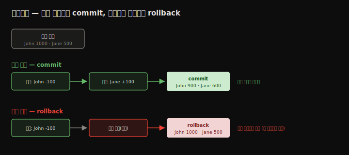
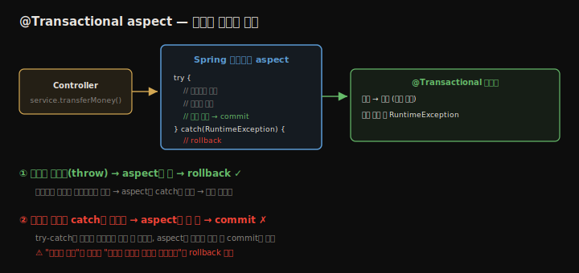

# 트랜잭션
---
> 데이터를 다룰 때 가장 중요한 것은 정확성을 지키는 일입니다. 송금처럼 여러 변경 연산이 한 묶음이어야 하는 작업에서, 중간에 하나가 실패하면 데이터가 어긋납니다. 트랜잭션은 여러 변경 연산을 **전부 성공하거나 전부 취소**하게 만들어 이를 막습니다. 이 장은 트랜잭션이 무엇인지(atomicity·commit·rollback), Spring이 AOP aspect로 트랜잭션을 어떻게 관리하는지, 그리고 `@Transactional` 하나로 송금 유스케이스를 트랜잭션으로 감싸는 법을 정리합니다.


## 핵심 요약

트랜잭션은 데이터를 바꾸는 연산들의 묶음으로, **전부 실행되거나 전혀 실행되지 않습니다**(atomicity). 모든 단계가 성공하면 변경을 영속화하는 **commit**이, 한 단계라도 실패하면 시작 시점으로 되돌리는 **rollback**이 일어납니다. 송금에서 출금만 되고 입금이 실패하면 돈이 사라지는데, 트랜잭션이 이를 막습니다. Spring에서는 6장의 **AOP aspect**가 트랜잭션의 배후입니다. 메서드에 `@Transactional`을 붙이면 Spring이 제공하는 aspect가 호출을 가로채, 정상 종료면 commit하고 **런타임 예외가 던져지면** rollback합니다. 여기서 핵심은 "예외가 났다"가 아니라 "예외가 메서드 밖으로 **던져졌다**"는 점입니다 — 메서드 안에서 catch로 삼키면 aspect가 예외를 못 봐 commit해 버립니다. 기본적으로 런타임 예외만 rollback하고, checked 예외는 rollback하지 않습니다(`@Transactional` 속성으로 바꿀 수 있음).


## 학습 목표

> 이 내용을 읽고 나면 다음을 할 수 있습니다.

1. 트랜잭션의 atomicity·commit·rollback을 설명할 수 있습니다.
2. 트랜잭션이 데이터 정합성을 어떻게 지키는지 예로 들 수 있습니다.
3. Spring이 AOP aspect로 트랜잭션을 관리하는 원리를 설명할 수 있습니다.
4. `@Transactional`로 메서드·클래스를 트랜잭션으로 감쌀 수 있습니다.
5. 예외를 catch로 삼키면 rollback이 안 되는 이유를 설명할 수 있습니다.


## 본문 정리


### 1. 트랜잭션이란

트랜잭션은 데이터를 바꾸는 연산(mutable operation)들의 정해진 묶음으로, 전부 올바로 실행되거나 전혀 실행되지 않습니다. 이 성질을 **atomicity**(원자성)라 부릅니다. 송금을 예로 보면 두 단계입니다 — 출금 계좌에서 빼고, 입금 계좌에 더합니다. 둘 다 데이터를 바꾸는 연산이고, 송금이 올바르려면 둘 다 성공해야 합니다.

John이 Jane에게 100달러를 보낸다고 합시다. John은 1000, Jane은 500을 가졌습니다. 송금 후 John은 900, Jane은 600이어야 합니다. 그런데 출금만 되고 입금이 실패하면 John은 900인데 Jane은 그대로 500 — 100달러가 사라집니다. 트랜잭션은 둘을 한 묶음으로 묶어 이 불일치를 막습니다.



단계 1 앞에서 트랜잭션을 시작하고 단계 2 뒤에서 닫습니다. 둘 다 성공하면 트랜잭션이 끝날 때 변경을 영속화하는데, 이를 **commit**이라 합니다. 단계 1은 됐지만 단계 2가 실패하면, 단계 1의 변경을 되돌립니다 — 이를 **rollback**이라 합니다. rollback은 데이터를 트랜잭션 시작 시점 모습으로 복원해 불일치를 막습니다.


### 2. Spring에서 트랜잭션이 동작하는 원리

트랜잭션의 배후에는 6장에서 다룬 **Spring AOP aspect**가 있습니다. aspect는 정의한 방식대로 특정 메서드 실행을 가로채는 코드입니다. 트랜잭션도 다르지 않아, 트랜잭션으로 감쌀 메서드를 `@Transactional`로 표시하면, Spring이 (직접 구현하지 않아도) aspect를 설정해 그 메서드의 연산에 트랜잭션 로직을 적용합니다.



Spring은 메서드가 런타임 예외를 **던지면** rollback합니다. "던진다"는 말이 핵심입니다. 메서드 안에서 예외가 발생하는 것만으로는 부족합니다 — 메서드가 예외를 호출자에게 더 던져야 aspect가 그것을 보고 rollback합니다. 메서드가 예외를 자기 로직 안에서 try-catch로 처리하고 더 던지지 않으면, aspect는 예외가 일어난 줄 모른 채 commit해 버립니다.

> **checked 예외는 어떨까요?** Java의 checked 예외는 처리하거나 던져야 컴파일되는 예외입니다. 기본적으로 Spring은 **런타임 예외만** rollback하고 checked 예외는 rollback하지 않습니다. checked 예외는 `throws` 절로 시그니처에 드러나는, 개발자가 다뤄야 할 통제된 상황이지 데이터 불일치를 부르는 사고가 아니기 때문입니다. checked 예외에도 rollback이 필요하면 `@Transactional` 속성으로 동작을 바꿀 수 있지만, 필요하지 않으면 프레임워크 기본 동작에 맡기는 편이 단순합니다.


### 3. Spring 앱에서 트랜잭션 사용하기

전자지갑 백엔드를 예로, 한 계좌에서 다른 계좌로 송금하는 유스케이스를 트랜잭션으로 감쌉니다. 클래스 설계는 컨트롤러 → 서비스(비즈니스 로직, 여기에 트랜잭션) → repository(DB 접근) 순입니다. 의존성은 12장처럼 Spring JDBC + H2를 씁니다.

`account` 테이블(`id`·`name`·`amount`)을 `schema.sql`로 만들고, `data.sql`로 테스트용 계좌 두 개(각 1000)를 넣습니다. `Account` 모델의 `amount`는 12장에서 본 이유로 `BigDecimal`입니다.

repository는 12장의 JdbcTemplate로 계좌 조회(`queryForObject`)와 금액 변경(`update`)을 구현합니다. 단건 조회에는 `queryForObject`를 쓰고 `RowMapper`로 행을 `Account`에 매핑합니다.

```java
@Repository
public class AccountRepository {
  private final JdbcTemplate jdbc;
  public AccountRepository(JdbcTemplate jdbc) { this.jdbc = jdbc; }

  public Account findAccountById(long id) {
    String sql = "SELECT * FROM account WHERE id = ?";
    return jdbc.queryForObject(sql, new AccountRowMapper(), id);
  }
  public void changeAmount(long id, BigDecimal amount) {
    String sql = "UPDATE account SET amount = ? WHERE id = ?";
    jdbc.update(sql, amount, id);
  }
}
```

서비스의 `transferMoney()`가 비즈니스 로직입니다 — 두 계좌를 조회하고, 보내는 쪽에서 빼고, 받는 쪽에 더해, 각각 금액을 변경합니다. 단계 2·3은 데이터를 바꾸는 변경 연산이라, 트랜잭션으로 감싸지 않으면 한 단계 실패 시 불일치가 생깁니다. `@Transactional` 한 줄이면 Spring이 이 메서드 실행을 트랜잭션으로 감쌉니다.

```java
@Service
public class TransferService {
  private final AccountRepository accountRepository;
  public TransferService(AccountRepository accountRepository) {
    this.accountRepository = accountRepository;
  }

  @Transactional
  public void transferMoney(long idSender, long idReceiver, BigDecimal amount) {
    Account sender = accountRepository.findAccountById(idSender);
    Account receiver = accountRepository.findAccountById(idReceiver);

    BigDecimal senderNewAmount = sender.getAmount().subtract(amount);
    BigDecimal receiverNewAmount = receiver.getAmount().add(amount);

    accountRepository.changeAmount(idSender, senderNewAmount);
    accountRepository.changeAmount(idReceiver, receiverNewAmount);
  }
}
```

트랜잭션은 서비스 메서드 실행 직전에 시작해 메서드가 성공적으로 끝난 직후 끝납니다. 런타임 예외를 던지지 않으면 commit하고, 어느 단계든 런타임 예외를 던지면 시작 시점으로 데이터를 복원합니다.

> **클래스에 `@Transactional`**: 애너테이션을 클래스에 붙이면 모든 메서드에 적용됩니다. 서비스 클래스의 메서드는 대개 유스케이스라 전부 트랜잭션이 필요하므로, 실무에서는 메서드마다 반복하는 대신 클래스에 한 번 붙이는 일이 많습니다. 클래스와 메서드 양쪽에 붙으면 메서드 설정이 클래스 설정을 덮어씁니다.

#### 정말 rollback되는지 테스트

데이터가 잘 저장되는 것은 봤지만, 예외 시 정말 복원되는지는 직접 테스트해야 압니다. 송금 메서드 끝에 런타임 예외를 던지는 한 줄을 넣어 봅니다.

```java
@Transactional
public void transferMoney(long idSender, long idReceiver, BigDecimal amount) {
  // ... 두 계좌 조회 · 금액 계산 · 양쪽 changeAmount 호출 ...
  throw new RuntimeException("Oh no! Something went wrong!");
}
```

이렇게 하면 두 `changeAmount`가 이미 실행됐는데도, `/accounts`로 다시 조회하면 두 계좌 모두 1000 그대로입니다. 변경 연산이 실행됐어도 aspect가 런타임 예외를 받아 rollback해, 데이터를 트랜잭션 시작 시점으로 되돌렸기 때문입니다.

> 앱의 어떤 기능도 제대로 테스트하기 전에는 "동작한다"고 믿어선 안 됩니다. 테스트하기 전까지 기능은 동작하면서 동시에 동작하지 않는, 슈뢰딩거 상태에 있습니다.


## 심화 학습

> 책은 Spring Boot 2 / Spring 5 기준입니다. 실무 맥락과 이후 동향을 보강합니다.

- **자기 호출(self-invocation) 함정**: `@Transactional`은 프록시 기반 AOP라, 같은 클래스 안에서 메서드가 다른 `@Transactional` 메서드를 직접 호출하면 프록시를 거치지 않아 트랜잭션이 안 걸립니다. 6장 AOP 프록시의 한계와 같은 원리입니다. 해결책은 메서드를 다른 빈으로 분리하거나 자기 자신을 주입받아 프록시 경유로 부르는 것입니다.
- **전파(propagation)와 격리(isolation)**: `@Transactional(propagation = ...)`로 기존 트랜잭션에 참여할지 새로 열지를 정하고(`REQUIRED`가 기본·`REQUIRES_NEW`로 분리), `isolation`으로 동시 트랜잭션 간 가시성(dirty read·phantom read 방지)을 조절합니다. 책 범위 밖이지만 실무 트랜잭션 설계의 핵심입니다.
- **읽기 전용 최적화**: 조회만 하는 메서드에 `@Transactional(readOnly = true)`를 주면, JPA에서는 변경 감지(dirty checking)를 건너뛰어 성능이 좋아집니다. JdbcTemplate에서는 효과가 제한적이지만 의도를 드러내는 신호로 씁니다.
- **`rollbackFor`로 동작 변경**: checked 예외에도 rollback하려면 `@Transactional(rollbackFor = Exception.class)`를, 반대로 특정 런타임 예외는 commit하려면 `noRollbackFor`를 씁니다. 다만 저자 조언대로 기본 동작으로 충분한 경우가 대부분입니다.
- **분산 트랜잭션의 한계**: 단일 DB 트랜잭션은 이 장 그대로지만, 여러 서비스·DB에 걸친 작업은 ACID 트랜잭션으로 묶기 어렵습니다. 그래서 MSA에서는 SAGA 패턴(보상 트랜잭션)으로 최종 일관성을 추구합니다.


## 실무 적용 포인트

### 이런 상황에서 사용하세요

- 여러 변경 연산이 한 묶음이어야 하는 유스케이스(송금·주문·재고 차감) → `@Transactional`
- 서비스 클래스의 메서드 대부분이 트랜잭션이어야 할 때 → 클래스에 `@Transactional`
- 조회 전용 메서드 → `@Transactional(readOnly = true)` (특히 JPA)

### 주의할 점

- ⚠️ 트랜잭션 메서드 안에서 예외를 catch로 삼키면 rollback이 안 됩니다 — 다시 던지거나 처리 방침을 명확히 합니다.
- ⚠️ 기본은 런타임 예외만 rollback합니다. checked 예외 rollback이 필요하면 `rollbackFor`를 명시합니다.
- ⚠️ 같은 클래스 내 자기 호출은 프록시를 안 거쳐 트랜잭션이 안 걸립니다.
- ⚠️ 단순함을 우선해, 필요하지 않으면 propagation·isolation을 기본값으로 둡니다.


## 면접 대비

### 한 줄 정의

"트랜잭션이란 데이터를 바꾸는 연산들의 묶음으로 전부 실행되거나 전혀 실행되지 않으며(atomicity), Spring에서는 `@Transactional`이 붙은 메서드를 AOP aspect가 가로채 정상 종료면 commit, 런타임 예외가 던져지면 rollback합니다."

### 핵심 포인트 3가지

1. 트랜잭션은 atomicity를 보장해, 모두 성공하면 commit하고 하나라도 실패하면 시작 시점으로 rollback합니다.
2. Spring은 `@Transactional`을 AOP aspect로 구현하며, 메서드 밖으로 던져진 런타임 예외에만 rollback합니다.
3. 메서드 안에서 예외를 catch로 삼키면 aspect가 못 봐 commit되므로, rollback 조건은 "예외 발생"이 아니라 "예외 전파"입니다.

### 자주 묻는 질문

Q: 메서드 안에서 예외가 났는데 왜 rollback이 안 되나요?
A: Spring 트랜잭션 aspect는 메서드 밖으로 던져진 예외만 봅니다. try-catch로 예외를 처리하고 다시 던지지 않으면 aspect가 예외를 모른 채 정상 종료로 간주해 commit합니다. rollback하려면 예외를 호출자에게 전파해야 합니다.

Q: checked 예외도 rollback되나요?
A: 기본적으로 아닙니다. Spring은 런타임 예외만 rollback합니다. checked 예외는 `throws`로 드러나는 통제된 상황이라 기본 제외이며, 필요하면 `@Transactional(rollbackFor = ...)`로 포함시킬 수 있습니다.

Q: `@Transactional`을 클래스에 붙이는 것과 메서드에 붙이는 것의 차이는?
A: 클래스에 붙이면 모든 메서드에 적용됩니다. 서비스 메서드 대부분이 트랜잭션이라 실무에서 흔히 클래스에 붙입니다. 양쪽에 붙으면 메서드 설정이 클래스 설정을 덮어씁니다.


## 핵심 개념 체크리스트

- [ ] atomicity·commit·rollback을 설명할 수 있는가?
- [ ] 송금 예제로 트랜잭션이 정합성을 지키는 흐름을 아는가?
- [ ] `@Transactional`이 AOP aspect로 동작함을 아는가?
- [ ] rollback 조건이 "예외 전파"임을 (catch 함정 포함) 아는가?
- [ ] 런타임 예외만 기본 rollback되고 checked는 제외임을 아는가?
- [ ] 클래스 레벨 `@Transactional`과 자기 호출 함정을 아는가?


## 참고 자료

- 공식 문서: [Spring Transaction Management](https://docs.spring.io/spring-framework/reference/data-access/transaction.html)
- 연관 노트: [데이터 소스와 JdbcTemplate](./12.데이터%20소스와%20JdbcTemplate.md) · [Spring AOP와 Aspect](./06.Spring%20AOP와%20Aspect.md)
- 다음 장: 14장 — Spring Data로 데이터 영속화
