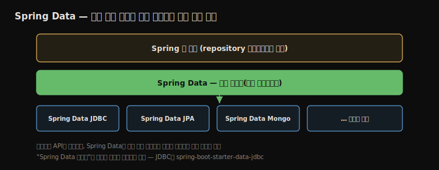
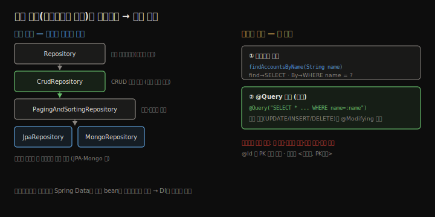

# Spring Data
---
> Spring Data는 영속 계층을 최소한의 코드로 구현하게 해 주는 Spring 생태계 프로젝트입니다. repository를 직접 구현하지 않고 **인터페이스만 선언**하면, 프레임워크가 구현을 채워 줍니다. 이 장은 Spring Data가 무엇이고 왜 가치 있는지, 계약 인터페이스 계층(Repository → CrudRepository → PagingAndSortingRepository → 기술별 계약)이 어떻게 구성되는지, 그리고 Spring Data JDBC로 영속 계층을 만드는 법을 송금 예제로 정리합니다.


## 핵심 요약

Spring Data는 여러 영속 기술(JDBC·JPA/Hibernate·MongoDB 등) 위에 **공통 추상화 계층**을 얹어, 어느 기술을 쓰든 비슷한 방식으로 영속 계층을 작성하게 합니다. "Spring Data 의존성"은 하나가 아니라 기술별 모듈로 나뉩니다 — JDBC면 `spring-boot-starter-data-jdbc`, Mongo면 Spring Data Mongo입니다. repository는 계약 인터페이스를 **확장(extends)**해 정의합니다. **Repository**(마커, 메서드 없음) → **CrudRepository**(CRUD) → **PagingAndSortingRepository**(정렬·페이징) 순으로 인터페이스 분리(interface segregation) 원칙에 따라 필요한 만큼만 확장하고, JPA면 `JpaRepository`, Mongo면 `MongoRepository` 같은 기술별 계약도 있습니다. 인터페이스만 선언하면 Spring Data가 구현 bean을 컨텍스트에 등록하므로 DI로 주입해 씁니다. 커스텀 연산은 **메서드명 파생**(`findAccountsByName` → `WHERE name = ?`)으로도 되지만, 저자는 **`@Query`로 명시**하기를 권하며 변경 쿼리에는 `@Modifying`을 붙입니다. PK 필드는 `@Id`로 표시합니다.


## 학습 목표

> 이 내용을 읽고 나면 다음을 할 수 있습니다.

1. Spring Data가 무엇이고 왜 영속 계층을 단순화하는지 설명할 수 있습니다.
2. Repository·CrudRepository·PagingAndSortingRepository 계약 계층을 구분할 수 있습니다.
3. Spring Data JDBC로 인터페이스만 선언해 repository를 만들 수 있습니다.
4. 메서드명 파생과 `@Query`의 차이와 장단점을 설명할 수 있습니다.
5. 변경 연산에 `@Modifying`이 필요한 이유를 알 수 있습니다.


## 본문 정리


### 1. Spring Data란

Java 생태계에는 영속 기술이 많습니다. 12·13장에서 쓴 JDBC(드라이버로 관계형 DBMS 직접 연결) 외에도, Hibernate 같은 ORM 프레임워크가 있고, 관계형이 아닌 NoSQL도 있습니다. 한 기술 안에서도 방법이 여럿입니다 — JDBC만 해도 JdbcTemplate을 쓰거나 JDK 인터페이스(`Statement`·`PreparedStatement`·`ResultSet`)를 직접 다룰 수 있습니다. 이 다양성이 복잡도를 키웁니다.



Spring Data는 두 가지로 영속 계층 구현을 단순화합니다. 첫째, 여러 영속 기술에 **공통 추상화(인터페이스)**를 제공해 기술이 달라도 비슷한 방식으로 작성하게 합니다. 둘째, 그 추상화만으로 영속 연산을 선언하면 **구현을 Spring Data가 제공**해, 코드를 적게 쓰고 앱이 이해·유지보수하기 쉬워집니다.


### 2. Spring Data가 동작하는 방식

"Spring Data"는 보통 이 프로젝트가 제공하는 모든 기능을 뭉뚱그려 부르는 말입니다. 실제로는 기술별 모듈이 따로 있고 서로 독립적이라, 각각 별도 Maven 의존성으로 추가합니다. **하나의 "Spring Data 의존성"은 없습니다** — JDBC면 Spring Data JDBC, MongoDB면 Spring Data Mongo 모듈을 씁니다.

어느 기술이든 Spring Data는 확장할 공통 계약 인터페이스를 줍니다.



- **Repository**: 가장 추상적인 계약. 확장하면 Spring Data repository로 인식되지만 미리 정의된 연산은 없습니다(메서드 없는 마커 인터페이스).
- **CrudRepository**: 가장 단순하면서 연산을 주는 계약. 확장하면 생성·조회·수정·삭제(CRUD) 기본 연산을 얻습니다.
- **PagingAndSortingRepository**: CrudRepository를 확장해 정렬·페이징 연산을 더합니다.

> ⚠️ 4장의 `@Repository` 애너테이션과 이 장의 `Repository` 인터페이스를 혼동하지 마십시오. `@Repository`는 클래스를 빈으로 등록하는 스테레오타입이고, `Repository`는 확장해서 Spring Data repository를 정의하는 인터페이스입니다.

여러 계약을 계단식으로 나눈 것은 **인터페이스 분리(interface segregation)** 원칙입니다. 모든 연산을 담은 "뚱뚱한" 계약 하나 대신, 앱이 필요한 연산만 가진 계약을 확장하게 합니다 — CRUD만 필요하면 CrudRepository를, 정렬·페이징도 필요하면 PagingAndSortingRepository를 확장합니다. 기술별 모듈은 더 구체적인 계약을 줍니다. Spring Data JPA는 `JpaRepository`(PagingAndSortingRepository보다 구체적, JPA 구현에서만 쓰는 연산 추가)를, Spring Data Mongo는 `MongoRepository`를 제공합니다.


### 3. Spring Data JDBC로 영속 계층 구현

13장처럼 전자지갑 송금 예제를 Spring Data JDBC로 다시 만듭니다. 의존성은 `spring-boot-starter-web` + `spring-boot-starter-data-jdbc` + H2(런타임)입니다. `account` 테이블(`id`·`name`·`amount`)을 `schema.sql`로 만들고 `data.sql`로 두 계좌를 넣습니다.

모델 클래스 `Account`의 `amount`는 정밀도 때문에 `BigDecimal`이고, PK 필드는 **`@Id`**로 표시합니다 — Spring Data가 조회 등 연산에서 어느 필드가 PK인지 알아야 하기 때문입니다.

```java
public class Account {
  @Id
  private long id;
  private String name;
  private BigDecimal amount;
  // getters/setters
}
```

repository는 인터페이스로 선언하고 계약을 확장합니다. CRUD만 필요하므로 `CrudRepository`를 확장하며, 제네릭 두 개(엔티티 타입, PK 타입)를 줍니다.

```java
public interface AccountRepository extends CrudRepository<Account, Long> {
}
```

이것만으로 PK 조회·전체 조회·삭제 같은 기본 연산이 생깁니다. 하지만 SQL로 짤 수 있는 모든 연산을 다 주진 않으니, 커스텀 연산이 필요합니다.

#### 커스텀 연산 — 메서드명 파생 vs @Query

Spring Data는 메서드명을 규칙에 따라 해석해 SQL을 만들어 줍니다. `findAccountsByName`이라 쓰면 `find`→SELECT, `Accounts`→무엇을 select할지, `By` 뒤 `Name`→`WHERE name = ?`로 번역합니다.

```java
public interface AccountRepository extends CrudRepository<Account, Long> {
  List<Account> findAccountsByName(String name);
}
```

이 "마법"은 인상적이지만 만능이 아닙니다. 저자는 **`@Query`로 쿼리를 명시**하길 권합니다. 메서드명 파생의 단점은 이렇습니다 — 복잡한 쿼리면 이름이 너무 길고 읽기 어렵고, 실수로 이름을 리팩터하면 동작이 바뀔 수 있고, Spring Data 전용 명명 규칙을 따로 익혀야 하고, 메서드명을 쿼리로 번역하느라 기동이 느려집니다.

`@Query`를 붙이면 메서드 이름은 무관해지고 명시한 쿼리를 실행하며 성능도 낫습니다. 데이터를 바꾸는 쿼리(UPDATE·INSERT·DELETE)에는 **`@Modifying`**도 함께 붙여 변경 연산임을 알립니다.

```java
public interface AccountRepository extends CrudRepository<Account, Long> {

  @Query("SELECT * FROM account WHERE name = :name")
  List<Account> findAccountsByName(String name);   // :name 은 파라미터명과 동일, 콜론 뒤 공백 없음

  @Modifying
  @Query("UPDATE account SET amount = :amount WHERE id = :id")
  void changeAmount(long id, BigDecimal amount);
}
```

#### 서비스에서 사용

인터페이스만 썼는데도 Spring Data가 동적 구현 bean을 컨텍스트에 등록하므로, 5장에서 배운 대로 인터페이스 타입으로 DI 받으면 됩니다. 13장처럼 `@Transactional`로 송금 로직을 트랜잭션으로 감싸 한 단계 실패 시 데이터가 어긋나지 않게 합니다.

```java
@Service
public class TransferService {
  private final AccountRepository accountRepository;
  public TransferService(AccountRepository accountRepository) {
    this.accountRepository = accountRepository;
  }

  @Transactional
  public void transferMoney(long idSender, long idReceiver, BigDecimal amount) {
    Account sender = accountRepository.findById(idSender)
        .orElseThrow(() -> new AccountNotFoundException());
    Account receiver = accountRepository.findById(idReceiver)
        .orElseThrow(() -> new AccountNotFoundException());

    accountRepository.changeAmount(idSender, sender.getAmount().subtract(amount));
    accountRepository.changeAmount(idReceiver, receiver.getAmount().add(amount));
  }

  public Iterable<Account> getAllAccounts() {
    return accountRepository.findAll();   // CrudRepository 상속 메서드
  }
}
```

`findById`는 `Optional`을 반환하므로 `orElseThrow`로 없는 계좌를 처리하고, `findAll`은 CrudRepository에서 상속받습니다. 컨트롤러는 `/transfer`(POST)·`/accounts`(GET, 선택 `name` 파라미터)로 노출합니다. 13장과 같은 결과 — Jane 1000·John 1000에서 100 이체 후 Jane 900·John 1100이 됩니다.


## 심화 학습

> 책은 Spring Boot 2 / Spring 5 기준입니다. 실무 맥락과 이후 동향을 보강합니다.

- **Spring Data JDBC vs JPA**: 둘 다 Spring Data지만 성격이 다릅니다. JDBC는 단순·명시적이라 SQL이 그대로 보이고 변경 추적·lazy loading·연관관계 자동화가 없습니다. JPA(Hibernate)는 영속성 컨텍스트·dirty checking·연관 매핑을 자동화하는 대신 추상화가 두껍고 학습 곡선이 있습니다. 실무 대다수는 `JpaRepository`를 확장하는 Spring Data JPA를 씁니다.
- **계약 계층의 변화**: Spring Data 3.x(Boot 3)에서 `PagingAndSortingRepository`가 더 이상 `CrudRepository`를 확장하지 않도록 분리됐습니다. 정렬·페이징과 CRUD를 둘 다 원하면 두 인터페이스를 함께 확장하거나, JPA에서는 `JpaRepository`를 확장합니다. 책의 계층도와 다른 점입니다.
- **`@Query`의 네이티브 vs JPQL**: Spring Data JDBC의 `@Query`는 네이티브 SQL입니다. Spring Data JPA에서는 기본이 JPQL(엔티티 기준)이고, 네이티브 SQL이 필요하면 `@Query(value = "...", nativeQuery = true)`를 씁니다 — 두 모듈에서 `@Query`의 의미가 다릅니다.
- **Pageable·Slice·Sort**: `PagingAndSortingRepository`는 `Page<T>`(전체 개수 포함)·`Slice<T>`(다음 페이지 유무만)·`Sort`를 메서드 파라미터로 받아 페이징·정렬을 선언적으로 처리합니다. 대량 목록 API의 표준 패턴입니다.
- **Querydsl·Specification**: 동적 조건이 많은 검색은 메서드명·`@Query`로 한계가 있어, QuerydslPredicateExecutor나 JPA Specification으로 타입 안전한 동적 쿼리를 조립합니다. 실무 검색 API에서 흔합니다.


## 실무 적용 포인트

### 이런 상황에서 사용하세요

- 영속 계층을 최소 코드로 빠르게 → Spring Data 계약 확장
- CRUD만 필요 → `CrudRepository`, 정렬·페이징도 → `PagingAndSortingRepository`(또는 JPA `JpaRepository`)
- 단순·명시적 SQL 제어 → Spring Data JDBC, 도메인 중심 ORM 자동화 → Spring Data JPA
- 커스텀 쿼리 → `@Query` 명시(변경 쿼리는 `@Modifying`)

### 주의할 점

- ⚠️ 메서드명 파생은 긴 이름·리팩터 위험·기동 지연이 있으니, 가급적 `@Query`로 명시합니다.
- ⚠️ `@Query`의 변경 연산(UPDATE/INSERT/DELETE)에 `@Modifying`을 빠뜨리면 실행되지 않습니다.
- ⚠️ `@Repository`(스테레오타입)와 `Repository`(Spring Data 계약 인터페이스)를 혼동하지 않습니다.
- ⚠️ Boot 3에서 `PagingAndSortingRepository` 계층이 바뀌었으니 버전에 맞춰 확장합니다.


## 면접 대비

### 한 줄 정의

"Spring Data란 여러 영속 기술 위에 공통 계약 인터페이스를 제공하는 Spring 생태계 프로젝트이며, repository를 인터페이스로 선언하면 프레임워크가 구현을 채워 영속 계층을 최소 코드로 만들게 합니다."

### 핵심 포인트 3가지

1. repository는 계약(Repository → CrudRepository → PagingAndSortingRepository → 기술별)을 확장해 정의하고, 인터페이스 분리 원칙에 따라 필요한 만큼만 확장합니다.
2. 인터페이스만 선언하면 Spring Data가 구현 bean을 등록하므로 DI로 주입해 씁니다.
3. 커스텀 연산은 메서드명 파생보다 `@Query` 명시가 권장되며, 변경 쿼리에는 `@Modifying`을 붙입니다.

### 자주 묻는 질문

Q: `@Repository` 애너테이션과 Spring Data의 `Repository` 인터페이스는 같은 건가요?
A: 아닙니다. `@Repository`는 클래스를 컨텍스트에 빈으로 등록하는 스테레오타입 애너테이션이고, `Repository`는 확장해서 Spring Data repository를 정의하는 마커 인터페이스입니다. 이름이 비슷해 혼동하기 쉽습니다.

Q: 메서드명 파생과 `@Query` 중 무엇을 쓰나요?
A: 저자는 `@Query` 명시를 권합니다. 메서드명 파생은 복잡한 쿼리에서 이름이 길어지고, 이름 리팩터로 동작이 바뀔 수 있고, 전용 규칙 학습이 필요하며, 번역 때문에 기동이 느려집니다. `@Query`는 이름과 무관하게 명시한 쿼리를 쓰고 성능도 낫습니다.

Q: `@Modifying`은 언제 붙이나요?
A: `@Query`로 UPDATE·INSERT·DELETE처럼 데이터를 바꾸는 연산을 정의할 때 붙입니다. Spring Data에 변경 연산임을 알리는 표시이며, 빠뜨리면 쿼리가 의도대로 실행되지 않습니다.


## 핵심 개념 체크리스트

- [ ] Spring Data가 공통 추상화로 영속 계층을 단순화함을 아는가?
- [ ] Repository·CrudRepository·PagingAndSortingRepository 계층을 구분하는가?
- [ ] 기술별로 의존성·계약(JpaRepository·MongoRepository)이 다름을 아는가?
- [ ] 인터페이스만 선언해도 구현 bean이 등록되는 원리를 아는가?
- [ ] 메서드명 파생 단점과 `@Query` 권장 이유를 설명할 수 있는가?
- [ ] 변경 쿼리에 `@Modifying`이 필요함을 아는가?


## 참고 자료

- 공식 문서: [Spring Data Commons — Repositories](https://docs.spring.io/spring-data/commons/reference/repositories.html)
- 모듈 목록: [Spring Data Projects](https://spring.io/projects/spring-data)
- 연관 노트: [데이터 소스와 JdbcTemplate](./12.데이터%20소스와%20JdbcTemplate.md) · [트랜잭션](./13.트랜잭션.md)
- 다음 장: 15장 — Spring 앱 테스트
