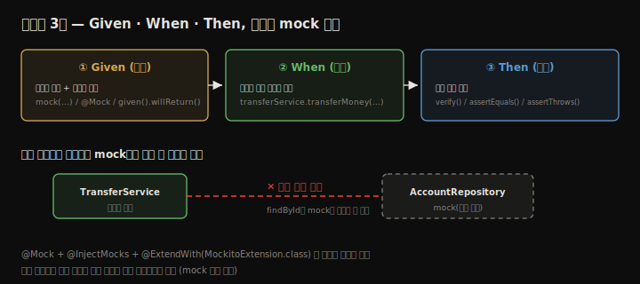
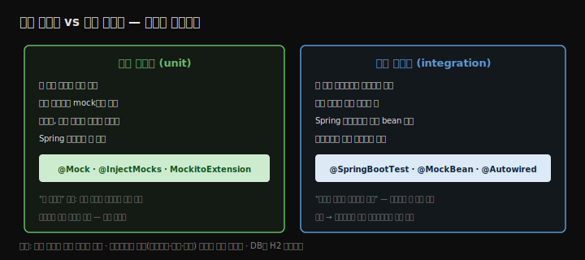

# Spring 앱 테스트
---
> 테스트는 앱의 특정 기능이 기대대로 동작하는지 검증하는 작은 로직입니다. 한 조각 로직만 격리해 보는 **단위 테스트**와, 여러 컴포넌트가 올바로 상호작용하는지 보는 **통합 테스트** 두 가지를 다룹니다. 테스트는 변경이 기존 기능을 깨지 않음을 보장하고(회귀 테스트) 문서 역할도 합니다. 이 장은 올바른 테스트의 구조(Given/When/Then 3단), Mockito로 의존성을 mock하는 단위 테스트, 그리고 `@SpringBootTest`로 Spring 컨텍스트를 띄우는 통합 테스트를 송금 예제로 정리합니다.


## 핵심 요약

테스트는 기능이 기대대로 동작하는지 검증하는 작은 코드이며, 변경이 기존 기능을 깨지 않게 지키고(회귀 테스트) 문서 역할도 합니다. **단위 테스트**는 한 조각 로직만 격리해 빠르게 검증하고 실패 지점을 정확히 가리키며, 모든 의존성을 **mock**(제어 가능한 가짜 객체)으로 대체합니다. **통합 테스트**는 둘 이상 컴포넌트의 상호작용을 검증하며, 일부 의존을 실제 객체로 둡니다 — 각 컴포넌트는 격리 상태에서 정상이어도 서로 잘 "대화"하지 못하는 결함을 잡습니다. 어떤 테스트든 세 부분으로 짭니다 — **Given**(입력·의존성 제어), **When**(대상 메서드 호출), **Then**(동작 검증). 단위 테스트는 JUnit 5 + Mockito(`@Mock`·`@InjectMocks`·`given`·`verify`·`assertThrows`)로 짜고, Spring 통합 테스트는 `@SpringBootTest`로 컨텍스트를 띄워 `@MockBean`으로 mock을 컨텍스트에 넣고 `@Autowired`로 실제 객체를 주입해 프레임워크 기능(트랜잭션·보안 등) 연동까지 검증합니다.


## 학습 목표

> 이 내용을 읽고 나면 다음을 할 수 있습니다.

1. 테스트가 왜 중요한지(회귀·문서·조기 피드백) 설명할 수 있습니다.
2. 단위 테스트와 통합 테스트의 차이를 구분할 수 있습니다.
3. 테스트의 Given/When/Then 3단 구조로 테스트를 작성할 수 있습니다.
4. Mockito로 의존성을 mock하고 동작을 검증할 수 있습니다.
5. `@SpringBootTest`로 Spring 통합 테스트를 작성할 수 있습니다.


## 본문 정리


### 1. 테스트가 왜 중요한가

테스트는 수동 검증 대신 써야 합니다. 같은 테스트를 최소 노력으로 반복 실행해 동작을 지속 검증할 수 있고(회귀 테스트), 테스트 단계를 읽으면 유스케이스 의도를 이해할 수 있어 문서가 되며, 개발 중 새 문제를 조기에 알려 주기 때문입니다. 한 번 잘 돌던 기능이 왜 다시 안 될 수 있을까요 — 버그 수정·기능 추가로 소스를 계속 바꾸기 때문입니다. 변경 시 테스트를 돌리면 기존 기능이 깨졌는지 프로덕션 전에 알 수 있습니다.



오늘날에는 개발자가 수동으로 돌리지 않고 빌드 과정에 테스트를 넣습니다. 팀은 보통 **지속적 통합(CI)** 방식을 씁니다 — Jenkins·TeamCity 같은 도구가 변경마다 빌드를 돌리고 테스트를 실행해, 무언가 깨지면 개발자에게 알립니다.


### 2. 올바른 테스트의 구조

테스트는 특정 메서드 로직이 원하는 대로 동작하는지 검증합니다. 한 메서드를 테스트할 때 보통 입력에 따른 여러 시나리오를 검증해야 하고, 시나리오마다 테스트 메서드를 하나씩 씁니다. 13·14장의 송금 유스케이스는 네 단계뿐이지만 테스트할 시나리오는 여럿입니다 — 보내는 계좌를 못 찾을 때, 받는 계좌를 못 찾을 때, 잔액 부족, 금액 갱신 실패, 모두 정상일 때입니다.

작은 메서드에서도 시나리오가 여럿 나온다는 점이 메서드를 작게 유지해야 하는 또 다른 이유입니다. 여러 일을 동시에 하는 큰 메서드는 시나리오를 식별하기 어려워 **테스트 용이성**이 떨어집니다. 책임을 작은 메서드로 분리하면 테스트 용이성과 유지보수성이 함께 좋아집니다.


### 3. 단위 테스트 구현

단위 테스트는 특정 조건에서 유스케이스를 호출해 동작을 검증하며, 테스트하는 기능의 **모든 의존성을 제거**해 한 조각 로직만 다룹니다. 차 계기판에 비유하면, 시동이 안 걸릴 때 "연료 부족" 표시가 문제를 즉시 지목하듯, 단위 테스트가 실패하면 어느 컴포넌트가 잘못됐는지 정확히 가리킵니다.

송금 유스케이스(`transferMoney`)를 봅니다. 의존성은 메서드가 쓰지만 스스로 만들지 않는 것 — **메서드 파라미터**와 **AccountRepository 객체**입니다. 파라미터는 호출 시 값을 주면 되지만, `findById()`의 동작은 제어해야 합니다. 단위 테스트는 한 조각만 보므로 실제 `findById()`를 부르면 안 되고, 그것이 특정 방식으로 동작한다고 **가정**해야 합니다. 그래서 실제 `AccountRepository` 대신 **mock**(제어 가능한 가짜 객체)으로 바꿉니다.

#### 정상 흐름(happy flow) 테스트

가장 먼저 쓰는 것은 예외·오류가 없는 정상 흐름입니다. 테스트는 세 부분 — **Given**(입력·의존성 제어), **When**(대상 호출), **Then**(검증)입니다. 이를 "arrange/act/assert" 또는 "given/when/then"으로도 부릅니다. mock은 Mockito의 `mock()`으로 만들고, `given().willReturn()`으로 동작을 지정하며, 호출 여부는 `verify()`로 확인합니다.

```java
@ExtendWith(MockitoExtension.class)
public class TransferServiceWithAnnotationsUnitTests {

  @Mock                                    // mock 생성 후 주입
  private AccountRepository accountRepository;

  @InjectMocks                             // 테스트 대상 생성 + mock 주입
  private TransferService transferService;

  @Test
  @DisplayName("예외가 없으면 한 계좌에서 다른 계좌로 금액이 이체된다")
  public void moneyTransferHappyFlow() {
    // Given — 송신·수신 계좌를 만들고, findById가 그 계좌를 반환하도록 mock 제어
    Account sender = new Account();
    sender.setId(1);
    sender.setAmount(new BigDecimal(1000));
    Account destination = new Account();
    destination.setId(2);
    destination.setAmount(new BigDecimal(1000));
    given(accountRepository.findById(sender.getId())).willReturn(Optional.of(sender));
    given(accountRepository.findById(destination.getId())).willReturn(Optional.of(destination));

    // When — 100을 이체
    transferService.transferMoney(1, 2, new BigDecimal(100));

    // Then — 두 계좌의 changeAmount가 기대 값으로 호출됐는지 검증
    verify(accountRepository).changeAmount(1, new BigDecimal(900));
    verify(accountRepository).changeAmount(2, new BigDecimal(1100));
  }
}
```

`@Mock`은 mock을 만들어 필드에 주입하고, `@InjectMocks`는 테스트 대상을 만들어 mock들을 그 안에 주입하며, `@ExtendWith(MockitoExtension.class)`가 이 애너테이션들을 활성화합니다. (mock을 메서드 안에서 `mock(AccountRepository.class)`로 직접 만들 수도 있지만, 애너테이션 방식이 더 깔끔합니다.)

#### 예외 흐름 테스트

정상 흐름만 보면 안 됩니다. 예외가 나는 흐름도 봐야 합니다. 받는 계좌를 못 찾으면 `AccountNotFoundException`이 나고 `changeAmount`는 호출되면 안 됩니다. 예외는 `assertThrows()`로, 호출 안 함은 `verify(..., never())`로 검증합니다.

```java
  @Test
  public void moneyTransferDestinationAccountNotFoundFlow() {
    // Given — 송신 계좌는 있고, 수신 계좌 조회는 빈 Optional 반환
    Account sender = new Account();
    sender.setId(1);
    sender.setAmount(new BigDecimal(1000));
    given(accountRepository.findById(1L)).willReturn(Optional.of(sender));
    given(accountRepository.findById(2L)).willReturn(Optional.empty());

    // When / Then — 예외가 던져지고, changeAmount는 한 번도 호출되지 않음
    assertThrows(AccountNotFoundException.class,
        () -> transferService.transferMoney(1, 2, new BigDecimal(100)));
    verify(accountRepository, never()).changeAmount(anyLong(), any());
  }
```

#### 반환값 테스트

메서드 반환값 검증도 흔합니다. 9장 로그인 컨트롤러를 보면, 로그인 성공 시 뷰 이름 `"login.html"`을 반환하고 `Model`에 메시지가 담겨야 합니다. 반환값은 `assertEquals()`로, Model 호출은 `verify()`로 봅니다.

```java
  @Test
  public void loginPostLoginSucceedsTest() {
    // Given — LoginProcessor.login()이 true를 반환하도록 제어(올바른 자격 증명 가정)
    given(loginProcessor.login()).willReturn(true);

    // When — 로그인 처리 호출
    String result = loginController.loginPost("username", "password", model);

    // Then — 반환 뷰 이름과 model 메시지 검증
    assertEquals("login.html", result);
    verify(model).addAttribute("message", "You are now logged in.");
  }
```

입력(파라미터·mock 동작)을 바꾸면 다른 시나리오도 봅니다. `login()`이 `false`를 반환하게 하면 실패 메시지(`"Login failed!"`)가 담기는지 확인할 수 있습니다.


### 4. 통합 테스트 구현

통합 테스트는 단위 테스트와 비슷하지만, 한 컴포넌트의 동작이 아니라 **둘 이상 컴포넌트의 상호작용**에 초점을 둡니다. 차 비유로, 연료 탱크는 가득 찼는데(부품은 정상) 탱크와 엔진 사이 연료관이 막히면 시동이 안 걸립니다 — 격리 검증으로는 못 잡는 결함입니다. Spring 앱에서는 주로 객체가 Spring이 주는 기능과 올바로 연동하는지 검증하며, 이를 **Spring 통합 테스트**라 부릅니다.

같은 Given/When/Then 단계를 따르되, 격리가 목적이 아니므로 모든 의존성을 mock하지 않아도 됩니다. 두 객체의 통신을 보고 싶으면 실제 객체를 부르게 두고, 관심 없으면 mock해도 됩니다.

> ⚠️ 통합 테스트에서 repository를 mock하지 않기로 했다면, 실제 DB 대신 H2 같은 인메모리 DB를 씁니다. 실제 DB는 지연·네트워크 문제로 테스트를 느리게 하거나 실패시킬 수 있습니다 — 테스트 대상은 인프라가 아니라 앱이기 때문입니다.

단위 테스트를 Spring 통합 테스트로 바꾸기는 쉽습니다. `@SpringBootTest`로 컨텍스트를 띄우고, `@MockBean`으로 mock을 만들어 컨텍스트에 넣고(`@Mock`과 비슷하되 컨텍스트에 등록됨), `@Autowired`로 테스트할 실제 객체를 주입합니다.

```java
@SpringBootTest
class TransferServiceSpringIntegrationTests {

  @MockBean                                  // 컨텍스트에 등록되는 mock
  private AccountRepository accountRepository;

  @Autowired                                 // 컨텍스트의 실제 객체 주입
  private TransferService transferService;

  @Test
  void transferServiceTransferAmountTest() {
    // Given — 계좌 셋업 + findById가 그 계좌를 반환하도록 제어
    Account sender = new Account();
    sender.setId(1);
    sender.setAmount(new BigDecimal(1000));
    Account receiver = new Account();
    receiver.setId(2);
    receiver.setAmount(new BigDecimal(1000));
    when(accountRepository.findById(1L)).thenReturn(Optional.of(sender));
    when(accountRepository.findById(2L)).thenReturn(Optional.of(receiver));

    // When — 100 이체
    transferService.transferMoney(1, 2, new BigDecimal(100));

    // Then — changeAmount 호출 검증
    verify(accountRepository).changeAmount(1, new BigDecimal(900));
    verify(accountRepository).changeAmount(2, new BigDecimal(1100));
  }
}
```



겉보기엔 단위 테스트와 비슷하지만, 이제 Spring이 대상 객체를 실행 앱처럼 관리합니다. Spring 버전을 올렸는데 DI가 깨지면, 대상 객체를 안 바꿨어도 테스트가 실패합니다. 트랜잭션·보안·캐시 같은 Spring 기능과의 연동도 같은 방식으로 검증됩니다.

> 실무에서는 컴포넌트 로직 검증에 단위 테스트를, 필요한 연동 검증에 통합 테스트를 씁니다. 통합 테스트는 컨텍스트 구성 때문에 느리므로, 모든 로직 시나리오를 통합 테스트로 짜는 것은 비효율적입니다. 로직은 단위 테스트로, 프레임워크 연동만 통합 테스트로 보는 게 좋습니다.

> ⚠️ `@MockBean`은 Spring Boot 애너테이션입니다. 순수 Spring 앱이면 `@ExtendWith(SpringExtension.class)`로 같은 방식을 씁니다. (참고: `@MockBean`은 Spring Boot 3.4부터 deprecated이고 `@MockitoBean`으로 대체됐습니다.)


## 심화 학습

> 책은 Spring Boot 2 / Spring 5 기준입니다. 실무 맥락과 이후 동향을 보강합니다.

- **`@MockBean` → `@MockitoBean`**: Spring Boot 3.4(Spring Framework 6.2)에서 `@MockBean`·`@SpyBean`이 deprecated되고 프레임워크 표준 `@MockitoBean`·`@MockitoSpyBean`으로 옮겨졌습니다. 오늘 통합 테스트를 새로 짠다면 `@MockitoBean`을 씁니다.
- **슬라이스 테스트**: `@SpringBootTest`는 전체 컨텍스트를 띄워 느립니다. 웹 계층만 보려면 `@WebMvcTest`(+`MockMvc`), JPA repository만 보려면 `@DataJpaTest`(H2 + 트랜잭션 롤백)처럼 **필요한 계층만 띄우는 슬라이스 테스트**가 더 빠르고 집중적입니다.
- **`MockMvc`로 엔드포인트 검증**: 10장 REST 엔드포인트는 `MockMvc`로 HTTP 요청을 모사해 상태 코드·응답 본문·헤더를 검증합니다. 컨트롤러 통합 테스트의 표준 도구입니다.
- **Testcontainers**: H2는 빠르지만 실제 DB(MySQL·Postgres)와 SQL 방언이 다릅니다. Testcontainers로 실제 DB를 도커 컨테이너로 띄워 통합 테스트하면, 인메모리 DB가 숨기는 방언·제약 차이를 잡습니다 — H2와 운영 DB의 괴리를 줄이는 현대적 선택지입니다.
- **테스트 더블 구분**: mock(호출 검증)·stub(값 반환)·spy(실제 객체 일부만 가로채기)·fake(간단 구현)는 역할이 다릅니다. 무엇을 검증하느냐(상호작용 vs 상태)에 따라 골라 씁니다.


## 실무 적용 포인트

### 이런 상황에서 사용하세요

- 한 메서드의 로직·시나리오 검증 → 단위 테스트(JUnit 5 + Mockito)
- 컴포넌트 간·프레임워크 기능 연동 검증 → Spring 통합 테스트(`@SpringBootTest`/슬라이스)
- REST 엔드포인트 검증 → `@WebMvcTest` + `MockMvc`
- repository·DB 연동 → `@DataJpaTest`(H2) 또는 Testcontainers

### 주의할 점

- ⚠️ 모든 시나리오를 통합 테스트로 짜지 않습니다 — 느립니다. 로직은 단위, 연동만 통합으로.
- ⚠️ 통합 테스트에서 repository를 실제로 쓸 땐 실제 DB 대신 H2 인메모리를 씁니다.
- ⚠️ 큰 메서드는 시나리오 식별이 어려워 테스트 용이성이 떨어집니다 — 작게 분리합니다.
- ⚠️ `@MockBean`은 Boot 3.4부터 deprecated이니 새 코드는 `@MockitoBean`을 씁니다.


## 면접 대비

### 한 줄 정의

"테스트란 기능이 기대대로 동작하는지 검증하는 작은 코드이며, 한 조각 로직을 격리해 보는 단위 테스트와 둘 이상 컴포넌트의 상호작용을 보는 통합 테스트로 나뉘고, 둘 다 Given/When/Then 세 부분으로 짭니다."

### 핵심 포인트 3가지

1. 단위 테스트는 모든 의존성을 mock으로 끊어 한 조각 로직만 빠르게 검증하고 실패 지점을 정확히 가리킵니다.
2. 통합 테스트는 일부 의존을 실제 객체로 두어 컴포넌트 간·프레임워크 연동을 검증하며, Spring에서는 `@SpringBootTest`로 컨텍스트를 띄웁니다.
3. 모든 테스트는 Given(입력·의존성 제어)·When(대상 호출)·Then(검증) 세 부분으로 구성됩니다.

### 자주 묻는 질문

Q: mock은 왜 쓰나요?
A: 단위 테스트가 한 조각 로직에만 집중하도록 의존성을 끊기 위함입니다. 실제 의존 객체 대신 동작을 제어할 수 있는 가짜 객체를 넣어, 대상 메서드가 다양한 상황(정상·예외)에서 어떻게 동작하는지 유도해 검증합니다.

Q: 단위 테스트와 통합 테스트 중 무엇을 더 많이 쓰나요?
A: 로직 검증의 주력은 단위 테스트입니다. 통합 테스트는 컨텍스트 구성 때문에 느려, 프레임워크 기능(트랜잭션·보안·DI) 연동처럼 격리로는 못 잡는 시나리오에만 한정해 씁니다.

Q: `@Mock`과 `@MockBean`의 차이는?
A: `@Mock`은 Mockito가 만드는 순수 mock으로 Spring 컨텍스트와 무관합니다. `@MockBean`은 mock을 만들면서 Spring 컨텍스트에도 등록해, `@Autowired`로 주입되는 실제 객체가 그 mock을 의존성으로 받게 합니다. 통합 테스트용입니다(Boot 3.4+는 `@MockitoBean`).


## 핵심 개념 체크리스트

- [ ] 테스트가 회귀·문서·조기 피드백에 기여함을 설명할 수 있는가?
- [ ] 단위 테스트와 통합 테스트의 초점 차이를 아는가?
- [ ] 테스트의 Given/When/Then 3단 구조를 아는가?
- [ ] `@Mock`·`@InjectMocks`·`given`·`verify`·`assertThrows`의 역할을 아는가?
- [ ] `@SpringBootTest`·`@MockBean`·`@Autowired`로 통합 테스트를 구성할 수 있는가?
- [ ] 로직은 단위, 연동만 통합으로 나누는 이유(속도)를 아는가?


## 참고 자료

- 공식 문서: [Spring Boot Testing](https://docs.spring.io/spring-boot/reference/testing/index.html)
- 추천 도서: Cătălin Tudose, *JUnit in Action* 3rd ed. (Manning, 2020) — JUnit 4/5 차이는 4장
- 연관 노트: [Spring Data](./14.Spring%20Data.md) · [트랜잭션](./13.트랜잭션.md)
- 심화 카테고리: [테스트 피라미드와 Spring 테스트 종류](../../04_testing/01-01.테스트%20피라미드와%20Spring%20테스트%20종류.md) · [Mockito와 MockMvc 슬라이스](../../04_testing/01-03.Mockito와%20MockMvc%20슬라이스.md)
- 책 정리 끝 — 전체 목차는 [README](./README.md)
