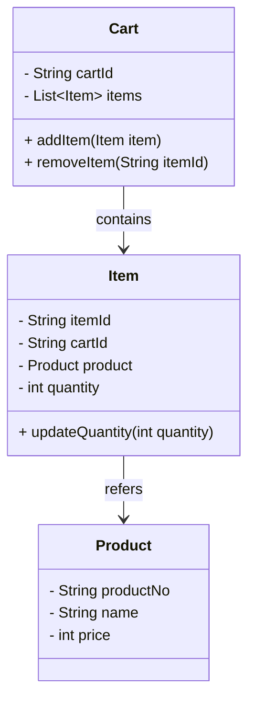

# 이벤트 소싱과 마이크로 서비스 아키텍쳐

주제: Spring Study

[이벤트 소싱과 마이크로서비스 아키텍처](http://acornpub.co.kr/book/microservices-eventsourcing)

# 1. 도메인 주도 설계

그레디 부치는 모델을 단순하게 표현한 실제 세계라고 했다.

데이터에 익숙한 개발자는 모든 속성을 모델에 표현해야하는 일종의 관성이 작용해 적게는 몇개 많게는 수십개의 속성을 가진 데이터 모델을 만든다.

데이터 중심 모델은 단 하나의 시각으로 문제를 표현하므로 잡음이 만들어지므로 모델에 대한 이해를 어렵게 만든다.

개발 초기에는 많은 속성을 가진 몇 개의 도메인 객체로 시작

시간이 지나 비즈니스 케이스가 추가되고 몇 개의 도메인 객체에 속성을 계속 추가하면 모델은 더욱 이해하기 어려워진다.

관심사의 분리(Separation of concern, SOC)

- 관심사의 분리는 소프트웨어에 질서를 부여하기 위해 구성 요소간 관계를 정의한다.
- 소프트웨어에 질서를 부여하면 응집도가 높은 구성 요소를 만들 수 있고 구성 요소간 결합도를 낮춰 유지보수에 도움이 된다.

## 도메인 로직 패턴

마틴 파울러는 엔터프라이즈 애플리케이션 아키텍쳐 패턴에서 도메인 로직을 구현하는 방법을 4가지로 정리했다.

1. 트랜잭션 스크립트 패턴: 클라이언트 요청을 하나의 프로시저가 처리
    - 단순한 CRUD에 적합하다.
    - JSP에서 자주 사용되는 방식
2. 테이블 모듈 패턴: 테이블 단위로 비즈니스 로직을 처리하는 클래스 분리
3. 서비스 레이어 패턴: 서비스 레이어에서 시스템 통합 및 전체 흐름 조정
4. 도메인 모델 패턴

## 헥사고날 아키텍쳐

엘리스터 코번의 2005년 헥사고날 아키텍쳐 소개

- 기술과 관계 없는 비즈니스 로직과 기술에 의존하는 어댑터 간 분리를 강조
- POJO(순수한 자바)의 추구에서 나오는 개념

## 도메인 주도 설계

에릭 에반스의 도메인 주도 설계에서 소프트웨어 설계의 방대한 영역을 다룬다.

- 도메인 주도 설계는 관심사를 바운디드 컨텍스트로 한정하고, 컨텍스트 간 관계와 컨텍스트 내에서 효과적인 모델링을 위한 접근법

1. 유비쿼터스 언어
2. 빌딩 블록
3. 엔티티
    - 엔티티의 근본적인 개념 → 객체의 생명주기 내내 이어지는 추상적인 연속성, 추상적인 연속성이 여러 형태를 거쳐 전달, 어떤 객체를 일차적으로 해당 객체의 식별성으로 정의하는 경우 그 객체를 엔티티라 한다.
    - 엔티티의 핵심은 식별성, 어떤 클래스의 인스턴스를 다른 인스턴스와 구분해야하면 엔티티로 설계해야함
4. 값 객체
    - 엔티티와 달리 개념적으로 식별자가 필요하지 않은 객체
    - 불변이 핵심
    - 개발의 편의성을 선택한 라이브러리 제약으로 setter를 꼭 구현하더라도, 값 객체는 불변이어야 함을 기억해야한다.
5. 서비스
    - 도메인 주도 설계의 3가지 서비스
    1. 인프라 스트럭쳐 서비스: 헥사고날의 어댑터(DB, Network)
    2. 애플리케이션 서비스: 트랜잭션 관리, 인프라스트럭쳐와 상호작용 유스케이스
        - 1번째 책임요청~응답까지를 하나의 트랜잭션으로 처리, 트랜잭션 처리 실패, 로깅, 매트릭, 모니터링 기능
        - 2번째 책임 유스케이스 수행의 흐름 조정
    3. 도메인 서비스: 도메인을 위해 존재하는 객체(POJO로 구현하는게 중점)
        - 에릭 에반스는 엔티티에 부여하기 적합하지 않은 책임은 도메인 서비스로
        - 도메인 서비스 사용시점의 반 노번의 휴리스틱 3가지
            1. 중요한 비즈니스 프로세스 수행
                - 
            2. 특정 컴포지션에서 다른 컴포지션으로 도메인 객체 반환
                - 다른 도메인 객체 혹은 DTO 변환
            3. 하나 이상의 도메인 객체에서 요구하는 입력 값 계산
6. 모듈
    - 모듈은 설계자가 의도한 기준으로 도메인 객체들을 분류한 것으로 자바 언어에서는 패키지를 사용한다.

```mermaid
graph TD
    subgraph Application Layer
        OrderApplicationService[OrderApplicationService]
    end

    subgraph Domain Layer
        OrderPaymentService[OrderPaymentService]
        PaymentProcessingService[PaymentProcessingService]
        OrderProcessingService[OrderProcessingService]
        Order[Order]
        Payment[Payment]
    end

    subgraph Infrastructure Layer
        OrderRepository[OrderRepository]
    end

    %% Application Layer 의존성
    OrderApplicationService --> OrderPaymentService
    OrderApplicationService --> OrderRepository

    %% Domain Layer 의존성
    OrderPaymentService --> PaymentProcessingService
    OrderPaymentService --> OrderProcessingService
    PaymentProcessingService --> Payment
    OrderProcessingService --> Order
```



```java
public class Order {
    private String orderId;
    private boolean isPaid;

    public Order(String orderId) {
        this.orderId = orderId;
        this.isPaid = false;
    }

    public boolean canBePaid() {
        // 주문이 결제 가능한 상태인지 확인하는 로직
        return !isPaid;
    }

    public void markAsPaid() {
        this.isPaid = true;
    }

    public String getOrderId() {
        return orderId;
    }

    public boolean isPaid() {
        return isPaid;
    }
}
```

```java
class Payment {
    private boolean valid;

    public Payment(boolean valid) {
        this.valid = valid;
    }

    public boolean isValid() {
        return valid;
    }
}
```

```java
public class PaymentProcessingService {
    public boolean validatePayment(Payment payment) {
        return payment.isValid();
    }
}

public class OrderProcessingService {
    public boolean validateOrder(Order order) {
        return order.canBePaid();
    }
}

public class OrderPaymentService {
    private final PaymentProcessingService paymentProcessingService;
    private final OrderProcessingService orderProcessingService;

    public OrderPaymentService(PaymentProcessingService paymentProcessingService,
                               OrderProcessingService orderProcessingService) {
        this.paymentProcessingService = paymentProcessingService;
        this.orderProcessingService = orderProcessingService;
    }

    public boolean processOrderPayment(Order order, Payment payment) {
        if (orderProcessingService.validateOrder(order) &&
            paymentProcessingService.validatePayment(payment)) {
            order.markAsPaid();
            return true;
        }
        return false;
    }
}
```

```java
@Repository
public class OrderRepository {
    public void save(Order order) {
        // 데이터베이스에 Order 저장 로직
        System.out.println("Order 저장: " + order.getOrderId());
    }
}
```

```java
@Service
public class OrderApplicationService {
    private final PaymentService paymentService;
    private final OrderRepository orderRepository;

    public OrderApplicationService(PaymentService paymentService, OrderRepository orderRepository) {
        this.paymentService = paymentService;
        this.orderRepository = orderRepository;
    }

    public void placeOrder(String orderId, Payment payment) {
        // 유스케이스 로직
        Order order = new Order(orderId);

        boolean paymentProcessed = paymentService.processPayment(order, payment);
        if (paymentProcessed) {
            orderRepository.save(order);
        } else {
            System.out.println("결제 실패: " + orderId);
        }
    }
}
```

## 라이프 사이클

### 애그리게이트

[DDD - 애그리거트(Aggregate)를 잘 사용하는 방법들!](https://jaehoney.tistory.com/223)

애그리게이트는 도메인 객체들의 연관 관계에서 불변식을 보장해야하는 단위

에그리게이트는 엔티티와 값 객체로 구성하는데 여러 개의 엔티티와 값 객체를 표함할 수 있으며, 에그리게이트를 대표하는 엔티티를 애그리에이트 루트라고 한다.

애그리게이트가 정의하는 범위 밖에서는 애그리게이트 루트를 통해서만 애그리게이트 상태를 변경해야함

애그리게이트 규칙



```java
public class Product {
    private final String productNo;
    private final String name;
    private final int price;

    public Product(String productNo, String name, int price) {
        this.productNo = productNo;
        this.name = name;
        this.price = price;
    }

    public String getProductNo() {
        return productNo;
    }

    public String getName() {
        return name;
    }

    public int getPrice() {
        return price;
    }
}

```

```java
public class Item {
    private final String itemId;
    private final Product product;
    private int quantity;

    public Item(String itemId, Product product, int quantity) {
        this.itemId = itemId;
        this.product = product;
        this.quantity = quantity;
    }

    public String getItemId() {
        return itemId;
    }

    public Product getProduct() {
        return product;
    }

    public int getQuantity() {
        return quantity;
    }

    public void updateQuantity(int quantity) {
        this.quantity = quantity;
    }
}

```

```java
public class Cart {
    private final String cartId;
    private final List<Item> items;

    public Cart(String cartId) {
        this.cartId = cartId;
        this.items = new ArrayList<>();
    }

    public String getCartId() {
        return cartId;
    }

    public List<Item> getItems() {
        return items;
    }

    public void addItem(Item item) {
        items.add(item);
    }

    public void removeItem(String itemId) {
        items.removeIf(item -> item.getItemId().equals(itemId));
    }
}
```

1. 비즈니스 불변식을 애그리게이트로 한정
2. 작은 애그리게이트 설계
3. 다른 애그리게이트는 식별자로 참조

### 팩토리

애그리게이트를 생성하는 방법이 복잡하거나 내부를 너무 많이 드러낸다면, 팩토리를 이용해 캡슐화하자.

에릭 에반스

- 복잡한 객체와 애그리게이트의 인스턴스를 생성하는 책임을 별도의 객체로 옮겨라
- 이 객체 자체는 도메인 모델에서 아무런 책임도 맡지 않을 수도 있지만 여전히 도메인 설계의 일부를 구성한다.
- 모든 복잡한 객체 조립 과정을 캡슐화하는 동시에 클라이언트가 인스턴스화되는 개체의 구체 클래스를 참조할 필요가 없는 인터페이스를 제공하라.
- 전체 애그리게이트를 하나의 단위로 생성해서 그것의  불변식이 유지되게 하라

애그리게이트 루트

Cart → Item (has a 관계)

- 

저장소 설계

리포지토리는 개발자 성향에 따라 다양하게 설계 가능하며, 대표적 3가지 방법을 소개한다. 단 어떠한 방법을 선택하더라도 리포지토리가 제공하는 메소드는 애그리게이트 단위로 제공하면서 하나의 트랜잭션으로 처리해야 한다.

1. 단일 테이블
2. 다중 테이블
3. 하이브리드 테이블 

## 추상화된 핵심

도메인 주도 설계의 주제 → 엔티티, 값, 객체, 서비스, 리포지토리, 애그리게이트, 애그리게이트 루트에 대해서 가장 많이 언급된다.

- 단 이 개념들만을 이용해 실무에 적용하기는 어려우며, 빌딩 블록외에 중요한 것들은 추상회된 핵심이다.
- 모델의 가장 근본적인 개념을 식별해서 별도의 클래스나 추상 클래스 또는 인터페이스로 추출하라

항만 - 크레인과 컨테이너의 사례

- 크레인은 컨테이너를 컨테이너선 → 야적장으로 이동하거나 야적장에 쌓여 있는 컨테이너를 차량으로 옮긴다.컨테이너선에서 차량으로 직접 옮길수도 있다.
- 크레인의 주요 책임 → 컨테이너 이동

```java
public interface MovingService {
    void move(Container container, Location from, Location to); 
}
```

1. 선박 → 차량 직접이동
2. 선박 → 야적장 특정 위치 이동
3. 야적장 특정위치 → 야적장 다른 위치 이동
4. 야적장 특정위치 → 차량 이동

## 요약

- 비즈니스 로직은 트랜잭션 스크립트, 테이블 모듈, 서비스 레이어, 도메인 모델 패턴으로 구현할 수 있다.
- 비즈니스 로직은 복잡하고 객체지향 언어를 사용하며 도메인 모델 패턴을 우선적으로 고려한다.
- 도메인 주도 설계에서 기본 설계 요소인 빌딩 블록에 대해 알아보았다.
- 엔티티 - 식별자를 가진다, 값 객체 - 식별자를 가지지 않고, 엔티티를 수식하는 속성 그룹
- 서비스 종류
    - 외부 서비스 협력 - 인프라스트럭쳐
    - 트랜잭션 범위 한정 - 애플리케이션
    - 순수 비즈니스 로직, 무상태 클래스 - 도메인 서비스
- 애그리게이트는 도메인의 불변식을 유지하는 단위(여러 개의 엔티티, 값 객체로 구성)
- 애그리게이트의 대표 엔티티 → 애그리게이트 루트
- 애그리게이트의 모든 요청은 루트가 제공하는 메소드 호출로 시작

# 객체지향 설계

---

고객(Customer)과 설문 조사원(Surveyor) 애그리게이트 식별, 2개의 애그리게이트와 간단한 요구사항으로 객체지향 설계 원칙을 적용한다.


- 나이, 연착처 종류, 성별로 배정 대상 고객을 추출한다.
- 추출한 고객을 설문 조사원에게 배정한다.
- 배정 담당자는 배정 시 다양한 배정 알고리듬을 선택한다.

## 책임 주도 설계

소프트웨어 설계는 일반적으로 책임, 역할, 협력으로 표현하는 책임 주도 설계라 부르는 접근 방법의 한 분야로 객체에 책임을 부여하는 것을 중요하게 여긴다.

- UML과 패턴의 적용에서 객체의 책임을 ‘아는 것’과 ‘하는 것’으로 설명한다.
- ‘아는 것’ → 필드, ‘하는 것’ → 메소드

UML에서는 책임을 약정 또는 의무로 정의한다.

- 하는 것
    - 객체 생성이나 계산과 같이 스스로 하는것
    - 다른 객체의 행동을 시작하게 하는 것
    - 다른 객체의 행동을 제어/조정 하는 것
- 아는 것
    - 캡슐화한 데이터를 아는 것
    - 관련 객체에 대해 아는 것
    - 자신이 유도하거나 계산할 수 있는 것에 대해 아는 것

책임은 추상화 레벨에 따라 크게 차이가 있다.

- 수십개의 클래스를 묶어 하나의 책임을 부여하거나, 하나의 클래스에 책임을 부여할수도 있다.

## 단일 책임 원칙


단일책임 원칙은 클래스가 1가지 이유에 대해서만 변경되도록 설계되어야 한다.

단일 책임 원칙을 준수하기 위해 여러 책임을 가진 클래스를 더 작은 클래스로 분할해 새로운 클래스를 추가하거나 연관돼 있는 속성을 하나의 클래스로 통합해야 한다.

## 개방 폐쇄 원칙

개방/폐쇄 원칙은 코드가 자유로우면서도 제한적이어야 한다는 의미이다.

- 소프트웨어 엔티티는 확장에 대해서는 개방적이어야 하지만, 수정에 대해서는 폐쇄적이어야 한다.

대표적으로 톰캣에서 서블릿/JSP가 동작하는 방식

- 서블릿/JSP를 사용해 개발한 웹 애플리케이션을 war파일로 만들고 톰캣에 배포한다.
    - war 파일은 톰캣 고유 기능에 영향을 주거나 변경하지 않는다. (폐쇄적)
    - war 파일이 새로운 기능 제공 (확장성)

개방 폐쇄 원칙은 인터페이스나 상위 클래스를 사용하는 디자인 패턴에서 어렵지 않게 찾아볼 수 있다.

- 인터페이스 또는 상위 클래스에 기본 기능을 두고 구현 클래스나 상속 클래스에서 기능을 확장한다.

로버트 C. 마틴은 확장에 대한 ‘개방’ ‘ 과 수정’에 대한 ‘폐쇄’를 변하지 않는 부분과 변할 수 있는 부분을 분리한 접근법으로 설명한다.

- 확장에 대한 개방 → 구현 클래스나 상속 클래스에 기능을 추가할 수 있어야 한다.
- 수정에 대한 폐쇄 → 인터페이스나 상위 클래스의 변화가 구현 클래스나 상속 클래스에 영향을 주면 안된다.

나이, 연락처, 연령으로 후보 고객을 추출하기 위해 고객 속성을 조건과 비교해 고객을 필터링한다.

- 필터링 하는 것으로 책임에 변화는 없지만, 구체적인 비교방법은 달라진다.
- 이 요구사항을 만족하기 위해 Filter 인터페이스 선언하고 나이, 연착처처럼 비교할 속성에 따라 로직을 다르게 구현한다.
- 필터링 → 고객의 정보를 변경하지 않으면서 조건과 비교하는 것이므로 또다른 책임으로 볼 수 있다.

## 리스코프 치환

리스코프 치환 원칙은 상속 클래스를 안정적으로 사용할 수 있는 구조를 설계하는데 도움을 준다.

- S가 T의 서브 타입이라면, T타입 객체는 프로그램 실행문제 없이 S타입의 객체로 치환되어야 한다.

원칙 3가지 요소

1. 기반타입: 클라이언트가 직접 사용
2. 서브타입: 상속한 모든 종류의 클래스
3. 문맥(context): 클라이언트가 기반

리스코프 치환 원칙은 추가적으로 계약(Contract) 규칙과, 가변성 규칙 준수를 요구한다,

- 서브타입에 기반타입보다 더 강력한 사전 조건을 정의할 수 없다.
- 서브타입에 기반타입보다 더 완화한 사후 조건을 정의할 수 없다.
- 가변타입의 불변식은 서브타입에서도 유지해야 한다.

자바 언어

- 기반타입: 인터페이스, 추상 클래스
- 서브타입: 구현/상속 클래스

```java
public interface Distributable {
    List<Assign> distribute(List<Customer> customers, List<Surveyor> surveyors);
}
```

```java
public class PerformanceDistributor implements Distributable {
    @Override
    public List<Assign> distribute(List<Customer> customers, List<Surveyor> surveyors) {

        return IntStream.range(0, customers.size()).mapToObj(i -> {
                    Surveyor surveyor = surveyors.get(i % surveyors.size());
                    Customer customer = customers.get(i);
                    return new Assign(customer, surveyor);
                })
                .toList();
    }
}

```

```java
public class PerformanceDistributor implements Distributable {
    @Override
    public List<Assign> distribute(List<Customer> customers, List<Surveyor> surveyors) {

        return IntStream.range(0, customers.size()).mapToObj(i -> {
                    Surveyor surveyor = surveyors.get(i % surveyors.size());
                    Customer customer = customers.get(i);
                    return new Assign(customer, surveyor);
                })
                .toList();
    }
}
```

## 인터페이스 분리 원칙

인터페이스 분리 원칙은 너무 많거나 관계없는 오퍼레이션을 제공하는 인터페이스를 만들지 않게 제약한다.


```java
public class AgeRule implements Filterable, Sortable {
    private final int minAge;
    private final int maxAge;

    public AgeRule(int minAge, int maxAge) {
        this.minAge = minAge;
        this.maxAge = maxAge;
    }

    @Override
    public boolean isSatisfied(Customer customer) {
        return this.minAge <= customer.getBirthday().getAge() && customer.getBirthday().getAge() <= this.maxAge;
    }

    @Override
    public int compare(Customer before, Customer after) {
        return before.getBirthday().getAge().compareTo(after.getBirthday().getAge());
    }
}
```

## 의존성 역전(DIP)

의존성 역전은 객체 설계에서 구체적인 클래스를 사용하는 방법을 클라이언트가 직접 알 필요가 없게 분리한다.

리스코프 치환 원칙에서 인터페이스로 2개의 구현체를 두어 인터페이스를 사용하는 클라이언트가 자주 변하지 않는 객체에 의존성을 갖게 했다. 또한 인터페이스를 구현한 클래스를 다른 패키지에 둬 안정적인 타입과 그렇지 않은 타입을 분리할 수 있었다.

- 하지만 이러한 방식의 한계는 알고리즘 변경기 구현체를 직접 수정해줘야한다.

```java
Distributable distributable = new RoundRobinDistributor();
```

## 모듈


분배 알고리즘의 성능 개선이나 알고리즘을 다양하게 적용하기 위해 단위(jar)로 분리하는 것도 고려할 수 있다.


요약

- 객체지향 설계에서 객체의 책임을 가장 중요시 한다.
- 객체의 기본 책임 아는 것(속성)과 하는 것(메소드) 이다.

# 이벤트 소싱

---

[[Design] EDA의 개념 (2) – Event Sourcing](https://notypie.dev/design-eda%EC%9D%98-%EA%B0%9C%EB%85%90-2-event-sourcing/)

[[SaaS] 시간여행이 가능한 시스템 아키텍처](https://blog.gangnamunni.com/post/saas-event-sourcing/)

[The architectural concepts powering the AxonIQ method.](https://www.axoniq.io/concepts)

[Event Sourcing 맛보기 - 이론편](https://sabarada.tistory.com/231)

[https://github.com/BaekGeunYoung/cqrs-eventsourcing-practice](https://github.com/BaekGeunYoung/cqrs-eventsourcing-practice)


커머스 도메인에서 고객은 카트에 상품을 추가/삭제에 대한 행위를 하며, 이러한 이력을 모두 추적할 수 있다 가정해보자.

- 마지막 주문, 이전 주문 사이에 특정 상품을 반복적으로 추가/삭제 한다면 상품 구매를 고민중이다, → 쿠폰제공

물류창고 적재 최적화를 위해 출고장으로 미리 이동시키는 알고리즘이 있다.

- 입고 이후 출고까지의 상품 이동경로에서 불필요한 움직임을 줄여 개선한다.

이러한 사례처럼 데이터의 상태 변화 전체를 상세히 기록할 수 있다면 데이터의 활용 사치는 훨씬 높아지고 다양한 기회를 제공할 수 있따.

- 데이터 상태 변화과정을 기록하기 위한 이벤트 소싱의 원리

## 부서 이동

기업용 애플리케이션은 직원/소속 부서를 관리한다.

부서는 TB_DEPARTMENT 테이블로 관리하고 부서 번호와 부서명 컬럼을 가진다.

### 감사(Audit)와 이력

대부분의 시스템에서 감사 기능을 제공하기 위해 아래 속성 사용

- 등록일시/등록자
- 변경일시/변경자
- 삭제일시/삭제자

6개의 속성을 통해 누가/언제 라는건 알 수 있지만, 무엇을 바꾸었는지를 모른다. 무엇을 바꾸었는지를 알기 위해서는 이전 상태를 분리해서 기록해 둔 후 필요할 때 현재 상태와 비교해야 한다.

### 단일 테이블과 시퀀스

```java
public class EmployeeServiceV1 {

    private final EmployeeDaoV1 employeeDaoV1;

    public EmployeeServiceV1(EmployeeDaoV1 employeeDaoV1) {
        this.employeeDaoV1 = employeeDaoV1;
    }

    public void update(Employee employee) {
        int sequence = employeeDaoV1.selectSequence(employee.getEmployeeId());

        sequence++;
        employee.setSequence(sequence);
        employeeDaoV1.insert(employee);
    }
}
```

기존 PK이외에 시퀀스 일련번호를 추가하고, 기존 레코드를 유지하며 수정마다 새로운 레코드를 추가한다.

### 상태 테이블과 이력 테이블 분리

```java
public class EmployeeServiceV2 {

    private final EmployeeDaoV2 employeeDaoV2;
    private final EmployeeHistoryDao employeeHistoryDao;

    public EmployeeServiceV2(EmployeeDaoV2 employeeDaoV2, EmployeeHistoryDao employeeHistoryDao) {
        this.employeeDaoV2 = employeeDaoV2;
        this.employeeHistoryDao = employeeHistoryDao;
    }

    public void update(Employee employee) {
        Employee currentEmployee = employeeDaoV2.select(employee.getEmployeeId());
        int sequence = employeeHistoryDao.selectSequence(employee.getEmployeeId());

        sequence++;

        employeeHistoryDao.insert(currentEmployee, sequence);
        employeeDaoV2.update(employee);
    }
}

```

기존 테이블을 두고, 이력을 기록하는 테이블을 따로 생성한다. 현재 상태와 동일한 컬럼으로 구성하고, 일련번호를 추가한다.

### 변경 값

앞의 2가지 방법들은 변경하지 않은 속성을 포함한 데이터 전체를 저장하기 떄문에 데이터베이스를 효과적으로 사용이 힘들고, 변경한 속성을 찾기 위해 모든 속성을 비교해야 한다.

3번째 방법은 변경한 속성 이름과 값의 목록만 기록한다.

- 전체 복사본이 아닌 변경한 속성만 선택해 기록한다.

변경한 속성 목록을 생성하는 로직을 어디에 구현할지 결정해야 한다. 후보는 애플리케이션 서비스, 엔티티, 애그리게이트, 레포지토리 이다.

- 애플리케이션 서비스: 전체 흐름 조정 및, 트랜잭션 범위를 결정하는 책임을 지닌다. 이 객체에 변경 값 목록을 생성하는 책임을 부여하면 애플리케이션 서비스가 도메인 객체를 더 자세히 알아야 한다.
- 엔티티: 변경 요청에 영향을 받는 개별 속성을 가장 자세히 알고 있어 적합하다.
- 애그리게이트: 변경 쵸엉에 영향을 받는 엔티티와 값 객체를 알고, 불변식을 유지하는 단위이므로 최적의 후보다.
- 리포지토리: 변경을 기록하는 책임을 지니지만, 생성하는것의 책임은 없다.

변경한 속성 목록을 생성하는 책임을 애그리게이트에 부여하면 유지보수 시 변경해야 하는 범위를 자연스럽게 애그리게이트로 한정한다.

- 애플리케이션 서비스 → 책임 변화 x
- 리포지토리 → 변경한 속성 목록만 전달받음

## 도메인 이벤트

앞서 살펴본 이슈들은 모두 추가/변경/삭제에 관한 단순한 기록이다.

- 부서 번호 변경처럼 속성 하나만 변경했다면 이유를 쉽게 유추할 수 있지만, 여러 속성을 한번에 변경했다면 다양한 케이스를 고려해야 한다.
- 속성 추가/삭제가 필요한 설계 변경은 속성 목록의 조합을 다시 정리하는데 많은 시간이 걸린다.

도메인 주도 설계는 ‘도메인 이벤트’를 강조한다.

- 도메인 이벤트 → 변경 단위를 비즈니스 처리 과정에서 발생한 결과로 정의한다.
- 즉 이벤트는 사용자가 무엇인가 처리하도록 시스템에 요청한 것임을 알 수 있는 힌트이면서 변경이 발생한 이유임을 알 수 있다.
- 시스템이 관리하는 정보의 변화를 도메인 이벤트로 기록하면 도메인 모델을 더욱 명확하게 표현할 수 있다.

이벤트 클래스를 사용하면 클래스 이름만으로 도메인에서 어떤 일이 일어났는지 즉시 이해할 수 있다.

- 대부분의 도메인 이벤트는 이벤트를 발생시킨 요청과 1대1 관계이므로, 변경값 목록을 도메인 이벤트 클래스로 네이밍하면 사용자의 요청도 어렵지않게 유추할 수 있다.
- 단 요청과 이벤트는 무조건 1:1이 아닌, 1:N이 될 수도 있다.

## 이벤트 소싱

이벤트 소싱은 도메인에서 발생하는 이벤트를 시스템의 상태 변화로 간주한다.

이벤트 스트림

```java
Event 1 → Event 2 → Event 3 → Event 4 → Current State
```

- 애그리게이트는 자신만의 이벤트 스트림을 가진다.
- 이벤트들은 시간 순서대로 정렬되어 있다.
- 각 이벤트는 고유한 순서 번호를 가진다.

스냅샷

```java
Event 1 → Event 2 → [Snapshot] → Event 3 → Event 4
```

- 성능 최적화를 위해 중간 상태를 저장
- 매번 처음부터 재생할 필요 없이 마지막 스냅샷부터 재생
- 주기적으로 또는 이벤트 개수가 임계값을 넘을 때 생성

이벤트 소싱은 도메인 주도 설계에서 설명한 불변식 유지 단위인 애그리게이트에서 발생한 모든 이벤트를 데이터베이스에서 기록한다.


- 데이터베이스에 기록한 도메인 이벤트를 리플레이하면 현재 상태로 다시 복원할 수 있다.
- 이벤트 소싱은 마이바티스나 자바 영속성 API와 같은 일반적인 접근과 달리, 도메인 객체에 새로운 속성을 추가할때 데이터베이스 테이블에도 컬럼을 추가해야 하는 임피던스 불일치가 없는 장점도 있다.

애그리게이트를 저장하는 레포지토리와 마찬가지로, 애그리게이트에서 발생한 이벤트를 저장하는 것 또한 원자적이어야 한다.


1. 외부요청 받음
2. 애그리게이트 검색 및 요청 전달
3. 애그리게이트가 요청 처리 이후 발생한 이벤트를 DB에 기록

## 이벤트 소싱 구현

도메인 이벤트를 기록하고 리플레이하는 메커니즘은 애그리게이트에서 이벤트를 처리하는 몇 가지 코딩 규칙이 필요하다. 커머스 도메인의 카트를 이벤트 소싱으로 구현하면서 알아보자.

### 데이터 모델

이벤트 소싱은 애그리게이트의 속성을 컬럼으로 관리하지 않고, 발생한 도메인 이벤트만 기록한다.

데이터모델은 아래와 같다.

```java
CREATE TABLE TB_CART(
	CART_ID VARCHAR(8),
	PRIMARY KEY (CART_ID)
)

CREATE TABLE TB_CART_EVENT(
	EVENT_ID VARCHAR(36), # 이벤트 식별자
	CART_ID VARCHAR(8),   # 이벤트 발생한 CART
	PAYLOAD TEXT,         # 이벤트 JSON
	TIME LONG,
	PRIMARY KEY (EVENT_ID)
)
```

### 애그리게이트와 이벤트 저장

카트의 주요 기능은 상품 추가/삭제/수량 변경이고 주요 도메인 객체는 Cart와 Item이다.

- Cart는 엔티티이면서 애그리게이트 루트이고 Item은 값 객체이다.

- 상품을 카트에 아이템으로 추가한다.
- 카트에 있는 아이템의 수량을 변경한다.
- 카트에 있는 아이템을 삭제한다.

Cart 애그리게이트가 제공하는 메소드를 호출하면 실행 결과인 도메인 이벤트 인스턴스를 생성하고 이벤트 저장소인 TB_CART_EVENT 테이블에 저장하기 전까지 CART 애그리게이트가 임시로 보관한다.

```java
public class Cart {
    private String cartId;
    private List<Item> items;

    private Cart(String cartId) {
		    this.cartId = cartId
        this.events = new ArrayList<>();
        this.items = new ArrayList<>();
        this.snapshot = Optional.empty();
    }

    public void addItem(AddItem command) {
        Optional<Item> foundItem = this.findItem(command.getProductNo());
        if (foundItem.isPresent()) {
            return;
        }

        this.apply(new ItemAdded(command.getCartId(), command.getProductNo(), command.getProductName(), command.getPrice(), command.getQuantity()));
    }
    
    public void changeQuantity(ChangeQuantity command) {
        Optional<Item> foundItem = this.findItem(command.getProductNo());
        if (foundItem.isPresent()) {
            if (command.getQuantity() > 0) {
                this.apply(new QuantityChanged(this.getCartId(), command.getProductNo(), command.getQuantity()));
            } else {
                this.apply(new ItemRemoved(this.getCartId(), command.getProductNo()));
            }
        }
    }

    public void removeItem(RemoveItem command) {
        Optional<Item> foundItem = this.findItem(command.getProductNo());
        if (foundItem.isPresent()) {
            this.apply(new ItemRemoved(this.getCartId(), command.getProductNo()));
        }
    }

   // ...
}
```

```java

```

```java
@Getter
@Setter
@NoArgsConstructor
@AllArgsConstructor
public class ItemAdded {
    private String cartId;

    private String productNo;
    private String productName;
    private int price;
    private int quantity;
}

```

```java
@Getter
@Setter
@NoArgsConstructor
@AllArgsConstructor
public class QuantityChanged {
    //
    private String cartId;
    private String productNo;
    private int quantity;
}
```

```java
@Getter
@Setter
@NoArgsConstructor
@AllArgsConstructor
public class ItemRemoved {
    private String cartId;
    private String productNo;
}

```

애그리게이;트가 요청을 실행하고 오류가 없다면, 애플리케이션 서비스는 카트 애그리게이트에 임시로 보관한 도메인 이벤트를 데이터베이스에 기록하기 위해 레포지토리를 사용한다.

- 이벤트 소싱에서는 이벤트를 기록해놓은 DB나 파일 시스템을 이벤트 저장소라 한다.

```java
public class CartStore {
	public void save(Cart cart);
	public Cart load(STring cartId);
}
```

```java

```

## 커맨드와 이벤트

일반적으로 소프트웨어에서는 “시스템에 요청한다”고 하는데, 요청은 비즈니스 유스케이스를 시작하는 트리거이고 객체의 상태를 변경한다.

- ex) John Doe의 소속부서 변경은 인사 담당자가 시스템에 부서 변경을 요청한 것인데 업무에서는 “인사발령” 유스케이스다.

소프트웨어가 어떤 일을 수행하게 하는 의도(목표)를 커맨드라고 하고, 수행한 결과를 이벤트라고 한다.

커맨드와 이벤트 모두 기술적으로 정보를 전달하는 목적을 가진 메시지이지만 커맨드는 일반적으로 동기, 이벤트는 비동기로 처리하는 차이가 있다.

커맨드 ⇒ 도메인에서 식별한 동사를 주로 사용한다.

- 행위를 실행하는 방법
- 사이드 이펙트가 있다.
- 시스템 상태를 변경하는 의도를 가진 메시지다.
- 사용자 또는 시스템의 다른 부분에서 생성한다.
- ex) createCart, addItem

이벤트 ⇒ 커맨드에 의해 발생한 사건이므로 커맨드 과거형으로 사용가능

- 이미 발생한 사실에 관한 설명이다.
- 발생한 것이므로 과거형으로 네이밍한다.
- 이벤트는 시스템 내에서 발생한 것이다.
- 메소드가 반환한 것이 아닌 명령을 실행한 결과이다.
- ex) CartCreated, ItemAddeded

비즈니스 프로세스는 식별한 이벤트와 연관된 커맨드 그리고 파생되는 이벤트까지 고려해야 한다.

- ex) 사용자 등록으로 UserRegistered 또는 UserCreated 이벤트를 식별한다.
- 해당 이벤트에 반응해 가입 환영 이메일을 발송하는 SendWelcome Mail 커맨드와 WelcomeMailSent 이벤트를 추가로 식별할 수 있다.


커맨드 클래스를 사용하면 응집도/결합도/유지보수에 도움이 된다.

```java
@Getter
@Setter
@NoArgsConstructor
@AllArgsConstructor
public class AddItem extends Command {
    //
    transient private String cartId;
    //
    private String productNo;
    private String productName;
    private int price;
    private int quantity = 1;
}
```

```java
@Getter
@Setter
@NoArgsConstructor
@AllArgsConstructor
public class RemoveItem extends Command {
    //
    transient private String cartId;
    //
    private String productNo;
}
```

```java
public void createCart(CreateCart command) {
    // command 객체 사용
    Cart cart = new Cart(command);
    this.cartStore.save(cart);
}

public void addItem(AddItem command) {
    // command 객체 사용
    Cart cart = this.cartStore.load(command.getCartId());
    cart.addItem(command);
    this.cartStore.save(cart);
}
```

### 커맨드와 유효성 검사

유효성 검사를 기술이 아닌 도메인 영역으로 정의함녀 커맨드에서 유효성을 검사해 응집도를 높일 수 있다.

### 재수화(이벤트 리플레이)

애그리게이트 상태의 변화 기록인 도메인 이벤트를 데이터베이스에 빠짐없이 기록했으면 이벤트를 리플레이해 애그리게이트의 현재 상태로 복원할 수 있다.

도메인 이벤트로 상태를 복원하는 것을 재수화(Rehydration)이라고 한다. 이벤트를 기록하기 위해 코딩 규칙을 정의한것과 같이 재수화를 위해 도메인 이벤트를 애그리게이트에 반영해 현재 상태로 복원하는 규칙도 필요하다.

이벤트 소싱에 자주 언급되는 언어로 프로젝션(projection)이 있는데 재수화와 구별해야한다.

- 시스템은 쓰기보다 ‘읽기’빈도가 훨씬 높다.
- 이벤트 소싱을 적용하면 다양한 조건으로 데이터를 조회할 때 한계가 있다.

조회 성능과 개발 편의성을 해소하기 위해 도메인 이벤트에서 조회 전용 데이터를 미리 만드는 것을 프로젝션이라 한다.

- 프로젝션은 CQRS에서 자세히 설명한다.

도메인 주도 설계에서 리포지토리는 도메인 객체 라이프사이클의 중간 단계인 애그리게이트를 재구성하는 책임도 가진다.

- 이벤트 스토어인 CartStore도 리포지토리로 TB_CART와 TB_CART_EVENT 테이블의 데이터를 조회하고 리플레이해 현재 상태를 재구성하는 Load 메소드를 제공한다.
- load 메소드는 애그리게이트인 Cart 식별자를 사용하고 5스텝으로 복원한다.

```java
계좌 생성(0원) → 입금(+10000원) → 출금(-3000원) → 입금(+5000원)
= 최종 잔액 12000원
```

```java
// 1. 계좌 이벤트 (발생한 모든 일들을 기록)
public sealed interface AccountEvent permits AccountCreatedEvent, MoneyDepositedEvent, MoneyWithdrawnEvent {
    LocalDateTime getTimestamp();
}

public record AccountCreatedEvent(
    String accountId, 
    String ownerName,
    LocalDateTime timestamp
) implements AccountEvent {}

public record MoneyDepositedEvent(
    String accountId, 
    long amount,
    LocalDateTime timestamp
) implements AccountEvent {}

public record MoneyWithdrawnEvent(
    String accountId, 
    long amount,
    LocalDateTime timestamp
) implements AccountEvent {}

```

```java
// 2. 계좌 도메인 (현재 상태)
public class Account {
    private final String accountId;
    private final String ownerName;
    private long balance;
    
    public Account(String accountId, String ownerName) {
        this.accountId = accountId;
        this.ownerName = ownerName;
        this.balance = 0;
    }
    
    // 이벤트들을 재생해서 현재 상태를 만듦
    public void replay(List<AccountEvent> events) {
        for (AccountEvent event : events) {
            if (event instanceof AccountCreatedEvent e) {
                // 계좌 생성 이벤트는 이미 생성자에서 처리됨
            } 
            else if (event instanceof MoneyDepositedEvent e) {
                this.balance += e.amount();  // 입금 이벤트 발생시 잔액 증가
            }
            else if (event instanceof MoneyWithdrawnEvent e) {
                this.balance -= e.amount();  // 출금 이벤트 발생시 잔액 감소
            }
        }
    }
}
```

```java
// 3. 간단한 사용 예제
public class EventSourcingDemo {
    public static void main(String[] args) {
        // 발생한 이벤트들 (데이터베이스에서 읽어온 것처럼 사용)
        List<AccountEvent> events = List.of(
            new AccountCreatedEvent("A1", "홍길동", LocalDateTime.now().minusDays(2)),
            new MoneyDepositedEvent("A1", 10000, LocalDateTime.now().minusDays(1)),
            new MoneyWithdrawnEvent("A1", 3000, LocalDateTime.now().minusHours(12)),
            new MoneyDepositedEvent("A1", 5000, LocalDateTime.now())
        );
        
        // 계좌 생성
        Account account = new Account("A1", "홍길동");
        
        // 이벤트들을 재생하여 현재 상태로 만들기
        account.replay(events);
        
        // 결과 확인 (잔액: 12000원)
        System.out.println("계좌 잔액: " + account.getBalance() + "원");
        
        // 시간별 잔액 변화
        long balance = 0;
        for (AccountEvent event : events) {
            if (event instanceof MoneyDepositedEvent e) {
                balance += e.amount();
                System.out.println(e.timestamp() + " - 입금: " + e.amount() + "원, 잔액: " + balance + "원");
            }
            else if (event instanceof MoneyWithdrawnEvent e) {
                balance -= e.amount();
                System.out.println(e.timestamp() + " - 출금: " + e.amount() + "원, 잔액: " + balance + "원");
            }
        }
    }
}
```

## 요약

- 시스템에 변경을 요청하는 커맨드와 요청의 처리 결과인 이벤트에 대해 알아보았따.
- 이벤트 소싱에서 커맨드와 이벤트를 처리하는 메소드를 각각 커맨드/이벤트 핸들러라고 한다.
- 이벤트 소싱에서 재수화와 7장에서 설명할 프로젝션을 구분해야 한다.

## 도메인 객체 라이프사이클

### 애그리게이트 생성

애그리게이트를 구성하는 엔티티와 값 객체는 모두 파라미터를 가지는 메소드를 제공하고 상태가 변할 때 이벤트를 발생시킨다.

Cart 애그리게이트를 생성하는 시점은 비즈니스 프로세스 정의에 따라 달라진다. 회원으로 가입한 직후 Cart를 미리 생성하게 정의할 수 있고 회원 가입 후 상품을 Cart에 처음 담았을 때 생성할 수도 있지만 기능차이는 없다.

```java
@Getter
@Setter
@NoArgsConstructor
@AllArgsConstructor
public class CreateCart {
    //
    transient private String cartId;
}

```

```java
@Getter
@Setter
@NoArgsConstructor
@AllArgsConstructor
public class CartCreated extends Event {
    //
    private String cartId;
}
```

```java
public class Cart {
	public Cart(CreateCart command){
		this.apply(new CartCreated(command.getCartId()));
	}
	
	private void on(CartCreated event) {
		this.cartId = event.getCartId();
	}
}
```

```java
public cass CartService {
	private final CartStroe cartStore;
	
	public String createCart(CreateCart command) {
		if(this.cartStore.exists(command.getCartId())) {
			throw new CartAlreadyExistsException(command.getCartId());
		}
		
		Cart cart = new Cart(command);
		this.cartStore.save(cart);
	}
}
```

### 동시성과 이벤트 충돌

한 고객사를 담당하는 영업사원 두 명이 있다고 가정한다.

담당자 A와 B가 고객사의 연락처를 동시에 수정해 같은 속성을 변경할 때 나중에 처리된 요청이 이전 요청을 덮어쓰는 현상이 발생한다. DB에서는 이를 갱신 분실이라 한다.

- 애그리게이트가 제공하는 커맨드 핸들러를 동시에 호출하는 경우, 일관성을 유지 못할 수 있으며 이를 이벤트 충돌이라 한다.

## 재수화 성능 및 스냅샷


재수화는 애그리게이트에서 발생한 도메인 이벤트가 많을수록 시간이 증가하기 때문에 성능에 직접적인 영향을 준다.

- 재수화 동안 일시적으로 도메인 이벤트 인스턴스를 메모리에 올려야 하지만 사용할 수 있는 메모리는 한계가 있다.
- 재수화 성능 향상 및 메모리 효율을 위해 스냅샷을 사용할 수 있다.

```java
// 일반적인 이벤트 흐름
Client → 입금 요청 → 이벤트 저장 → 이벤트 스토어
                                ↓
                           현재 잔액 계산
                           

// 스냅샷 최적화 흐름
[스냅샷 조회] → [최근 이벤트만 재생] → [현재 상태]
   (1000원)     (+500원, -200원)     (1300원)
   

// CQRS 흐름
[읽기 전용 뷰] ← 즉시 조회 ← Client
     ↑
  실시간 갱신
     ↑
[이벤트 발생]
```

```java
// 1. 스냅샷 구현
@Getter
public class AccountSnapshot {
    private final String accountId;
    private final String ownerName;
    private final long balance;
    private final long version;
    
    private final LocalDateTime snapshotTime;

    public AccountSnapshot(Account account) {
        this.accountId = account.getAccountId();
        this.ownerName = account.getOwnerName();
        this.balance = account.getBalance();
        this.version = account.getVersion();
        this.snapshotTime = LocalDateTime.now();
    }
}
```

```java
// 2. 스냅샷을 지원하는 계좌 애그리게이트
public class Account {
    private String accountId;
    private String ownerName;
    private long balance;
    private long version;
    
    // 스냅샷으로부터 계좌 복원
    public static Account fromSnapshot(AccountSnapshot snapshot) {
        Account account = new Account();
        account.accountId = snapshot.getAccountId();
        account.ownerName = snapshot.getOwnerName();
        account.balance = snapshot.getBalance();
        account.version = snapshot.getVersion();
        return account;
    }
    
    // 스냅샷 생성
    public AccountSnapshot createSnapshot() {
        return new AccountSnapshot(this);
    }
}
```

```java
// 4. 최적화된 리포지토리
@Repository
@RequiredArgsConstructor
public class OptimizedAccountRepository {
    private final AccountSnapshotRepository snapshotRepository;
    private final AccountEventStore eventStore;
    private static final int SNAPSHOT_THRESHOLD = 100; // 100개 이벤트마다 스냅샷 생성
    
    public Account findById(String accountId) {
        // 1. 최근 스냅샷 조회
        Optional<AccountSnapshot> latestSnapshot = snapshotRepository.findLatestByAccountId(accountId);
        
        if (latestSnapshot.isPresent()) {
            AccountSnapshot snapshot = latestSnapshot.get();
            Account account = Account.fromSnapshot(snapshot);
            
            // 스냅샷 이후의 이벤트만 조회하여 재생
            List<AccountEvent> events = eventStore.getEventsSinceVersion(
                accountId, 
                snapshot.getVersion()
            );
            account.replay(events);
            return account;
        } else {
            // 스냅샷이 없는 경우 모든 이벤트 재생
            Account account = new Account();
            List<AccountEvent> events = eventStore.getAllEvents(accountId);
            account.replay(events);
            return account;
        }
    }
    
    public void save(Account account, AccountEvent newEvent) {
        // 1. 새 이벤트 저장
        eventStore.save(newEvent);
        
        // 2. 이벤트 수가 임계값을 넘으면 스냅샷 생성
        long eventCount = eventStore.getEventCount(account.getAccountId());
        if (eventCount % SNAPSHOT_THRESHOLD == 0) {
            AccountSnapshot snapshot = account.createSnapshot();
            snapshotRepository.save(snapshot);
        }
    }
}
```

스냅샷은 어떻게 생성해야 한다는 원칙은 없지만 주기적인 시간을 초과해 이벤트가 발생했을 때 스냅샷을 생성하는 것을 기본 전략으로 사용한다.

- 주기적인 시간 → 스냅샷을 생성하고 정해진 시간을 초과해 이벤트가 발생한다.
- 매 N번째 이벤트 → 매 n번째 도메인 이벤트가 발생했을 경우
- 도메인 이벤트 → 특정 도메인 이벤트가 발생했을 경우

```java
1. 주문 조회 요청
   ↓
2. replay() 실행
   - 과거 모든 이벤트 재생
   - 현재 상태로 복원
   ↓
3. handleNewEvent() 실행
   - 새로운 이벤트 처리
   - 상태 변경 + 사이드 이펙트 실행
```

```java
// 1. 이벤트
public interface DomainEvent {
    // 상태 변경만 하는 메서드
    void apply(Order order);
    
    // 사이드 이펙트 실행 메서드
    default void executeSideEffects(boolean isReplay) {
        // 기본적으로는 아무것도 하지 않음
    }
}

// 1-1 내부 이벤트
public class OrderCreatedEvent implements DomainEvent {
    @Override
    public void apply(Order order) {
        order.setStatus("CREATED");
    }
}

// 1-2 외부 이벤트 존재
public class OrderEmailEvent implements DomainEvent {
    private final String email;
    private final String content;
    
    @Override
    public void apply(Order order) {
        order.setEmailSent(true);  // 상태 변경
    }
    
    @Override
    public void executeSideEffects(boolean isReplay) {
        if (!isReplay) {
            // 실제 이메일 발송은 replay가 아닐 때만
            emailService.send(email, content);
        }
    }
}

// 도메인 객체
public class Order {
    public void replay() {
        List<DomainEvent> events = eventStore.getEvents(this.id);
        events.forEach(event -> {
            // 1. 상태 변경
            event.apply(this);
            // 2. 사이드 이펙트 실행 (replay 플래그 true)
            event.executeSideEffects(true);
        });
    }
    
    public void handleNewEvent(DomainEvent event) {
        // 1. 상태 변경
        event.apply(this);
        // 2. 사이드 이펙트 실행 (replay 플래그 false)
        event.executeSideEffects(false);
        // 3. 이벤트 저장
        eventStore.save(event);
    }
}
```

```java

// 서비스 실제
@Service
@RequiredArgsConstructor
public class OrderService {
    private final OrderEventStore eventStore;
    private final EmailService emailService;

    // 주문 조회
    @Transactional(readOnly = true)
    public Order getOrder(String orderId) {
        // 1. 빈 주문 객체 생성
        Order order = new Order(orderId);
        
        // 2. 이벤트 재생으로 현재 상태 복원
        List<DomainEvent> events = eventStore.getEvents(orderId);
        order.replay(events);
        
        return order;
    }

    // 주문 생성
    @Transactional
    public Order createOrder(OrderRequest request) {
        // 1. 새 주문 생성
        Order order = new Order(UUID.randomUUID().toString());
        
        // 2. 주문 생성 이벤트 처리
        OrderCreatedEvent event = new OrderCreatedEvent(
            order.getId(),
            request.getCustomerName(),
            request.getItems()
        );
        order.handleNewEvent(event);
        
        return order;
    }

    // 주문 취소
    @Transactional
    public Order cancelOrder(String orderId, String reason) {
        // 1. 현재 주문 상태 조회
        Order order = getOrder(orderId);
        
        // 2. 취소 이벤트 처리
        OrderCanceledEvent event = new OrderCanceledEvent(
            orderId,
            reason,
            LocalDateTime.now()
        );
        order.handleNewEvent(event);
        
        return order;
    }
}
```

## 이벤트 소싱과 상수

시스템은 시간이 지나면서 변경이 필요한데, 상수값 또한 변경될수가 있다. 이벤트 소싱을 사용하는 경우 상수값에 대해 각별한 주의가 필요하다.

- ex) 특정 구매 금액의 특정 비율을 포인트로 적립한다. (포인트 비율이 상수값)
- 날짜마다 이 값이 변경되면 이후 replay마다 계산이 크게 틀어질 수 있다. 상수 적용에 시간을 두거나, 이벤트에 해당 값을 같이 넣어주는게 좋다.

## 도메인 이벤트와 버전

새로운 도메인 이벤트를 선언해야 하는 변경 요청도 있지만 사용 중인 도메인 이벤트에 속성을 추가하거나 삭제해야 하기도 한다.

새로운 도메인 이벤트 추가는 비교적 단순하지만, 속성을 추가하거나 삭제해야 하면 생각보다 많은 것을 고려해야 한다. 

### 업 캐스팅

서비스가 발전하면서 2가지 변화가 필요하다고 가정한다.

- 새로운 속성을 추가한다.
- 더 이상 사용하지 않는 속성을 제거한다.

이벤트 스토어에 기록한 도메인 이벤트는 과거에 발생한 사건으로 불변이므로 원칙적으로 수정할 수 없다. 하지만 요구사항 변경은 피할 수 없고 변경 요청은 이미 선언해 사용중인 클래스에 영향을 준다.

```java
public class Point {
	private static final float ACCUMULATION_RATE = 0.07;
	private long value;
	
	private void on(IncreasedByOrder increasedByOrder) {
		
		this.value += increasedByOrder.total * ACCMULATION_RATE;
	}
}
```

### 업 캐스터


```java
public class OrderEventUpcaster {
	public static OrderCanceledV2 upcast(OrderCanceled event) {
		return new OrderCanceledV2(event.getOrderNo(), event.getTime(), "upcasted");
	}
	
	public static OrderCanceledV3 upcast(OrderCanceled event) {
		return new OrderCanceledV3(event.getOrderNo(), event.getTime(), "upcasted");
	}
	
	public static OrderCanceledV3 upcast(OrderCanceledV2 event) {
		return new OrderCancledV3(event.getOrderNo(), event.getTime(), true);
	}
}
```

이벤트 스토어에 기록한 변경 불가능한 과거 버전의 도메인 이벤트를 현재 버전으로 변환하는 것을 업캐스팅이라 한다. 과거 버전의 이벤트를 현재 버전의 이벤트로 변환하는 책임을 가진 클래스를 업캐스터라고 한다.

- 업캐스터는 과거 이벤트를 변경하지 않고 현재 이벤트를 변환하는 단 한 가지 책임만 가진다.
- 업캐스터를 직접 구현하지 않고, Avro나 Bufferes와 같은 버저닝을 지원하는 라이브러리를 사용할 수 있다.

업캐스터는 도메인 객체가 아닌 데이터와 관련된 기술적인 요소다. 기술 요소가 도메인 이벤트를 자세히 알고 있어야 하는 의존성은 문제가 되지 않으므로 이벤트 스토어에서 애그리게이트의 apply() 메서드를 호출하기전에 이벤트 버전 반환

```java
@Repository
@Transactional
public class OrderStore {
	private final OrderRepository orderRepository;
	private final OrderEventRepository orderEventRepository;
	
	public Order load(String orderNo) {
		// 주문 검색
		OrderJpo orderJpo = orderRepository.findById(orderNo);
		// 주문 이벤트 검색
		List<OrderEventJpo> eventJpos = orderEventRepository
																			.findByOrderNoOrderByTimeAsc(identifier);
		
		//
		Order foundOrder = orderJpo.toOrder();
		List<Event> events = eventJpos.stream()
													.map(eventJpo -> eventJpo.toEvent();)
													.toList()
		
		events.forEach(event -> {
			// 업캐스트 호출
			Event upcastedEvent = OrderEventUpcaster.upcast(event);
			
			// 이벤트 적용
			foundOrder.apply(upcastedEvent);
		})
		
		return foundOrder;
	}
}
```

### 중간 이벤트

앞서 구현한 업캐스트 방식은 오래된 버전 이벤트에 대해서 직접 사용할 수 있는 장점이 있었지만, 코드베이스에서 완전히 제거할 수 없다는 단점이 있다.

오래된 버전의 이벤트 클래스를 제거하기 위해 중립적인 포맷을 사용할 수 있다.

```java
CREATE TABLER TB_ORDER_EVENT (
	EVENT_ID VARCHAT(255),
	EVENT_TYPE VARCHAR(255),
	...
	
	REVISION VARCHAR(10),
)
```

```java
// 업캐스팅 중간 이벤트
public class IntermediateEvent {
	private String id;
	private String typeName;
	private ObjectNode payload;
	private String revision;
	
	public Event to Evnet() {
		Event result = null;
		
		try {
			Class clazz = Class.forName(this.typeName);
			result = (Event) JsonUtil.fromJson(JsonUtil.toJson(payload), clazz);
		
		} catch(ClassNotFoundException e) {
			e.printStackTrace();
		}
		
		return result;
	}
}

```

### 이벤트 버전과 스냅샷

도메인 이벤트의 버전이 변경되면 스냅샷도 영향을 받는다. 이미 생성한 스냅샷을 업캐스팅하는 것은 비즈니스 규칙에 따라 고려사항이 많아 복잡도가 급격하게 증가한다.

- 스냅샷 자체를 업캐스팅 하는 것은 불가능에 가깝다.
- 따라서 과거 발생한 전체 도메인 이벤트를 다시 리플레이해 새로운 스냅샷을 만드느것이 좋다.

### 이벤트 마이그레이션 & 이벤트 버전과 스냅샷

도메인 이벤트는 과거에 발생한 사건이고, 불변이다.

- 업캐스팅 로직이 너무 복잡해서 성능에 큰 영향을 준다면 전체 이벤트를 현재 버전으로 마이그레이션하는 전통적인 접근법을 선택할 수 있다.
- 마이그레이션은 DB에 직접 접근해 프로그래밍 방식으로 수행하거나 ETL 전용 도구를 사용할 수 있다.

이벤트 버전과 스냅샷

- 도메인 이벤트의 버전이 변경되면 스냅샷도 영향을 받으므로, 이미 생성한 스냅샷을 업캐스팅하는 것은 비즈니스에 따라 복잡도가 급격하게 증가한다.
- 결과적으로 스냅샷 자체를 업캐스팅하는 것은 불가능하므로, 과거 발생한 전체 도메인 이벤트를 다시 리플레이해 스냅샷을 만드는것이 현실적이다.

## 마이크로서비스 모듈


## 다건 처리(반복문)와 성능

전통적인 프로그래밍 방식인 반복문을 사용해 다수의 애그리게이트를 처리하는 로직은 애그리게이트 조회와 처리 시 성능 이슈가 발생한다. ⇒ 최소한의 노력으로 효과를 볼 수 있는 병렬 처리와 캐싱에 대해 정리한다.