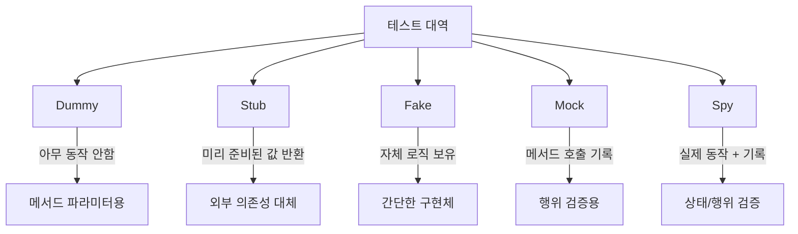

# 자바/스프링 개발자 위한 실용주의 프로그래밍

주제: Spring Study

- 참고
    
    ‣ 
    

# 기록용

---

## 4. SOLID

### SPR(단일 책임 원칙)

> 하나의 모듈은 하나의, 오직 하나의 액터에 대해서만 책임저야 한다.
> 

단일 책임 원칙은 클래스에 너무 많은 책임이 할당되어서는 안되며, 단 하나의 책임만 있어야 한다고 말한다.

- 클래스는 하나의 책임만을 가지고 있어야 하며, 하나의 책임이란 수정되어야 하는 이유가 1가지여야 한다는 것이다.

단일 책임 원칙을 따르는 것은 클래스가 특정 역할을 달성하는데 집중하기 위함이다.

- 코드 수정 → 특정 클래스/모듈만 수정
- 하나의 문제에만 집중하면 되며, 그렇게 만들어진다.
- 단일 책임 원칙을 추구하면 변경으로 인한 영향 범위 최소화가 가능하다.

액터는 메시지를 전달하는 주체, 단일 책임 원칙에서 말하는 책임은 액터에 대한 책임이다.

- 메시지를 요청하는 주체가 누구냐에 따라 책임이 달라질 수 있다.

시스템에서 어떤 모듈이나 클래스를 사용하게 될 엑터가 몇 명인지를 먼저 확인 → 같은 코드일지라도 시스템에 따라 엑터가 달라질 수 있다.

### 의존성

의존이란 다른 객체나 함수를 사용하는 상태를 말한다.

- 어떤 객체가 다른 코드를 사용하고 있기만 해도 이를 의존한다고 볼 수 있다.
- 상속이나 구현 관계도 의존관계이며, 사용하기만 해도 소프트웨어는 의존하는 객체들의 집합이다.

컴퓨터 공학에서는 의존을 결합(coupling)으로 표현한다.

- 의존과 마찬가지로 어떤 객체나 코드를 사용하기만 해도 결합이 생성난다.
- 결합도는 의존성과 같은 말이다. (소프트웨어 세계에서 결합도는 약할수록 좋다.)

의존성과 결합도를 낮추는 기법 → 의존성 주입

### 의존성 주입(Dependency Injection)

의존성을 약화시키며, 필요한 의존성을 외부에서 넣어주는 것을 의미한다.

```java
public class Service {
    private final Repository repository; // 주입

    public Service(Repository repository) {
        this.repository = repository;
    }
}
```

- 생성자 주입, 파라미터 주입등 다양한 방식이 있다.
- 제어 역전(IOC)의 구현 방식 중 하나이다.

의존성 주입은 의존성을 제거하는게 아닌 약화시킨다.

- 의존하는 형태를 바꾸어 의존성을 약화시킨다.

### 의존성 역전(Dependency Inversion)

의존성 역전은 상위 모듈과 하위 모듈이 구체적인 구현에 의존하지 않고, 추상화에 의존해야한다는 원칙이다.


```java
// 추상화(인터페이스)
public interface Repository {
    void save(String data);
}

// 하위 모듈
public class DatabaseRepository implements Repository {
    @Override
    public void save(String data) {
        System.out.println("Data saved to database: " + data);
    }
}

// 상위 모듈
public class Service {
    private final Repository repository;

    public Service(Repository repository) {
        this.repository = repository;
    }

    public void process(String data) {
        repository.save(data);
    }
}
```

- SOLID 원칙 중 하나로, 높은 수준의 정책이 낮은 수준의 세부 사항에 종속되지 않도록 한다.
- 의존성 방향을 반전하여 상위 모듈과 하위 모듈이 동일한 추상화에 의존하게 만든다.

의존성 방향이 바뀌었으므로 의존성 역전이다.

- 추상화를 사용하면 기존 구현체에게 의존을 당하다가, 의존을 하는 개체로 바뀐다. (의존성 역전은 화살표 방향을 바꾸는 기법)

인터페이스트는 계약/정책이라고 할 수 있다. 인터페이스를 구현하는 객체는 세부사항을 의미한다.

시스템을 설계할때 상위 모듈은 하위 모듈에 의존해서는 안된다.

- 의존성 역전은 상위 모듈이 하위 모듈에 의존하지 않고 싶을때 사용하는 기법이다.
- 모듈의 상하 관계를 구분하고, 의존 방향이 하위 모듈이 상위 모듈을 바라보게 만듦으로써 상위 모듈의 재사용성이 높아진다.

**의존성 역전과 스프링**

스프링은 의존성 주입을 지원하는 프레임워크지만 의존성 역전 원칙을 지키지는 않는다.

의존성 역전 원칙은 설계의 영역 → 의존성 역전 원칙을 지키고 싶다면 개발자들이 능동적으로 신경써야 한다.

**의존성이 강조되는 이유**


의존성 역전으로 영향받는 컴포넌트를 없애거나 줄일 수 있다.

1. 영향 범위: 코드 변경으로 인한 영향 범위가 어떻게 되는가?
2. 의존성: 소프트웨어에서 의존성 관리가 제대로 이뤄지고 있는가?
3. 확장성: 쉽게 확장 가능한가?

1. 영향 범위에 문제가 있다면 응집도를 높이고 적절히 모듈화해서 단일 책임 원칙으로 만든다.
2. 의존성에 문제가 있다면 의존성 주입과 의존성 역전 원칙등을 적용해 약한 의존관계를 만든다.

자바 인터페이스가 구현을 가져가서는 안되는 이유

- 추상에 구현이 들어가서 변경이 잦아저서는 안 되기 때문
- 추상이 자주 변경되면 전이되는 의존성으로 인해 영향을 받는 클래스가 너무 많아짐
- 소프트웨어 설계는 복잡도와의 싸움 → 스파게티 코드는 의존 관계 관리가 제대로 안 되고 있으므로 발생한다.

순환 참조는 의존성 전이의 영향 범위를 확장시키는 주범

- 참조가 하나 더 생기면서 영향 범위가 커진다 → 변경으로 인한 영향 범위를 축소하라라는 목표에 반한다.
- 순환 참조는 사실상 같은 컴포넌트라는 선언이다.

**SOLID와 객체지향**

[2장 객체지향 프로그래밍 | Incheol's TECH BLOG](https://incheol-jung.gitbook.io/docs/study/object/2020-03-10-object-chap2#undefined-8)

[3장 역할, 책임, 협력 | Incheol's TECH BLOG](https://incheol-jung.gitbook.io/docs/study/object/2020-03-10-object-chap3)

SOLID 원칙이 추구하는 것은 객체지향 설계 → SOLID와 객체지향의 추구방향은 조금 다르다.

- 객체지향: 역할 / 책임 / 협력
- SOLID: 객체지향 방법론 → 변경에 유연하고 확장할 수 있는 코드를 만드는 데 초점을 둔다 → 설계 원칙 → 응집도를 높이고 의존성을 낮추는 방법에 집중

SOLID를 무작정 따르기보다는 객체지향의 본질인 역할, 책임, 협력을 이해하고 적절한 구현을 함게 고려해야 한다.

- SOLID의 목표 → 높은 응집도와 낮은 결합도

## 10. 도메인

도메인 → 애플리케이션이 해결하고자 하는 문제 영역을 의미한다.

### 소프트웨어 개발의 시작

비즈니스는 소프트웨어를 만들어야 겠다가 아닌, 현실 세상에서 벌어지는 문제에서 출발한다.

- 사용자가 겪는 문제를 해결해주는 것이 비즈니스 → 소프트웨어는 해결책 중 하나이다.

린(lean)

1. 사용자의 문제 상황을 인식한다.
2. 문제 상황에 따라 어떤 솔루션을 제공하면 좋은 반응을 얻을 것인가?
3. 가설이 맞다면 결과가 어떤 지표로 반영될것이라고 가정한다.
4. 가설을 검증할 수 있는 가장 빠른 방법을 생각하고 이를 실현한다.
5. 사용자와 지속적으로 소통하면서 가설의 방향을 지속적으로 조정, 확장한다.

린 방식의 업무 스타일에서는 사용자가 겪는 문제를 강조하고, 사용자의 문제를 해결할 수 있는 해결책을 만들어야 함을 강조한다.

오늘날 대부분의 사업은 고객의 문제에서 출발 → 고객이 겪는 문제를 파악하고, 요구사항을 분석하고, 요구사항을 정리해 솔루션을 만든다.

- 솔루션은 하드웨어/소프트웨어 제품이 될 수 있다.

솔루션을 개발하는 단계에서는 이미 솔루션을 제공하려는 대상, 즉 목표 고객이 존해나는 경우가 많다.

- 고객이 겪는 문제 상황도 이미 정의되어 있다.
- 문제 정의가 먼저 이뤄지고 해결책을 만들기 때문이다.

사용자들이 겪는 문제 영역이 바로 도메인 

- 문제 영역이 곧 비즈니스 영역이므로 도메인은 비즈니스 영역을 의미한다. → 즉 도메인은, 문제 영역이자 비즈니스 영역
- 개발자는 도메인을 분석하고, 고객이 겪는 문제를 인지하고, 이에 맞는 도메인 솔루션을 개발할 수 있어야 한다.

이러한 배경으로 만들어진 것이 도메인 주도 설계다.

### 도메인 모델과 영속성 객체

도메인 모델과 영속성 객체를 구분한다(구분하기 전략) → 역할에 따라 도메인 모델과 영속성 객체를 나눈다.

도메인 모델과 영속성 객체를 분리하지 않는 방식(통합하기 전략) → 도메인 모델과 영속성 객체를 하나의 클래스로 관리한다.

**통합하기 전략**

클래스 하나에 도메인 모델과 영속성 객체의 역할을 모두 몰아넣는다.

- 구분하기와 달리, 유사한 모델 생성 및 매핑메서드에 대한 비용을 줄일 수 있다.
- 클래스 책임에 대한 정리가 힘들 수 있으며, 후에 도메인 모델이 확장되어야 할때 DB 스키마 변경에 대한 비용이 크다.

**구분하기 전략**

구분하기 전략은 도메인 모델을 위한 클래스와 영속성 객체를 위한 클래스를 분리하는 것

- 구분하기 전략은 굳이 ORM을 사용할 필요가 없다. → 추구하는 방향
- 구분하기 전략은 도메인이 ORM 같은 특정 라이브러리에 의존하지 않게 하기 위해 만들어진 전략
- 애플리케이션이 RDB에 의존하지 않으므로 단일 책임을 지킨다
- 작성해야하는 코드가 많아진다.

## 11. 알아두면 유용한 스프링 활용법

### 타입 기반 주입

스프링에서 @Autowired을 이용한 의존성 주입은 타입을 기반으로 동작한다.

- 추상 타입을 구현하는 빈이 여러개라면 예외를 발생한다.
- @Qualifier, @Primary 사용

### 자가 호출

자가 호출은 어떤 객체가 메서드를 처리하는 와중에 자신이 갖고 있는 다른 메서드를 호출하는 상황을 의미한다.

자가 호출은 빈번히 일어나지만, 스프링의 빈 메서드에서 자가 호출이 일어나면 이야기가 다르다.

스프링의 빈 메서드에서 발생하는 자가 호출은 개발자의 의도에서 벗어나는 결과를 만들 수 있다.

자가 호출이 발생하면 호출되는 메서드에 적용한 어노테이션이 동작하지 않는다.

- 스프링 AOP는 프록시 기반으로 동작하기때문에 자가 호출을 사용하면 프록시 객체를 통해 실행되지 못한다.

# 테스트

## 12. 자동 테스트

소프트웨어 공학에서 말하는 테스트는 소프트웨어의 품질과 기능을 확인하고 버그를 찾아내는 과정을 말한다.

수동 테스트는 테스트 담당자가 소프트웨어를 직접 실행해보고 각각의 기능을 평가하며 구현된 기능이 요구사항에 부합하는지 검증하는 과정을 말한다.

자동 테스트는 테스트 스크립트나 도구를 사용해 소프트웨어를 자동으로 테스트하는 과정을 말한다.

- 테스트를 위해 만들어진 코드를 테스트 코드라고 한다. (테스트를 자동으로 하는 방법 중 하나)
- 자동 테스트는 인간의 개입이 적어 정확성이 높고, 반복적인 검증 업무를 줄이고 빠르게 수행 가능

인수테스트는 시스템이 비즈니스 요구사항을 만족해서 소유권을 넘기기전의 테스트를 의미한다.

- 시스템 인수인계전 마지막 검증단계
- 인수 테스트는 최종단계에서 하기 때문에 고객에게 전달하기 전 사용자 관점에서 전체 시스템을 검증할 수 있는 좋은 기회

개발자들이 저지르는 실수 중 하나는 인수 테스트 과정의 테스트를 대부분 수동 테스트로만 구성하는 것

- 인수 테스트가 수동 테스트로만 채우는 실수는 최종 테스트이기 때문에 사요자 관점에서 사용자 액션에 화면이 대응하는 방식으로 생각하기 때문
- 수동 테스트의 가장 문제점은 소모적인 작업이며, 수동 테스트는 해당 기능이 없어지는 날까지 반복적 수행이 필요

자동 테스트는 소프트웨어를 이용해 자동으로 시스템을 검증하는 테스트를 말한다.

- API 결과 등은 스크립트를 작성해 자동 테스트를 만들 수 있다.
- 테스트 코드는 어떤 클래스의 메서드가 제대로 동작하는지 확인하기 위해 작성
- 자동 테스트는 계속해서 누적된다.

### Regression(회귀)

Regression이란 시스템에서 정상적으로 제공하던 기능이 어떤 배포 시점을 기준으로 제대로 동작하지 않게되는 상황을 지칭한다.

- 기능 개발이 제대로 되어 있지 않던 과거로 회귀한다.
- 회귀 버그가 두려워 적극적으로 개발하지 못하게 되며, 기능 개발이 늦어지고 시스템이 성장하지 못한다.
- 자동화된 회귀 테스트가 있따면 프로젝트 확장/유지보수에 유리하다.

### 레거시 코드

소프트웨어 공학에서 말하는 레거시 코드는 오래된 소프트웨어 시스템에 존재하는 코드

- 레거시 코드 → 테스트 루틴이 없는 코드

레거시 코드가 갖고 있는 본질적인 문제점을 강조

- 오래된 코드를 레거시라고 분류하는 이유는 이해하기 어렵고, 변경하기 어렵다 → 테스트 코드로 해결가능
- 테스트 루틴이 충분히 갖춰진 코드는 오래됐더라도 안정적이고 변경하기 쉬움

## 13. 테스트 피라미드

1. 단위테스트
    
    단위 테스트는 소프트웨어를 구성하는 가장 작은 단위를 검증하는 테스트
    
    Unit → 함수, 메서드, 클래스 같은 개별적이고 작은 코드 조각을 지칭한다.
    
    단위 테스트란 객체나 컴포넌트에 할당된 작은 책임 하나가 예상대로 확인하는 테스트
    
2. 통합 테스트
    
    통합 테스트는 여러 컴포넌트나 객체가 협력하는 상황을 검증하는 테스트
    
    독립적으로 만들었던 객체들이 상호작용하면서 생길 수 있는 상황을 검증
    
    객체지향 관점에서 본다면 통합 테스트는 객체들의 협력이 제대로 이뤄지는지 평가하는 단계 → 애플리케이션 서비스 관점에서 본다면 통합테스트는 비즈니스 프로세스의 흐름을 검사하는 테스트
    
3. E2E 테스트
    
    실제 사용자 시나리오에서 시스템이 어떻게 동작하는지를 검증하는 테스트
    
    테스트 피라미드에서 가장 사용자에 가까운 테스트 → 단위 테스트나 통합 테스트에 ㅂ디해 사용자의 실제 상황과 비슷하게 이뤄진다.
    

일반적으로 단위테스트가 가장 많아야 하며 다음이 통합테스트, E2E순이다.

- 80 : 15 : 5 비율로 이루어지는 것이 이상적이다.


## 14. 테스트 대역

테스트 대역은 테스트 환경에서 실제/객체 컴포넌트를 대체하는 가짜 객체를 의미한다.



- 실제 객체를 사용하기 어려운 경우 (외부 API, 데이터베이스)
- 테스트 실행속도를 높여야 하는 경우나, 특정 시나리오 및 에러 상황을 테스트하기 위해 사용합니다.

```java
// 원본 인터페이스
public interface PaymentGateway {
    boolean processPayment(double amount);
    String getTransactionId();
}
```

### Dummy

가장 단순한 형태이며, 실제로 사용되지 않지만 파라미터를 채우기 위해 사용합니다.

```java
// 1. Dummy 예제
public class DummyPaymentGateway implements PaymentGateway {
    @Override
    public boolean processPayment(double amount) {
        return false; // 아무것도 하지 않음
    }
    
    @Override
    public String getTransactionId() {
        return null; // 아무것도 하지 않음
    }
}
```

```java
public class DummyLogger implements Logger {
    @Override
    public void log(String message) {
        // 아무 동작도 하지 않음
    }
}

// 테스트 코드
@Test
void testWithDummy() {
    DummyLogger dummyLogger = new DummyLogger();
    UserService service = new UserService(dummyLogger);
    User user = service.createUser("test@test.com");
    
    assertNotNull(user);
}
```

### Stub

미리 준비된 데이터를 반환한다. 실제 구현체의 응답을 정해진 방식으로 흉내낸다.

```java
// 2. Stub 예제
public class StubPaymentGateway implements PaymentGateway {
    @Override
    public boolean processPayment(double amount) {
        return true; // 항상 성공 반환
    }
    
    @Override
    public String getTransactionId() {
        return "FIXED-TX-ID"; // 고정된 값 반환
    }
}
```

```java
public class StubUserRepository implements UserRepository {
    @Override
    public User findById(Long id) {
        return new User(id, "Test User", "test@test.com");
    }
    
    @Override
    public List<User> findAll() {
        return Arrays.asList(
            new User(1L, "User 1", "user1@test.com"),
            new User(2L, "User 2", "user2@test.com")
        );
    }
}
```

- 장점
    - 테스트 환경을 완벽하게 통제 가능하다.
    - 특수한 상황을 쉽게 재현 가능하다.
- 단점
    - 다양한 상황을 테스트하려면 여러 stub이 필요하다.
    - 실제 구현체와의 차이가 발생할 수 있다.

### Fake

실제 구현체를 단순화한 구현을 제공하며, 실제 동작하는 구현체이지만 프로덕션에서 사용할 수 없다.

```java
// 3. Fake 예제
public class FakePaymentGateway implements PaymentGateway {
    private Map<String, Double> transactions = new HashMap<>();
    private int transactionCounter = 0;
    
    @Override
    public boolean processPayment(double amount) {
        if (amount <= 0) return false;
        String txId = "TX-" + (++transactionCounter);
        transactions.put(txId, amount);
        return true;
    }
    
    @Override
    public String getTransactionId() {
        return "TX-" + transactionCounter;
    }
}
```

```java
public class FakeUserRepository implements UserRepository {
    private Map<Long, User> users = new HashMap<>();
    private long sequence = 0;
    
    @Override
    public User save(User user) {
        if (user.getId() == null) {
            user = new User(++sequence, user.getName(), user.getEmail());
        }
        users.put(user.getId(), user);
        return user;
    }
    
    @Override
    public User findById(Long id) {
        return users.get(id);
    }
    
    @Override
    public List<User> findAll() {
        return new ArrayList<>(users.values());
    }
    
    @Override
    public void delete(Long id) {
        users.remove(id);
    }
}
```

- 장점
    - 실제와 유사한 동작을 제공한다.
    - 상태기반 테스트가 용이하다.
- 단점
    - 구현이 복잡해질 수 있다.

### Mock

객체들의 행위를 검증하는데 중점을 두며, 메서드 호출 여부/횟수/순서 등을 기록한다.

```java
// 4. Mock 예제 (Mockito 스타일)
public class MockPaymentGateway implements PaymentGateway {
    private boolean processPaymentCalled = false;
    private double lastAmount = 0;
    
    @Override
    public boolean processPayment(double amount) {
        processPaymentCalled = true;
        lastAmount = amount;
        return true;
    }
    
    public boolean verifyProcessPaymentCalled() {
        return processPaymentCalled;
    }
    
    public double getLastAmount() {
        return lastAmount;
    }
}
```

```java
public class MockEmailService implements EmailService {
    private List<Email> sentEmails = new ArrayList<>();
    private boolean sendCalled = false;
    
    @Override
    public void sendEmail(Email email) {
        sendCalled = true;
        sentEmails.add(email);
    }
    
    public boolean verifySendCalled() {
        return sendCalled;
    }
    
    public int getNumberOfEmailsSent() {
        return sentEmails.size();
    }
    
    public List<Email> getSentEmails() {
        return sentEmails;
    }
}

// 테스트 코드
@Test
void testEmailNotification() {
    MockEmailService mockEmailService = new MockEmailService();
    NotificationService service = new NotificationService(mockEmailService);
    
    service.notifyUser("test@test.com", "Test Message");
    
    assertTrue(mockEmailService.verifySendCalled());
    assertEquals(1, mockEmailService.getNumberOfEmailsSent());
}
```

장점

- 객체간 상호작용을 상세하게 검증이 가능하다.

단점

- 구현 세부사항에 의존적이다.

### Spy

실제 객체를 감싸서 추가적인 정보를 기록하며, 구현체의 메서드를 호출하면서 부가 정보를 수집한다.

```java
// 5. Spy 예제
public class SpyPaymentGateway extends RealPaymentGateway {
    private List<Double> processedAmounts = new ArrayList<>();
    
    @Override
    public boolean processPayment(double amount) {
        processedAmounts.add(amount);
        return super.processPayment(amount); // 실제 구현 호출
    }
    
    public List<Double> getProcessedAmounts() {
        return processedAmounts;
    }
}
```

```java
public class SpyUserRepository extends UserRepository {
    private int findByIdCallCount = 0;
    private List<Long> findByIdArgs = new ArrayList<>();
    
    @Override
    public User findById(Long id) {
        findByIdCallCount++;
        findByIdArgs.add(id);
        return super.findById(id);  // 실제 구현체 호출
    }
    
    public int getFindByIdCallCount() {
        return findByIdCallCount;
    }
    
    public List<Long> getFindByIdArgs() {
        return findByIdArgs;
    }
}
```

- 장점
    - 실제 동작을 잘 유지하면서 추가 정보 수집 가능
- 단점
    - 구현이 복잡할 수 있다.

## 테스트 검증 전략

### 상태기반 검증

테스트 실행 후 시스템의 상태를 확인하는 방식이며, 객체의 책임/결과에 집중한다.

Dummy, Stub, Fake에 적합하다

```java
@Test
void testUserCreation_StateVerification() {
    FakeUserRepository userRepository = new FakeUserRepository();
    UserService userService = new UserService(userRepository);
    
    User createdUser = userService.createUser("test@test.com");
    
    assertNotNull(createdUser.getId());
    assertEquals("test@test.com", createdUser.getEmail());
    assertTrue(userRepository.findById(createdUser.getId()).isPresent());
}
```

### 행위 기반 검증

메서드 호출과 상호작용을 검증하며, 구현 세부사항에 의존한다.

Mock, Spy와 잘어울리며 리팩토링에 약하다.

```java
@Test
void testUserCreation_BehaviorVerification() {
    MockUserRepository mockUserRepository = new MockUserRepository();
    MockEmailService mockEmailService = new MockEmailService();
    UserService userService = new UserService(mockUserRepository, mockEmailService);
    
    userService.createUser("test@test.com");
    
    assertTrue(mockUserRepository.verifySaveCalled());
    assertTrue(mockEmailService.verifyWelcomeEmailSent());
}
```

## 테스트 대역 모범사례

1. 의존성 주입 활용
2. 적절한 대역 선택
3. 상태 검증 우선 (행위 검증은 필요한 경우에만)
4. 테스트 가독성 유지