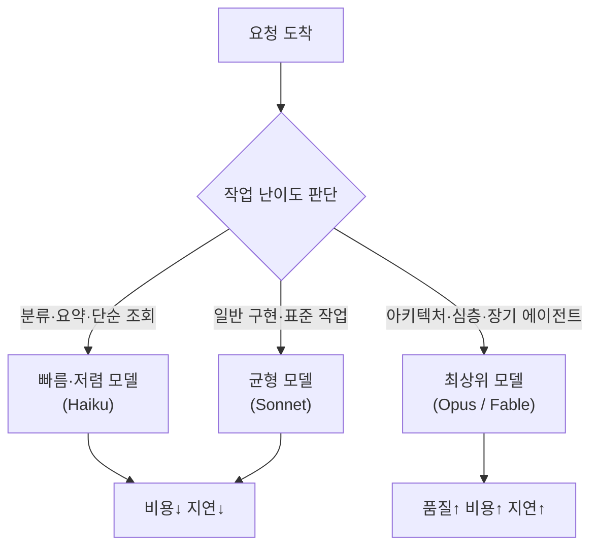

# LLM 모델의 특성과 활용 — 선택·사고·구조화·마이그레이션
---
> 이 문서를 읽고 나면 작업 난이도·비용·지연을 따져 어떤 모델을 쓸지 근거를 들어 선택하고, adaptive thinking·effort·구조화 출력·모델 마이그레이션의 동작을 그림 없이 설명할 수 있습니다. AI Engineering 시험의 "주요 LLM 모델 특성과 활용" 축을 다룹니다.

> 이 개념은 데이터베이스에서 워크로드에 맞는 인덱스·격리수준을 고르는 발상과 같지만, 고르는 대상이 쿼리 플랜이 아니라 "어느 모델을, 얼마나 생각하게, 어떤 형식으로" 쓸지로 옮겨진 형태입니다.

AI Engineering에서 모델을 "쓴다"는 건 가장 똑똑한 모델을 무조건 호출한다는 뜻이 아닙니다. 같은 작업이라도 분류·요약처럼 단순한 일에 최상위 모델을 쓰면 비용과 지연만 늘고 품질 이득은 거의 없습니다. 그래서 모델의 특성을 알고 작업에 맞춰 고르는 것, 그리고 모델이 바뀔 때 코드가 깨지지 않게 다루는 것이 이 축의 핵심입니다.

이 문서는 모델 선택부터 사고(thinking) 제어, 구조화 출력, 마이그레이션까지 다섯 주제를 순서대로 봅니다. 구체 수치·API는 Claude를 기준으로 들지만, 원리는 벤더와 무관합니다.


## 1. 모델 선택과 라우팅

> 모델 선택은 "작업 난이도 × 비용 × 지연"의 트레이드오프를 푸는 일이며, 단순 작업엔 작고 빠른 모델, 어려운 작업엔 크고 똑똑한 모델을 배정하는 라우팅이 기본기입니다.

### 왜 무조건 최상위 모델이 아닌가

분류·요약·추출·단답 같은 작업은 작은 모델로도 품질이 충분합니다. 여기에 최상위 모델을 쓰면 토큰 단가가 몇 배 비싸지고 응답도 느려지는데, 정작 결과 품질은 거의 같습니다. 반대로 다파일 리팩토링·아키텍처 판단·복잡한 디버깅은 작은 모델이 자주 틀립니다. 그래서 한 파이프라인 안에서도 단계마다 모델을 다르게 배정하는 편이 합리적입니다.

### Claude 3계층 라우팅

Claude는 세 등급으로 갈립니다. 각 등급의 자리를 알면 라우팅 판단이 쉬워집니다.

| 등급 | 모델 예 | 강점 | 적합 작업 |
|------|---------|------|----------|
| 빠름·저렴 | Haiku 4.5 | 낮은 비용·낮은 지연 | 단순 조회, 분류, 짧은 문서 정리 |
| 균형 | Sonnet 4.6 | 속도와 지능의 균형 | 일반 구현, 표준 작업 |
| 최상위 | Opus 4.8 / Fable 5 | 깊은 추론·장기 에이전트 | 아키텍처, 심층 분석, 긴 자율 작업 |

본 학습 저장소를 굴리는 OMC 라우팅도 같은 원칙을 씁니다. 가벼운 조회는 `haiku`, 표준 작업은 `sonnet`, 아키텍처·심층 분석은 `opus`로 보냅니다.

### 라우팅의 시각화



라우팅 비유 한 줄: 택배를 보낼 때 동네 한 블록은 걸어가고, 시내는 자전거, 타 도시는 트럭을 쓰는 것과 같습니다. 단, 이 비유는 "거리(난이도)에 맞춰 수단을 고른다"까지 유효하고, 모델은 거리뿐 아니라 *작업 종류*(코딩이냐 분류냐)에 따라서도 갈린다는 점은 택배 비유로 표현되지 않습니다.


## 2. 사고(Thinking)와 노력(Effort)

> 사고 모드는 모델이 답 전에 내부 추론을 더 하게 만들어 품질을 올리는 대신 비용·지연을 키우며, 그 깊이를 노력(effort) 파라미터로 조절합니다.

### 고정 예산에서 적응형으로

예전에는 "사고에 토큰을 N개까지 써라"는 식으로 고정 예산(budget_tokens)을 줬습니다. 문제는 작업마다 적정 사고량이 다른데 개발자가 그 숫자를 미리 정해야 했다는 점입니다. 단순 조회엔 과하고 복잡한 문제엔 모자랐습니다.

**Adaptive thinking**은 이 결정을 모델에게 넘깁니다. 모델이 턴마다 "지금 생각이 필요한가"를 스스로 판단해, 단순 조회에는 바로 답하고 복잡한 다단계 문제에서만 추론합니다. 깊이는 토큰 숫자가 아니라 `effort` 레벨(`low`~`max`, 4.7+는 `xhigh` 추가)로 조절합니다.

```python
# Opus 4.6 이하 — 고정 사고 예산 (deprecated)
thinking = {"type": "enabled", "budget_tokens": 32000}

# Opus 4.7 이후 (4.8·Fable 5 포함) — 적응형 사고 + effort
# budget_tokens 를 넣으면 400 에러가 납니다. 깊이는 effort 로 조절합니다.
thinking = {"type": "adaptive"}
output_config = {"effort": "high"}   # low | medium | high | xhigh | max
```

### effort를 올리면 무엇이 좋고 나쁜가

effort를 높이면 모델이 더 깊이 추론하고 도구를 더 신중히 씁니다. 코딩·에이전트 작업에서는 `xhigh`가 보통 가장 좋은 균형점이고, 지능이 중요한 작업은 최소 `high`를 권장합니다. 대신 토큰 지출과 지연이 늘고, 단순 작업에서는 "과한 탐색(overthinking)"으로 오히려 낭비가 생깁니다. 그래서 effort는 한 번 정하고 끝이 아니라 작업별로 스윕(sweep)해 보고 고르는 *조절 손잡이*로 다룹니다.

> Fable 5는 사고가 항상 켜져 있습니다. `thinking` 파라미터를 아예 생략하고, 깊이는 `effort`로만 조절합니다. 모델 세대마다 이 동작이 달라지므로 작업 전 해당 모델의 규약을 확인하는 습관이 필요합니다.


## 3. 모델 능력과 구조화 출력

> 모델마다 비전·PDF·도구 사용·구조화 출력 같은 능력 집합이 다르므로 런타임에 조회해 쓰고, 응답 형식이 중요하면 프롬프트 부탁이 아니라 스키마 강제로 신뢰성을 확보합니다.

### 능력은 하드코딩하지 말고 조회

"이 모델은 비전을 지원한다"를 코드에 박아 두면 모델이 바뀔 때 틀린 가정이 됩니다. 능력은 Models API로 런타임에 조회하는 편이 안전합니다.

```python
m = client.models.retrieve("claude-opus-4-8")
m.max_input_tokens                                  # 컨텍스트 윈도우(입력 한도)
m.capabilities["image_input"]["supported"]          # 비전 지원 여부
m.capabilities["thinking"]["types"]["adaptive"]["supported"]  # 적응형 사고 지원 여부
```

### 구조화 출력 — 프롬프트 부탁보다 강제

응답을 정해진 JSON 스키마로 받아야 할 때 "JSON만 답해 줘"라고 프롬프트로 부탁하면 모델이 가끔 어깁니다. 구조화 출력은 응답 형식을 스키마로 *강제*해 파싱 가능·유효성을 보장합니다. 분류 라벨·정보 추출처럼 다운스트림이 형식에 의존하는 작업에서 신뢰성이 크게 올라갑니다.

```python
# 구조화 출력 — 스키마로 형식 강제
# 구식 output_format 파라미터는 deprecated, output_config.format 을 씁니다.
response = client.messages.create(
    model="claude-opus-4-8",
    max_tokens=1024,
    output_config={"format": {"type": "json_schema", "schema": SCHEMA}},
    messages=[{"role": "user", "content": "이름을 추출해 줘."}],
)
```

도구 인자도 같은 발상으로 `strict: true`를 주면 도구 입력이 스키마에 정확히 맞도록 강제됩니다.


## 4. 모델 마이그레이션 — 버전 드리프트

> 모델 업그레이드는 모델 ID만 바꾸면 끝나는 일이 아니며, 파라미터·기본동작이 바뀌는 breaking change 때문에 호출부를 분류하고 점검해야 합니다.

### 모델 ID만 바꾸면 안 되는 이유

세대가 오르면 파라미터가 제거되거나 기본동작이 바뀝니다. 코드를 그대로 두고 모델 문자열만 갈면 런타임에 400 에러가 나거나 동작이 달라집니다. 대표적 breaking change를 봅니다.

1. **샘플링 파라미터 제거**. `temperature`, `top_p`, `top_k`를 Fable 5·Opus 4.8·4.7에 보내면 400 에러가 납니다. 다양성은 프롬프트로 유도합니다.
2. **고정 사고 예산 제거**. `budget_tokens`는 같은 세대에서 400입니다. `adaptive` + `effort`로 옮깁니다.
3. **prefill 금지**. 마지막 assistant 턴을 미리 채우는 기법이 4.6+에서 400입니다. 대체는 구조화 출력입니다.
4. **모델 ID 형식**. 별칭에 날짜 접미사를 임의로 붙이면 404가 납니다. 문서에 있는 정확한 문자열만 씁니다.

### 마이그레이션은 호출부 분류부터

같은 모델 ID가 들어간 파일이라고 다 같은 성격이 아닙니다. 바꾸기 전에 분류해야 잘못 건드리지 않습니다.

| 호출부 성격 | 예 | 조치 |
|------------|-----|------|
| API/SDK 호출부 | `messages.create(model=...)` | ID 교체 + breaking change 점검 |
| 모델 정의/서빙 | 모델 레지스트리, 라우팅 설정 | 옛 항목 유지, 새 모델은 *나란히 추가* |
| 단순 문자열 참조 | UI 폴백 상수, capability 게이트 | 문맥 보고 교체(파서·게이트 영향 확인) |

특히 두 번째 — 모델이 아직 서빙 중이라면 옛 항목을 지우지 않고 새 모델을 나란히 추가합니다. 블라인드 교체는 운영 중 모델을 등록 해제하는 사고로 이어집니다.


## 5. 모델 거부와 폴백

> 안전 분류기가 요청을 거부할 수 있으므로 응답을 읽기 전에 거부 여부를 확인하고, 견고한 앱은 다른 모델로의 폴백을 미리 옵트인합니다.

### 거부는 에러가 아니라 정상 응답

Fable 5 같은 모델은 안전 분류기가 요청을 거부할 수 있는데, 이때 HTTP는 **200**으로 성공하고 `stop_reason`이 `"refusal"`로 옵니다. 그래서 `response.content[0]`을 무조건 읽으면 거부된 요청에서 빈 배열에 접근해 에러가 납니다. 항상 `stop_reason`을 먼저 확인합니다.

```python
response = client.messages.create(model="claude-fable-5", max_tokens=1024, messages=[...])
# content 를 읽기 전에 거부 여부부터 확인 — 거부 시 content 가 비어 있거나 부분만 옵니다.
if response.stop_reason == "refusal":
    handle_refusal()
else:
    print(response.content[0].text)
```

### 폴백은 옵트인

거부 시 자동으로 다른 모델로 넘어가지 않습니다. 폴백을 켜지 않으면 요청은 그냥 멈춥니다. 보안 도구·생명과학처럼 정상인데도 거부가 잘못 발동(false positive)할 수 있는 작업이라면, 서버사이드 `fallbacks` 파라미터로 다른 모델 재시도를 미리 옵트인해 두는 편이 안전합니다.


## 면접에서 받을 만한 질문

1. 분류·요약 같은 단순 작업에 최상위 모델을 쓰면 안 되는 이유를 비용·지연·품질로 설명해 보세요.
2. adaptive thinking이 기존 고정 사고 예산(budget_tokens) 방식보다 나은 점은 무엇인가요?
3. effort 레벨을 올렸을 때의 이득과 손실을 각각 한 가지씩 드세요.
4. 응답을 JSON으로 받을 때 프롬프트로 "JSON만 답해"라고 하는 것 대비 구조화 출력의 장점은?
5. 모델 업그레이드 시 "모델 ID만 바꾸면 된다"가 위험한 이유를 breaking change 예로 드세요.
6. 모델이 요청을 거부했을 때 `response.content[0]`을 바로 읽으면 안 되는 이유는?

> 6개 질문에 *먼저 스스로 답해 보세요.* 자답이 끝나면 아래 §정답으로 내려갑니다. 자답 없이 먼저 읽으면 학습 효과가 0입니다.


## 정답 (자답 후 펼치기)

> 위 §면접에서 받을 만한 질문의 6개에 *먼저 자답한 뒤* 아래를 읽으세요.

### 정답 1 — 단순 작업에 최상위 모델을 피하는 이유

분류·요약은 작은 모델로도 품질이 충분한데, 최상위 모델은 토큰 단가가 몇 배 비싸고 응답도 느립니다. 품질 이득은 거의 없으면서 비용과 지연만 늘어납니다. 그래서 작업 난이도에 맞춰 모델을 배정하는 라우팅이 합리적입니다.

### 정답 2 — adaptive thinking의 이점

고정 예산은 개발자가 적정 사고량을 미리 숫자로 정해야 했는데, 작업마다 그 값이 달라 단순 작업엔 과하고 복잡한 작업엔 모자랐습니다. adaptive thinking은 모델이 턴마다 사고 필요 여부를 스스로 판단해, 단순 조회엔 바로 답하고 복잡한 문제에서만 추론합니다. 같은 effort에서 낭비되는 사고 토큰이 줄어듭니다.

### 정답 3 — effort 트레이드오프

올렸을 때 이득은 더 깊은 추론과 신중한 도구 사용으로 코딩·에이전트 품질이 오르는 것입니다. 손실은 토큰 지출과 지연 증가, 단순 작업에서의 과한 탐색(overthinking) 낭비입니다.

### 정답 4 — 구조화 출력의 장점

프롬프트 부탁은 모델이 가끔 형식을 어기지만, 구조화 출력은 응답을 스키마로 강제해 파싱 가능·유효성을 보장합니다. 다운스트림이 형식에 의존하는 분류·추출 작업에서 신뢰성이 크게 올라갑니다.

### 정답 5 — 모델 ID만 바꾸면 위험한 이유

세대가 오르면 파라미터 제거·기본동작 변경 같은 breaking change가 생깁니다. 예로 샘플링 파라미터(`temperature` 등)나 `budget_tokens`, prefill을 그대로 두면 최신 세대에서 400 에러가 납니다. 그래서 호출부를 분류하고 breaking change를 점검해야 합니다.

### 정답 6 — 거부 시 content를 바로 읽으면 안 되는 이유

거부는 HTTP 200 + `stop_reason: "refusal"`로 오고, 이때 `content`가 비어 있거나 부분만 옵니다. `content[0]`을 무조건 읽으면 빈 배열 접근으로 에러가 납니다. 항상 `stop_reason`을 먼저 확인합니다.


## 관련 문서

> 이 문서가 "어떤 모델을 어떻게 쓸지"를 다룬다면, 아래 문서들은 그 모델을 감싸는 하네스·토큰·에이전트 층을 다룹니다. AI Engineering 5축의 나머지로 이어지는 동선입니다.

- [02-02. Harness Engineering — 모델을 감싸는 오케스트레이션 층](./02-02.Harness%20Engineering%20%E2%80%94%20%EB%AA%A8%EB%8D%B8%EC%9D%84%20%EA%B0%90%EC%8B%B8%EB%8A%94%20%EC%98%A4%EC%BC%80%EC%8A%A4%ED%8A%B8%EB%A0%88%EC%9D%B4%EC%85%98%20%EC%B8%B5.md) § "도구 사용" — 모델 선택 위에 도구·루프를 얹는 단계
- [02-03. Token Optimization — 비용·지연·context rot를 줄이는 법](./02-03.Token%20Optimization%20%E2%80%94%20%EB%B9%84%EC%9A%A9%C2%B7%EC%A7%80%EC%97%B0%C2%B7context%20rot%EB%A5%BC%20%EC%A4%84%EC%9D%B4%EB%8A%94%20%EB%B2%95.md) — effort·구조화 출력의 비용 측면을 이어서
- [01-01. Claude Opus 4.8 — 4.7에서 무엇이 달라졌나](./01-01.Claude%20Opus%204.8%20%E2%80%94%204.7%EC%97%90%EC%84%9C%20%EB%AC%B4%EC%97%87%EC%9D%B4%20%EB%8B%AC%EB%9D%BC%EC%A1%8C%EB%82%98.md) — 본 문서의 thinking·effort·마이그레이션 규약이 적용된 실제 모델 릴리스
