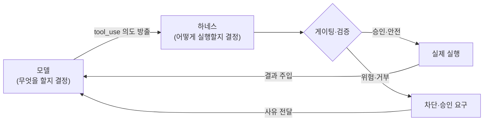

# Harness Engineering — 모델을 감싸는 오케스트레이션 층
---
> 이 문서를 읽고 나면 "모델"과 "하네스"의 책임을 구분해 설명하고, 도구 사용·에이전트 루프·도구 표면 설계·권한 게이팅·컨텍스트 관리가 왜 하네스의 몫인지 그림 없이 말할 수 있습니다. AI Engineering 시험의 "Harness Engineering" 축을 다룹니다.

> 이 개념은 운영체제가 프로그램과 하드웨어 사이에서 시스템 콜·권한·스케줄링을 중개하는 발상과 같지만, 중개 대상이 프로세스가 아니라 LLM의 도구 호출이라는 점이 다릅니다.

LLM은 똑똑하지만 혼자서는 아무것도 *실행*하지 못합니다. 파일을 읽거나 API를 부르거나 명령을 돌리려면, 모델이 "이걸 하고 싶다"는 의도를 내고 그 의도를 실제로 실행·통제하는 코드층이 있어야 합니다. 그 층이 **하네스(harness)**입니다.

Harness Engineering의 핵심은 책임 분리입니다. 모델은 *무엇을 할지* 결정하고, 하네스는 *그것을 어떻게 실행·게이팅·렌더링·병렬화할지* 결정합니다. 이 문서는 그 분리에서 출발해 도구 설계와 컨텍스트 관리까지 봅니다.


## 1. 하네스란 무엇인가

> 하네스는 모델이 방출한 도구 호출 의도를 실제 행동으로 옮기고 보안 경계·승인 정책·UX를 책임지는 코드층이며, 모델은 의도만 낼 뿐 실행 권한이 없습니다.

### 모델과 하네스의 책임 분리

모델은 도구 호출(tool_use) 토큰을 방출하는 데까지가 일입니다. 그 호출을 실제로 실행할지, 사용자 승인을 받을지, 화면에 어떻게 보여줄지, 병렬로 돌려도 되는지는 전부 하네스가 정합니다. 모델은 *애플리케이션의 보안 경계를 모릅니다*. 어떤 명령이 위험한지, 어떤 행동이 되돌릴 수 없는지를 모델은 판단할 수 없습니다. 그래서 그 판단을 하네스가 떠맡습니다.

### 왜 이 분리가 중요한가

모델이 `rm -rf /`를 호출하려 한다고 해서 하네스가 그대로 실행하면 안 됩니다. 모델은 그게 위험한 줄 모르고 방출했을 뿐입니다. 하네스가 그 호출을 가로채 승인을 요구하거나 거부할 수 있어야 시스템이 안전합니다. 같은 이유로 "에이전트 = 신뢰할 수 없는 운영자"로 취급하는 것이 보안 설계의 출발점입니다.




## 2. 도구 사용 (Tool Use)

> 도구 사용은 모델에 도구 정의를 주고 모델이 도구 호출을 요청하면 하네스가 실행해 결과를 되돌리는 패턴이며, 외부 데이터·행동을 LLM에 연결하는 기본기입니다.

### 도구 정의의 구조

도구는 세 가지로 정의합니다 — 이름, 설명, 입력 스키마(JSON Schema)입니다. 모델은 이 정의만 보고 *언제 어떤 도구를 부를지*를 판단합니다. 그래서 description을 자세히 쓰는 것이 중요합니다. 모델은 description으로 "이 도구를 언제 쓸지"를 결정하기 때문에, "무엇을 하는지"뿐 아니라 "언제 호출하는지"를 명시하면 호출 정확도가 올라갑니다.

```json
{
  "name": "get_weather",
  "description": "특정 도시의 현재 날씨를 조회. 사용자가 날씨·기온·강수를 물을 때 호출.",
  "input_schema": {
    "type": "object",
    "properties": {
      "location": {"type": "string", "description": "도시명, 예: 서울"}
    },
    "required": ["location"]
  }
}
```

### tool_choice — 도구 사용 제어

모델이 도구를 언제 쓸지는 `tool_choice`로 제어합니다. 네 가지 값이 있습니다.

| 값 | 동작 |
|----|------|
| `auto` | 모델이 도구 사용 여부를 스스로 결정 (기본) |
| `any` | 반드시 도구를 하나 이상 사용 |
| `tool` | 지정한 특정 도구를 반드시 사용 |
| `none` | 도구를 사용하지 못함 |


## 3. 에이전트 루프 (Agentic Loop)

> 에이전트 루프는 모델 호출 → 도구 실행 → 결과 주입을 모델이 더 이상 도구를 안 부를 때까지 반복하는 제어 흐름이며, SDK 자동 처리(Tool Runner)와 수동 루프로 나뉩니다.

### 루프의 동작

도구 하나로 끝나지 않는 작업은 반복이 필요합니다. 모델을 호출해 도구 요청을 감지하고, 도구를 실행해 결과를 주입한 뒤, 다시 모델을 호출합니다. 모델이 더 이상 도구를 부르지 않을 때(`stop_reason == "end_turn"`)까지 돕니다. 이때 매 턴 `response.content` 전체를 history에 append해야 합니다. tool_use 블록을 보존하지 않으면 다음 턴에서 도구 호출의 맥락이 끊깁니다.

### Tool Runner vs 수동 루프

루프를 직접 짤지 SDK에 맡길지는 제어 수준으로 갈립니다.

| 방식 | 언제 |
|------|------|
| Tool Runner (SDK 자동) | 루프를 직접 제어할 필요가 없을 때 — SDK가 호출·실행·반복을 처리 |
| 수동 루프 | 승인 게이트, 커스텀 로깅, 조건부 실행 같은 세밀한 제어가 필요할 때 |

부수효과가 있는 도구(이메일·삭제·결제)에 사람 승인을 끼우려면 수동 루프가 맞습니다. 자동 Runner는 모델이 부르는 대로 다 실행하기 때문입니다.


## 4. 도구 표면 설계 (Tool Surface Design)

> 범용 bash는 표현력이 크지만 하네스에 불투명한 명령 문자열만 주므로, 게이팅·렌더링·감사·병렬화가 필요한 행동은 전용 도구로 승격해 타입 있는 인자로 다룹니다.

### bash vs 전용 도구

`bash` 도구 하나면 모델은 거의 모든 행동을 할 수 있습니다(breadth가 큼). 하지만 하네스 입장에서는 모든 행동이 똑같은 불투명한 명령 문자열로 들어옵니다. `bash -c "curl -X POST ..."`를 보고 하네스는 이게 위험한 외부 호출인지 무해한 조회인지 알기 어렵습니다.

행동을 **전용 도구**로 승격하면 하네스가 행동별로 타입 있는 인자를 받아 가로채고, 게이팅하고, 렌더링하고, 감사할 수 있습니다. `send_email`이라는 전용 도구는 게이팅이 쉽지만, 같은 일을 `bash -c "curl ..."`로 하면 게이팅이 거의 불가능합니다.

### 승격 기준 네 가지

어떤 행동을 전용 도구로 올릴지는 다음 기준으로 판단합니다.

1. **보안 경계**. 되돌리기 어려운 행동(외부 API 호출, 메시지 전송, 데이터 삭제)은 승인 게이트 뒤에 두기 좋은 후보입니다. 되돌릴 수 있는지(reversibility)가 유용한 판단 기준입니다.
2. **스테일니스 체크**. 전용 `edit` 도구는 모델이 마지막으로 읽은 뒤 파일이 바뀌었으면 쓰기를 거부할 수 있습니다. bash로는 이 불변식을 강제하지 못합니다.
3. **렌더링**. 어떤 행동은 커스텀 UI가 필요합니다. 질문하기를 전용 도구로 만들면 모달로 띄우고 선택지를 보여 주고 답이 올 때까지 루프를 막을 수 있습니다.
4. **스케줄링**. 읽기 전용 도구(`glob`·`grep`)는 병렬 안전으로 표시할 수 있습니다. 같은 일을 bash로 돌리면 병렬 안전한 `grep`과 위험한 `git push`를 하네스가 구분하지 못해 전부 직렬화해야 합니다.

원칙 한 줄: **bash로 넓게 시작하고, 게이팅·렌더링·감사·병렬화가 필요해지면 전용 도구로 승격합니다.**


## 5. 권한 정책과 휴먼-인-더-루프

> 부수효과 있는 도구는 자동 실행 전 사용자 승인을 받게 게이팅하며, 되돌리기 어려운 행동일수록 승인이 필요합니다.

부수효과(이메일 전송·삭제·결제) 있는 도구를 모델이 부르는 대로 다 실행하면 위험합니다. 권한 정책으로 자동 실행과 승인 대기를 가릅니다. `always_allow`는 자동 실행, `always_ask`는 세션을 멈추고 사용자 확인(tool_confirmation)을 기다립니다. 되돌리기 어려운 행동일수록 `always_ask` 쪽에 두는 것이 안전합니다.

서버사이드 도구(웹검색·코드실행)는 모델 제공자 인프라에서 실행되고, 클라이언트사이드 도구(bash·파일편집)는 하네스가 직접 실행합니다. 실행 위치가 다르면 책임과 보안 경계도 달라집니다.


## 6. 스킬과 멀티 에이전트

> 스킬은 작업별 지침을 점진적으로 로드해 고정 컨텍스트를 작게 유지하고, 멀티 에이전트는 독립 작업을 서브에이전트에 위임해 중간 노이즈를 부모 컨텍스트에서 격리합니다.

### 스킬 — 점진적 공개

스킬은 작업별 지침·베스트프랙티스를 폴더(`SKILL.md`)로 패키징한 것입니다. 핵심은 *점진적 공개(progressive disclosure)*입니다. 스킬의 짧은 설명만 평소 컨텍스트에 두고, 관련 작업일 때만 전체 파일을 로드합니다. 덕분에 고정 컨텍스트가 작게 유지됩니다. 모든 스킬의 전문을 항상 컨텍스트에 넣으면 토큰이 폭증하지만, 설명만 두면 필요할 때만 펼쳐 읽습니다.

### 멀티 에이전트 — 컨텍스트 격리

코디네이터가 독립 작업을 서브에이전트에 위임하면, 서브에이전트는 격리된 컨텍스트로 실행됩니다. 중간 탐색의 장황한 출력이 부모 컨텍스트를 오염시키지 않고 자식 컨텍스트에 갇힙니다. 본 학습 저장소의 OMC 규약은 동시 병렬 3개, 그리고 독립 작업이 2개 이상이거나 결과가 수백 줄을 넘는 대형 탐색일 때만 위임하도록 제한합니다. 단순 조회는 직접 도구가 더 쌉니다.


## 7. 컨텍스트 관리

> 긴 에이전트 실행에서 컨텍스트를 관리하는 세 패턴은 삭제(Context Editing)·요약(Compaction)·영속(Memory)이며, 보존 범위가 서로 다릅니다.

에이전트가 오래 돌면 컨텍스트가 오래된 도구 결과와 끝난 사고 블록으로 부풉니다. 이를 관리하는 세 패턴이 있습니다.

| 패턴 | 동작 | 쓰는 때 |
|------|------|---------|
| Context Editing | 오래된 도구 결과·사고 블록을 **삭제(prune)** | 옛 출력이 더는 필요 없을 때 |
| Compaction | 한도 근접 시 이전 히스토리를 **요약(summarize)** | 컨텍스트 윈도우에 다다를 때 |
| Memory | 파일에 저장해 세션 간 **영속** | 세션이 끝나도 상태를 유지해야 할 때 |

핵심 차이는 **삭제 vs 요약 vs 영속**입니다. Context Editing은 내용을 지우고, Compaction은 요약으로 대체하며, Memory는 세션 밖으로 내보냅니다. 긴 에이전트는 셋을 함께 씁니다 — 세션 안에서는 편집·요약으로 줄이고, 세션 간에는 메모리로 잇습니다.


## 면접에서 받을 만한 질문

1. Harness Engineering에서 "모델"과 "하네스"의 책임을 구분해 설명해 보세요.
2. 도구 description에 "무엇을 하는지"뿐 아니라 "언제 호출하는지"를 넣으면 좋은 이유는?
3. 에이전트 루프에서 매 턴 `response.content`(tool_use 블록 포함)를 history에 보존해야 하는 이유는?
4. 어떤 행동을 bash 대신 전용 도구로 승격해야 하는 기준 두 가지 이상을 드세요.
5. Context Editing과 Compaction의 차이를 한 문장으로 말해 보세요.

> 5개 질문에 *먼저 스스로 답해 보세요.* 자답이 끝나면 아래 §정답으로 내려갑니다.


## 정답 (자답 후 펼치기)

> 위 §면접에서 받을 만한 질문의 5개에 *먼저 자답한 뒤* 아래를 읽으세요.

### 정답 1 — 모델 vs 하네스 책임

모델은 무엇을 할지 결정해 도구 호출 의도(tool_use 토큰)를 방출하는 데까지가 일입니다. 하네스는 그 의도를 실제로 실행할지, 승인을 받을지, 어떻게 렌더링·병렬화할지를 결정합니다. 보안 경계·승인 정책·UX는 모델이 모르므로 하네스의 몫입니다.

### 정답 2 — description에 트리거 조건을 넣는 이유

모델은 도구 정의의 description으로 "이 도구를 언제 쓸지"를 판단합니다. "무엇을 하는지"만 쓰면 호출 시점을 모델이 추측해야 하지만, "언제 호출하는지"를 명시하면 호출 정확도가 올라갑니다. 최신 모델은 도구를 보수적으로 부르는 경향이 있어 트리거 조건 명시가 특히 효과적입니다.

### 정답 3 — content를 history에 보존하는 이유

tool_use 블록을 보존하지 않으면 다음 턴에서 도구 호출의 맥락이 끊깁니다. 모델은 자기가 어떤 도구를 어떤 인자로 불렀는지, 그 결과가 무엇이었는지를 history로 추적하므로, 매 턴 `response.content` 전체를 append해야 루프가 일관되게 이어집니다.

### 정답 4 — 전용 도구 승격 기준

(1) 보안 경계 — 되돌리기 어려운 행동은 승인 게이트 뒤에 두기 위해. (2) 스테일니스 체크 — 파일이 읽은 뒤 바뀌었으면 쓰기를 거부하는 불변식 강제. (3) 렌더링 — 커스텀 UI가 필요한 행동. (4) 스케줄링 — 병렬 안전 여부를 하네스가 알 수 있게. 둘 이상 들면 충분합니다.

### 정답 5 — Context Editing vs Compaction

Context Editing은 오래된 도구 결과·사고 블록을 *삭제(prune)*하고, Compaction은 이전 히스토리를 *요약(summarize)*으로 대체합니다. 전자는 내용을 지우고 후자는 압축한다는 점이 핵심 차이입니다.


## 관련 문서

> 이 문서가 모델을 감싸는 하네스 층을 다룬다면, 아래 문서들은 그 하네스가 다루는 토큰·도구 연결(MCP)·에이전트화로 이어집니다.

- [02-01. LLM 모델의 특성과 활용](./02-01.LLM%20%EB%AA%A8%EB%8D%B8%EC%9D%98%20%ED%8A%B9%EC%84%B1%EA%B3%BC%20%ED%99%9C%EC%9A%A9%20%E2%80%94%20%EC%84%A0%ED%83%9D%C2%B7%EC%82%AC%EA%B3%A0%C2%B7%EA%B5%AC%EC%A1%B0%ED%99%94%C2%B7%EB%A7%88%EC%9D%B4%EA%B7%B8%EB%A0%88%EC%9D%B4%EC%85%98.md) — 하네스가 감싸는 대상인 모델의 특성
- [02-03. Token Optimization](./02-03.Token%20Optimization%20%E2%80%94%20%EB%B9%84%EC%9A%A9%C2%B7%EC%A7%80%EC%97%B0%C2%B7context%20rot%EB%A5%BC%20%EC%A4%84%EC%9D%B4%EB%8A%94%20%EB%B2%95.md) § "컨텍스트 격리" — §7 컨텍스트 관리의 비용 측면을 이어서
- [02-04. MCP 설계](./02-04.MCP%20%EC%84%A4%EA%B3%84%20%E2%80%94%20%EC%99%B8%EB%B6%80%20%EB%8F%84%EA%B5%AC%C2%B7%EB%8D%B0%EC%9D%B4%ED%84%B0%EB%A5%BC%20%ED%91%9C%EC%A4%80%EC%9C%BC%EB%A1%9C%20%EC%97%B0%EA%B2%B0%ED%95%98%EA%B8%B0.md) — §2 도구 사용을 외부 시스템으로 확장하는 표준 프로토콜
- [02-05. AI Agentization](./02-05.AI%20Agentization%20%E2%80%94%20%EC%9B%8C%ED%81%AC%ED%94%8C%EB%A1%9C%EC%9A%B0%EC%99%80%20%EC%97%90%EC%9D%B4%EC%A0%84%ED%8A%B8%20%EC%82%AC%EC%9D%B4.md) — §3 에이전트 루프를 자율 에이전트로 끌어올리는 단계
