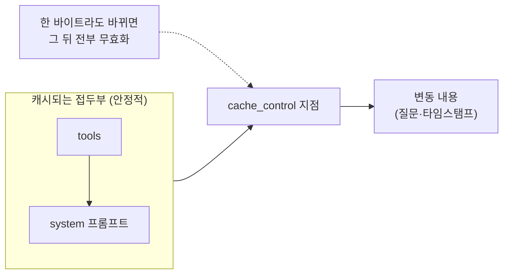

# Token Optimization — 비용·지연·context rot를 줄이는 법
---
> 이 문서를 읽고 나면 프롬프트 캐싱의 단 하나의 불변식을 설명하고, 컨텍스트 격리·tool search·프로그래매틱 도구 호출·배치가 어떻게 토큰을 아끼는지 그림 없이 말할 수 있습니다. AI Engineering 시험의 "Token Optimization" 축을 다룹니다.

> 이 개념은 데이터베이스에서 캐시·인덱스·배치 커밋으로 I/O를 줄이는 발상과 같지만, 줄이는 대상이 디스크 접근이 아니라 모델이 매번 처리하는 토큰이라는 점이 다릅니다.

LLM 애플리케이션의 비용·지연·품질 저하는 거의 다 토큰에서 나옵니다. 입력이 길수록 돈이 더 들고 응답이 느려지며, 컨텍스트가 길수록 옛 정보가 현재 판단을 흐립니다(context rot). 그래서 토큰을 줄이는 것이 곧 비용·지연·품질 최적화입니다.

이 문서는 토큰을 아끼는 여러 기법을 봅니다. 가장 먼저, 그리고 가장 중요하게, 프롬프트 캐싱부터 다룹니다.


## 1. 프롬프트 캐싱

> 프롬프트 캐싱은 반복되는 프롬프트 접두부를 캐싱해 재처리 비용·지연을 줄이는 기법이며, 단 하나의 불변식 — 접두부 일치(prefix match) — 에서 모든 규칙이 따라 나옵니다.

### 단 하나의 불변식

프롬프트 캐싱은 **접두부 일치(prefix match)**입니다. 캐시 키는 각 캐시 지점까지의 렌더된 프롬프트 바이트로 만들어집니다. 접두부 중 *한 바이트라도* 바뀌면 그 지점 이후 전체 캐시가 무효화됩니다. 이 한 문장에서 모든 실전 규칙이 따라 나옵니다.

렌더 순서는 `tools` → `system` → `messages`입니다. 그래서 **안정적인 내용은 앞에, 변동하는 내용은 뒤에** 두어야 합니다. 안정적인 system 프롬프트와 결정론적 도구 목록을 앞에 고정하고, 매 요청 바뀌는 타임스탬프·질문은 마지막 캐시 지점 뒤에 둡니다.



### 사일런트 무효화 — 조용히 캐시가 깨지는 함정

캐시가 안 되는데 에러도 안 나는 경우가 함정입니다. 다음이 system 프롬프트 앞쪽에 들어가면 매 요청 접두부가 달라져 캐시가 조용히 깨집니다.

1. system 프롬프트에 `now()`·현재 시각을 삽입합니다. 매 요청 접두부가 바뀝니다.
2. 정렬하지 않은 JSON을 직렬화합니다. 키 순서가 비결정적이라 바이트가 달라집니다.
3. 사용자별 ID를 system 프롬프트에 박습니다. 사용자 간 캐시 공유가 깨집니다.
4. 도구 세트를 요청마다 바꿉니다. 도구는 위치 0에서 렌더되므로 전체 캐시가 무효화됩니다.

### 캐시 히트는 검증해야 한다

캐시가 실제로 적중하는지는 `usage.cache_read_input_tokens`로 확인합니다. 같은 접두부로 반복 요청하는데 이 값이 0이면 사일런트 무효화가 일어나는 중입니다.

```python
# 캐시 적중 검증 — 반복 요청에서 cache_read 가 0 이면 무효화 요인을 찾아야 합니다.
print(response.usage.cache_read_input_tokens)   # 캐시에서 읽은 토큰 (~0.1배 비용)
print(response.usage.cache_creation_input_tokens)  # 캐시에 쓴 토큰 (~1.25배 비용)
```

경제성도 알아 둡니다. 캐시 읽기는 기본 입력의 약 0.1배, 쓰기는 5분 TTL 기준 1.25배입니다. 그래서 같은 접두부를 *2회 이상* 쓰면 이득입니다. 1.25 + 0.1 = 1.35배가 캐시 없이 2회 보낼 때의 2배보다 싸기 때문입니다.


## 2. 컨텍스트 격리

> 컨텍스트 격리는 장황한 중간 출력을 서브에이전트나 별도 호출에 가둬 메인 컨텍스트 오염을 막는 기법이며, 결과는 내용 전체가 아니라 경로만 돌려받습니다.

긴 탐색이나 verbose한 도구 출력을 메인 컨텍스트에 그대로 쌓으면 토큰이 부풀고 context rot이 심해집니다. 이런 작업은 서브에이전트나 별도 호출에 가둡니다. 본 학습 저장소의 토큰 위생 규약은 구체적입니다 — 에이전트 프롬프트에 "report under N words"를 명시하고, 긴 파일은 내용 대신 *경로 + 라인 범위*만 전달하며, 긴 결과는 notepad에 저장한 뒤 경로만 반환하게 합니다. 파일 전체를 컨텍스트에 넣는 대신 "이 파일 120~180줄을 봐"라고 주면 모델이 필요한 만큼만 읽습니다.


## 3. 컨텍스트 분할 도구 선택

> 컨텍스트가 팽창하거나 잘못된 시도가 쌓일 때 상황별로 다른 도구(compact·clear·rewind·서브에이전트)를 골라야 하며, 능동적 정리가 자동 정리보다 낫습니다.

세션 안에서 컨텍스트를 정리하는 도구는 상황별로 다릅니다.

| 상황 | 도구 | 이유 |
|------|------|------|
| 잘못된 접근을 되돌릴 때 | `/rewind` | 파일 read는 보존하고 실패한 시도만 제거 |
| 탐색으로 컨텍스트가 팽창했을 때 | `/compact <hint>` | 힌트로 요약을 조향 |
| 전혀 다른 새 작업을 시작할 때 | `/clear` | context rot 제로 |
| 다음 단계가 verbose 출력을 낼 때 | 서브에이전트 | 중간 노이즈를 자식 컨텍스트에 격리 |

핵심은 *능동적* 정리입니다. 컨텍스트가 한도에 다다라 자동 압축(autocompact)이 일어나기 전에 `/compact <hint>`로 요약 방향을 직접 지정하면 나쁜 요약을 예방합니다. 1M 컨텍스트여도 context rot은 발생하므로, 긴 세션에서 옛 탐색 결과가 현재 판단을 흐리지 않게 능동적으로 관리합니다.


## 4. 출력 토큰 제어

> 출력 길이와 총 토큰 지출은 max_tokens(강제 상한)·effort(사고 깊이)·Task Budget(모델 인지 예산)으로 제어하며, 세 손잡이의 성격이 다릅니다.

출력 쪽 토큰도 제어 대상입니다. 세 손잡이의 차이를 알아야 합니다.

1. **max_tokens**는 강제 상한입니다. 모델은 이 값을 *모릅니다*. 넘으면 출력이 잘립니다.
2. **effort**는 사고 깊이입니다. 낮추면 도구 호출이 줄고 군더더기가 줄어듭니다.
3. **Task Budget**은 모델이 *인지하는* 연성 예산입니다. 에이전트 루프 전체에 토큰 예산을 알려주면 모델이 카운트다운을 보며 스스로 작업을 우선순위화하고 우아하게 마무리합니다(최소 20K).

max_tokens와 Task Budget의 차이가 시험 포인트입니다. max_tokens는 모델이 모르는 *강제 상한*이고, Task Budget은 모델이 보면서 자기조절하는 *연성 예산*입니다.


## 5. tool search와 프로그래매틱 도구 호출

> tool search는 많은 도구 중 필요한 것만 검색해 로드하고, 프로그래매틱 도구 호출은 여러 순차 호출을 스크립트로 합쳐 중간 결과가 컨텍스트에 쌓이지 않게 합니다.

### tool search — 지연 로딩

도구가 많은데 요청마다 몇 개만 쓴다면, 전체 스키마를 미리 컨텍스트에 넣는 건 낭비입니다. tool search는 도구 세트를 검색해 관련 스키마만 로드합니다. 게다가 발견된 스키마는 *append*되므로 기존 접두부 캐시가 보존됩니다.

### 프로그래매틱 도구 호출 (PTC)

표준 도구 사용에서는 호출 하나가 왕복 한 번입니다. 모델이 도구를 부르면 결과가 모델 컨텍스트로 들어오고, 모델이 추론한 뒤 다음 도구를 부릅니다. 순차 3호출이면 왕복 3번이고, 중간 데이터 대부분은 다시 쓰이지 않는데도 컨텍스트에 쌓입니다.

PTC는 이 호출들을 모델이 *스크립트로 합성*해 코드 실행 컨테이너에서 돌립니다. 스크립트가 도구를 부르면 결과가 모델 컨텍스트가 아니라 *실행 중인 코드*로 돌아갑니다. 스크립트가 일반 제어 흐름(반복·필터·분기)으로 처리하고, *최종 출력만* 모델에 돌아갑니다. 토큰이 중간 결과가 아니라 최종 출력에만 비례하게 됩니다.


## 6. 배치 처리

> 배치 API는 지연에 민감하지 않은 대량 요청을 비동기로 묶어 절반 가격에 처리하며, 결과는 순서 보장이 없어 custom_id로 매칭합니다.

지연이 중요하지 않은 대량 요청은 배치로 묶으면 **50% 저렴**합니다. 다만 결과가 *순서 보장 없이* 도착하므로 위치(index)로 매칭하면 안 됩니다. 각 요청에 `custom_id`를 붙이고 결과를 그 키로 매칭합니다. 폴링으로 완료를 확인하고, 완료되면 결과를 스트림으로 받습니다.

배치를 쓰면 안 되는 경우도 분명합니다. 사용자가 실시간으로 응답을 기다리는 대화형 작업은 배치의 비동기 지연을 감당할 수 없습니다. 배치는 야간 일괄 분류·대량 추출처럼 *기다려도 되는* 작업에 씁니다.


## 면접에서 받을 만한 질문

1. 프롬프트 캐싱의 단 하나의 불변식(prefix match)을 설명하고, 왜 그 한 문장에서 모든 규칙이 나오는지 말해 보세요.
2. system 프롬프트에 현재 시각을 넣으면 캐시가 깨지는 이유는?
3. 캐시가 실제로 적중하는지 어떤 usage 필드로 확인하나요?
4. max_tokens와 Task Budget의 차이를 강제 상한 vs 모델 인지 예산으로 설명해 보세요.
5. 배치 결과를 위치(index)가 아니라 custom_id로 매칭해야 하는 이유는?

> 5개 질문에 *먼저 스스로 답해 보세요.* 자답이 끝나면 아래 §정답으로 내려갑니다.


## 정답 (자답 후 펼치기)

> 위 §면접에서 받을 만한 질문의 5개에 *먼저 자답한 뒤* 아래를 읽으세요.

### 정답 1 — prefix match 불변식

프롬프트 캐싱은 접두부 일치입니다. 캐시 키가 각 지점까지의 렌더된 프롬프트 바이트로 만들어지므로, 접두부 중 한 바이트라도 바뀌면 그 뒤 전체 캐시가 무효화됩니다. 그래서 "안정적인 건 앞에, 변동하는 건 뒤에"라는 모든 배치 규칙이 이 한 문장에서 따라 나옵니다.

### 정답 2 — 시각 삽입이 캐시를 깨는 이유

렌더 순서가 `tools` → `system` → `messages`라 system 프롬프트는 접두부 앞쪽에 있습니다. 현재 시각을 넣으면 매 요청 그 바이트가 달라지고, 접두부가 바뀌므로 그 뒤 전체 캐시가 무효화됩니다. 에러는 안 나고 조용히 캐시가 안 됩니다.

### 정답 3 — 캐시 적중 확인 필드

`usage.cache_read_input_tokens`로 확인합니다. 같은 접두부로 반복 요청하는데 이 값이 0이면 사일런트 무효화 요인(시각·UUID·비정렬 JSON·도구 세트 변경)이 있다는 신호입니다.

### 정답 4 — max_tokens vs Task Budget

max_tokens는 강제 상한이고 모델은 그 값을 모릅니다. 넘으면 출력이 잘립니다. Task Budget은 모델이 카운트다운으로 인지하는 연성 예산이라, 모델이 보면서 작업을 우선순위화하고 우아하게 마무리합니다.

### 정답 5 — custom_id 매칭

배치 결과는 순서 보장 없이 도착합니다. 위치(index)로 매칭하면 다른 요청의 결과를 잘못 연결할 수 있습니다. 각 요청의 custom_id로 매칭해야 정확히 짝지어집니다.


## 관련 문서

> 이 문서가 토큰을 아끼는 기법을 다룬다면, 아래 문서들은 그 토큰을 쓰는 모델·하네스·에이전트 맥락을 다룹니다.

- [02-01. LLM 모델의 특성과 활용](./02-01.LLM%20%EB%AA%A8%EB%8D%B8%EC%9D%98%20%ED%8A%B9%EC%84%B1%EA%B3%BC%20%ED%99%9C%EC%9A%A9%20%E2%80%94%20%EC%84%A0%ED%83%9D%C2%B7%EC%82%AC%EA%B3%A0%C2%B7%EA%B5%AC%EC%A1%B0%ED%99%94%C2%B7%EB%A7%88%EC%9D%B4%EA%B7%B8%EB%A0%88%EC%9D%B4%EC%85%98.md) § "사고와 노력" — effort가 출력 토큰에 미치는 영향
- [02-02. Harness Engineering](./02-02.Harness%20Engineering%20%E2%80%94%20%EB%AA%A8%EB%8D%B8%EC%9D%84%20%EA%B0%90%EC%8B%B8%EB%8A%94%20%EC%98%A4%EC%BC%80%EC%8A%A4%ED%8A%B8%EB%A0%88%EC%9D%B4%EC%85%98%20%EC%B8%B5.md) § "컨텍스트 관리" — 삭제·요약·영속 패턴이 토큰을 줄이는 방식
- [01-01. Claude Opus 4.8 — 4.7에서 무엇이 달라졌나](./01-01.Claude%20Opus%204.8%20%E2%80%94%204.7%EC%97%90%EC%84%9C%20%EB%AC%B4%EC%97%87%EC%9D%B4%20%EB%8B%AC%EB%9D%BC%EC%A1%8C%EB%82%98.md) § "개발자가 체감하는 API 변화" — 캐시 최소 길이·mid-conversation system 메시지가 캐시에 주는 실제 영향
