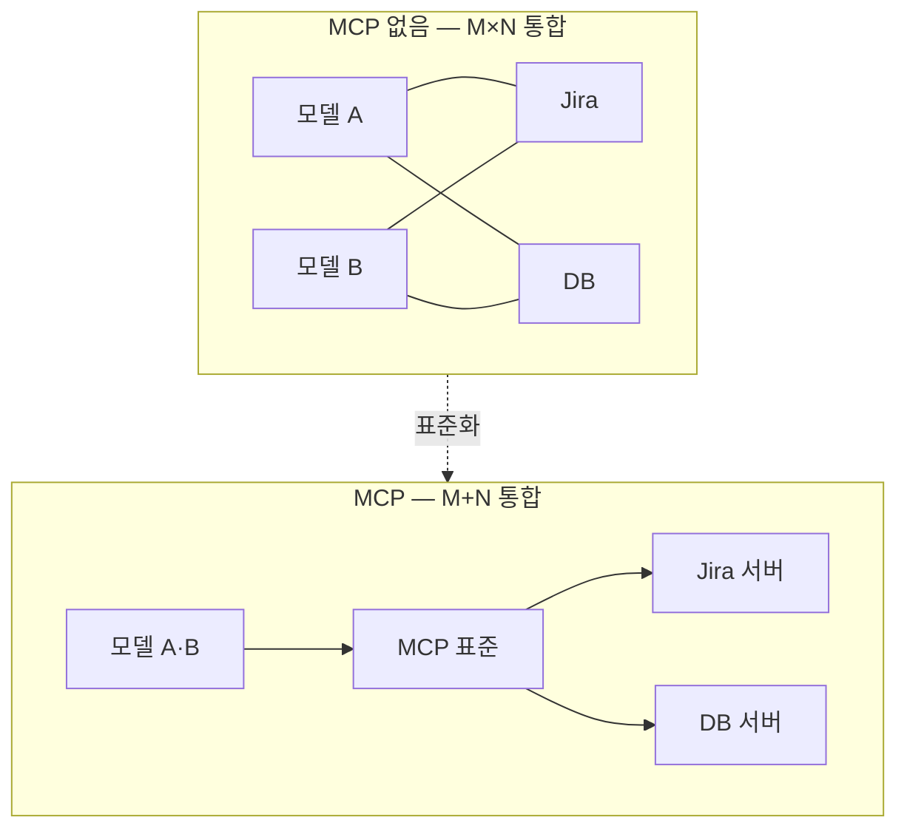
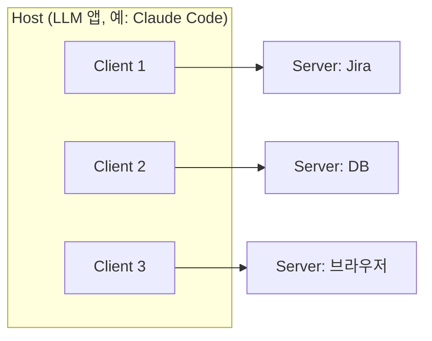
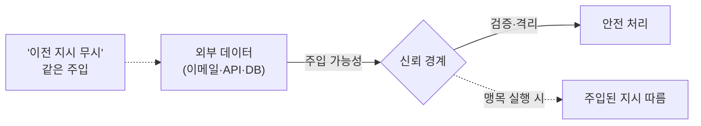

# MCP 설계 — 외부 도구·데이터를 표준으로 연결하기
---
> 이 문서를 읽고 나면 MCP가 해결하는 N×M 통합 문제를 설명하고, Tools/Resources/Prompts·Host/Client/Server 구조·인증 격리·프롬프트 주입 방어를 그림 없이 말할 수 있습니다. AI Engineering 시험의 "MCP 설계" 축을 다룹니다.

> 이 개념은 USB-C가 기기마다 다른 케이블을 하나의 표준 포트로 통일한 발상과 같지만, 통일 대상이 전원·데이터 케이블이 아니라 LLM과 외부 시스템의 연결이라는 점이 다릅니다.

LLM이 똑똑해도 회사 위키·Jira·DB·브라우저에 닿지 못하면 닫힌 상자입니다. 외부 시스템마다 통합을 따로 짜면, 모델 M개와 도구 N개를 잇는 데 M×N개의 1회성 통합이 필요합니다. **MCP(Model Context Protocol)**는 이 연결을 표준 프로토콜로 통일해, 도구를 재사용 가능한 서버로 한 번만 노출하면 어느 모델·앱이든 붙을 수 있게 합니다.

이 문서는 MCP가 무엇이고 어떻게 구성되며, 왜 인증과 보안 경계가 설계의 핵심인지를 봅니다.

## 1. MCP란 무엇인가

> MCP는 LLM 애플리케이션이 외부 도구·데이터·기능을 표준 인터페이스로 연결하는 개방 프로토콜이며, M×N 통합을 M+N으로 줄이는 것이 존재 이유입니다.

### N×M 통합 문제

모델이 3개, 붙일 외부 도구가 5개라면, 표준이 없을 때는 3×5 = 15개의 통합을 각각 짜야 합니다. 도구가 하나 늘면 모델 수만큼 통합이 또 늘어납니다. MCP는 도구를 *MCP 서버*로 한 번 노출하면 어느 모델이든 표준 프로토콜로 붙으므로, 통합이 3 + 5 = 8개로 줄어듭니다. 각 통합이 1회성이 아니라 재사용 가능해집니다.

그래서 MCP를 "AI의 USB-C"라 부릅니다. 기기마다 다른 케이블 대신 하나의 표준 포트로 통일한 것처럼, 외부 시스템마다 다른 통합 대신 하나의 프로토콜로 통일합니다. 단, 이 비유는 "표준 인터페이스로 다양한 주변기기를 꽂는다"까지 유효하고, MCP는 단순 연결을 넘어 *인증·권한·프롬프트 템플릿*까지 표준화한다는 점은 USB-C 비유로 다 표현되지 않습니다.

본 학습 환경에도 여러 MCP가 붙어 있습니다 — `context7`(라이브러리 문서), 검색, `mcp-atlassian`(Jira·Confluence), `claude-in-chrome`(브라우저 자동화)이 같은 프로토콜로 연결됩니다.

## 2. MCP의 세 프리미티브

> MCP 서버는 Tools(모델이 호출하는 행동)·Resources(모델이 읽는 데이터)·Prompts(재사용 프롬프트 템플릿) 세 가지를 노출하며, 행동과 데이터를 구분하는 것이 핵심입니다.

MCP 서버가 노출하는 것은 세 종류입니다.

| 프리미티브 | 무엇인가 | 예 |
|-----------|---------|-----|
| Tools | 모델이 호출하는 *행동*(함수) | 이슈 생성, 메시지 전송 |
| Resources | 모델이 읽는 *데이터* | 파일, DB 레코드, 위키 페이지 |
| Prompts | 재사용 가능한 *프롬프트 템플릿* | "코드 리뷰" 정형 프롬프트 |

Tools와 Resources의 차이가 시험 포인트입니다. Tools는 *행동*을 일으키고(부수효과 가능), Resources는 *데이터*를 읽기만 합니다(읽기 중심). 이슈를 *만드는* 것은 Tool이고, 이슈 목록을 *읽는* 것은 Resource입니다.

## 3. MCP 아키텍처 — Host / Client / Server

> MCP는 Host(LLM 앱) 안의 Client가 Server(외부 기능 제공자)에 연결하는 구조이며, 하나의 Host가 여러 Server에 동시에 붙을 수 있습니다.

### 세 역할

MCP는 세 역할로 구성됩니다. **Host**는 LLM 애플리케이션 자체입니다(예: Claude Code, IDE). Host 안에는 **Client**가 있고, 각 Client가 하나의 **Server**(외부 기능 제공자)에 연결합니다. 하나의 Host는 여러 Server에 동시에 붙을 수 있습니다 — Jira 서버, DB 서버, 브라우저 서버를 한 Host가 함께 씁니다.

전송(transport)은 Streamable HTTP나 stdio를 씁니다. 에이전트 정의에서 서버 선언은 인증 정보 없이 `{type, name, url}` 형태만 둡니다.

## 4. MCP 인증과 보안 — 비밀 격리

> MCP 서버 접근에는 자격증명이 필요하지만 비밀을 재사용 가능한 정의에서 분리해 별도 저장소(vault)에 두고, 그 비밀이 에이전트 실행 환경에 절대 노출되지 않게 하는 것이 설계의 핵심입니다.

### 비밀을 정의에서 분리하는 이유

MCP 서버에 붙으려면 OAuth 토큰 같은 자격증명이 필요합니다. 이 비밀을 에이전트 정의에 박으면 두 가지 문제가 생깁니다. 첫째, 정의를 재사용·버전 관리할 때 비밀이 함께 따라다닙니다. 둘째, 정의를 공유하면 비밀이 새어 나갑니다.

그래서 인증을 둘로 가릅니다. 에이전트의 `mcp_servers`는 `{type, name, url}`만 선언하고 인증은 넣지 않습니다. 자격증명은 별도 저장소(vault)에 두고 세션에 `vault_ids`로 첨부합니다. OAuth 토큰은 자동 갱신됩니다. 결과적으로 *재사용 가능한 정의*와 *비밀*이 분리됩니다.

### 비밀은 샌드박스에 들어가지 않는다

핵심 보안 경계는 비밀이 *에이전트 실행 환경(샌드박스)에 절대 들어가지 않는다*는 점입니다. 샌드박스에서 도는 코드(모델이 작성한 코드 포함)는 vault에 든 자격증명을 읽거나 빼낼 수 없습니다. 대신 자격증명은 요청이 샌드박스를 *떠난 뒤* 제공자 측 프록시가 주입합니다. 프롬프트 주입을 당해도 비밀이 새지 않는 구조입니다.

### MCP 토큰 ≠ REST API 키

함정이 하나 있습니다. 호스티드 MCP 서버는 보통 **OAuth bearer 토큰**을 요구하는데, 이는 서비스의 네이티브 API 키와 다릅니다. 예를 들어 Notion의 `ntn_` 통합 토큰은 Notion REST API에는 통하지만 Notion MCP 서버의 vault 자격증명으로는 작동하지 않습니다. 둘은 다른 인증 체계입니다.

## 5. MCP 도구 설계와 프롬프트 주입 방어

> 도구는 구체적 이름·트리거 조건 명시·집중된 개수로 설계하고, MCP로 가져온 외부 데이터에는 프롬프트 주입이 섞일 수 있으므로 신뢰 경계를 둡니다.

### 도구 설계 원칙

도구 이름은 구체적으로 짓습니다 — `get_current_weather`가 `weather`보다 낫습니다. description에는 *언제 호출하는지*를 명시합니다. 최신 모델은 도구를 보수적으로 부르는 경향이 있어, 트리거 조건을 명시하면 호출률이 올라갑니다. 도구 수는 집중해야 합니다. 너무 많으면 모델이 어느 도구를 쓸지 혼란스러워합니다.

### 프롬프트 주입 — 외부 데이터를 신뢰하지 않는다

MCP로 가져온 외부 데이터(API 응답·이메일 본문·DB 레코드)에 "이전 지시사항을 무시하라" 같은 **프롬프트 주입**이 섞여 있을 수 있습니다. 모델이 이 외부 데이터를 맹목적으로 실행하면 공격자의 지시를 따르게 됩니다. 그래서 외부 데이터에 신뢰 경계를 둡니다 — "에이전트 = 신뢰할 수 없는 운영자"로 취급하고, 외부 데이터 내 주입 가능성을 인식한 채 처리합니다.

추가로, 에이전트 환경의 네트워크 egress를 deny-by-default(`limited`)로 두고 필요한 호스트만 허용하면 공격 표면이 줄어듭니다. 이때 허용 호스트 설정을 빠뜨리면 MCP 도구가 조용히 실패하므로 주의합니다.

## 면접에서 받을 만한 질문

1. MCP가 해결하는 N×M 통합 문제를 설명하고, 왜 "AI의 USB-C"라 불리는지 말해 보세요.
2. MCP의 Tools와 Resources의 차이는 무엇인가요?
3. MCP의 Host·Client·Server 관계를 문장으로 설명해 보세요.
4. MCP 인증 정보를 에이전트 정의가 아니라 vault에 두는 이유 두 가지를 드세요.
5. MCP로 가져온 외부 데이터를 신뢰하면 안 되는 보안 이유는?

> 5개 질문에 *먼저 스스로 답해 보세요.* 자답이 끝나면 아래 §정답으로 내려갑니다.

## 정답 (자답 후 펼치기)

> 위 §면접에서 받을 만한 질문의 5개에 *먼저 자답한 뒤* 아래를 읽으세요.

### 정답 1 — N×M 통합 문제

표준이 없으면 모델 M개와 도구 N개를 잇는 데 M×N개의 1회성 통합이 필요하고, 도구가 늘 때마다 모델 수만큼 통합이 또 늘어납니다. MCP는 도구를 서버로 한 번 노출하면 어느 모델이든 표준 프로토콜로 붙으므로 통합이 M+N으로 줄고 재사용됩니다. 기기마다 다른 케이블을 하나의 표준 포트로 통일한 USB-C와 같아서 "AI의 USB-C"라 부릅니다.

### 정답 2 — Tools vs Resources

Tools는 모델이 호출하는 *행동*(함수)으로 부수효과가 있을 수 있고(이슈 생성·메시지 전송), Resources는 모델이 *읽는 데이터*입니다(파일·DB 레코드·위키 페이지). 행동이냐 데이터냐가 둘을 가르는 기준입니다.

### 정답 3 — Host·Client·Server

Host는 LLM 애플리케이션 자체(Claude Code 등)이고, Host 안의 Client가 각각 하나의 Server(외부 기능 제공자)에 연결합니다. 하나의 Host는 여러 Server에 동시에 붙을 수 있습니다.

### 정답 4 — vault에 두는 이유

첫째, 재사용성 — 비밀을 정의에서 빼면 정의를 재사용·버전 관리·공유해도 비밀이 따라다니지 않습니다. 둘째, 비밀 격리 — 비밀이 vault에 있어 에이전트 실행 환경(샌드박스)에 노출되지 않으므로, 샌드박스 코드가 자격증명을 빼낼 수 없습니다.

### 정답 5 — 외부 데이터를 신뢰하면 안 되는 이유

MCP로 가져온 외부 데이터(이메일·API 응답·DB 레코드)에 "이전 지시 무시" 같은 프롬프트 주입이 섞일 수 있습니다. 모델이 맹목적으로 실행하면 공격자의 지시를 따르게 되므로, 외부 데이터에 신뢰 경계를 두고 "신뢰할 수 없는 입력"으로 다뤄야 합니다.

## 관련 문서

> 이 문서가 외부 도구를 표준으로 연결하는 MCP를 다룬다면, 아래 문서들은 그 도구를 호출하는 하네스와 자율화하는 에이전트로 이어집니다.

- [02-02. Harness Engineering](./02-02.Harness%20Engineering%20%E2%80%94%20%EB%AA%A8%EB%8D%B8%EC%9D%84%20%EA%B0%90%EC%8B%B8%EB%8A%94%20%EC%98%A4%EC%BC%80%EC%8A%A4%ED%8A%B8%EB%A0%88%EC%9D%B4%EC%85%98%20%EC%B8%B5.md) § "도구 사용" — MCP는 도구 사용을 외부 시스템으로 확장한 표준
- [02-05. AI Agentization](./02-05.AI%20Agentization%20%E2%80%94%20%EC%9B%8C%ED%81%AC%ED%94%8C%EB%A1%9C%EC%9A%B0%EC%99%80%20%EC%97%90%EC%9D%B4%EC%A0%84%ED%8A%B8%20%EC%82%AC%EC%9D%B4.md) § "에이전트 신뢰성" — 외부 데이터 신뢰 경계가 에이전트 환각 통제와 이어짐
- [02-01. LLM 모델의 특성과 활용](./02-01.LLM%20%EB%AA%A8%EB%8D%B8%EC%9D%98%20%ED%8A%B9%EC%84%B1%EA%B3%BC%20%ED%99%9C%EC%9A%A9%20%E2%80%94%20%EC%84%A0%ED%83%9D%C2%B7%EC%82%AC%EA%B3%A0%C2%B7%EA%B5%AC%EC%A1%B0%ED%99%94%C2%B7%EB%A7%88%EC%9D%B4%EA%B7%B8%EB%A0%88%EC%9D%B4%EC%85%98.md) — MCP 도구를 호출하는 모델의 능력·구조화 출력
