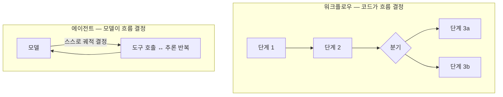
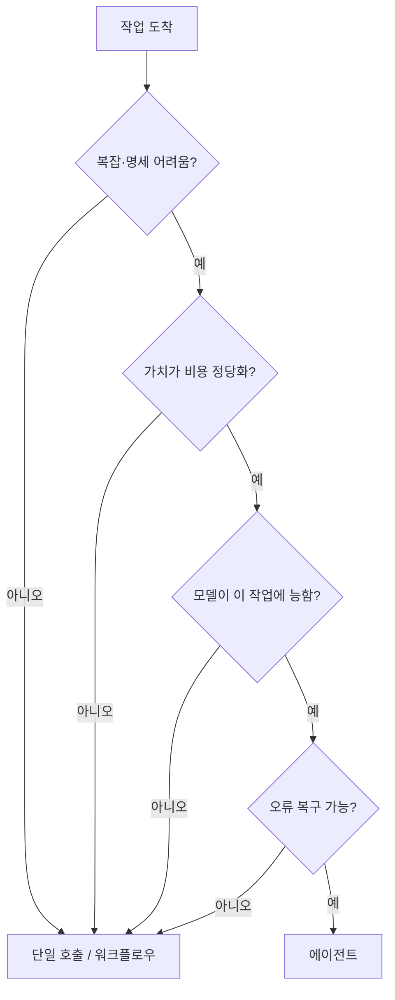

# AI Agentization — 워크플로우와 에이전트 사이
---
> 이 문서를 읽고 나면 워크플로우와 에이전트의 차이를 "제어 흐름을 누가 정하는가"로 설명하고, 에이전트를 만들지 판단하는 4기준·완료 검증·환각 통제·관찰성을 그림 없이 말할 수 있습니다. AI Engineering 시험의 "AI Agentization" 축을 다룹니다.

> 이 개념은 자동화에서 "정해진 스크립트로 돌릴까, 사람에게 재량을 줄까"를 정하는 발상과 같지만, 재량을 받는 주체가 사람이 아니라 LLM이고 그 재량이 비용·불확실성을 동반한다는 점이 다릅니다.

"에이전트를 만든다"는 말이 유행이지만, 모든 문제에 에이전트가 답은 아닙니다. 에이전트는 강력한 만큼 비싸고 느리고 불확실합니다. AI Agentization의 핵심은 *언제 에이전트로 가고 언제 더 단순한 방식에 머무를지*를 판단하는 것, 그리고 에이전트로 갔을 때 그것을 신뢰할 수 있게 만드는 것입니다.

이 문서는 워크플로우와 에이전트의 구분에서 출발해, 에이전트 판단 기준·티어·완료 검증·신뢰성까지 봅니다.

## 1. 워크플로우 vs 에이전트

> 워크플로우는 제어 흐름을 코드가 정하고 에이전트는 모델이 정하며, 예측 가능성을 택하느냐 유연성을 택하느냐의 갈림입니다.

차이는 *제어 흐름을 누가 정하는가*입니다. **워크플로우**는 루프와 분기를 개발자가 코드로 작성합니다. 어떤 순서로 무엇을 할지가 미리 정해져 있어 예측 가능하고 디버깅이 쉽습니다. **에이전트**는 모델이 스스로 궤적(trajectory)을 결정합니다. 무엇을 어떤 순서로 할지 모델이 정하므로 개방형 문제에 유연하지만, 비용·지연·불확실성이 큽니다.

비유 한 줄: 워크플로우는 레시피를 그대로 따르는 요리, 에이전트는 냉장고를 열어 보고 메뉴를 정하는 요리입니다. 단, 이 비유는 "정해진 절차 vs 재량"까지 유효하고, 에이전트의 재량이 *토큰 비용*을 동반한다는 점은 요리 비유로 표현되지 않습니다.

## 2. 에이전트를 만들지 판단하는 4기준

> 에이전트로 갈지는 복잡성·가치·실현가능성·오류비용 4기준을 모두 통과해야 하며, 하나라도 "아니오"면 더 단순한 티어로 내려갑니다.

에이전트는 마지막 선택지입니다. 다음 4기준을 *모두* "예"로 통과해야 에이전트가 정당화됩니다.

1. **복잡성(Complexity)**. 작업이 다단계이고 사전에 완전히 명세하기 어려운가? "설계 문서를 PR로 바꿔라"는 에이전트감이지만 "PDF에서 제목을 추출하라"는 아닙니다.
2. **가치(Value)**. 결과가 더 높은 비용과 지연을 정당화하는가?
3. **실현가능성(Viability)**. 모델이 이 작업 유형에 실제로 능한가?
4. **오류비용(Cost of error)**. 오류를 잡고 복구할 수 있는가(테스트·리뷰·롤백)?

하나라도 "아니오"면 에이전트로 가지 않고 단일 호출이나 워크플로우 같은 더 단순한 티어에 머무릅니다. PDF 제목 추출처럼 단순하고 명세 가능한 작업에 에이전트를 쓰면 비용·불확실성만 늘고 이득이 없습니다.

## 3. 에이전트 티어

> 가장 단순한 티어부터 단일 호출 · 워크플로우 · 자체 호스팅 에이전트 · 관리형 에이전트로 올라가며, 필요 최소 티어에 머무는 것이 원칙입니다.

티어는 단순한 것부터 올라갑니다.

| 티어 | 무엇인가 | 적합 작업 |
|------|---------|----------|
| 단일 LLM 호출 | 한 요청·한 응답 | 분류·요약·추출·Q&A |
| 워크플로우 | 코드 제어 다단계 + 도구 | 코드가 흐름을 통제하는 파이프라인 |
| 에이전트(자체 호스팅) | 모델 주도 + 자기 도구, 컴퓨트 직접 호스팅 | 개방형, 모델이 궤적 결정 |
| 관리형 에이전트 | 제공자가 루프·샌드박스 호스팅 | 상태 유지·장기 실행, 인프라 위임 |

원칙은 *필요 최소 티어에 머무는 것*입니다. 분류·요약은 단일 호출이면 충분한데 에이전트로 올리면 낭비입니다.

관리형 에이전트(예: Claude Managed Agents)의 핵심 규약은 **Agent(1회 생성) → Session(매 실행)**입니다. `model`·`system`·`tools`는 Agent에 한 번 정의해 두고, Session은 그 Agent를 포인터로 참조만 합니다. 매 실행마다 Agent를 새로 만들면 고아 객체가 쌓이고 버전 관리가 깨집니다.

## 4. 에이전트 상태와 메모리

> 세션 내 컨텍스트와 세션 간 메모리를 구분하며, 영속 메모리는 파일에 저장돼 프로세스 재시작에도 살아남습니다.

에이전트의 상태는 두 층입니다. *세션 내* 상태는 현재 대화의 컨텍스트입니다. *세션 간* 상태는 메모리로, 파일에 저장돼 세션이 끝나고 프로세스가 재시작돼도 살아남습니다. 세션 안에서만 필요한 정보는 컨텍스트로 충분하지만, 사용자 선호나 누적 학습처럼 다음 세션에도 써야 하는 것은 메모리에 둡니다. 메모리는 보통 버전 관리·롤백·감사를 지원하고, 에이전트가 파일 도구로 읽고 씁니다.

## 5. 에이전트 완료 검증

> 완료는 vibes가 아니라 채점 가능한 루브릭으로 정의하고, 작성과 검증을 별도 패스로 분리해 자기승인을 막습니다.

### 루브릭으로 완료를 정의

"좋은 리포트"는 채점할 수 없지만 "SKU마다 숫자형 price 컬럼이 있는 CSV"는 채점할 수 있습니다. 에이전트의 완료를 모호한 느낌이 아니라 *독립적으로 채점 가능한 루브릭*으로 정의하면, iterate → grade → revise 루프로 통과까지 반복할 수 있습니다. 채점기가 각 기준을 독립적으로 보므로 기준이 모호하면 루프가 시끄러워집니다.

### 작성과 검증은 별도 패스

같은 컨텍스트에서 작성하고 그 자리에서 "다 됐다"고 자기 승인하면 안 됩니다. 작성(writer) 패스와 검증(reviewer/verifier) 패스를 분리합니다. 본 학습 저장소의 규약도 같습니다 — writer 패스가 내용을 만들고, 별도 레인의 code-reviewer/verifier가 나중에 평가합니다. 같은 활성 컨텍스트에서 자기 작업을 승인하지 않습니다.

## 6. 에이전트 신뢰성 — 환각 통제

> 그럴듯하지만 틀린 결과를 막으려면 구조 사실을 결정론적 도구로 먼저 확정한 뒤 LLM이 해석하고, 진행 주장은 도구 결과로 검증합니다.

에이전트의 가장 위험한 실패는 *틀린 결과*가 아니라 *틀렸는데 맞다고 보고하는 것*입니다. 이를 막는 원칙이 둘입니다.

첫째, **사실 확정과 해석을 분리**합니다. "누가 무엇을 호출/참조하는가" 같은 구조 사실은 LLM 추측이나 단순 grep 텍스트 매칭이 아니라 결정론적 도구(AST·LSP)로 먼저 확정합니다. 그 확정된 골격 *위에서만* LLM이 "이 의존이 경계를 침범하는가"를 해석합니다. 추측에서 출발한 의존 그래프는 그럴듯하지만 틀린 결과를 냅니다.

둘째, **진행 주장을 증거로 검증**합니다. "완료"라고 보고하기 전에 그 주장을 이번 세션의 도구 결과와 대조합니다. 테스트가 실패했으면 그대로 보고하고, 건너뛴 단계가 있으면 그렇게 말하며, 검증되지 않은 것은 명시합니다. 회색지대는 추측으로 채우지 않고 질문해 채운 뒤 진행합니다.

## 7. 관찰성과 스티어링

> 에이전트 실행은 이벤트 스트림으로 관찰하고 중간에 메시지·인터럽트로 조향하며, 긴 작업은 동기 블로킹 대신 비동기 체크인으로 다룹니다.

에이전트가 길게 돌 때 동기로 블로킹하면 응답이 올 때까지 아무것도 못 합니다. 대신 이벤트 스트림(SSE)으로 실행을 관찰하고, 중간에 메시지나 인터럽트로 조향합니다. 인터럽트는 큐를 건너뛰어 에이전트를 안전한 지점에서 멈춥니다.

실무 주의점이 둘 있습니다. 스트림은 send보다 *먼저* 열어야 합니다(stream-first). 안 그러면 초기 이벤트가 버퍼에 몰려 실시간으로 반응하지 못합니다. 또 SSE 스트림은 재생(replay)이 없으므로, 연결이 끊겨 재연결할 때는 이벤트 history를 가져와 ID로 중복 제거(dedup)해야 빠진 이벤트를 메웁니다.

## 면접에서 받을 만한 질문

1. 워크플로우와 에이전트의 차이를 "제어 흐름을 누가 정하는가"로 설명해 보세요.
2. 에이전트로 갈지 결정하는 4기준을 들고, 하나라도 "아니오"면 어떻게 하는지 말해 보세요.
3. 분류·요약 작업에 에이전트를 쓰면 안 되고 단일 호출이면 되는 이유는?
4. 에이전트의 "완료"를 vibes가 아니라 루브릭으로 정의해야 하는 이유는?
5. 에이전트의 구조 사실 판단을 grep 텍스트 매칭이나 추측이 아니라 AST/LSP로 확정해야 하는 이유는?

> 5개 질문에 *먼저 스스로 답해 보세요.* 자답이 끝나면 아래 §정답으로 내려갑니다.

## 정답 (자답 후 펼치기)

> 위 §면접에서 받을 만한 질문의 5개에 *먼저 자답한 뒤* 아래를 읽으세요.

### 정답 1 — 워크플로우 vs 에이전트

제어 흐름을 누가 정하느냐가 차이입니다. 워크플로우는 루프·분기를 개발자가 코드로 작성해 예측 가능하고 디버깅이 쉽습니다. 에이전트는 모델이 스스로 궤적을 결정해 개방형 문제에 유연하지만 비용·지연·불확실성이 큽니다.

### 정답 2 — 에이전트 판단 4기준

복잡성(다단계·명세 어려움), 가치(비용을 정당화), 실현가능성(모델이 능함), 오류비용(복구 가능). 네 가지를 모두 "예"로 통과해야 에이전트가 정당화됩니다. 하나라도 "아니오"면 단일 호출이나 워크플로우 같은 더 단순한 티어로 내려갑니다.

### 정답 3 — 단순 작업에 에이전트를 안 쓰는 이유

분류·요약은 단순하고 사전에 완전히 명세 가능한 작업이라 단일 호출이면 충분합니다. 에이전트로 올리면 모델 주도 루프의 비용·지연·불확실성만 늘고 품질 이득이 없습니다. 필요 최소 티어에 머무는 것이 원칙입니다.

### 정답 4 — 루브릭으로 완료를 정의하는 이유

"좋은 리포트" 같은 모호한 기준은 채점할 수 없어 iterate-grade-revise 루프가 시끄러워집니다. "숫자형 price 컬럼이 있는 CSV"처럼 독립적으로 채점 가능한 루브릭으로 정의해야 채점기가 각 기준을 평가하고 통과 여부를 판정할 수 있습니다.

### 정답 5 — 구조 사실을 AST/LSP로 확정하는 이유

import·호출·상속 같은 구조 사실을 LLM 추측이나 grep 텍스트 매칭으로 지어내면, 주석·문자열 안의 가짜 매칭까지 잡혀 그럴듯하지만 틀린 의존 그래프가 나옵니다. AST·LSP로 사실을 결정론적으로 먼저 확정한 뒤 그 위에서만 LLM이 해석해야 환각을 통제할 수 있습니다.

## 관련 문서

> 이 문서가 에이전트화 판단과 신뢰성을 다룬다면, 아래 문서들은 그 에이전트를 이루는 모델·하네스·도구 연결을 다룹니다.

- [02-02. Harness Engineering](./02-02.Harness%20Engineering%20%E2%80%94%20%EB%AA%A8%EB%8D%B8%EC%9D%84%20%EA%B0%90%EC%8B%B8%EB%8A%94%20%EC%98%A4%EC%BC%80%EC%8A%A4%ED%8A%B8%EB%A0%88%EC%9D%B4%EC%85%98%20%EC%B8%B5.md) § "에이전트 루프" — 에이전트가 도는 루프의 메커니즘
- [02-04. MCP 설계](./02-04.MCP%20%EC%84%A4%EA%B3%84%20%E2%80%94%20%EC%99%B8%EB%B6%80%20%EB%8F%84%EA%B5%AC%C2%B7%EB%8D%B0%EC%9D%B4%ED%84%B0%EB%A5%BC%20%ED%91%9C%EC%A4%80%EC%9C%BC%EB%A1%9C%20%EC%97%B0%EA%B2%B0%ED%95%98%EA%B8%B0.md) § "프롬프트 주입" — 외부 데이터 신뢰 경계가 §6 환각 통제와 이어짐
- [02-01. LLM 모델의 특성과 활용](./02-01.LLM%20%EB%AA%A8%EB%8D%B8%EC%9D%98%20%ED%8A%B9%EC%84%B1%EA%B3%BC%20%ED%99%9C%EC%9A%A9%20%E2%80%94%20%EC%84%A0%ED%83%9D%C2%B7%EC%82%AC%EA%B3%A0%C2%B7%EA%B5%AC%EC%A1%B0%ED%99%94%C2%B7%EB%A7%88%EC%9D%B4%EA%B7%B8%EB%A0%88%EC%9D%B4%EC%85%98.md) § "사고와 노력" — 에이전트의 effort·장기 실행 특성
