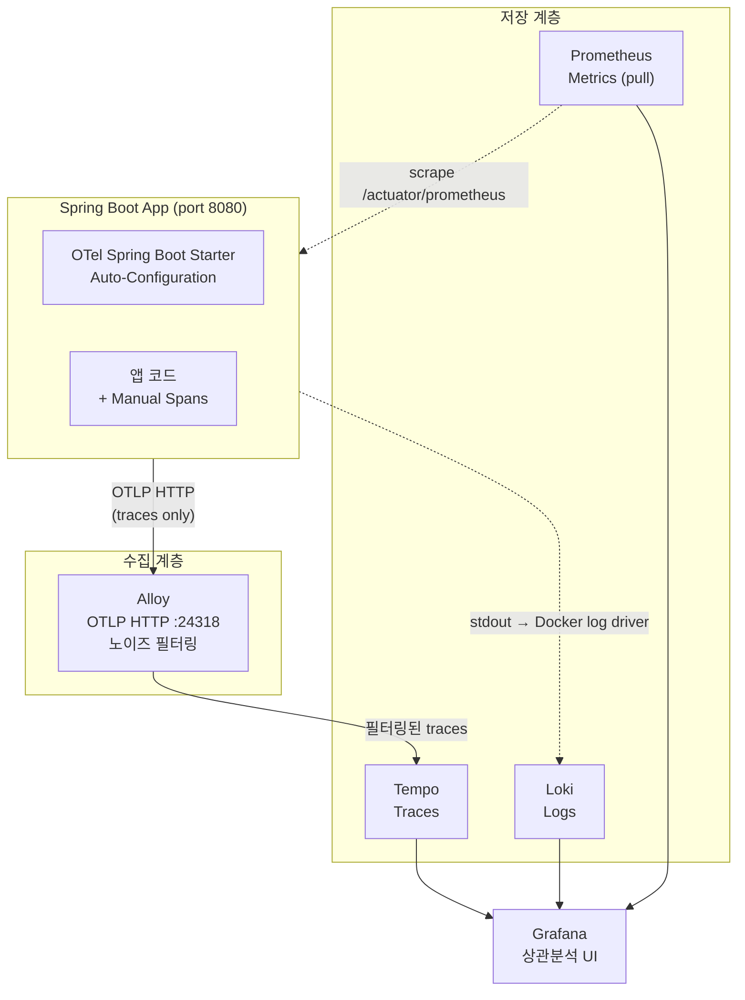
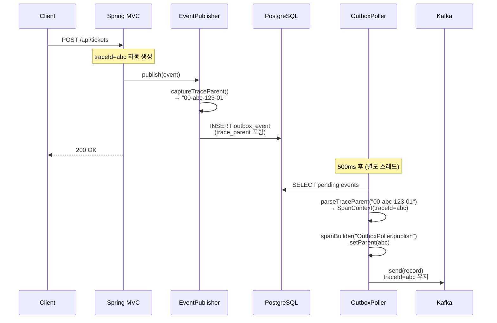

# Redpanda Playground 관측성 아키텍처

> 작성일: 2026-03-13
> 대상: redpanda-playground 프로젝트 (Spring Boot 3.4 + OTel Spring Boot Starter)

---

## 1. 전체 그림

관측성(Observability)은 시스템 내부 상태를 외부 출력으로 추론할 수 있는 능력을 가리킨다. 단순히 "서버가 살아있는가"를 넘어, "왜 이 요청이 느린가", "어느 구간에서 에러가 발생했는가", "지금 JVM 힙이 얼마나 차 있는가"를 답할 수 있어야 한다. 이를 위해 현대적인 관측성 시스템은 세 가지 신호(Signal)를 다룬다. 메트릭(Metrics), 트레이스(Traces), 로그(Logs)가 그것이다.

세 신호는 각각 다른 질문에 답한다. 메트릭은 "무엇이 문제인가"를 알려준다. 요청 수가 갑자기 증가했는지, 에러율이 임계값을 넘었는지를 숫자로 보여준다. 트레이스는 "왜 이 요청이 느린가"를 설명한다. HTTP 진입에서 DB 쿼리, Kafka 발행까지 각 구간의 소요 시간을 span으로 기록해 병목을 시각화한다. 로그는 "정확히 무슨 일이 일어났는가"를 상세히 담는다. 예외 스택트레이스나 비즈니스 이벤트의 맥락은 로그에서만 얻을 수 있다. 세 신호 중 하나라도 빠지면 장애 대응 시 맹점이 생기는 이유가 여기에 있다.

redpanda-playground 프로젝트의 설계 원칙은 "애플리케이션 코드 최소 변경, 인프라가 수집"이다. 비즈니스 로직에 관측성 코드가 침투하는 것을 최소화하고, 자동 계측과 사이드카 수집기가 대부분의 작업을 담당한다. 이 원칙이 각 구성요소 선택에 어떤 영향을 미쳤는지는 이후 섹션에서 구체적으로 살펴본다.



다이어그램에서 실선과 점선을 구분한 것은 의도적이다. 실선은 애플리케이션이 능동적으로 데이터를 밀어내는(push) 흐름이고, 점선은 외부 시스템이 데이터를 가져가거나(pull) 런타임 환경이 자동으로 처리하는 흐름이다. 메트릭은 Prometheus가 `/actuator/prometheus`를 15초마다 스크랩하고, 로그는 Docker log driver가 stdout을 받아 Alloy에 전달한다. 트레이스만 OTel Starter가 직접 Alloy로 밀어낸다. 이 구조 덕분에 애플리케이션 코드가 Loki나 Prometheus의 존재를 알 필요가 없다.

---

## 2. 메트릭: Micrometer → Prometheus → Grafana

메트릭 수집의 출발점은 Spring Boot Actuator다. Actuator는 애플리케이션의 내부 상태를 HTTP 엔드포인트로 노출하는 Spring Boot의 내장 기능이다. 여기에 `micrometer-registry-prometheus` 의존성을 추가하면 `/actuator/prometheus` 엔드포인트가 활성화되어 Prometheus 텍스트 형식으로 모든 메트릭을 제공한다. 별도 코드 작성 없이도 Spring Boot가 자동으로 수십 가지 메트릭을 등록해주는 것이 Micrometer의 핵심 가치다.

자동 등록되는 메트릭 범주는 크게 네 가지다. HTTP 메트릭은 `http_server_requests_seconds`로 요청 수, 지연 시간 분포, HTTP 상태 코드별 통계를 제공한다. JVM 메트릭은 `jvm_memory_used_bytes`, `jvm_gc_pause_seconds`, `jvm_threads_live_threads`처럼 힙 사용량, GC 일시 정지, 스레드 수를 추적한다. HikariCP 메트릭은 커넥션 풀 상태를 `hikaricp_connections_active`, `hikaricp_connections_pending`으로 드러낸다. 커넥션 풀 포화는 DB 병목의 대표적인 신호라 실무에서 특히 유용하다. Kafka 메트릭은 `kafka_producer_record_send_total`, `kafka_consumer_fetch_manager_records_consumed_total`처럼 프로듀서와 컨슈머의 처리량을 보여준다.

`application.yml`의 관련 설정은 아래와 같다.

```yaml
management:
  endpoints:
    web:
      exposure:
        include: health,info,prometheus,metrics
  metrics:
    export:
      prometheus:
        enabled: true
```

`exposure.include`에 `prometheus`를 명시하는 이유는 보안이다. 기본적으로 Actuator는 `health`와 `info`만 HTTP로 노출하므로, Prometheus 엔드포인트를 명시적으로 허용해야 한다. 프로덕션 환경에서는 이 엔드포인트에 별도의 인증이나 네트워크 접근 제한을 걸어야 하지만, 로컬 개발 환경인 이 프로젝트에서는 편의를 위해 개방한다.

Prometheus는 pull 모델로 작동한다. Prometheus가 주기적으로 대상 엔드포인트를 스크랩해 데이터를 가져오는 방식이다. push 모델(애플리케이션이 직접 메트릭 서버에 전송)에 비해 메트릭 수집 실패가 수집기 문제인지 애플리케이션 문제인지를 명확히 분리할 수 있다는 장점이 있다. 애플리케이션이 스크랩에 응답하지 않으면 Prometheus가 "대상 다운(target down)" 상태로 표시하므로, 메트릭 누락의 원인을 즉시 파악할 수 있다.

실제 PromQL 쿼리 예시를 몇 가지 살펴보면 메트릭의 활용 방식이 구체적으로 드러난다.

- `rate(http_server_requests_seconds_count{uri="/api/tickets"}[1m])` — `/api/tickets` 엔드포인트의 초당 요청 수 변화율
- `histogram_quantile(0.99, rate(http_server_requests_seconds_bucket[5m]))` — 99번째 백분위 응답 지연 시간
- `jvm_memory_used_bytes{area="heap"} / jvm_memory_max_bytes{area="heap"}` — 힙 사용률
- `kafka_producer_record_send_total` — Kafka 누적 발행 건수
- `hikaricp_connections_active` — 현재 사용 중인 DB 커넥션 수

---

## 3. 트레이싱: OTel Spring Boot Starter → Alloy → Tempo → Grafana

### 3-1. Spring Boot Starter 자동 계측

트레이싱 구현의 핵심은 `opentelemetry-spring-boot-starter`다. Gradle 의존성으로 추가하며 BOM 버전 2.12.0을 사용한다. 이 Starter가 활성화되면 Spring의 Auto-Configuration 메커니즘이 `TracerProvider`, `OTLP Exporter`를 Spring Bean으로 등록한다. 개발자가 별도의 초기화 코드를 작성하지 않아도 되는 이유다.

```yaml
otel:
  service:
    name: redpanda-playground
  exporter:
    otlp:
      endpoint: http://localhost:24318
      protocol: http/protobuf
  metrics:
    exporter: none
  logs:
    exporter: none
```

`metrics.exporter: none`과 `logs.exporter: none` 설정이 중요하다. OTel SDK는 기본적으로 메트릭과 로그도 OTLP로 내보내려 시도한다. 그런데 이 프로젝트는 메트릭을 Micrometer→Prometheus 경로로, 로그를 Docker stdout→Alloy→Loki 경로로 이미 처리하고 있다. OTel로도 같은 데이터를 내보내면 중복 수집이 발생한다. 따라서 OTel의 메트릭·로그 익스포터를 비활성화하고 트레이스만 Alloy로 전송하도록 설정한다. 각 신호가 가장 적합한 경로를 통해 수집되도록 역할을 분리한 결과다.

Starter가 자동 계측하는 영역은 Spring 생태계 전반이다. Spring MVC의 모든 HTTP 요청, JDBC를 통한 모든 DB 쿼리, Kafka Producer와 Consumer의 메시지 송수신이 자동으로 span을 생성한다. 코드 한 줄 없이 HTTP 요청부터 DB 쿼리까지의 전체 흐름이 Tempo에 기록된다.

`@Scheduled` 메서드는 Starter가 자동 계측하지 않는다. 이는 Java Agent와의 중요한 차이점이다. Java Agent는 기본적으로 모든 스케줄된 작업의 span을 생성하므로, Outbox 폴러처럼 500ms마다 실행되는 작업이 Tempo에 엄청난 양의 노이즈 span을 쌓는다. Starter를 선택한 이유 중 하나가 이 불필요한 자동 계측을 피하기 위해서다. 폴러의 span은 Outbox 이벤트를 Kafka에 발행하는 의미 있는 시점에만 수동으로 생성한다.

### 3-2. 수동 계측: Outbox E2E 트레이스 연결

Transactional Outbox 패턴은 트레이스 연결에 있어 흥미로운 도전을 제시한다. HTTP 요청이 들어오면 트레이스 컨텍스트(traceId + spanId)가 생성된다. 이 컨텍스트는 같은 스레드에서 실행되는 Service, Repository 호출까지 자동으로 전파된다. 그런데 Outbox 방식에서는 HTTP 요청 처리가 DB INSERT(outbox_event 테이블)로 끝난다. 실제 Kafka 발행은 별도 스레드에서 동작하는 OutboxPoller가 나중에 처리한다. 스레드가 바뀌면 스레드 로컬(ThreadLocal)에 저장된 트레이스 컨텍스트가 소실된다. 결과적으로 Tempo에서 HTTP 요청 트레이스와 Kafka 발행 트레이스가 서로 다른 traceId를 가진 별개의 흐름으로 보이게 된다.

이 단절을 해결하는 방법은 트레이스 컨텍스트를 DB에 직렬화해 저장하는 것이다. HTTP 요청 처리 시점에 `EventPublisher.captureTraceParent()`가 현재 span의 컨텍스트를 W3C Trace Context 규격의 `traceparent` 헤더 형식("00-{traceId}-{spanId}-01")으로 변환해 outbox_event 테이블의 `trace_parent` 컬럼에 함께 저장한다. OutboxPoller가 이 레코드를 읽을 때 `publishWithTraceContext()`가 저장된 traceparent 문자열을 파싱해 SpanContext를 복원하고, 이를 부모 컨텍스트로 설정해 새 span을 생성한다. 다른 스레드에서 실행되지만 같은 traceId 아래에 자식 span으로 연결된다.



이 설계의 핵심은 "DB가 트레이스 컨텍스트의 브릿지 역할을 한다"는 점이다. 비동기 처리에서 트레이스를 연결하는 일반적인 방법(메시지 헤더나 메타데이터에 traceparent를 포함)을 Outbox 패턴에 맞게 적용한 것이다. 이를 통해 Grafana Tempo에서 HTTP 요청 → DB INSERT → Outbox 폴링 → Kafka 발행의 전체 흐름을 단일 trace로 조회할 수 있다.

---

## 4. Agent vs Starter 비교

OpenTelemetry를 Spring Boot에 통합하는 방법은 크게 두 가지다. Java Agent 방식과 Spring Boot Starter 방식이다. 두 방식은 계측 원리부터 다르기 때문에 특성도 상당히 다르다.

| 기준 | Java Agent | Spring Boot Starter |
|------|-----------|-------------------|
| 계측 원리 | JVM 바이트코드 조작 | Spring Bean + AOP |
| 설정 방식 | 환경변수 (OTEL_*) | application.yml |
| 의존성 | JAR 파일 (-javaagent) | Gradle/Maven 의존성 |
| 계측 범위 | 150+ 라이브러리 | Spring 생태계 중심 |
| @Scheduled 계측 | 기본 활성화 (끄기 가능) | 미포함 |
| JVM 시작 시간 | 1~3초 증가 | 영향 없음 |
| Spring 없는 환경 | 가능 | 불가능 |
| 빌드 의존성 | 없음 (외부 JAR) | 있음 (빌드에 포함) |

Java Agent는 JVM이 클래스를 로딩할 때 바이트코드를 동적으로 수정해 계측 코드를 삽입한다. 애플리케이션 코드를 전혀 건드리지 않고도 150개 이상의 라이브러리에 대한 계측을 제공한다는 점이 강력하다. 반면 JAR 파일을 별도로 관리해야 하고, JVM 시작 시간이 늘어나며, 바이트코드 조작으로 인해 예기치 않은 동작이 발생할 가능성이 있다.

redpanda-playground가 Starter를 선택한 이유는 세 가지다. 첫째, JAR 파일을 별도로 관리하거나 JVM 실행 인자에 `-javaagent`를 추가하는 번거로움이 없다. Gradle 의존성 하나 추가로 통합이 완료된다. 둘째, 설정이 `application.yml`에 통합된다. Agent 방식에서는 환경변수(`OTEL_SERVICE_NAME`, `OTEL_EXPORTER_OTLP_ENDPOINT` 등)와 설정 파일이 나뉘어 있어 관리 포인트가 분산되지만, Starter는 나머지 Spring 설정과 같은 파일에서 관리된다. 셋째, 이 프로젝트의 기술 스택은 순수하게 Spring 생태계다. Spring MVC, JDBC, Kafka 계측이면 충분하고, Agent가 제공하는 150개 라이브러리 계측의 추가 범위가 필요하지 않다.

---

## 5. TraceID 생명주기

단일 HTTP 요청이 시스템을 통과하는 동안 traceId가 어떻게 생성되고, 전파되고, 저장되는지를 단계별로 추적한다.

**1단계 - 생성**: 클라이언트에서 HTTP 요청이 진입하는 순간 Spring MVC 계측이 동작한다. 요청 헤더에 `traceparent`가 없으면 새로운 traceId(128비트 무작위 hex)와 spanId(64비트 무작위 hex)를 생성해 루트 span을 만든다. 요청 헤더에 `traceparent`가 이미 있으면(예: API 게이트웨이나 다른 서비스가 붙여준 경우) 해당 traceId를 이어받아 기존 분산 트레이스의 일부가 된다.

**2단계 - 동기 전파**: HTTP 요청 처리 스레드 내에서는 OTel의 `Context`가 ThreadLocal에 저장되어 자동으로 전파된다. HTTP Handler → Service → MyBatis → JDBC 드라이버까지 각 계측 포인트가 현재 컨텍스트에서 자식 span을 생성한다. 같은 traceId 아래 계층적인 span 트리가 형성된다. SQL 쿼리 span은 HTTP span의 자식이고, DB 커넥션 획득 span은 SQL span의 자식이 되는 식이다.

**3단계 - 비동기 끊김**: `EventPublisher.publish()` 호출 시점에 현재 traceId가 outbox_event 테이블에 저장된다. HTTP 응답은 이미 클라이언트에게 반환된다. 이후 OutboxPoller는 Spring의 `@Scheduled`로 별도 스레드 풀에서 실행되므로 HTTP 요청 처리 스레드의 OTel 컨텍스트가 존재하지 않는다. 이 지점이 자동 계측만으로는 trace가 끊기는 구간이다.

**4단계 - 수동 브릿지**: OutboxPoller가 outbox_event를 읽으면 `trace_parent` 컬럼의 값("00-{traceId}-{spanId}-01")을 파싱한다. OTel API의 `W3CTraceContextPropagator`가 이 문자열에서 SpanContext(traceId + spanId)를 복원하고, `spanBuilder("OutboxPoller.publish").setParent(spanContext)`로 새 span을 생성한다. 다른 스레드에서 실행되지만 원래 HTTP 요청과 동일한 traceId를 가진 자식 span이 된다.

**5단계 - Kafka 전파 재개**: Kafka Producer가 메시지를 발행할 때 OTel의 Kafka 계측이 현재 span의 컨텍스트를 메시지 헤더에 `traceparent` 형태로 자동 삽입한다. Kafka Consumer가 이 메시지를 읽으면 헤더의 `traceparent`를 파싱해 trace를 이어 연결한다. 결과적으로 HTTP 요청 → DB INSERT → Outbox 폴링 → Kafka 발행 → Kafka 소비까지의 전체 흐름이 Tempo에서 하나의 traceId로 조회 가능한 완전한 트레이스로 표현된다.

---

## 6. 노이즈 필터링

분산 트레이싱이 실용적이려면 의미 있는 span만 수집되어야 한다. 시스템이 매초 수백 개의 내부 span을 생성한다면 실제로 중요한 트레이스가 묻혀버린다. redpanda-playground는 두 단계의 필터링 전략을 사용한다.

**1단계 - Starter 선택에 의한 소거**: Starter는 `@Scheduled` 메서드를 기본적으로 계측하지 않는다. Outbox 폴러는 500ms마다 실행되므로 하루에 약 172,800번 span이 생성될 수 있는데, 이 중 대부분은 "폴링했지만 처리할 이벤트 없음" 상황이다. Java Agent를 사용했다면 `OTEL_INSTRUMENTATION_SPRING_SCHEDULING_ENABLED=false`처럼 명시적으로 끄는 설정이 필요하지만, Starter는 별도 설정 없이 이 노이즈를 원천 차단한다.

**2단계 - Alloy 프로세서 필터링**: OTel 파이프라인에서 `otelcol.processor.filter` 컴포넌트가 특정 패턴의 span을 Tempo 전송 전에 드롭한다. 필터링 대상은 세 종류다. 첫째는 Outbox 폴러가 발행할 이벤트 없이 수행하는 주기적 SELECT 쿼리 span이다. 둘째는 HikariCP의 커넥션 유효성 검사 쿼리(SELECT 1)다. 셋째는 Prometheus가 `/actuator/prometheus`를 스크랩할 때 생성되는 HTTP span이다.

이 필터링이 trace 무결성을 해치지 않는 이유는 드롭되는 span이 모두 리프 span(자식 span이 없는 단말 노드)이기 때문이다. 부모 span은 유지되고 해당 리프 span만 제거되므로 trace의 전체 구조와 traceId 계층이 그대로 보존된다. 만약 어느 span이 자식을 가진 상태에서 드롭된다면 자식들이 고아 span이 되어 trace 구조가 깨지게 된다. 따라서 필터 대상을 선정할 때 해당 span이 자식을 가질 가능성이 없는지를 확인하는 과정이 필요하다.

---

## 7. 로그: Docker stdout → Alloy → Loki

Spring Boot 애플리케이션의 로그는 stdout으로 출력된다. Docker 컨테이너로 실행될 때 이 stdout은 Docker의 로그 드라이버가 수집한다. Grafana Alloy는 Docker 소켓(`/var/run/docker.sock`)에 접근해 `playground-*` 패턴에 매칭되는 컨테이너의 로그를 실시간으로 수집한다.

Alloy의 로그 처리에는 두 가지 중요한 변환이 있다. 첫째는 멀티라인 처리다. Java의 예외 스택트레이스는 여러 줄에 걸쳐 출력되는데, Docker는 각 줄을 별도 로그 이벤트로 처리한다. Alloy의 멀티라인 조인 설정이 스택트레이스를 하나의 로그 이벤트로 합쳐 Loki에 저장한다. Grafana에서 예외를 검색할 때 첫 번째 줄만 보이는 문제를 방지한다. 둘째는 레이블 부착이다. 컨테이너 이름, 서비스 이름, 환경 정보가 Loki 레이블로 추가되어 `{service="redpanda-playground"}` 형태의 LogQL 쿼리가 가능해진다.

현재 설계의 제약 사항이 있다. 호스트에서 직접 실행하는 Spring Boot 프로세스의 로그는 Loki에 수집되지 않는다. Alloy가 Docker 소켓을 통해 컨테이너 로그만 접근하기 때문이다. 개발 중 IDE에서 직접 실행하는 경우 Grafana에서 해당 로그를 조회할 수 없다. 이 제약을 해소하는 방법은 두 가지다. 애플리케이션을 Docker 컨테이너로 실행하거나, Logback에 Loki appender(`com.github.loki4j:loki-logback-appender`)를 추가해 애플리케이션이 직접 Loki로 로그를 전송하도록 한다. 로컬 개발 편의성과 관측성 커버리지 사이의 트레이드오프다.

---

## 8. 신호 간 연결 (Correlation)

세 신호가 각각 수집되더라도 Grafana에서 신호 간 이동이 자유롭지 않다면 관측성의 진가를 발휘하기 어렵다. 장애 상황에서 이상 메트릭을 발견한 순간, 해당 시점의 트레이스를 클릭 한 번으로 조회하고, 트레이스에서 오류 로그로 바로 이동할 수 있어야 한다. 이 연결은 Grafana 데이터소스 프로비저닝 설정으로 구성한다.

**Loki → Tempo 연결**: Loki 데이터소스에 `derivedFields` 설정을 추가한다. 로그 라인에서 `traceId=(\w+)` 패턴을 정규식으로 추출해 Tempo 조회 링크를 자동 생성한다. 로그 뷰어에서 traceId가 하이퍼링크로 표시되고, 클릭하면 해당 trace가 Tempo에서 열린다.

**Tempo → Loki 연결**: Tempo 데이터소스의 `tracesToLogs` 설정으로 trace 상세 페이지에서 "관련 로그 보기" 버튼이 활성화된다. `filterByTraceID: true` 옵션이 같은 traceId를 가진 로그 라인만 Loki에서 쿼리한다. traceId가 로그와 트레이스를 연결하는 공통 키 역할을 한다는 점에서, 앞서 설명한 Outbox 트레이스 연결이 여기서도 의미를 가진다. 단절 없는 traceId가 있어야 이 상관분석이 유효하기 때문이다.

**Tempo → Prometheus 연결**: Tempo의 `serviceMap` 기능이 trace 데이터에서 서비스 간 의존성 그래프를 자동 생성한다. 각 서비스의 요청 수와 에러율을 Prometheus에서 조회해 그래프 노드에 오버레이한다. 아직 단일 서비스 구성이라 serviceMap의 효과가 제한적이지만, 이후 여러 서비스로 확장될 때 의존성 토폴로지를 즉시 시각화할 수 있는 기반이 마련된 상태다.

이 세 연결이 완성되면 관측성 플로우는 다음처럼 작동한다. Grafana 대시보드에서 에러율 급증을 발견한다 → 해당 시점의 trace를 Tempo에서 조회한다 → 오류가 발생한 span을 특정한다 → 해당 span의 로그를 Loki에서 확인한다 → 예외 스택트레이스와 비즈니스 컨텍스트를 파악한다. 여러 도구를 따로 열고 시간대를 맞춰가며 수작업으로 연결하던 과거 방식과 달리, 단일 UI에서 클릭만으로 이동이 가능하다.

---

## 9. 한계와 개선 방향

현재 구현에는 인식하고 있는 한계가 몇 가지 있다.

**호스트 프로세스 로그 미수집**: 앞서 언급했듯, IDE에서 직접 실행하는 Spring Boot 프로세스의 로그는 Loki에 들어가지 않는다. 단기 해결책은 `docker-compose up app`으로 애플리케이션을 컨테이너로 실행하는 것이고, 근본적인 해결책은 Logback Loki appender를 추가해 로그 수집 경로를 이원화하는 것이다.

**커스텀 비즈니스 메트릭 부재**: 현재 메트릭은 모두 프레임워크가 자동 생성하는 기술 메트릭이다. "시간당 처리된 티켓 수", "Outbox 이벤트 평균 지연 시간" 같은 비즈니스 의미 있는 메트릭이 없다. Micrometer의 `@Timed`, `Counter`, `Gauge`를 코드에 추가하면 도메인 레벨의 관측성을 확보할 수 있다.

**Grafana 대시보드 미프로비저닝**: Grafana가 시작될 때 기본 대시보드가 없어 매번 쿼리를 직접 입력해야 한다. `grafana/provisioning/dashboards/` 디렉토리에 대시보드 JSON 파일을 추가하면 컨테이너 시작 시 자동으로 로드된다. JVM 메트릭 대시보드(Grafana ID 4701), Spring Boot Statistics 대시보드 같은 커뮤니티 대시보드를 즉시 활용할 수 있다.

**Starter의 계측 범위 모니터링**: Starter가 Agent보다 계측 범위가 좁기 때문에, 새로운 라이브러리를 추가할 때 자동 계측 여부를 확인하는 습관이 필요하다. 예를 들어 Redis나 gRPC를 추가한다면 OTel Spring Boot Starter가 해당 라이브러리를 계측하는지 공식 문서에서 확인해야 한다. 계측되지 않는 경우 직접 span을 생성하거나, 해당 라이브러리의 OTel 계측 모듈을 별도로 추가하는 작업이 필요할 수 있다.

이러한 한계들은 프로젝트를 더 깊이 사용하면서 자연스럽게 개선 방향이 드러나는 종류다. 현재의 구현은 3개 신호 수집, 신호 간 상관분석, 노이즈 필터링, 비동기 트레이스 연결이라는 핵심 과제를 해결하는 데 집중했고, 그 범위 안에서는 의도한 대로 동작하는 구조를 갖추고 있다.
