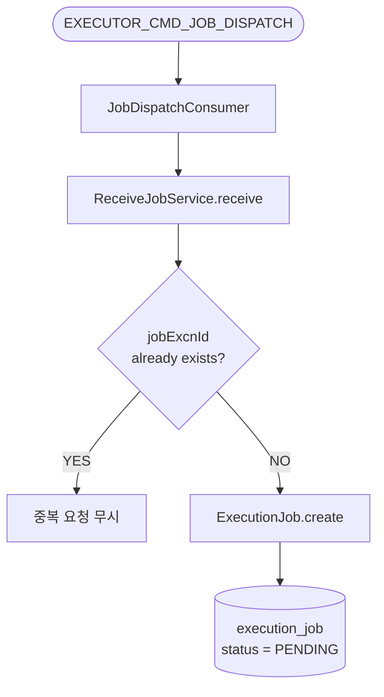
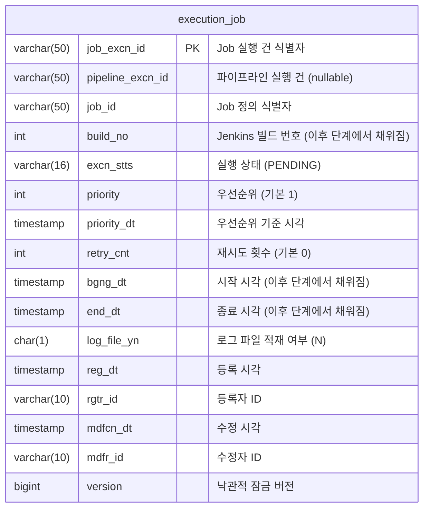

# Received Job

---

> 목적: Operator가 발행한 `EXECUTOR_CMD_JOB_DISPATCH`를 받아 executor 내부 테이블 `execution_job`에 실행 대기 건을 생성한다.



## 진입점

- Kafka Consumer: `JobDispatchConsumer`
- Use case: `ReceiveJobUseCase`
- Application service: `ReceiveJobService`


## 입력

> 메시지는 Avro `ExecutorJobDispatchCommand`로 들어온다. consumer에서 `priorityDt`를 문자열 timestamp에서 `LocalDateTime`으로 변환한다.

```java
// ExecutorJobDispatchCommand.avsc
{
  "name": "ExecutorJobDispatchCommand",
  "namespace": "com.study.playground.avro.executor",
  "fields": [
    {"name": "jobExcnId",       "type": "string"},
    {"name": "pipelineExcnId",  "type": ["null", "string"], "default": null},
    {"name": "jobId",           "type": "string"},
    {"name": "priorityDt",      "type": "string", "doc": "ISO 8601"},
    {"name": "rgtrId",          "type": ["null", "string"], "default": null},
    {"name": "timestamp",       "type": "string", "doc": "ISO 8601"}
  ]
}
```


## 처리 흐름

### 1. Consumer -> useCase 호출

```java
// JobDispatchConsumer.java
@RetryableTopic(
        attempts = "4"
        , backoff = @Backoff(delay = 1000, multiplier = 2, maxDelay = 10000)
        , topicSuffixingStrategy = TopicSuffixingStrategy.SUFFIX_WITH_INDEX_VALUE
        , kafkaTemplate = "avroRetryKafkaTemplate"
)
@KafkaListener(
        topics = Topics.EXECUTOR_CMD_JOB_DISPATCH
        , groupId = "${spring.kafka.consumer.group-id:executor-group}"
        , concurrency = "2"
        , containerFactory = "avroListenerFactory"
)
public void onJobDispatch(@Payload ExecutorJobDispatchCommand cmd) {
    try {
        receiveJobUseCase.receive(
                cmd.getJobExcnId()
                , cmd.getPipelineExcnId()
                , cmd.getJobId()
                , LocalDateTime.ofInstant(Instant.parse(cmd.getPriorityDt()), ZoneId.systemDefault())
                , cmd.getRgtrId()
        );
    } catch (Exception e) {
        log.error("[JobDispatch] Failed: jobExcnId={}, error={}"
                , cmd.getJobExcnId(), e.getMessage(), e);
        throw new RuntimeException(e);
    }
}

@DltHandler
public void handleDlt(ExecutorJobDispatchCommand cmd) {
    log.error("[JobDispatch-DLT] Exhausted retries: jobExcnId={}", cmd.getJobExcnId());
}
```

- `@RetryableTopic`이 consumer 레벨 예외를 최대 4회 재시도한다. 지수 백오프(1s → 2s → 4s, 최대 10s)를 적용한다.
- `onJobDispatch`에서 예외가 발생하면 `RuntimeException`으로 감싸 Spring Retry에 전파하고, 최종 소진 시 `@DltHandler`가 에러 로그를 남긴다.

### 2. useCase 로직 

```java
// ReceiveJobService.java
@Transactional
public void receive(
        String jobExcnId
        , String pipelineExcnId
        , String jobId
        , LocalDateTime priorityDt
        , String rgtrId
) {
    
    // 1. 멱등성 방어
    if (jobPort.existsById(jobExcnId)) {
        log.debug("[Receive] Duplicate job ignored: jobExcnId={}", jobExcnId);
        return;
    }

    // 2. 도메인 객체 기본값 
    ExecutionJob job = ExecutionJob.create(
            jobExcnId
        	, pipelineExcnId
        	, jobId
            , DEFAULT_PRIORITY
        	, priorityDt
        	, rgtrId
    );

    // 3. 중복 예외 발생한 경우 무시
    try {
        jobPort.save(job);
        log.info("[Receive] Job received: jobExcnId={}, jobId={}, priority={}, priorityDt={}"
                , jobExcnId, jobId, DEFAULT_PRIORITY, priorityDt);
    } catch (DataIntegrityViolationException e) {
        log.debug("[Receive] Duplicate job ignored after concurrent insert: jobExcnId={}", jobExcnId);
    }
}
```

- **멱등성 이중 방어**
  - `existsById`로 1차 중복 체크를 수행한다. at-least-once 소비 환경에서 같은 command가 다시 올 수 있으므로 이미 존재하면 즉시 종료한다. 
  - `save` 시점에는 다른 스레드가 먼저 insert했을 가능성이 있으므로 `DataIntegrityViolationException`을 잡아 2차 방어한다.

- **도메인 객체 기본값** 
  - `ExecutionJob.create()`는 `status = PENDING`, `retryCnt = 0`, `logFileYn = N`으로 고정한다. 
  - 수신 시점에는 Jenkins 슬롯 확인이나 Job 정의 조회를 하지 않고 "실행 대기 레코드 생성"만 보장한다. 이 분리 덕분에 메시지 수신 실패와 디스패치 실패를 따로 다룰 수 있다.

- **실패 처리**
  - consumer 레벨 예외는 `@RetryableTopic`으로 재시도된다. 최종 소진 시 DLT로 빠지고 에러 로그를 남긴다. 
  - DB 저장 중 중복은 실패가 아니라 정상 무시로 취급한다.


## 테이블 스키마




