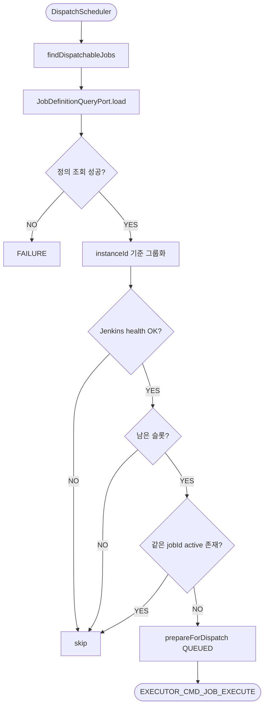
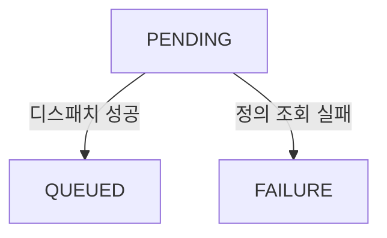
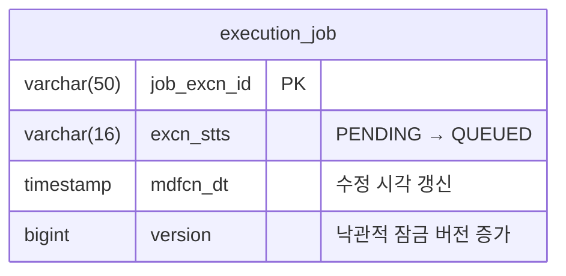

# Dispatch 평가

---

> `PENDING` 상태 Job 중 지금 실행 가능한 대상을 골라 `QUEUED`로 전환하고, 내부 실행 명령 `EXECUTOR_CMD_JOB_EXECUTE`를 발행한다. executor의 핵심 스케줄링 역할을 담당한다.



## 상태 전이



| 조건                        | 전이                         | 트리거 코드                               |
| --------------------------- | ---------------------------- | ----------------------------------------- |
| 디스패치 성공               | PENDING → QUEUED             | `dispatchService.prepareForDispatch(job)` |
| 정의 조회 실패, 재시도 가능 | PENDING 유지 (retryCnt 증가) | `retryPendingJob(job)`                    |
| 정의 조회 실패, 한도 초과   | PENDING → FAILURE            | `job.transitionTo(FAILURE)`               |
| Jenkins unhealthy           | 상태 변경 없음               | 다음 주기까지 PENDING 유지                |
| 슬롯 부족                   | 상태 변경 없음               | 다음 주기까지 PENDING 유지                |
| 같은 jobId active 존재      | 상태 변경 없음               | 다음 주기까지 PENDING 유지                |


## 진입점

- Scheduler: `DispatchScheduler`
- Use case: `EvaluateDispatchUseCase`
- Application service: `DispatchEvaluatorService`

스케줄러는 3초 고정 지연으로 `tryDispatch()`를 호출한다.

```java
// DispatchScheduler.java
@Scheduled(
        fixedDelayString = "${executor.dispatch-interval-ms:3000}"
        , initialDelayString = "${executor.dispatch-initial-delay-ms:0}"
)
public void scheduledDispatch() {
    evaluateDispatchUseCase.tryDispatch();
}
```

- `fixedDelay`는 이전 실행 완료 후 다음 실행까지의 간격이고, `initialDelay`는 앱 시작 후 첫 실행까지의 대기 시간이다. 
- 기본값 0이므로 기동 즉시 밀린 PENDING Job을 처리한다.


## 처리 흐름




### tryDispatch 전체 코드

```java
// DispatchEvaluatorService.java
@Transactional
public void tryDispatch() {
    List<ExecutionJob> pendingJobs = jobPort.findDispatchableJobs(
            properties.getMaxBatchSize());

    if (pendingJobs.isEmpty()) {
        return;
    }

    // Phase 1: 정의 조회 + 인스턴스별 그룹화
    Map<Long, List<ExecutionJob>> jobsByInstance = new LinkedHashMap<>();

    for (ExecutionJob job : pendingJobs) {
        var defInfoOpt = jobDefinitionQueryPort.load(job.getJobId());
        if (defInfoOpt.isEmpty()) {
            // 정의 조회 실패 = 데이터 누락이므로 재시도 없이 즉시 FAILURE
            job.transitionTo(ExecutionJobStatus.FAILURE);
            jobPort.save(job);
            continue;
        }
        jobsByInstance.computeIfAbsent(
            	defInfoOpt.get().jenkinsInstanceId()
            	, ignored -> new ArrayList<>()
        ).add(job);
    }

    // Phase 2: 인스턴스 단위 디스패치
    for (var entry : jobsByInstance.entrySet()) {
        dispatchForInstance(entry.getKey(), entry.getValue());
    }
}
```

- 각 Job마다 `jobDefinitionQueryPort.load(jobId)`로 Jenkins 인스턴스를 찾는다. port는 `Optional`을 반환하므로, `empty`이면 데이터 누락으로 판단해 재시도 없이 즉시 `FAILURE`로 전환한다. 
- 정상 조회된 Job들은 `jenkinsInstanceId` 기준으로 `Map`에 그룹화한다.


### dispatchForInstance 전체 코드

```java
// 젠킨스 인스턴스당 1번씩 실행
private void dispatchForInstance(long instanceId, List<ExecutionJob> jobs) {
    // 1, 핼스 체크
    if (!jenkinsQueryPort.isHealthy(instanceId)) {
        return;
    }

    // 2. 슬롯 계산.
    int activeCount = jobPort.countActiveJobsByJenkinsInstanceId(instanceId, ACTIVE_STATUSES);
    int maxSlots = jenkinsQueryPort.getMaxExecutors(instanceId);
    int remainingSlots = maxSlots - activeCount;

    if (remainingSlots <= 0) {
        return;
    }

    // 3. 가용 슬롯 내에서 Job 디스패치
    for (ExecutionJob job : jobs) {
        if (remainingSlots <= 0) {
            break;
        }

        if (jobPort.existsByJobIdAndStatusIn(job.getJobId(), ACTIVE_STATUSES)) {
            continue;
        }

        dispatchService.prepareForDispatch(job);
        jobPort.save(job);
        publishPort.publishExecuteCommand(job);
        remainingSlots--;
    }
}
```

- 그룹화된 인스턴스별로 `dispatchForInstance`를 호출한다. health check와 슬롯 계산은 **인스턴스당 1회**만 수행하므로, Job이 10개여도 Jenkins API 호출은 인스턴스 수만큼만 발생한다.

**activeCount** — cross-schema 조인으로 특정 Jenkins 인스턴스에 연결된 active Job 수를 센다:

```sql
-- ExecutionJobJpaRepository (nativeQuery)
SELECT COUNT(*) FROM executor.execution_job ej
JOIN operator.job j ON j.job_id = ej.job_id
JOIN operator.purpose p ON p.id = CAST(j.preset_id AS BIGINT)
JOIN operator.purpose_entry pe ON pe.purpose_id = p.id AND pe.category = 'CI_CD_TOOL'
JOIN operator.support_tool st ON st.id = pe.tool_id
WHERE st.id = :jenkinsInstanceId AND ej.excn_stts IN :statuses
```

**getMaxExecutors** — 실제 Jenkins를 조회해 최대 실행 개수를 반환한다:

```java
// JenkinsClient.java
public int getMaxExecutors(long jenkinsInstanceId, int activeCount) {
    if (!isHealthy(jenkinsInstanceId)) {
        return 0;
    }

    var info = toolInfoReader.get(jenkinsInstanceId);
    return remoteApiClient.queryMaxExecutors(
            jenkinsInstanceId,
            URI.create(info.url()),
            buildAuthHeader(info),
            properties.getDynamicK8sDispatchCapacity(),
            activeCount
    );
}

// JenkinsRemoteApiClient.java
public int queryMaxExecutors(long jenkinsInstanceId,
                             URI baseUri,
                             String auth,
                             int dynamicK8sDispatchCapacity,
                             int activeCount) {
    int totalExecutors = getComputerSnapshot(baseUri, auth).totalExecutors();

    if ((totalExecutors == 0 || totalExecutors == activeCount)
            && isK8sDynamic(jenkinsInstanceId, baseUri, auth)) {
        return dynamicK8sDispatchCapacity;
    }
    return totalExecutors;
}

// Jenkins 가용 슬롯 조회
private JenkinsComputerSnapshot getComputerSnapshot(URI baseUri, String auth) {
    try {
        var response = feignClient.getComputerStatus(baseUri, auth);
        var node = objectMapper.readTree(response);
        return new JenkinsComputerSnapshot(
                node.path("busyExecutors").asInt(0),
                node.path("totalExecutors").asInt(0)
        );
    } catch (Exception e) {
        throw new RuntimeException("Failed to parse computer response", e);
    }
}

// K8s 여부 확인 조회
private boolean isK8sDynamic(long jenkinsInstanceId, URI baseUri, String auth) {
    var cached = k8sModeCache.get(jenkinsInstanceId);
    if (cached != null && Instant.now().isBefore(cached.cachedAt().plus(K8S_CACHE_TTL))) {
        return cached.isK8s();
    }

    boolean isK8s;
    try {
        var response = feignClient.getComputerClasses(baseUri, auth);
        var node = objectMapper.readTree(response);

        isK8s = node.path("totalExecutors").asInt(0) == 0;

        for (var computer : node.path("computer")) {
            if (computer.path("_class").asText("").toLowerCase().contains("kubernetes")) {
                isK8s = true;
                break;
            }

            for (var label : computer.path("assignedLabels")) {
                if (label.path("name").asText("").toLowerCase().contains("k8s")) {
                    isK8s = true;
                    break;
                }
            }

            if (isK8s) {
                break;
            }
        }
    } catch (Exception e) {
        log.warn("[JenkinsRemoteApiClient] K8S detection failed: instanceId={}", jenkinsInstanceId);
        isK8s = false;
    }

    k8sModeCache.put(jenkinsInstanceId, new CachedK8sMode(isK8s, Instant.now()));
    return isK8s;
}
```

- 기본값은 정적 Jenkins의 `GET /computer/api/json`에서 읽은 `totalExecutors`다. 
- 다만 `totalExecutors = 0`이거나 `totalExecutors = activeCount`일 때만 agent label을 확인하고, 이때 K8S로 판단되면 Jenkins 값 대신 애플리케이션 설정값 `executor.dynamic-k8s-dispatch-capacity`를 반환한다. 
- `operator.support_tool`은 인증/health 정보만 읽고, Jenkins 런타임 API 조회는 별도 파일에서 처리한다.


