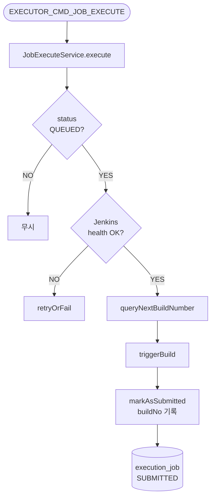

# 젠킨스 실행

---

> `QUEUED` 상태 Job을 Jenkins에 실제로 트리거하고, 빌드 번호를 확보한 뒤 `SUBMITTED` 상태로 전환한다. "실행 후보 선정"과 "실제 Jenkins 호출"을 분리하는 역할을 한다.



## 진입점

- Kafka Consumer: `JobExecuteConsumer`
- Use case: `ExecuteJobUseCase`
- Application service: `JobExecuteService`


## 입력

입력 메시지는 02-evaluate-dispatch에서 발행한 내부 Avro command다.

```java
// ExecutorJobExecuteCommand.avsc (Executor 내부)
{
  "name": "ExecutorJobExecuteCommand",
  "namespace": "com.study.playground.avro.executor",
  "fields": [
    {"name": "jobExcnId",       "type": "string"},
    {"name": "jobId",           "type": "string"},
    {"name": "idempotencyKey",  "type": "string"},
    {"name": "timestamp",       "type": "string", "doc": "ISO 8601"}
  ]
}
```


## 처리 흐름

```java
@Transactional
public void execute(String jobExcnId) {
    ExecutionJob job = jobPort.findById(jobExcnId)
            .orElseThrow(() -> new IllegalStateException("Unknown jobExcnId=" + jobExcnId));

    if (job.getStatus() != ExecutionJobStatus.QUEUED) {
        log.debug("[JobExecute] Not QUEUED: jobExcnId={}, status={}"
                , jobExcnId, job.getStatus());
        return;
    }

    try {
        var defInfo = jobDefinitionQueryPort.load(job.getJobId());
        long jenkinsInstanceId = defInfo.jenkinsInstanceId();
        var jenkinsJobPath = defInfo.jenkinsJobPath();

        if (!jenkinsQueryPort.isHealthy(jenkinsInstanceId)) {
            dispatchService.retryOrFail(job, properties.getJobMaxRetries());
            jobPort.save(job);
            return;
        }

        int nextBuildNo = jenkinsQueryPort.queryNextBuildNumber(jenkinsInstanceId, jenkinsJobPath);
        jenkinsTriggerPort.triggerBuild(jenkinsInstanceId, jenkinsJobPath, job.getJobId());

        // nextBuildNumber를 먼저 읽어 둬야 started/completed webhook과 동일 buildNo로 매칭할 수 있다.
        dispatchService.markAsSubmitted(job, nextBuildNo);
        jobPort.save(job);
    } catch (Exception e) {
        log.error("[JobExecute] Failed: jobExcnId={}, error={}", jobExcnId, e.getMessage());
        boolean retried = dispatchService.retryOrFail(job, properties.getJobMaxRetries());
        jobPort.save(job);
    }
}
```

