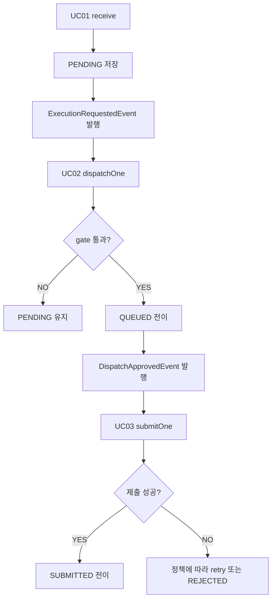

# Executor 이벤트 기반 디스패치 구조 리뷰
---
> `executor`의 dispatch 경로를 주기적 poller 중심에서 이벤트 중심으로 전환한 구조를 리뷰용으로 정리한 문서다. 정상 흐름, 복구 흐름, 설정값 소비 지점, 설계상 검토 포인트를 한 번에 확인하는 데 목적이 있다.

## 문서 목적

이 문서는 최근 변경된 `receive -> dispatch -> submit` 경로를 리뷰 관점에서 설명한다. 구현 세부를 모두 나열하기보다, 왜 이 구조가 선택됐는지와 어떤 설정이 어디서 동작하는지를 빠르게 파악할 수 있게 정리한다.

리뷰어가 먼저 봐야 할 핵심은 다음과 같다:

- 정상 경로는 이벤트 기반으로 즉시 처리된다.
- 예외나 유실 상황은 방어 스케줄러가 복구한다.
- Jenkins capacity는 설정 추정치가 아니라 Jenkins 조회 결과를 기준으로 계산한다.

## 변경 배경

기존 구조는 `tryDispatch()`와 `trySubmit()`를 주기적으로 호출하는 poller 중심 모델에 가까웠다. 이 방식은 단순하지만 요청을 저장한 직후에도 다음 주기까지 기다려야 하므로 지연이 생기고, 상태 전이 책임이 스케줄러에 과하게 몰린다는 단점이 있었다.

이번 변경의 방향은 정상 경로와 복구 경로를 분리하는 것이다. 정상 경로는 이벤트로 즉시 진행하고, JVM 재시작이나 async 핸들러 실패처럼 정상 경로가 놓친 건만 방어 스케줄러가 다시 집어 올리게 했다.

## 전체 흐름

정상 흐름은 다음과 같다:



보조 흐름은 다음과 같다:

```mermaid
graph TD
    A[DispatchDefenseScheduler] --> B[오래 머문 PENDING 조회]
    A --> C[오래 머문 QUEUED 조회]
    B --> D[dispatchOne 재호출]
    C --> E[submitOne 재호출]
    F[JenkinsQueueMonitoringScheduler] --> G[/queue/api/json 조회]
    F --> H[DB active 상태 비교]
    H --> I{drift 임계값 이상?}
    I -->|YES| J[WARN 로그]
    I -->|NO| K[DEBUG 로그]
```

## 핵심 설계 포인트

### 정상 경로와 복구 경로를 분리한 이유

정상 요청은 저장 직후 곧바로 다음 단계로 흘러가는 편이 맞다. 요청이 들어왔는데도 3초, 5초 같은 poll 간격을 기다리게 하면 시스템이 불필요하게 느려지고, burst 상황에서는 큐가 더 빨리 쌓인다.

반면 이벤트만 믿고 가면 예외 상황에서 정체 Job이 생길 수 있다. 그래서 정상 경로는 이벤트에 맡기고, 방어 스케줄러는 "이미 처리됐어야 하는데 아직 남아 있는 건"만 재평가하는 구조로 나눴다.

### 트랜잭션 커밋 후 비동기 처리

이벤트 핸들러는 `@TransactionalEventListener(AFTER_COMMIT)`와 `@Async`를 함께 사용한다. 이 조합의 의미는 저장 트랜잭션이 실제로 커밋된 뒤, 전용 스레드풀에서 후속 단계를 처리한다는 뜻이다.

이렇게 해야 하는 이유는 다음과 같다:

- 커밋 전 데이터를 다음 단계가 읽는 문제를 막는다.
- webhook 또는 요청 처리 스레드를 Jenkins 호출 때문에 점유하지 않는다.
- 이벤트 처리 실패가 요청 수신 자체를 느리게 만들지 않는다.

### 단일 Job 단위 평가

이벤트 기반 구조에서는 한 번의 이벤트가 하나의 `jobExcnId`를 대표한다. 따라서 `dispatchOne(jobExcnId)`와 `submitOne(jobExcnId)`는 모두 단일 Job만 처리한다.

이 구조는 책임 분리가 명확하다. 또한 중복 이벤트나 방어 스케줄러 재호출이 들어와도 현재 상태를 다시 확인하고 아니면 skip할 수 있으므로 멱등 처리에 유리하다.

## UC01 Receive

`receive()`의 책임은 요청을 안전하게 적재하고 다음 단계 이벤트를 발행하는 데 있다. 실제 흐름은 다음과 같다:

- `jobExcnId` 중복이 아니면 `PENDING`으로 저장한다.
- 저장 성공 시 `ExecutionRequestedEvent`를 발행한다.
- 중복이면 조용히 무시한다.

이 단계에서 중요한 점은 "저장 성공 후 이벤트 발행" 순서다. 이 순서가 보장되어야 UC02가 DB에서 Job을 읽을 수 있다.

## UC02 Dispatch Gate

Dispatch는 더 이상 배치형 전체 스캔만을 전제로 하지 않는다. 핵심은 `DispatchDomainComponent.gate()`가 단일 Job에 대해 통과 여부와 사유를 `GateResult`로 반환하는 점이다.

게이트 순서는 다음과 같다:

1. 현재 상태가 `PENDING`인지 확인한다.
2. Jenkins 연결 정보가 유효한지 확인한다.
3. 동일 `jobId`의 ACTIVE 실행이 이미 있는지 확인한다.
4. Jenkins health를 확인한다.
5. Jenkins capacity를 확인한다.
6. 같은 Jenkins에 대한 active, in-flight 카운트를 계산한다.
7. 슬롯이 남으면 `PENDING -> QUEUED`로 전이한다.

게이트 결과 유형은 다음처럼 나뉜다:

| 상태 | 의미 | 후속 동작 |
|------|------|------|
| `PASSED` | 게이트 통과 | `QUEUED` 전이 후 `DispatchApprovedEvent` 발행 |
| `NOT_ELIGIBLE` | 현재 상태가 이미 `PENDING`이 아님 | skip |
| `INVALID_JENKINS` | Jenkins 연결 정보가 불완전함 | `PENDING` 유지 |
| `JENKINS_UNAVAILABLE` | health check 실패 | `PENDING` 유지 |
| `UNKNOWN_TOPOLOGY` | capacity 산정 불가 | `PENDING` 유지 |
| `NO_SLOTS` | capacity 대비 여유 슬롯 없음 | `PENDING` 유지 |
| `DUPLICATE_ACTIVE` | 같은 `jobId`가 이미 처리 중 | skip |

이 구조의 장점은 boolean 대신 실패 사유가 구조화된다는 점이다. 운영 로그와 리뷰에서 "왜 안 나갔는지"를 바로 확인할 수 있다.

## 상태 카운트 분리 이유

이번 변경에서 중요한 포인트는 상태 집합을 세 가지로 분리한 것이다.

| 집합 | 포함 상태 | 용도 |
|------|-----------|------|
| `ACTIVE_STATUSES` | `QUEUED`, `SUBMITTED`, `RUNNING` | 동일 `jobId` 중복 실행 방지 |
| `JENKINS_ACTIVE_STATUSES` | `SUBMITTED`, `RUNNING` | 실제 Jenkins 슬롯 점유 계산 |
| `IN_FLIGHT_STATUSES` | `QUEUED` | 게이트 통과 후 submit 전 대기 수 계산 |

이 분리가 필요한 이유는 burst 상황 때문이다. `QUEUED`는 아직 Jenkins에 제출되지 않았지만, 곧 제출될 가능성이 높은 in-flight 상태다. 이를 무시하면 짧은 시간에 너무 많은 Job을 `QUEUED`로 밀어 넣어 capacity를 초과하는 과잉 dispatch가 생길 수 있다.

현재 계산식은 다음 의미를 가진다:

```text
remaining = capacity - active - inFlight
```

즉 Jenkins가 실제로 쓰는 슬롯 수뿐 아니라, 이미 gate는 통과했지만 아직 submit되지 않은 `QUEUED`까지 함께 고려한다.

## Jenkins Capacity 판단 방식

이번 변경에서 제거된 설정이 `dynamic-k8s-dispatch-capacity`다. 이전에는 K8s 환경처럼 executor 수가 고정적으로 드러나지 않을 때 애플리케이션 설정값으로 capacity를 추정했다.

현재는 Jenkins 조회 결과를 기준으로 capacity를 판단한다:

1. `/cloud/api/json`에서 `clouds[].containerCap` 합산 시도
2. 성공하면 `K8S_CLOUD`로 판정
3. 실패하면 `/computer/api/json`의 `totalExecutors` 조회
4. 성공하면 `STATIC_VM`으로 판정
5. 둘 다 실패하면 `UNKNOWN`, capacity `0`

이 방식의 의도는 보수적 제어다. 실제 capacity를 읽지 못하는 상태라면 임의 값으로 보내지 않고 dispatch를 막는다.

## UC03 Submit

`DispatchApprovedEvent`를 받은 뒤 `submitOne(jobExcnId)`가 호출된다. 여기서는 현재 상태가 여전히 `QUEUED`인지 먼저 확인한 뒤 Jenkins 트리거를 수행한다.

정상 흐름은 다음과 같다:

- `QUEUED` 상태 검증
- `SubmitDomainComponent.submit(job)` 호출
- 성공 시 `SUBMITTED` 전이
- 실패 시 정책에 따라 재시도 또는 `REJECTED`

여기서도 상태를 다시 확인하는 이유는 이벤트 중복이나 방어 스케줄러와의 경합을 안전하게 처리하기 위해서다. 이미 다른 경로가 상태를 바꿨다면 현재 호출은 아무 일도 하지 않고 종료하면 된다.

## 방어 스케줄러의 역할

`DispatchDefenseScheduler`는 정상 경로를 대체하지 않는다. 이 스케줄러의 역할은 이벤트 유실 또는 장애로 정체된 Job을 다시 정상 경로에 태우는 것이다.

복구 대상은 다음 두 종류다:

- 일정 시간 이상 갱신되지 않은 `PENDING`
- 일정 시간 이상 갱신되지 않은 `QUEUED`

각각의 복구 방식은 다음과 같다:

- `PENDING`은 `dispatchOne(jobExcnId)`로 재평가한다.
- `QUEUED`는 `submitOne(jobExcnId)`로 재제출한다.

즉 방어 스케줄러는 독자적인 새 로직을 만들지 않고, 정상 경로의 진입점만 다시 호출한다. 이 점이 유지보수 관점에서 중요하다. 복구 로직이 정상 로직과 따로 놀지 않기 때문이다.

## Queue Drift 모니터링의 역할

`JenkinsQueueMonitoringScheduler`는 dispatch 의사결정을 직접 바꾸지 않는다. 이 스케줄러는 관측용이다.

관측 방법은 다음과 같다:

- DB에서 `SUBMITTED`, `RUNNING` 상태 Job을 읽는다.
- Job이 가리키는 Jenkins URL별로 묶는다.
- 각 Jenkins에 대해 `/queue/api/json`을 조회한다.
- `jenkinsQueueItemCount`와 `dbActive` 차이를 계산한다.
- 차이가 임계값 이상이면 `WARN` 로그를 남긴다.

이 값은 제어용 진실값이 아니라 운영 진단 지표다. Jenkins queue 깊이와 DB active 카운트는 완전히 같은 의미의 숫자가 아니므로, 이 모니터는 "상태 동기화가 비정상적으로 어긋나기 시작했는가"를 감지하는 보조 장치로 보는 게 맞다.

## 설정값별 실제 사용 위치

리뷰에서 가장 많이 혼동되는 부분은 설정값의 쓰임새다. 아래 표는 새로 추가된 주요 설정이 실제로 어디서 소비되는지를 정리한 것이다.

| 설정 키 | 사용 위치 | 실제 역할 |
|------|------|------|
| `executor.jenkins.queue-drift-threshold` | `JenkinsQueueMonitoringScheduler` | queue와 DB active 차이의 경고 임계값 |
| `executor.jenkins.queue-monitor-interval-ms` | `JenkinsQueueMonitoringScheduler` | queue drift 점검 주기 |
| `executor.jenkins.queue-monitor-initial-delay-ms` | `JenkinsQueueMonitoringScheduler` | 앱 기동 후 첫 점검 지연 |
| `executor.dispatch.defense-interval-ms` | `DispatchDefenseScheduler` | aged `PENDING`, `QUEUED` 복구 주기 |
| `executor.dispatch.defense-initial-delay-ms` | `DispatchDefenseScheduler` | 앱 기동 후 첫 복구 실행 지연 |
| `executor.dispatch.aged-pending-threshold-ms` | `DispatchDefenseScheduler` | 정체 Job으로 판단할 최소 경과 시간 |
| `executor.event.async-pool-size` | `AsyncConfig` | 이벤트 핸들러 전용 스레드 수 |
| `executor.event.async-queue-capacity` | `AsyncConfig` | 이벤트 핸들러 작업 대기열 크기 |

### `queue-drift-threshold`

이 값은 `|jenkinsQueue - dbActive| >= threshold`일 때 경고 로그를 남기는 데 쓰인다. 작게 잡으면 민감하게 반응하지만 노이즈가 많아지고, 크게 잡으면 실제 drift를 늦게 감지한다.

### `queue-monitor-interval-ms`, `queue-monitor-initial-delay-ms`

두 값은 `JenkinsQueueMonitoringScheduler`의 `@Scheduled` 설정이다. 전자는 반복 주기고, 후자는 애플리케이션 시작 후 첫 실행까지 기다리는 시간이다.

### `defense-interval-ms`, `defense-initial-delay-ms`

두 값은 `DispatchDefenseScheduler`의 `@Scheduled` 설정이다. 이 값이 너무 짧으면 이벤트 경로가 처리할 기회를 충분히 주기 전에 방어 경로가 자주 개입할 수 있다. 반대로 너무 길면 정체 Job 복구가 늦어진다.

### `aged-pending-threshold-ms`

이 값은 이름과 달리 현재 구현에서는 `PENDING`뿐 아니라 `QUEUED`에도 적용된다. 즉 의미상 `dispatch pipeline aged threshold`에 가깝다.

설정 의도는 "정상 경로가 먼저 처리할 시간을 주고, 그 시간이 지난 뒤에도 남아 있으면 방어 경로가 건드린다"는 것이다.

### `async-pool-size`, `async-queue-capacity`

이 두 값은 `executionEventExecutor`를 구성한다. `async-pool-size`는 동시에 실행할 이벤트 핸들러 수이고, `async-queue-capacity`는 스레드가 모두 사용 중일 때 임시로 쌓아 둘 이벤트 수다.

이 값은 처리량 제한과 burst 흡수에 직접 연결된다. Jenkins API 지연이 긴 환경에서는 풀 크기와 큐 용량이 모두 체감 성능에 영향을 준다.

## 리뷰 포인트

리뷰어가 중점적으로 볼 항목은 다음과 같다:

- `ExecutionRequestedEvent`, `DispatchApprovedEvent`가 모두 실제 커밋 이후에만 실행되는지
- `dispatchOne`, `submitOne`이 중복 호출 시에도 안전하게 skip되는지
- `UNKNOWN_TOPOLOGY`일 때 보수적으로 `PENDING` 유지하는 정책이 운영 요구와 맞는지
- `aged-pending-threshold-ms` 명칭이 실제 용도와 어긋나지 않는지
- queue drift 비교 기준이 운영 지표로 충분히 유의미한지

특히 마지막 두 항목은 코드 오류라기보다 운영·가독성 측면의 검토 포인트다. 문서와 설정명이 실제 동작을 충분히 설명하지 못하면 나중에 튜닝 과정에서 혼선이 생길 수 있다.

## 결론

이번 변경의 본질은 단순한 scheduler 교체가 아니다. 시스템의 기본 경로를 이벤트 기반으로 전환하고, 장애 복구와 운영 관측을 별도 축으로 분리한 구조 변경이다.

정리하면 현재 구조는 다음 세 층으로 이해하면 된다:

- 정상 처리: `receive -> event -> dispatch -> event -> submit`
- 복구 처리: aged `PENDING`, `QUEUED`를 방어 스케줄러가 재개
- 운영 관측: Jenkins queue drift를 별도 스케줄러가 감시

이 구조는 응답 지연을 줄이면서도 이벤트 유실에 대한 안전망을 유지하려는 설계다. 리뷰에서는 구현 세부보다도, 이 역할 분리가 실제 운영 모델과 일치하는지를 우선 검토하는 것이 적절하다.
