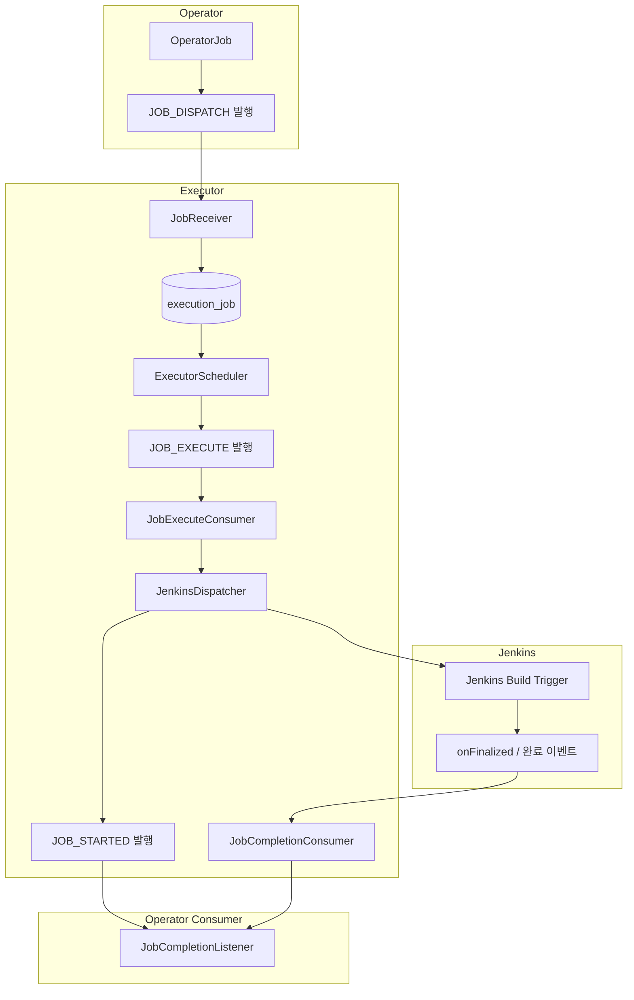

# Redpanda Playground Executor 구조 분석
---
> `executor`는 Kafka 명령을 받아 Jenkins 실행으로 연결하고, DB 상태와 재시도·헬스체크를 함께 관리하는 실행 서비스다.
> 작성일: 2026-04-01
> 대상: `redpanda-playground/executor`

## 1. 이 모듈이 하는 일

`executor`는 단순한 Jenkins API 래퍼가 아니다. Operator가 "이 Job을 실행하라"는 명령을 Kafka로 보내면, `executor`는 이를 내부 테이블에 적재하고, Jenkins 슬롯을 계산한 뒤, 실제 Jenkins 빌드 트리거와 완료 콜백까지 이어서 처리한다.

핵심 역할은 네 가지다:

- `job-dispatch` 명령을 받아 `execution_job`에 적재한다.
- 활성 Jenkins 인스턴스의 슬롯을 계산해 실행 가능한 Job만 `job-execute`로 넘긴다.
- Jenkins API 호출 성공/실패에 따라 `PENDING`, `DISPATCHED`, `RUNNING`, `COMPLETED`, `FAILED` 상태를 관리한다.
- 타임아웃, 헬스체크, 크래시 복구, Kafka 재시도 토픽을 통해 장애 상황을 완화한다.

## 2. 패키지별 책임

`executor` 패키지는 역할 기준으로 나뉜다:

| 패키지 | 대표 클래스 | 책임 |
|--------|-------------|------|
| `receiver` | `JobReceiver` | Operator가 보낸 실행 명령을 수신하고 DB에 적재 |
| `dispatcher` | `ExecutorScheduler`, `JobExecuteConsumer`, `JenkinsDispatcher` | 스케줄링, 슬롯 계산, Jenkins API 트리거 |
| `callback` | `JobCompletionConsumer` | Jenkins 완료 이벤트를 받아 종료 상태 반영 |
| `status`, `timeout`, `health`, `recovery` | `JobStatusManager`, `RunningJobTimeoutChecker`, `JenkinsHealthChecker`, `CrashRecoveryHandler` | 상태 전이, 재시도, 타임아웃, 장애 복구 |
| `domain`, `repository` | `ExecutionJob`, `JenkinsInstance` 등 | JPA 엔티티와 조회 쿼리 |

## 3. 전체 실행 흐름

아래 흐름이 `executor`의 기본 생명주기다:

이 구조에서 중요한 점은 Jenkins를 바로 호출하지 않는다는 것이다. `ExecutorScheduler`가 먼저 DB에서 실행 후보를 선별하고, 그 결과를 다시 Kafka 명령으로 발행한다. 즉 `executor`는 "수신 즉시 실행"보다 "상태를 저장한 뒤 안전하게 실행"에 더 가깝다.

## 4. 핵심 컴포넌트

### 4-1. `JobReceiver`

`JobReceiver`는 `playground.executor.commands.job-dispatch`를 소비한다. 수신한 명령이 중복이면 `idempotency_key`로 무시하고, 처음 보는 명령이면 `ExecutionJob.create()`로 `PENDING` 레코드를 만든다.

이 단계의 의미는 "실행 요청을 durable하게 받았다"는 것이다. 아직 Jenkins는 호출하지 않는다. 먼저 DB에 실행 의도를 남겨야 이후 재시도와 복구가 가능해진다.

### 4-2. `ExecutorScheduler`

`ExecutorScheduler`는 기본 3초 주기로 동작한다. 활성 Jenkins 인스턴스를 순회하면서 가용 슬롯을 계산하고, 각 인스턴스별로 `findDispatchableJobs()`를 호출해 `PENDING` Job 중 지금 내보낼 수 있는 후보를 고른다.

후보가 있으면 `job-execute` 명령을 outbox를 통해 Kafka로 발행하고, 상태를 `DISPATCHED`로 바꾼다. 이때 실제 Jenkins 호출은 아직 일어나지 않는다.

### 4-3. `JobExecuteConsumer`와 `JenkinsDispatcher`

`JobExecuteConsumer`는 `playground.executor.commands.job-execute`를 소비한다. 여기서 비로소 `JenkinsDispatcher.dispatch()`가 호출되고, `buildWithParameters` API를 통해 Jenkins Job이 시작된다.

호출이 성공하면 상태를 `RUNNING`으로 바꾸고 `job-started` 이벤트를 발행한다. 실패하면 `retryOrNotify()`로 비즈니스 재시도를 수행한다.

### 4-4. `JobCompletionConsumer`

Jenkins 측 완료 콜백은 `playground.executor.events.job-completed`로 들어온다. `JobCompletionConsumer`는 Avro와 JSON 두 포맷을 모두 파싱하고, 성공이면 `COMPLETED`, 실패면 `FAILED`로 종료한다.

이 소비자는 실행 종료의 단일 진입점이다. Jenkins에서 끝났다는 외부 사실을 DB 상태에 반영하는 역할을 맡는다.

## 5. DB와 Kafka를 함께 쓰는 이유

`executor`는 DB와 Kafka를 함께 사용한다. 이유는 둘의 역할이 다르기 때문이다.

- DB는 현재 상태의 단일 원천이다.
- Kafka는 서비스 간 비동기 연결 통로다.
- Outbox는 DB 트랜잭션과 Kafka 발행 사이의 손실 가능성을 줄인다.

`execution_job`이 없다면 재시도, 크래시 복구, timeout 재평가가 어렵다. 반대로 Kafka가 없다면 Operator와 Executor, Jenkins 완료 콜백을 느슨하게 연결하기 어렵다. 이 모듈은 두 가지를 섞어 "상태 저장형 실행기"를 만든 셈이다.

## 6. 스케줄러 기반 설계의 의미

이 모듈이 스케줄러를 두는 이유는 Jenkins 슬롯 부족 문제를 흡수하기 위해서다. 모든 Job을 즉시 Jenkins로 던지지 않고, DB에 `PENDING`으로 쌓아 둔 뒤 인스턴스별 여유에 맞춰 조금씩 내보낸다.

이 덕분에 다음 세 가지가 가능하다:

- Jenkins 인스턴스별 `max_concurrent` 제한을 중앙에서 제어한다.
- K8S 동적 Jenkins와 VM Jenkins를 같은 인터페이스로 다룬다.
- 장애 발생 시 `PENDING`으로 되돌려 재시도할 수 있다.

## 7. 현재 코드에서 보이는 특징

현재 구현을 읽으면 `executor`는 "정확한 실행 엔진"보다 "안전한 중간 완충층"에 가깝다. 특히 다음 특징이 눈에 띈다:

- 상태 전이 규칙을 `ExecutionJobStatus`에 명시해 잘못된 전이를 막는다.
- Kafka 소비자마다 `@RetryableTopic`을 걸어 메시지 처리 실패를 재시도한다.
- Jenkins 장애와 개별 Job hang를 분리해 `health`와 `timeout`이 각각 처리한다.
- 크래시 후 `DISPATCHED` Job을 `PENDING`으로 되돌려 재평가한다.

## 8. 함께 읽어야 하는 문서

이 문서를 읽은 뒤에는 아래 순서가 가장 자연스럽다:

- `04-2. Redpanda Playground Executor 도메인 모델과 테이블.md`
- `04-3. Redpanda Playground ExecutorScheduler 로직 분석.md`
- `04-4. Redpanda Playground Executor 재시도와 DLT 흐름.md`
- [시각화 보기](04-5-executor-flow.html)
