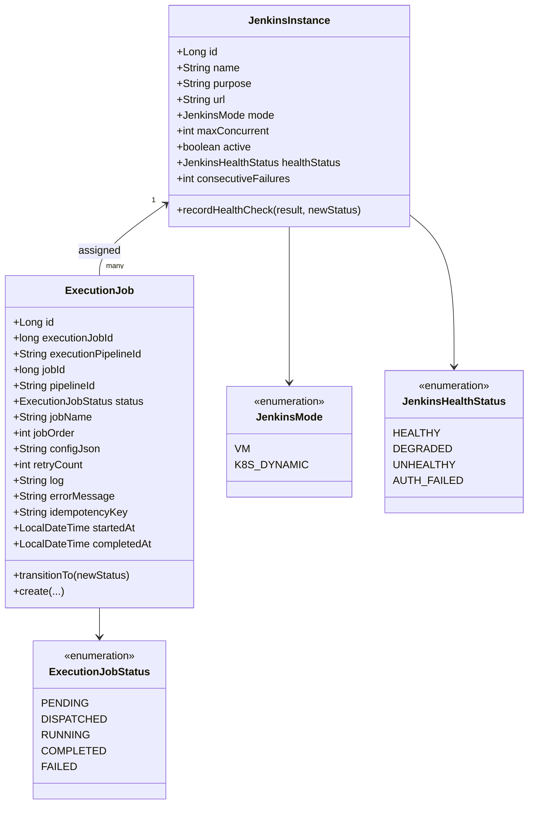
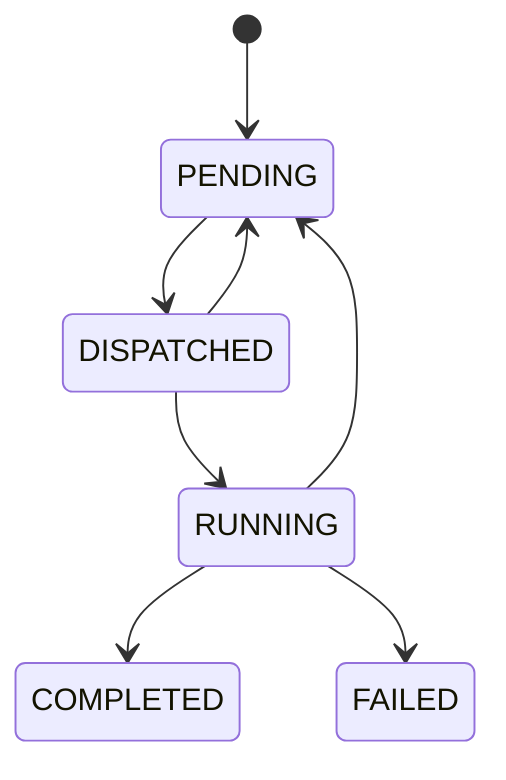

# Redpanda Playground Executor 도메인 모델과 테이블
---
> `executor`의 핵심 모델은 `jenkins_instance`, `execution_job`, `outbox_event` 세 테이블과 이를 감싸는 JPA 엔티티다.
> 작성일: 2026-04-01
> 대상: `executor/src/main/java/.../domain`, `executor/src/main/resources/db/migration`

## 1. 왜 이 모델이 필요한가

`executor`는 외부 시스템인 Jenkins를 다룬다. 외부 시스템 호출은 언제든 실패할 수 있으므로, 메모리 상태만으로는 실행 중복이나 유실을 제어하기 어렵다.

그래서 이 모듈은 "Jenkins 서버 정보", "실행할 Job 상태", "Kafka로 내보낼 이벤트"를 각각 영속화한다. 이 세 축이 있어야 슬롯 계산, 재시도, 콜백 처리, 복구가 가능해진다.

## 2. 테이블 관계

실제 마이그레이션 기준 관계는 아래와 같다:

```mermaid
erDiagram
    JENKINS_INSTANCE ||--o{ EXECUTION_JOB : serves
    EXECUTION_JOB ||--o{ OUTBOX_EVENT : publishes_logically

    JENKINS_INSTANCE {
        bigint id PK
        varchar name UK
        varchar purpose
        varchar url
        varchar username
        varchar api_token
        varchar mode
        int max_concurrent
        boolean active
        varchar health_status
        int consecutive_failures
        timestamp last_health_check
        varchar last_failure_type
        bigint version
        timestamp created_at
    }

    EXECUTION_JOB {
        bigint id PK
        bigint execution_job_id
        varchar execution_pipeline_id
        bigint job_id
        varchar pipeline_id
        bigint jenkins_instance_id FK
        varchar status
        varchar job_name
        int job_order
        text config_json
        int retry_count
        text log
        text error_message
        varchar idempotency_key UK
        timestamp created_at
        timestamp started_at
        timestamp completed_at
        timestamp updated_at
        bigint version
    }

    OUTBOX_EVENT {
        bigint id PK
        varchar aggregate_type
        varchar aggregate_id
        varchar event_type
        bytea payload
        varchar topic
        varchar status
        timestamp created_at
        timestamp sent_at
        int retry_count
        varchar correlation_id
        varchar trace_parent
        timestamp next_retry_at
    }
```

`outbox_event`는 FK로 `execution_job`를 직접 참조하지는 않는다. 하지만 비즈니스적으로는 `ExecutionJob` 상태 변화에 따라 발행되는 이벤트를 담는 저장소 역할을 한다.

## 3. 실제 도메인 모델

JPA 엔티티 관점에서는 아래 구조로 볼 수 있다:

## 4. `JenkinsInstance` 설명

`JenkinsInstance`는 실행 대상 서버 자체를 표현한다. 중요한 필드는 `mode`, `maxConcurrent`, `healthStatus`다.

`mode`가 `VM`이면 Jenkins API에서 `busyExecutors`와 `totalExecutors`를 읽어 실제 가용 슬롯을 계산한다. `K8S_DYNAMIC`이면 Jenkins API 대신 애플리케이션 레벨 카운트만으로 슬롯을 제한한다.

`healthStatus`와 `consecutiveFailures`는 단순 모니터링용이 아니다. `JenkinsHealthChecker`가 이 값을 갱신하고, 상태가 `UNHEALTHY`나 `AUTH_FAILED`로 떨어지면 해당 인스턴스의 `RUNNING` Job에 대해 실패 통지를 보낸다.

## 5. `ExecutionJob` 설명

`ExecutionJob`은 `executor`의 중심 모델이다. 이 엔티티 하나에 "무슨 Job을", "어느 Jenkins에서", "지금 어떤 상태로", "몇 번 재시도했고", "언제 시작/종료됐는가"가 모두 담긴다.

핵심 필드의 의미는 다음과 같다:

| 필드 | 의미 | 운영상 용도 |
|------|------|-------------|
| `executionJobId` | Operator 쪽 실행 Job 식별자 | 외부 이벤트와 매칭 |
| `jobOrder` | 파이프라인 내 순서 | 선행 Job 완료 여부 판단 |
| `status` | 내부 상태 머신 값 | 스케줄러/콜백/재시도 판단 |
| `retryCount` | 비즈니스 재시도 횟수 | timeout, Jenkins trigger 실패 제어 |
| `idempotencyKey` | 중복 수신 방지 키 | Kafka 중복 메시지 방어 |

이 엔티티는 setter를 거의 열어 두지 않는다. 상태 변경은 `transitionTo()`로만 수행하며, 허용 전이인지 먼저 검증한다. 즉 JPA 엔티티이면서도 얇은 상태 머신 역할을 겸한다.

## 6. 상태 모델

`ExecutionJobStatus`는 다섯 상태만 가진다:

- `PENDING`
- `DISPATCHED`
- `RUNNING`
- `COMPLETED`
- `FAILED`

허용 전이는 다음과 같다:

여기서 중요한 점은 `PENDING`이 재시도 대기와 최초 적재를 동시에 표현한다는 것이다. 별도의 `RETRYING` 상태를 두지 않고 `retry_count`로만 재시도 이력을 남긴다.

## 7. 인덱스와 조회 패턴

`execution_job`에는 세 개의 인덱스가 있다:

- `(status, job_order)`
- `(execution_pipeline_id, status)`
- `(jenkins_instance_id, status)`

이 인덱스들은 각각 다른 읽기 패턴을 지원한다. 첫 번째는 대기열 정렬, 두 번째는 같은 파이프라인의 선행 Job 조회, 세 번째는 Jenkins별 활성 Job 수 계산에 쓰인다.

즉 테이블 설계는 단순 저장보다 스케줄러 쿼리에 맞춰져 있다. `execution_job`은 실행 로그 테이블이면서 동시에 현재 스케줄링 큐다.

## 8. 마이그레이션을 읽으며 보이는 특징

마이그레이션을 순서대로 읽으면 설계 의도가 보인다:

- `V1__init_schema.sql`에서 기본 테이블과 outbox를 만든다.
- `V2__init_jenkins_instances.sql`에서 초기 Jenkins 인스턴스를 적재한다.
- `V3__add_health_columns.sql`에서 헬스체크 관련 필드를 확장한다.
- `V4__add_version_columns.sql`에서 optimistic lock용 `version`을 추가한다.
- `V5__fix_docker_jenkins_url.sql`에서 초기 데이터 URL을 수정한다.

즉 처음에는 단순 실행기였다가, 이후 장애 대응과 동시성 제어가 붙으면서 모델이 커졌다고 볼 수 있다.

## 9. 확인이 필요한 불일치

현재 코드와 스키마를 함께 읽으면 한 가지 눈에 띄는 차이가 있다. `V1__init_schema.sql`의 `execution_job.status` 기본값은 `QUEUED`인데, Java enum과 factory method는 `PENDING`을 사용한다.

애플리케이션 경로에서는 `ExecutionJob.create()`가 명시적으로 `PENDING`을 넣으므로 바로 장애로 이어지지는 않는다. 다만 DB 기본값만 사용하는 배치나 수동 SQL이 추가되면 상태 불일치가 생길 수 있으니 정리 대상이다.
