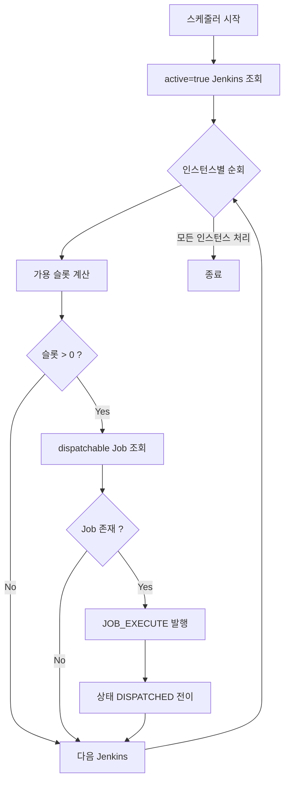
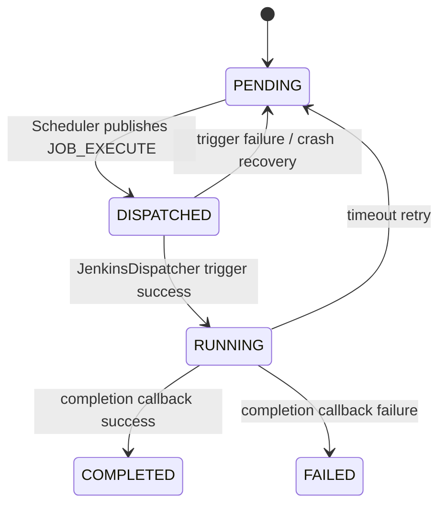

# Redpanda Playground ExecutorScheduler 로직 분석
---
> `ExecutorScheduler`는 `PENDING` Job을 바로 실행하지 않고, Jenkins별 슬롯과 선행 순서를 확인한 뒤 `job-execute` 명령으로 넘기는 조정자다.
> 작성일: 2026-04-01
> 대상: `executor/dispatcher/ExecutorScheduler.java`

## 1. 스케줄러의 위치

`ExecutorScheduler`는 `executor` 안에서 가장 중요한 조정 지점이다. `JobReceiver`가 실행 요청을 저장하고, `JobExecuteConsumer`가 실제 Jenkins 호출을 수행한다면, 그 사이에서 "지금 무엇을 내보낼 것인가"를 결정하는 컴포넌트가 바로 스케줄러다.

이 클래스는 3초마다 실행된다. `application.yml`과 `ExecutorProperties`에서 기본값은 `executor.dispatch-interval-ms: 3000`으로 잡혀 있다.

## 2. 동작 순서

코드를 순서대로 풀면 흐름은 단순하다:

즉 이 스케줄러는 global priority queue를 훑지 않는다. 먼저 Jenkins 인스턴스를 축으로 잡고, 각 인스턴스 안에서 실행 가능한 Job을 고른다.

## 3. 가용 슬롯 계산 방식

슬롯 계산은 `JenkinsDispatcher.getAvailableSlots()`에 위임한다. 여기서 모드에 따라 계산식이 달라진다.

### 3-1. 공통 계산

먼저 DB에서 현재 인스턴스에 묶인 `DISPATCHED`, `RUNNING` Job 수를 센다. 이 수를 `maxConcurrent`에서 빼면 애플리케이션이 생각하는 남은 슬롯 수가 나온다.

이 계산이 필요한 이유는 Jenkins API만 믿으면 중복 디스패치가 가능하기 때문이다. Kafka 발행 직후부터 실제 Jenkins 실행 시작 사이에는 시간차가 있으므로, 앱 레벨에서도 "이미 내보낸 Job"을 차감해야 한다.

### 3-2. `VM` 모드

`VM`이면 Jenkins `/computer/api/json?tree=busyExecutors,totalExecutors`를 호출한다. 그리고 `total - busy`와 앱 레벨 가용 수 중 더 작은 값을 최종 슬롯으로 사용한다.

즉 VM Jenkins는 "Jenkins 실제 상태"와 "애플리케이션 내부 상태"를 동시에 본다.

### 3-3. `K8S_DYNAMIC` 모드

`K8S_DYNAMIC`이면 Jenkins API를 신뢰하지 않고 앱 레벨 가용 수만 사용한다. 주석에도 적혀 있듯 동적 에이전트 환경에서는 `totalExecutors=0`이 나올 수 있기 때문이다.

즉 K8S 모드는 "실제 executor 수"보다 "이 애플리케이션이 허용한 동시성 한도"를 더 중요하게 본다.

## 4. 어떤 Job을 뽑는가

실제 후보 선정은 `ExecutionJobRepository.findDispatchableJobs(instanceId, limit)`의 native query가 담당한다. 조건은 세 가지다:

- 상태가 `PENDING`일 것
- 지정한 Jenkins 인스턴스에 속할 것
- 같은 파이프라인에서 자신보다 앞선 Job 중 특정 상태 조건을 만족하지 못하는 것이 없을 것

정렬은 `created_at ASC, job_order ASC`다. 즉 먼저 들어온 Job을 우선 보되, 같은 파이프라인 안에서는 `job_order`가 앞선 것이 먼저 나온다.

쿼리는 `FOR UPDATE SKIP LOCKED`를 사용한다. 이 때문에 여러 인스턴스가 동시에 같은 후보를 잡는 것을 어느 정도 방지한다.

## 5. 배치 크기 제한

실제 조회 개수는 `min(availableSlots, maxBatchSize)`다. 기본 `maxBatchSize`는 5다.

이 상한이 필요한 이유는 슬롯이 많다고 해서 한 번의 스케줄링 루프에 너무 많은 레코드를 잡아버리면, 다른 인스턴스나 다른 파이프라인이 기회를 얻지 못할 수 있기 때문이다. 즉 이 값은 처리량 제어이면서 공정성 제어다.

## 6. 명령 발행과 상태 전이

후보로 뽑힌 `ExecutionJob`은 바로 Jenkins로 가지 않는다. 먼저 `publishExecuteCommand()`가 `ExecutorJobExecuteCommand`를 만들어 `playground.executor.commands.job-execute`로 발행한다.

그 다음에 `JobStatusManager.transitionTo(... DISPATCHED ...)`가 호출된다. 이 전이의 의미는 "Jenkins가 이미 시작했다"가 아니라 "실행 명령을 내보냈고 이제 소비자 차례"라는 뜻이다.

상태 흐름을 묶으면 아래처럼 된다:

## 7. 왜 Kafka 한 단계를 더 두는가

스케줄러가 직접 `JenkinsDispatcher.dispatch()`를 호출할 수도 있었지만, 현재 구조는 한 단계를 더 둔다. 이 설계는 몇 가지 장점이 있다:

- 스케줄링과 실제 실행을 분리해 장애 지점을 나눈다.
- `job-execute` 소비자에 `@RetryableTopic`을 걸 수 있다.
- 발행 시점과 실행 시점 사이를 `DISPATCHED`라는 별도 상태로 추적할 수 있다.

즉 `DISPATCHED`는 단순 중간 상태가 아니라 "Kafka 기반 실행 파이프의 경계점"이다.

## 8. 현재 쿼리를 문자 그대로 해석하면 생기는 점

`findDispatchableJobs()`의 주석은 "선행 Job이 `DISPATCHED` 또는 `RUNNING`이 아닌 것이 없어야 함"이라고 설명한다. 하지만 SQL을 그대로 읽으면, 선행 Job 상태가 `COMPLETED`여도 `prev.status NOT IN ('DISPATCHED', 'RUNNING')` 조건에 걸리므로 후속 Job을 막는다.

즉 현재 쿼리는 일반적인 DAG 실행기처럼 "선행 Job 완료 후 다음 Job 실행"이라기보다 "선행 Job이 아직 active set 안에 있을 때만 다음 Job을 허용"하는 형태로 읽힌다. 의도인지 버그인지는 별도 확인이 필요하지만, 문서화 기준으로는 이 차이를 알고 읽는 것이 맞다.

## 9. 예외 처리 방식

`publishExecuteCommand()`나 상태 전이 중 예외가 나면 스케줄러는 해당 Job만 로그를 남기고 다음 Job으로 넘어간다. 즉 스케줄러 전체 루프를 중단하지 않는다.

이 선택은 운영 측면에서 합리적이다. 한 Job의 발행 실패가 모든 Jenkins 인스턴스의 디스패치를 막아서는 안 되기 때문이다.

## 10. 요약

`ExecutorScheduler`의 본질은 "대기열 폴링"이 아니라 "Jenkins별 실행권 배분"이다. 이 클래스는 아래 세 질문에 답한다:

- 지금 어느 Jenkins에 슬롯이 있는가
- 그 Jenkins에 속한 Job 중 지금 내보낼 수 있는 것은 무엇인가
- 그 Job을 안전하게 다음 실행 단계로 넘길 방법은 무엇인가

`executor`를 이해할 때 이 스케줄러를 기준으로 보면, 왜 `PENDING`, `DISPATCHED`, `RUNNING`이 따로 존재하는지 자연스럽게 보인다.
