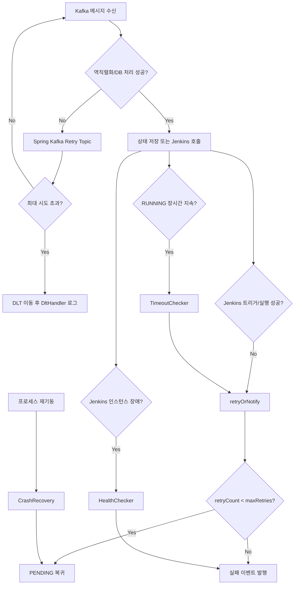

# Redpanda Playground Executor 재시도와 DLT 흐름
---
> `executor`의 장애 완화 장치는 세 층으로 나뉜다. Kafka 소비 재시도, 비즈니스 상태 재시도, 그리고 타임아웃·헬스체크·크래시 복구다.
> 작성일: 2026-04-01
> 대상: `receiver`, `dispatcher`, `callback`, `status`, `timeout`, `health`, `recovery`

## 1. 재시도를 어디서 하는가

`executor`는 한 군데에서만 재시도하지 않는다. 서로 다른 실패 원인에 대응하기 위해 재시도 레벨을 나눠 두었다.

세 레벨은 다음과 같다:

- Kafka 소비 실패 재시도
- Jenkins 실행 실패에 대한 비즈니스 재시도
- 장시간 미완료나 프로세스 중단에 대한 복구 재시도

이 구조를 하나의 그림으로 보면 아래와 같다:

## 2. Kafka 레벨 재시도

세 Kafka 소비자 모두 `@RetryableTopic`을 사용한다:

- `JobReceiver`
- `JobExecuteConsumer`
- `JobCompletionConsumer`

설정은 공통적이다:

- 총 시도 횟수 `attempts = 4`
- backoff 시작 1초
- 배수 2배
- 최대 지연 10초
- `TopicSuffixingStrategy.SUFFIX_WITH_INDEX_VALUE`

즉 첫 처리 실패 후 즉시 포기하지 않고, 재시도 토픽을 거치며 여러 번 다시 소비한다. 이 재시도는 역직렬화 실패, 일시적 DB 오류, 일시적 네트워크 장애 같은 "메시지 처리 자체의 실패"를 줄이기 위한 장치다.

## 3. DLT는 어떻게 동작하는가

`@RetryableTopic`이 붙은 세 소비자는 모두 `@DltHandler`를 갖고 있다. 최대 시도 횟수를 넘기면 메시지는 DLT로 이동하고, 각 핸들러는 topic, key, partition, offset을 로그로 남긴다.

중요한 점은 현재 구현이 DLT를 "관찰"만 한다는 것이다. DLT에 떨어진 메시지를 다시 비즈니스 큐로 되돌리거나, 별도 저장소에 적재하거나, 운영자 알림을 보내지는 않는다.

또 한 가지 눈에 띄는 점이 있다. `Topics.EXECUTOR_DLQ_JOB = playground.executor.dlq.job` 상수와 토픽 Bean은 정의돼 있지만, `executor` 모듈의 `@RetryableTopic` 설정에서는 이 상수를 직접 사용하지 않는다. 따라서 실제 DLT 흐름은 Spring Kafka가 생성하는 retry/DLT 토픽 규칙을 따르고, `playground.executor.dlq.job`은 현재 코드 경로에서는 직접 연결되지 않는다.

## 4. 비즈니스 레벨 재시도

Kafka 재시도와 별개로, Jenkins 호출 실패나 Job timeout은 `JobStatusManager.retryOrNotify()`가 처리한다.

동작은 간단하다:

- `retry_count < maxRetries`면 `retry_count`를 늘리고 `PENDING`으로 되돌린다.
- 초과하면 `error_message`를 저장하고 실패 이벤트를 발행한다.

여기서 기본 최대 재시도 횟수는 `ExecutorProperties.jobMaxRetries = 2`다. 즉 처음 실행 외에 추가로 두 번 더 기회를 주는 구조다.

## 5. 어떤 상황이 `retryOrNotify()`로 들어오는가

실제 코드 기준으로는 세 경로가 있다:

- `JenkinsDispatcher.dispatch()`에서 Jenkins API 트리거 실패
- `RunningJobTimeoutChecker`에서 `RUNNING` Job 타임아웃 감지
- `JenkinsHealthChecker`에서 인스턴스 장애 감지

세 경로는 모두 원인은 다르지만, 결과적으로 "이 Job을 지금 상태로 계속 둘 수 없다"는 판단으로 합쳐진다.

## 6. 타임아웃 흐름

`RunningJobTimeoutChecker`는 60초마다 `RUNNING` Job을 검사한다. `started_at`이 `jobTimeoutMinutes`보다 오래된 Job이 대상이다.

단, Jenkins 인스턴스가 이미 `UNHEALTHY`이면 이 체크는 건너뛴다. 그 경우는 개별 Job hang가 아니라 인프라 장애로 보아 `JenkinsHealthChecker`가 담당하기 때문이다.

즉 timeout 로직은 "Jenkins는 살아 있는데 어떤 Job만 끝나지 않는 상황"을 잡기 위한 안전망이다.

## 7. Jenkins 장애 흐름

`JenkinsHealthChecker`는 기본 30초마다 활성 Jenkins를 점검한다. `AUTH_ERROR`, `HTTP_503`, `CONNECTION_REFUSED`, `TIMEOUT`을 분류하고, 연속 실패 횟수에 따라 `HEALTHY`, `DEGRADED`, `UNHEALTHY`, `AUTH_FAILED`로 상태를 매긴다.

`UNHEALTHY` 또는 `AUTH_FAILED`가 되면 해당 인스턴스의 `RUNNING` Job에 대해 `retryOrNotify(job, 0, ...)`를 호출한다. 여기서 `maxRetries = 0`이므로 즉시 실패 이벤트 경로로 간다.

즉 인프라 전체가 죽었을 때는 재시도보다 빠른 실패 통지를 선택한 셈이다.

## 8. 크래시 복구 흐름

애플리케이션이 재기동되면 `CrashRecoveryHandler`가 `DISPATCHED` 상태 Job을 모두 찾아 `PENDING`으로 돌린다.

이 선택은 보수적이다. 프로세스가 죽기 직전 Kafka 발행은 됐을 수 있지만, 실제 Jenkins가 빌드를 받았는지 확실하지 않기 때문이다. 그래서 "모호하면 다시 평가한다"는 정책을 택한다.

문서 관점에서 보면 `DISPATCHED`는 가장 불안정한 상태다. 아직 Jenkins 실행이 확정되지 않았고, 크래시 후 가장 먼저 되감기는 상태이기 때문이다.

## 9. 현재 코드에서 보이는 실제 종단 실패 처리

코드상 "최종 실패"는 항상 `FAILED` 상태로 끝나지 않는다. `JobCompletionConsumer`가 Jenkins 완료 이벤트를 받았을 때만 `FAILED`로 종료한다.

반면 `retryOrNotify()`에서 최대 재시도를 넘기면 상태를 `FAILED`로 바꾸지 않고, `JOB_DISPATCH_FAILED` 이벤트를 `playground.executor.events.job-started` 토픽으로 발행한다. 즉 현재 구현은 "DB terminal state 기록"보다 "외부에 실패 사실을 알림"에 더 가깝다.

이 차이는 읽을 때 중요하다. timeout이나 Jenkins trigger 실패는 반드시 `execution_job.status = FAILED`로 끝난다고 가정하면 실제 코드와 어긋난다.

## 10. Operator 쪽과 연결해 보면 보이는 점

`operator-stub`의 `JobCompletionListener`는 `EXECUTOR_EVT_JOB_STARTED`를 받으면 이벤트 종류를 구분하지 않고 `RUNNING`으로 바꾼다. 따라서 `JOB_DISPATCH_FAILED`가 같은 토픽으로 오면, 현재 스텁 로직만 놓고 보면 실패로 해석되지 않는다.

즉 재시도 초과 후 실패 통지 경로는 설계 의도는 보이지만, 현재 스텁 구현과 완전히 맞물려 있지는 않다. 이 문서는 구현 사실을 설명하는 것이므로, 실제 운영 시 이 간극을 염두에 두고 읽어야 한다.

## 11. 정리

`executor`의 재시도 체계는 다음처럼 이해하면 가장 정확하다:

- Kafka 소비 실패는 Spring Kafka retry topic이 처리한다.
- Jenkins 실행 실패와 timeout은 `retry_count` 기반으로 `PENDING` 재큐잉한다.
- 인프라 장애와 프로세스 중단은 헬스체크와 크래시 복구가 흡수한다.

반면 DLT와 최종 실패 통지는 아직 운영 자동화보다는 로그 관찰과 후속 설계 여지가 남아 있는 상태다. 그래서 이 모듈은 완성된 실패 처리 엔진이라기보다, 실행 보장과 장애 흡수를 점진적으로 붙여 가는 중간 단계의 설계로 보는 편이 맞다.

같이 보면 좋은 보조 자료는 [시각화 보기](04-5-executor-flow.html)다. 정상 실행, Jenkins 트리거 실패, timeout과 헬스체크 분리, Kafka DLT와 크래시 복구를 단계별로 따라갈 수 있다.
