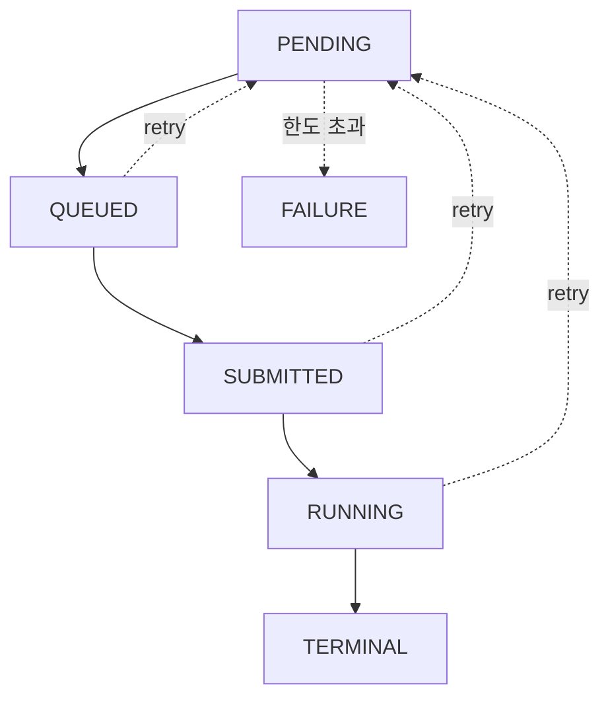
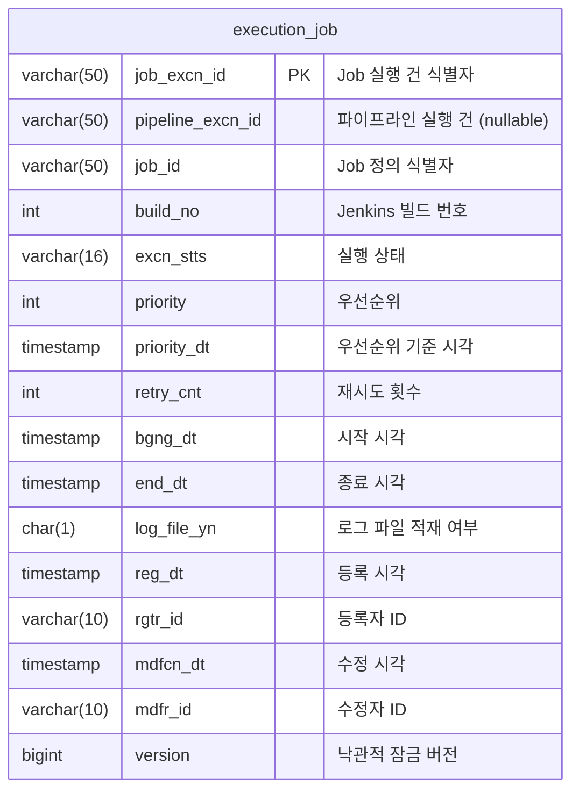

# Executor Use Cases
---
> `executor` 모듈의 현재 구현 기준 유스케이스 문서 모음이다. `spec.md`의 설계 의도보다 실제 live 코드가 어떻게 동작하는지 설명하는 데 초점을 둔다.

현재 구현의 중요한 전제는 다음과 같다.

- Jenkins health check와 API token 발급은 `operator`가 담당한다.
- `executor`는 cross-schema로 `operator.support_tool`의 `health_status`, `health_checked_at`, `api_token`을 읽는다.
- runtime Jenkins 호출은 API token 기반 Basic Auth만 사용한다.
- `executor`는 `crumbIssuer`를 호출하지 않는다.

## 문서 목록

- `01-receive-job.md`: operator가 보낸 dispatch command를 수신해 `execution_job`에 적재하는 흐름
- `02-evaluate-dispatch.md`: 대기 Job을 Jenkins 인스턴스별로 평가하고 health gate를 통과한 대상만 `QUEUED`로 전환하는 흐름
- `03-execute-job.md`: `QUEUED` Job을 Jenkins에 실제로 트리거하고 `SUBMITTED`로 전환하는 흐름
- `04-handle-build-started.md`: Jenkins 시작 이벤트를 받아 `RUNNING`으로 전환하고 operator에 알리는 흐름
- `05-handle-build-completed.md`: Jenkins 종료 이벤트를 받아 터미널 상태 반영, 로그 저장, operator notify를 수행하는 흐름
- `06-stale-job-recovery.md`: webhook 유실이나 메시지 유실에 대비해 stale Job을 복구하되 Jenkins unhealthy면 복구를 미루는 흐름
- `07-query-jobs.md`: REST API로 executor Job을 조회하는 흐름

각 문서에는 Mermaid 흐름도, 실제 코드 발췌, 테이블/메시지 스키마, 대응 HTML 시각화 링크가 포함돼 있다.

## 상태 흐름 요약

- `PENDING`: 수신 완료, 디스패치 대기
- `QUEUED`: 실행 대상으로 선정됨. 내부 execute command 발행 완료
- `SUBMITTED`: Jenkins 트리거 성공. 아직 시작 이벤트를 받지 못한 상태
- `RUNNING`: Jenkins 시작 이벤트 확인
- `TERMINAL`: `SUCCESS`, `FAILURE`, `UNSTABLE`, `ABORTED`, `NOT_BUILT`, `NOT_EXECUTED`

복구 경로에서는 `QUEUED -> PENDING`, `SUBMITTED -> PENDING`, `RUNNING -> PENDING`도 가능하다.

## 테이블 스키마

인덱스:

- `idx_ej_stts_priority(excn_stts, priority, priority_dt)` — 디스패치 조회용
- `idx_ej_pipeline(pipeline_excn_id, excn_stts)` — 파이프라인 단위 조회용

## Kafka 토픽 목록

| 토픽 | 방향 | 포맷 | 용도 |
|------|------|------|------|
| `playground.executor.commands.job-dispatch` | Op → Executor | Avro | Job 디스패치 명령 |
| `playground.executor.commands.job-execute` | Executor 내부 | Avro | 내부 실행 명령 |
| `playground.executor.events.job-started` | Jenkins → Executor | JSON | 빌드 시작 콜백 |
| `playground.executor.events.job-completed` | Jenkins → Executor | JSON | 빌드 완료 콜백 |
| `playground.executor.notify.job-started` | Executor → Op | Avro | 시작 통지 |
| `playground.executor.notify.job-completed` | Executor → Op | Avro | 완료 통지 |

## 핵심 진입점

Kafka inbound:

- `JobDispatchConsumer`
- `JobExecuteConsumer`
- `JobStartedConsumer`
- `JobCompletedConsumer`

Scheduler:

- `DispatchScheduler`
- `StaleJobRecoveryScheduler`

REST:

- `DispatchController`

## 읽는 순서

1. `01-receive-job.md`
2. `02-evaluate-dispatch.md`
3. `03-execute-job.md`
4. `04-handle-build-started.md`
5. `05-handle-build-completed.md`
6. `06-stale-job-recovery.md`
7. `07-query-jobs.md`
