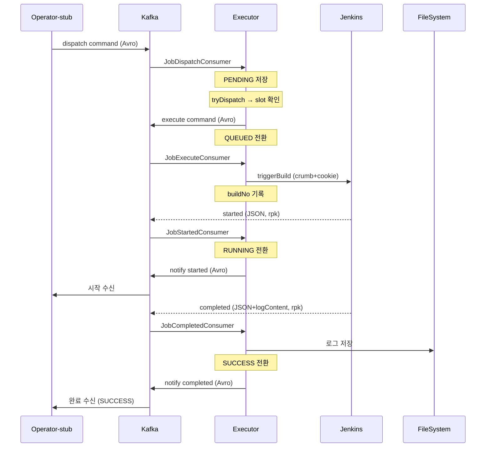
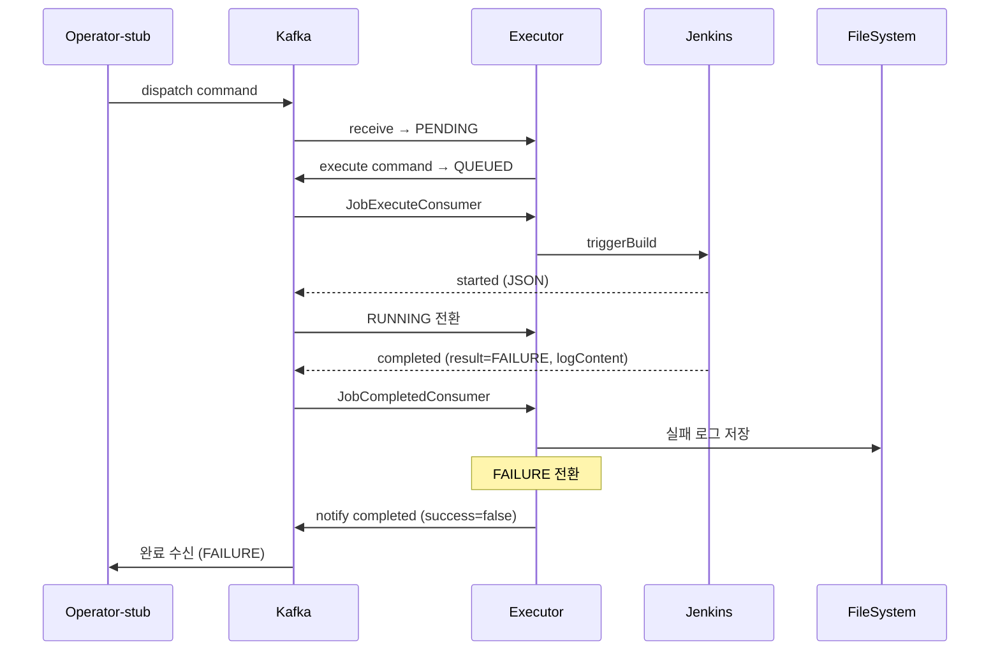
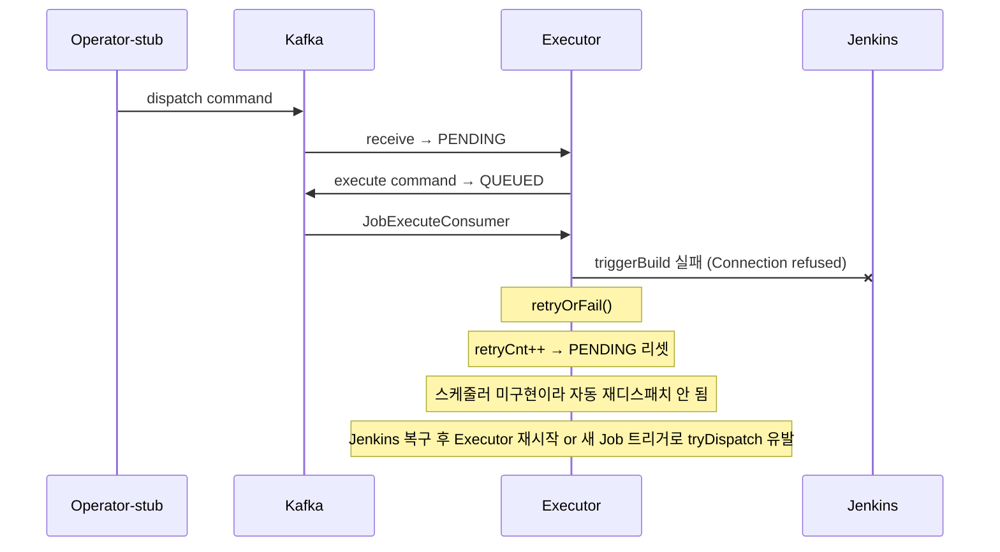
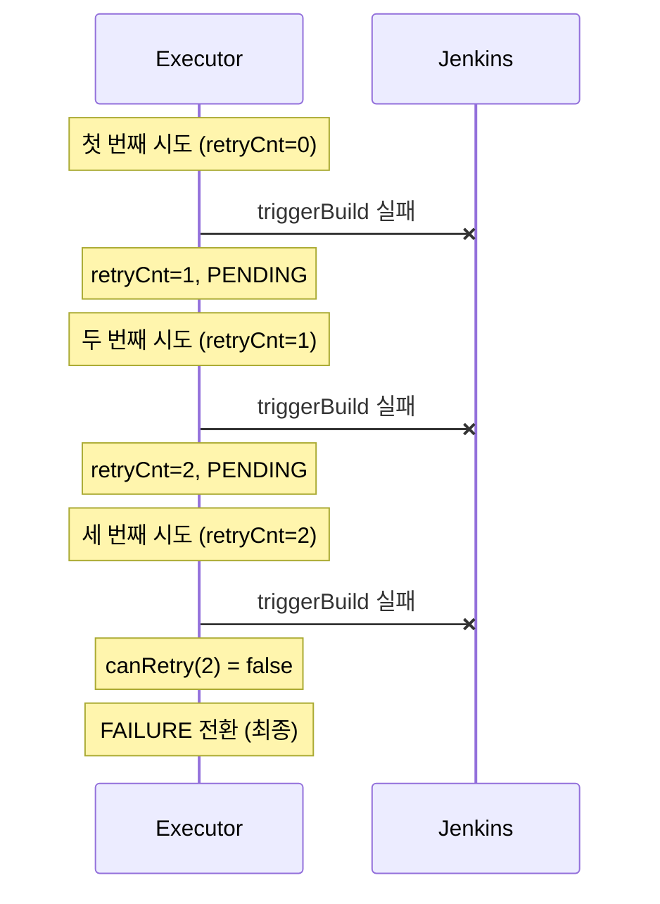
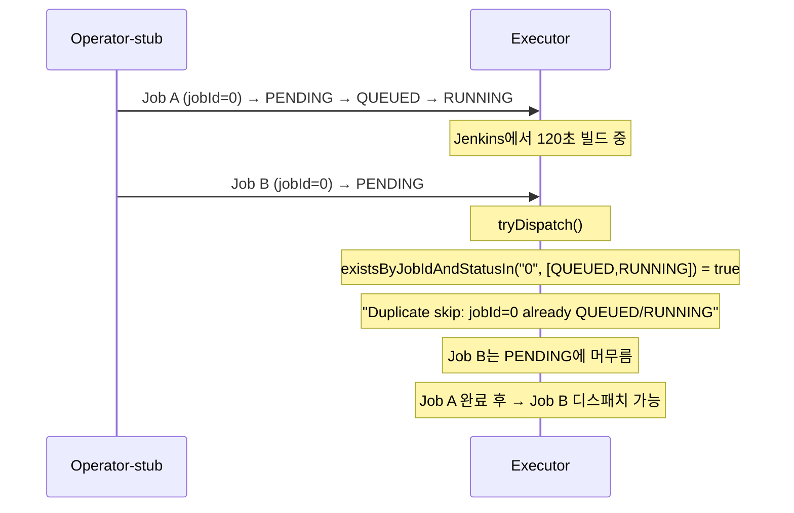
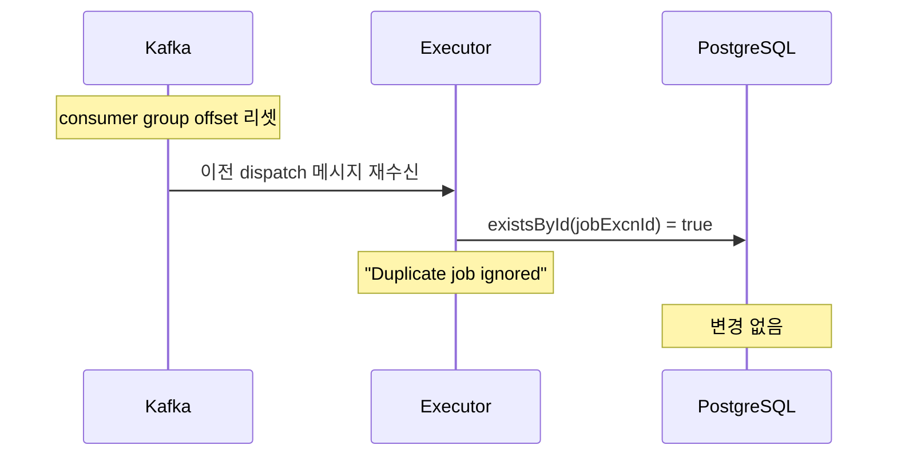
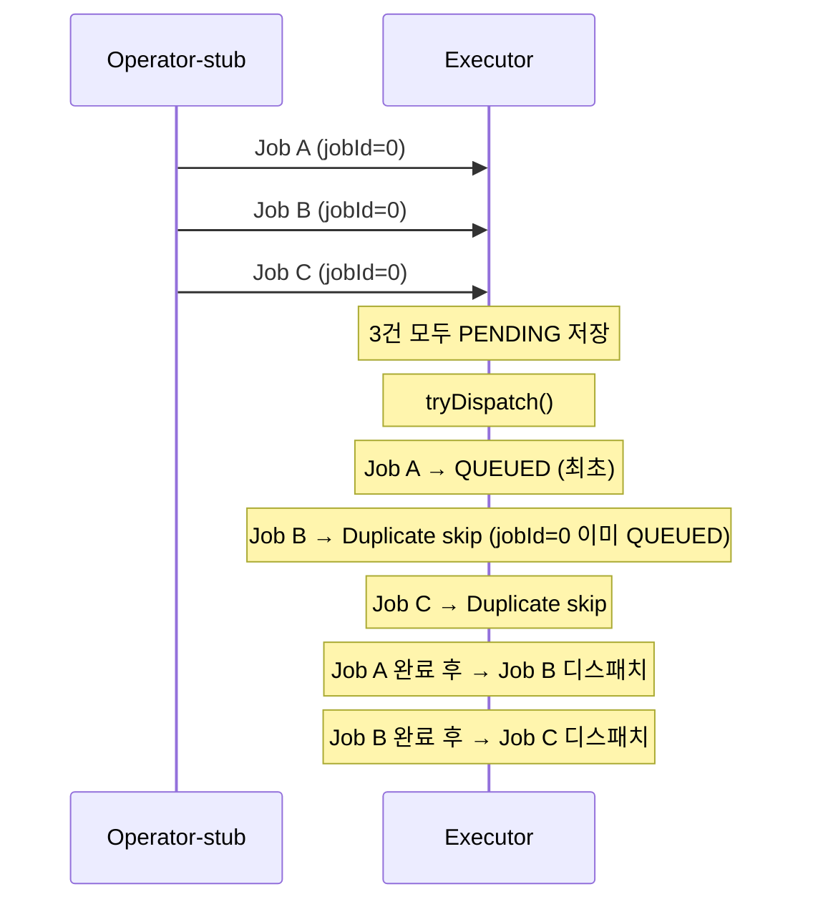

# Executor PoC 수동 테스트 계획

## Context

Executor PoC E2E 흐름이 완성되었으나, 정상 경로(SUCCESS)만 검증했다.
실제 개발에 필요한 다양한 엣지 케이스(실패, 재시도, 중복, 동시 실행 등)를 수동으로 테스트하여
Executor의 동작을 직접 확인하고 이해한다.

---

## 테스트 전 사전 준비

### 인프라 상태 확인

| 항목 | 확인 명령어 | 기대값 |
|------|-----------|--------|
| Executor | `curl -s http://localhost:8071/actuator/health` | `{"status":"UP"}` |
| Operator-stub | `curl -s http://localhost:8072/actuator/health` | `{"status":"UP"}` |
| Jenkins | `curl -s -u admin:admin http://34.47.74.0:31080/api/json \| python3 -c "import sys,json; print(json.load(sys.stdin)['mode'])"` | `NORMAL` |
| PostgreSQL | `nc -z 34.47.83.38 30275 && echo OK` | `OK` |
| Redpanda | `nc -z 34.47.83.38 31092 && echo OK` | `OK` |
| Schema Registry | `curl -s http://34.47.83.38:31081/subjects \| head -1` | JSON 배열 |

### 앱 기동 (미실행 시)

```bash
cd ~/Library/CloudStorage/GoogleDrive-tscofet@gmail.com/내\ 드라이브/study/runners-high/project/redpanda-playground
make executor > /tmp/executor.log 2>&1 &
make operator-stub > /tmp/operator-stub.log 2>&1 &
```

### DB 초기화 (각 TC 시작 전)

```bash
gcloud compute ssh dev-server --zone=asia-northeast3-a --project=project-a99c4fa1-6c9e-4491-afd \
  --command="kubectl exec -n rp-oss postgresql-0 -- env PGPASSWORD=playground psql -U playground -d playground \
  -c 'DELETE FROM executor.execution_job; DELETE FROM executor.outbox_event; DELETE FROM operator_stub.operator_job;'"
```

### Jenkins executor-test Job

- 위치: `http://34.47.74.0:31080/job/executor-test/`
- 인증: `admin / admin`
- 기본 Pipeline 스크립트 (정상):
  ```groovy
  pipeline {
      agent any
      stages {
          stage('Test') {
              steps {
                  echo 'Executor test job running...'
                  sh 'sleep 10'
                  echo 'Done!'
              }
          }
      }
  }
  ```
- TC별로 스크립트를 수정하고, 완료 후 원복해야 한다

### 로그 파일 디렉토리 초기화

```bash
rm -rf /tmp/executor-logs/*
```

### 설정값 (ExecutorProperties 기본값)

| 설정 | 값 | 용도 |
|------|-----|------|
| `executor.max-batch-size` | 5 | 한번에 디스패치할 최대 Job 수 |
| `executor.job-max-retries` | 2 | Jenkins 트리거 실패 시 최대 재시도 |
| `executor.job-timeout-minutes` | 30 | RUNNING 타임아웃 (미구현) |
| `executor.log-path` | `/tmp/executor-logs` | 빌드 로그 저장 경로 |

---

## 현재 Executor 기능 맵

| 기능 | 구현 | 테스트 |
|------|------|--------|
| 정상 실행 (PENDING→QUEUED→RUNNING→SUCCESS) | ✅ | TC-01 |
| Jenkins 빌드 실패 (→FAILURE) | ✅ | TC-02 |
| Jenkins 트리거 실패 → 재시도 | ✅ | TC-03 |
| 재시도 한도 초과 → FAILURE | ✅ | TC-04 |
| 중복 실행 방지 | ✅ | TC-05 |
| 멱등성 (중복 수신 무시) | ✅ | TC-06 |
| 다중 동시 실행 | ✅ | TC-07 |
| 로그 파일 적재 | ✅ | TC-01,02 |
| 스케줄러 / 헬스체크 / 타임아웃 / 크래시 복구 | ❌ | - |

---

## TC-01. 정상 실행 (Happy Path)

### 흐름



### 확인 포인트

| 항목 | 확인 방법 | 기대값 |
|------|----------|--------|
| Executor Job 상태 | API 조회 | SUCCESS |
| Operator Job 상태 | API 조회 | SUCCESS |
| 로그 파일 | `ls /tmp/executor-logs/executor-test/` | `{id}_0` 파일 존재 |
| dispatch 토픽 | Redpanda Console | Avro 메시지 1건 |
| started 토픽 | Redpanda Console | JSON 메시지 1건 |
| completed 토픽 | Redpanda Console | JSON + logContent |
| notify completed 토픽 | Redpanda Console | Avro 메시지 1건 |
| Outbox 테이블 | DB 조회 | sent=true |

---

## TC-02. Jenkins 빌드 실패

### 사전 준비

Jenkins executor-test Pipeline 스크립트를 실패로 변경:
```groovy
pipeline {
    agent any
    stages {
        stage('Test') {
            steps {
                error('Intentional failure for TC-02')
            }
        }
    }
}
```

### 흐름



### 확인 포인트

| 항목 | 기대값 |
|------|--------|
| Executor Job status | FAILURE |
| Operator Job status | FAILURE |
| 로그 파일 내용 | `Intentional failure` 포함 |
| notify completed | `success=false`, `result=FAILURE` |

### 정리

테스트 후 Jenkins Pipeline을 **정상 스크립트로 원복**할 것.

---

## TC-03. Jenkins 트리거 실패 → 자동 재시도

### 사전 준비

Jenkins Pod를 내린다 (빌드 트리거 실패 유발):
```bash
gcloud compute ssh dev-server --zone=asia-northeast3-a --project=project-a99c4fa1-6c9e-4491-afd \
  --command="kubectl scale statefulset jenkins -n rp-jenkins --replicas=0"
```

### 흐름



### 확인 포인트

| 항목 | 기대값 |
|------|--------|
| Executor Job status | PENDING |
| retryCnt | 1 |
| Executor 로그 | `[JobExecute] Failed:`, `Retry #1` |

### Jenkins 복구 후 재실행

```bash
# Jenkins 복구
gcloud compute ssh dev-server --zone=asia-northeast3-a --project=project-a99c4fa1-6c9e-4491-afd \
  --command="kubectl scale statefulset jenkins -n rp-jenkins --replicas=1"

# Jenkins Ready 대기 (약 60초)
sleep 60

# 새 Job 트리거 → tryDispatch()가 PENDING Job도 함께 처리
curl -X POST "http://localhost:8072/api/operator/jobs/execute?jobName=executor-test&jenkinsInstanceId=1"
```

---

## TC-04. 재시도 한도 초과 (max 2회 → FAILURE)

### 사전 준비

Jenkins를 다운 상태로 유지 (TC-03에서 이어서).

### 흐름



### 테스트 방법

스케줄러가 미구현이므로, Executor를 재시작하면 PENDING Job이 Kafka 메시지 재소비를 통해 다시 tryDispatch된다.
```bash
# 각 재시작마다 retryCnt가 증가하는 것을 확인
# 1회차: retryCnt=0→1
kill $(lsof -i :8071 -t); sleep 2; make executor > /tmp/executor.log 2>&1 &
sleep 30; curl -s "http://localhost:8071/api/executor/jobs?status=PENDING" | python3 -m json.tool

# 2회차: retryCnt=1→2
kill $(lsof -i :8071 -t); sleep 2; make executor > /tmp/executor.log 2>&1 &
sleep 30; curl -s "http://localhost:8071/api/executor/jobs?status=PENDING" | python3 -m json.tool

# 3회차: retryCnt=2 → FAILURE
kill $(lsof -i :8071 -t); sleep 2; make executor > /tmp/executor.log 2>&1 &
sleep 30; curl -s "http://localhost:8071/api/executor/jobs?status=FAILURE" | python3 -m json.tool
```

### 확인 포인트

| 항목 | 기대값 |
|------|--------|
| 최종 status | FAILURE |
| retryCnt | 2 |
| Executor 로그 | `retryOrFail → FAILURE` |

### 정리

```bash
gcloud compute ssh dev-server --zone=asia-northeast3-a --project=project-a99c4fa1-6c9e-4491-afd \
  --command="kubectl scale statefulset jenkins -n rp-jenkins --replicas=1"
sleep 60
```

---

## TC-05. 중복 실행 방지

### 사전 준비

Jenkins executor-test를 느린 빌드로 변경 (120초 sleep):
```groovy
pipeline {
    agent any
    stages {
        stage('Test') {
            steps {
                echo 'Slow build for TC-05...'
                sh 'sleep 120'
                echo 'Done!'
            }
        }
    }
}
```

### 흐름



### 확인 포인트

| 항목 | 기대값 |
|------|--------|
| Job A | RUNNING (빌드 중) |
| Job B | PENDING (대기) |
| Executor 로그 | `Duplicate skip: jobId=0 already QUEUED/RUNNING` |

### 정리

테스트 후 Jenkins Pipeline을 **정상 스크립트(sleep 10)로 원복**할 것.

---

## TC-06. 멱등성 (중복 메시지 수신)

### 사전 준비

TC-01을 먼저 실행하여 정상 완료된 Job이 DB에 있는 상태.

### 흐름



### 테스트 방법

```bash
# 1. TC-01 실행하여 Job 완료

# 2. Consumer group offset을 처음으로 리셋
gcloud compute ssh dev-server --zone=asia-northeast3-a --project=project-a99c4fa1-6c9e-4491-afd \
  --command="kubectl exec -n rp-oss redpanda-0 -- rpk group seek executor-group --to start --topics playground.executor.commands.job-dispatch"

# 3. Executor 재시작 (리셋된 offset에서 메시지 재소비)
kill $(lsof -i :8071 -t); sleep 2
cd ~/Library/CloudStorage/GoogleDrive-tscofet@gmail.com/내\ 드라이브/study/runners-high/project/redpanda-playground
make executor > /tmp/executor.log 2>&1 &
sleep 30

# 4. 로그 확인
grep "Duplicate job ignored" /tmp/executor.log
```

### 확인 포인트

| 항목 | 기대값 |
|------|--------|
| Executor 로그 | `Duplicate job ignored: jobExcnId=...` |
| DB Job 수 | 변경 없음 (1건 유지) |

---

## TC-07. 다중 Job 동시 트리거

### 흐름



### 확인 포인트

| 항목 | 기대값 |
|------|--------|
| 수신 | 3건 모두 PENDING 저장 |
| 디스패치 | 1건만 QUEUED, 나머지 PENDING |
| Executor 로그 | `Duplicate skip` 2건 |

---

## 메시지 흐름 모니터링

### Redpanda Console (GUI)
- **URL**: `http://34.47.83.38:31880`
- Topics 탭 → 토픽 선택 → Messages 탭
- Avro 메시지: Schema Registry로 자동 디코딩

### rpk CLI (실시간 구독)
```bash
# GCP 서버 SSH 접속 후
kubectl exec -n rp-oss redpanda-0 -- rpk topic consume playground.executor.commands.job-dispatch --brokers localhost:9092 --offset end
kubectl exec -n rp-oss redpanda-0 -- rpk topic consume playground.executor.events.job-started --brokers localhost:9092 --offset end
kubectl exec -n rp-oss redpanda-0 -- rpk topic consume playground.executor.events.job-completed --brokers localhost:9092 --offset end
kubectl exec -n rp-oss redpanda-0 -- rpk topic consume playground.executor.notify.job-completed --brokers localhost:9092 --offset end
```

### Executor API
```bash
curl http://localhost:8071/api/executor/jobs                        # 기본: PENDING
curl "http://localhost:8071/api/executor/jobs?status=QUEUED"
curl "http://localhost:8071/api/executor/jobs?status=RUNNING"
curl "http://localhost:8071/api/executor/jobs?status=SUCCESS"
curl "http://localhost:8071/api/executor/jobs?status=FAILURE"
curl http://localhost:8071/api/executor/jobs/{jobExcnId}            # 개별 조회
```

### Outbox 테이블 (common-kafka 검증)
```bash
gcloud compute ssh dev-server --zone=asia-northeast3-a --project=project-a99c4fa1-6c9e-4491-afd \
  --command="kubectl exec -n rp-oss postgresql-0 -- env PGPASSWORD=playground psql -U playground -d playground \
  -c 'SELECT id, aggregate_type, event_type, sent, created_at FROM executor.outbox_event ORDER BY created_at DESC LIMIT 10;'"
```

---

## common-kafka 간접 테스트

common-kafka는 라이브러리 모듈이므로 E2E 흐름에서 간접 검증한다:

| 기능 | TC | 검증 방법 |
|------|-----|----------|
| AvroSerializer | TC-01 | dispatch/execute 토픽에 Avro 메시지 디코딩 확인 |
| Outbox 패턴 | TC-01 | outbox_event 테이블 sent=true 확인 |
| TopicConfig 자동 생성 | 앱 기동 시 | Console에서 notify 토픽 존재 확인 |
| DlqConsumer | TC-06 | DLT 토픽 메시지 확인 (역직렬화 실패 시) |
| Schema Registry | TC-01 | Console에서 Avro 자동 디코딩 |

---

## 원커맨드 테스트 스크립트

테스트 자동화를 위한 쉘 스크립트를 `executor/scripts/e2e-test.sh`로 작성한다.
각 TC를 함수로 분리하여 개별/전체 실행이 가능하게 한다.

### 스크립트 구조

```
executor/scripts/e2e-test.sh
  - 공통 함수: clean_db, wait_for_status, check_log, trigger_job
  - tc01_happy_path
  - tc02_build_failure (Jenkins 스크립트 수동 변경 필요 → 안내 출력)
  - tc05_duplicate_prevention
  - tc06_idempotency
  - tc07_multi_trigger
  - tc03_trigger_retry (Jenkins 다운 필요 → 확인 프롬프트)
  - tc04_retry_exceeded (TC-03 연장)
```

### 주요 함수

- `clean_db()`: executor.execution_job + operator_stub.operator_job 삭제
- `trigger_job(jobName, jenkinsId)`: POST → operatorJobId 반환
- `wait_for_status(jobExcnId, expectedStatus, timeoutSec)`: 폴링하며 대기
- `check_log_file(jobExcnId)`: `/tmp/executor-logs/` 확인
- `assert_eq(actual, expected, msg)`: 결과 검증
