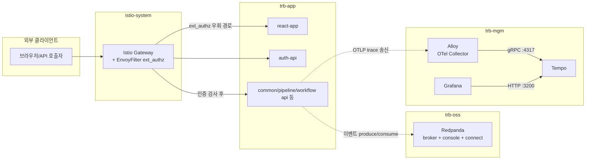

# 305PPP 인프라 개요

PPP v3.0.5.1P 신규 개발계(dev-3.0.5.1p)에서 내가 담당하는 세 가지 컴포넌트(Redpanda, Istio, Tempo)를 전체 그림 안에 배치하기 위한 문서이다. 각 컴포넌트의 설치 순서·의존 관계·공통 설정을 한 페이지에서 확인할 수 있도록 정리했다. 세부 절차는 컴포넌트별 문서(`01-redpanda.md`, `02-istio.md`, `03-tempo.md`)로 분리했다.

## 왜 이 환경이 필요한가

기존 BOK 환경의 설정을 그대로 복제하는 것이 아니라, 새 클러스터에 맞게 도메인·노드 정보·Harbor 주소를 바꿔 끼우는 작업이다. 운영 중인 BOK 환경과 동일한 토폴로지를 유지해야 배포 파이프라인(ArgoCD + Image Updater + Jenkins)이 그대로 돌아간다. 따라서 "아키텍처 설계"가 아니라 "환경 변수 치환과 검증"이 작업의 본질이다.

## 네임스페이스 지도

다섯 개 네임스페이스가 역할에 따라 나뉘어 있다. 각 네임스페이스는 의미가 명확하므로 새 환경에서도 이름을 바꾸지 않는다.

| 네임스페이스 | 역할 | 주요 워크로드 |
|---|---|---|
| `trb-oss` | OSS 인프라 | Jenkins, Harbor, ArgoCD, GitLab, Redpanda, MinIO, SonarQube, Nexus, LDAP |
| `trb-mgm` | 관측 스택 | Prometheus, Loki, Tempo, Alloy, Grafana |
| `trb-app` | 트럼본 애플리케이션 | auth-api, common-api, pipeline-api, workflow-api, scheduler, react-app, sse 등 |
| `istio-system` | 서비스 메시 | istiod, istio-gateway, EnvoyFilter, VirtualService |
| `mariadb-system` | MariaDB Operator | MariaDB CRD 컨트롤러 (인스턴스는 별도 NS) |

## 데이터 흐름 한 장에 담기

Istio Gateway가 외부 진입점이고, 내부에서 Redpanda가 이벤트 버스 역할을 하며, Tempo가 분산 트레이스를 수집한다. 세 컴포넌트는 직접 호출하는 관계가 아니라 `trb-app` 마이크로서비스가 각각의 클라이언트가 되는 구조이다.

흐름을 세 가지로 분리해서 읽으면 쉽다. 첫째, 요청 라우팅은 `client → Gateway → trb-app` 경로이고 EnvoyFilter가 인증을 가로챈다. 둘째, 메시지 흐름은 `trb-app ↔ Redpanda`인데 Redpanda는 Console UI와 Connect(Benthos 계열 통합 도구)가 같은 네임스페이스에 붙는다. 셋째, 트레이스 흐름은 `trb-app → Alloy → Tempo`이고 Grafana는 Tempo를 데이터소스로 참조한다.

## 설치 순서와 의존 관계

의존 관계를 무시하고 설치하면 하위 앱이 Pending에 빠진다. 아래 순서는 원본 태스크(00-index, 06-app-of-apps)에서 권장하는 순서를 정리한 것이다.

1. **OSS 인프라**: Harbor → GitLab/Bitbucket → ArgoCD → Jenkins → MariaDB. Harbor가 이미지 레지스트리 역할을 하므로 다른 컴포넌트가 이미지를 받아올 때 필요하다.
2. **Istio 제어 평면**: istiod → Gateway Pod → `istio-admin-routing-chart`. Gateway가 떠야 VirtualService가 실제로 라우팅에 반영된다.
3. **관측 스택**: Prometheus → Loki → Tempo → Alloy → Grafana. Tempo는 Alloy가 OTLP를 밀어넣을 대상이라 Tempo가 먼저 떠 있어야 한다.
4. **메시징**: Redpanda → Redpanda Connect. Connect의 `seed_brokers`가 Redpanda 브로커를 참조하므로 브로커가 먼저 Ready여야 한다.
5. **애플리케이션**: `trb-app` app-of-apps. MariaDB JDBC URL, Redpanda 브로커 주소, Tempo OTLP 엔드포인트가 모두 채워진 뒤에 떠야 실패가 안 난다.

실전에서는 ArgoCD app-of-apps가 자동 동기화로 일부 순서를 뒤섞지만, 파드 Pending이 생기면 위 순서로 되짚어 내려가며 상위 컴포넌트부터 확인하면 된다.

## 공통 환경 변수 (env-config 체크리스트)

`~/okestro/tps_manifest/tasks/dev-3.0.5.1p/env-config.md`의 `<TBD>` 칸을 새 환경 값으로 치환해야 모든 태스크가 굴러간다. 내가 담당하는 세 태스크에서 가장 먼저 필요한 값은 다음과 같다.

| 변수 | 용도 | 어디서 쓰이는가 |
|---|---|---|
| `HARBOR_URL` | 컨테이너 레지스트리 호스트 | Redpanda/Tempo/Istio 모든 values.yaml의 이미지 주소 |
| `DOMAIN` | Ingress/VirtualService 기본 호스트 | Redpanda Console(`redpanda.${DOMAIN}`), Istio Gateway |
| `STORAGE_CLASS` | PVC StorageClass | Tempo PVC (기본 `nfs-csi`) |
| `REDPANDA_NODE_IP` / `REDPANDA_NODE_HOSTNAME` | NodePort 외부 IP, hostPath 고정 노드 | Redpanda `external.addresses`, `nodeSelector` |
| `REDPANDA_HOSTPATH` | 노드 로컬 데이터 경로 | Redpanda hostPath PV, 기본 `/var/lib/redpanda-data` |
| `TLS_SECRET_NAME` + `TLS_GENERATE` | Gateway TLS 인증서 | `istio-admin-routing-chart` values |
| `AUTHZ_ENABLED` + `AUTHZ_SERVICE_HOST` | ext_authz 인증 필터 | Gateway EnvoyFilter, 기본 `trb-app-auth-api.trb-app.svc.cluster.local` |
| `TEMPO_TAG` / `TEMPO_RETENTION` / `TEMPO_STORAGE_SIZE` | Tempo 이미지/보존/용량 | `helm-charts/tempo/values-dev.yaml` |

공통 자격증명(`BITBUCKET_APP_PASSWORD`, `HARBOR_PASSWORD`, `ARGOCD_ADMIN_PASSWORD`, `MARIADB_ROOT_PASSWORD`)은 내가 직접 쓰지는 않아도 app-of-apps와 Image Updater가 의존하므로 환경 시트에 모두 채워져 있어야 한다.

## 배포 방식 선택: Helm 직접 vs ArgoCD

같은 차트를 두 가지 방식으로 올릴 수 있다. 어느 쪽을 고를지 미리 정해 두면 혼란이 줄어든다.

- **Helm 직접 설치** (`helm install ... -f values-dev.yaml`): 초기 검증, 빠른 반복 수정에 유리하다. 드리프트가 생겨도 ArgoCD가 교정하지 않는다.
- **ArgoCD app-of-apps 동기화** (`argocd-apps/app-of-apps/charts/trb-mgm/values-dev.yaml`에 `enabled: true`): 운영 원칙. Git이 곧 상태라 변경 이력이 남고 원복이 쉽다. Tempo는 이 경로를 권장한다.

신규 환경 초기에는 Helm으로 values를 여러 번 바꿔가며 검증하고, 모양이 잡히면 ArgoCD Application으로 전환해 들어가는 흐름이 안전하다.

## 참고 경로

- 원본 태스크 인덱스: `~/okestro/tps_manifest/tasks/dev-3.0.5.1p/00-new-env-setup-index.md`
- 환경 변수 시트: `~/okestro/tps_manifest/tasks/dev-3.0.5.1p/env-config.md`
- 담당 외 태스크 개요: [99-reference-other-tasks.md](./99-reference-other-tasks.md)
