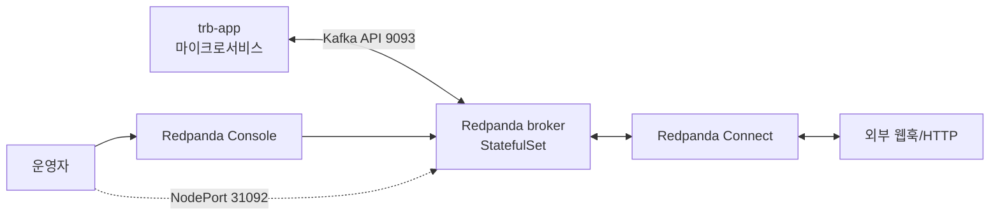

# Redpanda 설치 가이드

`trb-oss` 네임스페이스에 Redpanda 브로커·Console·Connect를 올리고, `trb-app` 마이크로서비스가 이를 이벤트 버스로 사용할 수 있게 한다. Helm 차트 기반 StatefulSet 배포이며 hostPath를 사용하는 것이 가장 중요한 제약이다.

## 1. 역할과 데이터 흐름

Redpanda는 Kafka API 호환 메시지 브로커이다. 이 환경에서는 `trb-app`의 마이크로서비스가 produce/consume 하는 이벤트 버스로 쓰이고, Connect는 외부 시스템(웹훅, DB, HTTP API 등)과 Redpanda 사이를 잇는 통합 파이프라인 역할을 한다. Console은 운영자가 토픽·컨슈머 그룹·메시지를 들여다보는 UI이다.



들어오는 트래픽은 두 갈래다. 클러스터 내부에서는 `redpanda.trb-oss.svc.cluster.local:9093`으로 접근하고, 외부에서는 NodePort `31092`를 이용해 `rpk cluster info --brokers <NODE_IP>:31092`로 확인한다.

## 2. 이미 알고 있는 것 (학습 자료 참조)

이 문서는 아래 학습 내용을 전제한다. 중복 설명 대신 개념이 헷갈릴 때 되짚으면 된다.

- **Thread-per-Core / Shard-Nothing 아키텍처**: Redpanda는 Seastar 프레임워크 위에서 코어별로 독립 메모리·I/O 큐를 갖는다. Kafka와 달리 JVM·ZooKeeper가 없고 단일 바이너리이다. → `…/runners-high/write/01_MessageQueue/05-01-rp.Redpanda 아키텍쳐.md`
- **Raft 기반 복제와 리더 선출**: 컨트롤러/파티션 모두 Raft 합의를 쓴다. → `…/01_MessageQueue/05-02.리더 선출.md`
- **메시지 큐 일반 구조**: Append-Only 로그, 파티션/오프셋/복제본/컨슈머 그룹. → `…/01_MessageQueue/05-01.메세지 큐 아키텍쳐.md`

## 3. 설치·운영에서 새로 알아야 할 개념

학습 자료는 아키텍처 중심이라, 실제 이 차트가 왜 이렇게 구성됐는지를 보충한다.

### 배포 형태는 Helm StatefulSet이지 Operator가 아니다

Redpanda는 공식적으로 Operator(`redpanda-operator`)와 Helm StatefulSet 두 가지 배포 방식을 제공한다. 이 환경은 **Helm StatefulSet** 방식이다. Operator 이미지도 Harbor에 올려 두지만 실제 설치에는 사용하지 않는다. 이유는 멀티 클러스터 관리가 필요 없고 values 치환만으로 충분하기 때문이다. Operator로 바꾸려면 CRD(`Redpanda`, `Topic`)부터 다시 설계해야 하므로 이번에는 건드리지 않는다.

### `developer_mode: true`의 의미

values에 `developer_mode: true`가 들어 있으면 Redpanda는 fsync·시스템 리소스 체크를 완화한다. 운영에서는 `false`가 정석이지만 개발계는 NFS 스토리지 제약과 혼용 노드 환경 때문에 `true`를 유지한다. 이 값을 끄면 "not enough memory" 또는 "filesystem doesn't support O_DIRECT" 같은 체크에서 브로커가 부팅을 거부한다.

### hostPath를 쓰는 이유

NFS/CephFS 위에서 Redpanda를 돌리면 `io_submit failed` 에러가 난다. Seastar의 비동기 I/O가 `io_uring` 기반인데 대부분의 네트워크 파일시스템이 이를 제대로 지원하지 않는다. 그래서 차트는 hostPath로 `/var/lib/redpanda-data`를 쓰고 `nodeSelector`로 특정 워커 노드에 고정한다. 노드를 스케일 아웃하면 반드시 그 노드에 `mkdir` + `chown 101:101`을 사전에 해두어야 한다 (UID 101은 Redpanda 컨테이너 내부 사용자이다).

### 한 프로세스가 여러 기능을 겸한다

Kafka 생태계는 브로커·Schema Registry·HTTP Proxy·Admin API를 별도 프로세스로 돌리지만, Redpanda는 단일 바이너리 안에 모두 포함한다. 따라서 Schema Registry나 REST Proxy를 위한 추가 Pod 배포가 필요 없다. 포트만 알면 된다.

| 포트 | 프로토콜 | 용도 |
|---|---|---|
| 9092 | Kafka API | 내부 client (PLAINTEXT) |
| 9093 | Kafka API | 내부 client (mTLS 또는 SASL) |
| 8081 | HTTP | Schema Registry |
| 8082 | HTTP | REST Proxy |
| 9644 | HTTP | Admin API, 메트릭 |
| 33145 | RPC | 노드 간 내부 통신 |
| 31092 | NodePort | 외부 Kafka API |

### Connect는 Kafka Connect가 아니다

이름은 같지만 Kafka Connect(Debezium 등 Connector 생태계)와 무관한 Redpanda 자체 제품이다. 엔진은 **Benthos** 계열이고, YAML 파이프라인으로 입출력·변환·필터를 정의한다. `seed_brokers: redpanda.trb-oss.svc.cluster.local:9093`으로 내부 브로커를 참조한다. 웹훅 수신 → 변환 → Redpanda 토픽 produce 같은 구조에서 유용하다.

## 4. 실행 절차

### 사전 준비

1. 대상 워커 노드 이름과 IP를 확인한다. `env-config.md`의 `REDPANDA_NODE_HOSTNAME`, `REDPANDA_NODE_IP`에 기입한다.
2. 워커 노드에 SSH 접속해 hostPath 디렉토리를 만든다.

```bash
# 각 Redpanda 노드에서 실행
sudo mkdir -p /var/lib/redpanda-data
sudo chown 101:101 /var/lib/redpanda-data
sudo chmod 755 /var/lib/redpanda-data
```

3. Harbor에 이미지가 올라와 있는지 확인한다.

| 이미지 | 태그 | 용도 |
|---|---|---|
| `trb/redpanda` | `v25.3.6-amd64` | 브로커 |
| `trb/redpanda-console` | `v3.5.1-amd64` | 운영 UI |
| `trb/redpanda-operator` | `v25.3.1-amd64` | (이번엔 미사용) |
| `trb/connect` | `4.80.0` | Redpanda Connect |
| `trb/busybox` | `latest` | init container |

### values.yaml 편집 포인트

`helm-charts/redpanda/values-dev.yaml`에서 **환경이 바뀔 때 반드시 손대야 하는 네 줄**이 있다. 다른 줄은 기본값을 유지한다.

| 라인 | 필드 | 의미 |
|---|---|---|
| L23 | `image.repository` | Harbor 주소 전체. 새 Harbor로 교체 |
| L39 | `console.ingress.hosts[0].host` | Console UI 도메인. `redpanda.${DOMAIN}` |
| L70 | `statefulset.podTemplate.spec.nodeSelector.kubernetes.io/hostname` | hostPath 고정 노드명 |
| L114 | `external.addresses` | NodePort 외부 접속 IP. `rpk` 로 외부에서 붙을 때 이 주소를 보낸다 |

Connect 차트(`helm-charts/redpanda-connect/values-dev.yaml`)는 세 줄이다.

| 라인 | 필드 | 의미 |
|---|---|---|
| L4 | `image.repository` | Harbor 주소 |
| L26 | `config.input.kafka.addresses` (또는 `seed_brokers`) | 대개 `redpanda.trb-oss.svc.cluster.local:9093` 유지 |
| L49 | `ingress.hosts[0].host` | `redpanda-connect.${DOMAIN}` |

### 설치 명령

```bash
helm install redpanda ./helm-charts/redpanda \
  -n trb-oss --create-namespace \
  -f ./helm-charts/redpanda/values-dev.yaml

helm install redpanda-connect ./helm-charts/redpanda-connect \
  -n trb-oss \
  -f ./helm-charts/redpanda-connect/values-dev.yaml
```

### 검증 체크리스트

```bash
# 1) 파드 상태
kubectl get pods -n trb-oss -l app.kubernetes.io/name=redpanda
# redpanda-0, redpanda-1, redpanda-2 가 Running 이어야 한다.

# 2) 클러스터 내부 상태
kubectl exec -n trb-oss redpanda-0 -- rpk cluster info
# 브로커 3개, 컨트롤러 리더가 지정되어 있어야 한다.

# 3) 외부 접속
rpk cluster info --brokers <REDPANDA_NODE_IP>:31092
# 내부와 동일한 결과가 떠야 NodePort가 살아 있는 것이다.

# 4) Console UI
curl -I http://redpanda.<DOMAIN>/
# 200 OK 또는 리다이렉트가 나와야 한다.

# 5) Prometheus 스크래핑
kubectl get servicemonitor -n trb-oss | grep redpanda
```

## 5. 트러블슈팅과 주의사항

- **`io_submit failed`**: NFS 스토리지로 PVC가 붙었다는 뜻이다. `storageClassName`이 hostPath-based가 맞는지, `nodeSelector`가 제대로 걸렸는지 확인한다.
- **`exec format error`**: ARM64 이미지가 섞여 들어간 경우이다. 태그에 반드시 `-amd64` 접미사가 있어야 한다.
- **Pod OOMKilled**: `resources.requests.memory`는 최소 `1.5Gi`가 필요하다. 이 값보다 작게 주면 Seastar가 힙을 할당하지 못하고 죽는다.
- **`post_install_job` 실패**: `post_install_job.enabled: false`를 유지한다. 내부 초기 라이선스 검사 Job인데 폐쇄망에서 외부 호출이 막혀 Pending에 빠진다.
- **Connect의 `seed_brokers` 오타**: 기본값은 유지하되, 혹시 수정한다면 9092(PLAINTEXT) 대신 9093(secure) 포트를 쓰는 내부 주소를 넣어야 한다. 포트를 잘못 찍으면 Connect가 연결을 맺지 못하고 재시도 로그만 쌓는다.

## 6. 참고 경로

- 원본 설치 plan: `~/okestro/tps_manifest/tasks/dev-3.0.5.1p/01-redpanda-install-plan.md`
- 학습: `…/runners-high/write/01_MessageQueue/05-01-rp.Redpanda 아키텍쳐.md`, `05-02.리더 선출.md`, `05-03 Consumer Group.md`
- 공식 문서: Redpanda Helm chart README (폐쇄망이면 사내 미러)
- 운영 실습: `…/runners-high/poc/` 하위 Redpanda 관련 챕터 (Spring Boot SAGA/CQRS)
