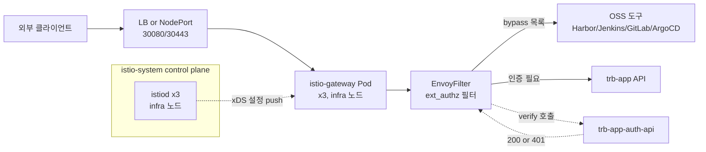

# Istio 설정 가이드

담당 범위는 Gateway 설정(태스크 08)이 중심이고, 후속 작업으로 예정된 VM mesh 통합(10-1)과 Cilium 마이그레이션(09)까지 묶어서 정리한다. Istio는 이미 기반 구성이 올라와 있는 경우가 많으므로, 이 문서는 "처음부터 설치"가 아니라 "어느 부분이 왜 이렇게 생겼는지 이해하고 values만 갈아 끼운다"에 초점을 둔다.

## 1. 역할과 데이터 흐름

Istio는 이 환경에서 **L7 Ingress Gateway + 외부 인증(ext_authz) 프록시** 역할을 한다. mTLS·DestinationRule·AuthorizationPolicy 같은 고급 기능은 쓰지 않으므로, 실질적으로 `istiod + istio-gateway + VirtualService + EnvoyFilter(ext_authz)` 네 요소만 이해하면 된다.



외부 요청은 Gateway Pod에 닿고, EnvoyFilter가 auth-api에 `/auth/api/verify`를 호출해 통과 여부를 결정한다. OSS 도구와 프론트엔드·SSE 같은 몇몇 경로는 이 필터를 건너뛴다(bypass).

## 2. 이미 알고 있는 것 (학습 자료 참조)

`…/runners-high/poc/03_CloudNative/03-service-mesh/` 26챕터를 통해 다음 내용은 학습이 끝났다고 본다.

- **제어 평면과 xDS**: istiod가 LDS/RDS/CDS/EDS로 Envoy에 설정을 밀어 넣는다. (`10-istio-architecture/`)
- **Gateway·VirtualService·DestinationRule**: 라우팅 CRD 역할 분담. (`12-istio-ingress-gateway/`, `13-istio-traffic-management/`)
- **mTLS 3모드**: STRICT/PERMISSIVE/DISABLE와 포트별 예외. 이 환경은 미사용. (`15-istio-security/`)
- **EnvoyFilter 고급 활용**: ext_authz, Lua, WASM. (`19-istio-envoyfilter/`)
- **Ambient Mesh**: 사이드카 없는 모드. 이 환경은 여전히 사이드카 주입 방식. (`22-istio-ambient-mesh/`)
- **Cilium 비교와 마이그레이션**: 왜 Cilium eBPF로 넘어가는지의 배경. (`24-ebpf-and-cilium/`, `26-migration-and-decision/`)

개념이 헷갈리면 위 챕터를 먼저 읽고 돌아오는 편이 실수가 적다.

## 3. 설치·운영에서 새로 알아야 할 개념

### Helm 차트가 세 개로 쪼개져 있다

설치 아티팩트가 단일 `istioctl install`이 아니라 Helm 차트 세 개로 분리되어 있다. 이 구조를 모르면 어디를 고쳐야 하는지 헷갈린다.

| 차트 경로 | 설치 대상 | 담당 |
|---|---|---|
| `helm-charts/istio-source/istiod` | istiod Pod (제어 평면) | 공식 istiod 차트를 Harbor 미러에 올려 둠 |
| `helm-charts/istio-source/gateway` | istio-gateway Pod (데이터 평면 진입점) | 공식 gateway 차트 |
| `helm-charts/tps-helm-ppp/istio-admin-routing-chart` | Gateway CRD, 모든 VirtualService, EnvoyFilter, TLS Secret | 프로젝트 전용 차트 |

실전 수정은 거의 세 번째 차트의 values만 건드린다. 앞 두 개는 replica 수와 nodeSelector 정도만 확인한다.

### `istio-admin-routing-chart`가 자동 생성하는 리소스

이 한 개 차트가 Gateway 라우팅 전체를 만든다. 템플릿을 뜯어 보면 서비스별 VirtualService가 이미 존재한다.

| 템플릿 | 생성 리소스 | 호스트 패턴 |
|---|---|---|
| `gateway.yaml` | `Gateway` CRD | `<domain>` + 와일드카드 |
| `gateway-vs.yaml` | `trb-app` 메인 라우팅 | `/auth/api`, `/common/api`, `/pipeline/api` 등 prefix |
| `harbor-vs.yaml` | Harbor core/portal | `harbor.<domain>` |
| `jenkins-vs.yaml` | Jenkins UI | `jenkins.<domain>` |
| `gitlab-vs.yaml` | GitLab + kas + registry | `gitlab.<domain>` 등 |
| `argocd-vs.yaml` | ArgoCD Server | `argocd.<domain>` |
| `grafana-vs.yaml` | Grafana/Prometheus/Alertmanager | `grafana.<domain>` 등 |
| `sonarqube-vs.yaml`, `nexus-vs.yaml`, `minio-vs.yaml`, `ldap-vs.yaml`, `scouter-vs.yaml` | OSS 도구들 | 각 `*.domain` |
| `envoyfilter.yaml` | `ext_authz` 필터 | Gateway 전 리스너에 적용 |
| `tls-secret.yaml` | TLS Secret (generate=true 시) | 자체 서명 인증서 |

따라서 "새 서비스를 Gateway에 붙이고 싶다"가 아니라면 새 YAML을 쓸 일이 없고, `values.yaml`의 도메인·TLS·authz 설정만 바꿔 주면 된다.

### ext_authz 필터의 요청 흐름

EnvoyFilter는 모든 요청이 업스트림으로 가기 전에 `trb-app-auth-api:/auth/api/verify`로 요청을 복제해 보낸다. 반환이 `200 OK`이면 원래 요청을 업스트림으로 넘기고, `401/403`이면 클라이언트에게 에러를 돌려준다.

```
요청 in → Envoy ── ext_authz ──▶ auth-api /auth/api/verify
                        │
                  ┌─────┴─────┐
                  ▼           ▼
              200 → 통과   401 → 차단
```

통과한 요청에는 auth-api가 돌려준 `userId`, `token`, `accessToken`, `authHeader` 헤더가 붙어 업스트림에 전달된다. 업스트림 마이크로서비스는 이 헤더를 신뢰해서 사용자 컨텍스트를 구성한다.

### bypass 목록이 있는 이유

Harbor·Jenkins·GitLab·ArgoCD 같은 OSS 도구는 각자 로그인 UI를 갖고 있어서 Istio ext_authz를 거치면 이중 인증이 된다. 또 `trb-auth-api` 자체가 호출되면 무한 재귀가 되므로 반드시 bypass에 넣는다. `sse`와 `react-app`(프론트)은 세션 생성 전에도 접근이 필요한 경로라서 bypass 대상이다. `authz.bypassRouteNames`에서 관리한다.

### `tps-helm-ppp/templates/`에 비슷한 리소스가 또 있다

`helm-charts/tps-helm-ppp/templates/gateway.yaml`과 `virtualservice.yaml`도 Istio 리소스를 만든다. 이건 `istio-admin-routing-chart`와 별개의 경로이며 `global.istio.enabled` 플래그로 켜고 끈다. 두 차트가 같은 Gateway 이름을 사용하면 충돌하므로, 신규 환경에서는 보통 `tps-helm-ppp`의 istio 관련 템플릿은 비활성화하고 `istio-admin-routing-chart`만 쓴다.

## 4. 실행 절차

### Step 1: istiod Pod 확인

```bash
kubectl get pods -n istio-system -l app=istiod
istioctl version
```

없으면 설치한다.

```bash
helm install istiod ./helm-charts/istio-source/istiod \
  -n istio-system --create-namespace \
  -f ./helm-charts/istio/istiod-values.yaml
```

`istiod-values.yaml`의 핵심은 세 줄이다.

```yaml
pilot:
  autoscaleEnabled: false      # autoscale 대신 고정 replica로 관리
  nodeSelector:
    node: infra                # infra 노드에 격리
  replicaCount: 3              # HA를 위해 3개
```

### Step 2: Gateway Pod 확인

```bash
kubectl get pods -n istio-system -l istio=gateway
```

없으면 설치한다.

```bash
helm install istio-gateway ./helm-charts/istio-source/gateway \
  -n istio-system \
  -f ./helm-charts/istio/istio-gateway-values.yaml
```

`topologySpreadConstraints`가 의미하는 것은 "3개의 Gateway Pod을 서로 다른 infra 노드에 분산시키되, 한 노드만 남으면 스케줄을 포기한다(`DoNotSchedule`)"이다. 단일 노드 장애에도 Gateway가 살아 있어야 하기 때문이다.

### Step 3: istio-admin-routing-chart 배포

환경에 맞게 values를 수정한다. BOK에서 이 환경으로 넘어올 때 바뀌는 값만 추린 표이다.

| 필드 | BOK 기본값 | 이 환경에서 바꾸기 |
|---|---|---|
| `domain` | `bok.trombone.okestro.cloud` | 새 환경 `${DOMAIN}` |
| `gateway.selector.istio` | `gateway` | Gateway Pod 라벨 그대로 |
| `gateway.tls.secretName` | `bok-trombone-okestro-cloud-tls` | 새 TLS Secret 이름 |
| `gateway.tls.generate` | `true` | 개발계는 자체 서명으로 `true` 유지 |
| `gateway.tls.targetNamespaces` | `[trb-app, istio-system]` | 필요 시 네임스페이스 추가 |
| `authz.enabled` | `true` | 운영 유지 |
| `authz.authService.host` | `trb-app-auth-api.trb-app.svc.cluster.local` | 그대로 유지 |
| `authz.bypassRouteNames` | Harbor/Jenkins/GitLab/ArgoCD/프론트/SSE/auth-api | OSS 추가 시 여기에 넣기 |

```bash
helm install istio-admin-routing ./helm-charts/tps-helm-ppp/istio-admin-routing-chart \
  -n istio-system \
  -f ./helm-charts/istio/istio-admin-routing-values.yaml
```

### Step 4: 검증

```bash
# 리소스 생성 확인
kubectl get gateway,virtualservice,envoyfilter -A

# 도메인별 접속
curl -I http://<DOMAIN>/
curl -I http://harbor.<DOMAIN>/
curl -I http://jenkins.<DOMAIN>/
curl -I http://grafana.<DOMAIN>/

# 인증 통과 테스트
curl -I -H "Authorization: Bearer <token>" https://<DOMAIN>/common/api/health

# Envoy 라우팅 테이블 확인 (실제로 어떤 cluster로 가는지)
istioctl proxy-config routes <istio-gateway-pod> -n istio-system
istioctl proxy-config listeners <istio-gateway-pod> -n istio-system
```

## 5. VM mesh 통합 (태스크 10-1 요약)

K8s 밖 VM(예: 레거시 API 서버)을 Istio 메시에 편입하는 시나리오이다. 현재 담당 범위에는 없지만 나중에 확장될 때를 위해 개념만 짚어 둔다.

- **East-West Gateway**: 클러스터 안팎 워크로드가 서로를 발견하도록 만드는 내부용 Gateway. 기존 Ingress Gateway와 분리해서 둔다.
- **WorkloadGroup / WorkloadEntry**: VM을 Kubernetes Service처럼 다루기 위한 CRD. WorkloadGroup은 "그룹 템플릿", WorkloadEntry는 "개별 VM 인스턴스"이다.
- **VM 측 istio-proxy 설치**: VM에 `istio-sidecar.deb`/`rpm`을 설치하고 root CA와 토큰을 받아 등록한다.

언제 쓰는가: 이 환경에서는 모두 K8s Pod로 떠 있으므로 필요 없다. BOK의 Scouter(레거시 APM) 같은 VM 기반 서비스를 메시에 붙여야 할 때만 검토한다. 상세 단계는 원본 `~/okestro/tps_manifest/tasks/dev-3.0.5.1p/10-1-istio-vm-mesh-integration-guide.md`를 본다.

## 6. Cilium 마이그레이션 (태스크 09 요약)

장기적으로 Istio를 걷어내고 Cilium Gateway API로 옮길 계획이 있다. 현재는 **계획 단계**이며 실행 시점은 별도 공지된다. 전체 그림은 다음과 같다.

### 왜 옮기는가

Istio 사이드카 46개 × 128MB ≈ **약 5.8GB 메모리**와 istiod/gateway/CNI까지 합치면 **약 8GB + 컨테이너 54개**가 사이드카 오버헤드로 쓰인다. Cilium eBPF는 커널 레벨에서 트래픽을 처리해 사이드카를 없애고 이 자원을 반환한다. 현재 Istio 사용 수준이 낮다는 점(mTLS·AuthorizationPolicy·DestinationRule 모두 미사용)이 전환 가능성을 높인다.

### 마이그레이션 단계 요약

1. **사전 준비** (무중단): Gateway API CRD 설치, Cilium `gatewayAPI.enabled=true`, TLS Secret을 `cilium` NS로 복사.
2. **병행 운영** (무중단): `Gateway`와 18개 `HTTPRoute`를 생성하고, 기존 Istio와 다른 NodePort(31080/31443)로 테스트.
3. **ext_authz 대체** (가장 위험): `EnvoyFilter`를 `CiliumEnvoyConfig`로 옮기거나 애플리케이션 레벨 인증으로 전환. `CiliumEnvoyConfig` 방식이 1순위.
4. **전환** (순단 발생): Cilium Gateway를 기존 NodePort(30080/30443)로 바꾸고, `kubectl rollout restart`로 사이드카 제거.
5. **정리**: VirtualService/Gateway(Istio)/EnvoyFilter/차트/CRD를 순서대로 삭제.
6. **사후**: WireGuard 암호화, Hubble UI 활성화 (선택).

### 롤백 포인트

각 단계 직후 원복 명령이 있다. 특히 3단계(ext_authz 대체)가 실패하면 사이드카를 아직 제거하지 않은 상태이므로 `CiliumEnvoyConfig`만 삭제하고 기존 EnvoyFilter를 남겨 두면 된다. 4단계에서 실패하면 사이드카를 다시 주입(`istio-injection=enabled`) 후 `rollout restart`로 복원한다. 상세 절차는 원본 `09-istio-to-cilium-migration-plan.md`를 본다.

## 7. 트러블슈팅과 주의사항

- **Gateway가 떴는데 404만 나온다**: VirtualService의 `hosts`가 Gateway의 `hosts`와 일치하지 않는다. `istioctl proxy-config routes`로 실제 매칭 패턴을 확인한다.
- **HTTPS 접속 시 인증서 오류**: `gateway.tls.secretName`과 실제 Secret 이름이 다르거나, Secret이 `istio-system`이 아닌 네임스페이스에 있으면 Gateway가 인식하지 못한다. `targetNamespaces`로 복사한다.
- **ext_authz 적용 후 모든 경로가 401**: `bypassRouteNames`에 auth-api 자체와 프론트가 빠져 있어 사용자가 로그인 페이지에 닿지 못한다. bypass 목록부터 확인한다.
- **`tps-helm-ppp`와 `istio-admin-routing-chart`가 같은 Gateway를 만들려고 한다**: `global.istio.enabled=false`로 `tps-helm-ppp` 쪽을 꺼 둔다.

## 8. 참고 경로

- 원본 plan: `~/okestro/tps_manifest/tasks/dev-3.0.5.1p/08-istio-gateway-setup-plan.md`
- VM mesh: `~/okestro/tps_manifest/tasks/dev-3.0.5.1p/10-1-istio-vm-mesh-integration-guide.md`
- Cilium 전환: `~/okestro/tps_manifest/tasks/dev-3.0.5.1p/09-istio-to-cilium-migration-plan.md`
- 학습 챕터: `…/runners-high/poc/03_CloudNative/03-service-mesh/learning/` 10, 12, 15, 19, 22, 24, 26
- 내부 문서: `docs/istio/` (19개 상세 분석, BOK 환경에서 작성됨)
