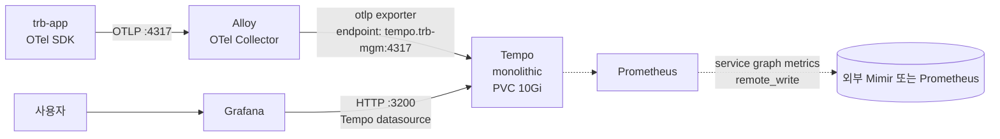

# Grafana Tempo 설치 가이드

`trb-mgm` 네임스페이스에 Tempo를 monolithic 모드로 올리고, Alloy(OTLP 수집기)에서 trace를 받아 Grafana에서 조회할 수 있게 한다. 가장 주의할 점은 분산(distributed) 모드가 아니라는 것이다.

## 1. 역할과 데이터 흐름

Tempo는 분산 트레이싱 백엔드이다. `trb-app` 마이크로서비스가 OpenTelemetry SDK로 span을 내보내면 Alloy가 받아서 Tempo에 포워딩하고, Grafana의 Explore 탭에서 trace_id로 조회한다. 이 환경은 로그(Loki) 및 메트릭(Prometheus)와 함께 삼위일체로 구성된다.



세 포트를 기억하면 된다. `4317`은 OTLP gRPC 수신, `4318`은 OTLP HTTP 수신, `3200`은 Grafana가 붙는 Tempo query API이다.

## 2. 이미 알고 있는 것 (학습 자료 참조)

`…/runners-high/write/04_Monitoring/02-04. Grafana Tempo.md`에서 이미 학습한 개념은 다음과 같다.

- **인덱스리스 저장**: Tempo는 trace_id를 키로 직접 조회한다. 별도 인덱스를 만들지 않고 Loki/Prometheus에서 trace_id를 추출해 들어오는 흐름을 전제한다.
- **Span·Trace·Attributes**: 부모-자식 관계, 속성 타입.
- **TraceQL**: Tempo 2.0+의 쿼리 언어. 인덱스 없이도 필터링 가능.
- **Service Graph·Span Metrics**: Tempo가 Prometheus remote_write로 메트릭을 내보낼 수 있다.
- **배포 모드 비교**: monolithic(단일 프로세스)과 distributed(distributor·ingester·querier·compactor 분리).

이 배경지식을 전제로 "왜 이 환경은 monolithic인가", "values의 어느 필드가 무엇을 바꾸는가"에 집중한다.

## 3. 설치·운영에서 새로 알아야 할 개념

### 이번 배포는 monolithic 모드이다

학습 자료는 distributed 모드 운영까지 다뤘지만, 이 환경은 개발계 규모라 distributor/ingester/querier/compactor를 한 프로세스에 몰아넣는 monolithic을 쓴다. 장점은 스케일링이 필요 없고 리소스 `requests 100m/256Mi`, `limits 500m/512Mi` 수준으로 충분하다는 것이다. 단점은 수평 확장이 안 되므로, 운영에서 trace 양이 급증하면 distributed로 전환해야 한다. 지금은 그 시점이 아니다.

### 로컬 스토리지 + PVC 10Gi + 72h 보존

`storage.trace.backend: local`과 `persistence.enabled: true`가 함께 들어간다. 운영계에서는 S3/GCS/MinIO 같은 객체 스토리지를 쓰지만 개발계는 NFS PVC 10Gi로도 72시간 치 trace를 담기 충분하다. retention을 늘리려면 PVC 크기도 같이 키워야 한다. 일반적으로 "1일치 trace = 대략 몇 GB"인지는 서비스 요청량에 달렸으므로, 첫 주 운영 후 `kubectl exec` 로 Tempo Pod 안의 `/var/tempo` 사용량을 보고 조정한다.

### 세 포트의 용도

| 포트 | 프로토콜 | 누가 붙는가 |
|---|---|---|
| 4317 | OTLP gRPC | Alloy, OTel Collector, 또는 앱이 직접 |
| 4318 | OTLP HTTP | 브라우저, HTTP만 쓰는 클라이언트 |
| 3200 | HTTP | Grafana Tempo datasource, TraceQL 쿼리 |

4317과 4318은 수신(ingestion)용이고, 3200은 조회(query)용이다. 3200은 `GET /api/search`, `GET /api/traces/<trace_id>` 같은 REST 엔드포인트를 연다.

### Alloy가 Tempo의 앞단이다

Alloy는 Grafana가 OTel Collector를 대체하려고 만든 통합 수집기이다. HCL 문법으로 구성하며, 여기서는 `otelcol.receiver.otlp` → `otelcol.exporter.otlp "tempo"` 파이프라인을 쓴다.

```hcl
otelcol.exporter.otlp "tempo" {
  client {
    endpoint = "tempo.trb-mgm.svc.cluster.local:4317"
    tls { insecure = true }
  }
}
```

`tls { insecure = true }`는 클러스터 내부 통신이라 TLS를 끈 것이다. Zero-trust를 강하게 적용하는 환경이면 mTLS를 켜야 하지만 개발계에서는 내부망 신뢰 전제로 끈다. 운영계로 가면 WireGuard(Cilium) 또는 Istio mTLS가 이 구간을 자동으로 암호화한다.

### Grafana 데이터소스 설정

Grafana가 Tempo를 모르면 Explore 탭에서 trace를 조회할 수 없다. `datasources.yaml`에 다음을 넣는다.

```yaml
datasources:
  - name: Tempo
    type: tempo
    url: http://tempo.trb-mgm.svc.cluster.local:3200
    access: proxy
    uid: tempo
    jsonData:
      tracesToLogsV2:
        datasourceUid: loki
      serviceMap:
        datasourceUid: prometheus
```

`tracesToLogsV2`와 `serviceMap` 연결은 Grafana가 trace → log, trace → metric으로 점프할 수 있게 한다. Loki와 Prometheus의 datasource `uid`가 먼저 정해져 있어야 한다.

## 4. 실행 절차

### 사전 준비

1. StorageClass `nfs-csi`가 동작하는지 확인한다. PVC 10Gi를 프로비저닝할 수 있어야 한다.
2. Harbor에 `trb/tempo:v2.10.3` 이미지가 있는지 확인한다.

### values-dev.yaml 편집 포인트

`helm-charts/tempo/values-dev.yaml`에서 환경이 바뀔 때 반드시 보는 필드이다.

| 필드 | 기본값 | 이번 환경에서 |
|---|---|---|
| `tempo.registry` | `harbor.dev.console.trombone.okestro.cloud` | 새 Harbor 주소 |
| `tempo.tag` | `v2.10.3` | 유지(확인만) |
| `tempo.retention` | `72h` | 유지. 늘리면 `persistence.size`도 같이 |
| `receivers.otlp.protocols.grpc.endpoint` | `0.0.0.0:4317` | 유지 |
| `receivers.otlp.protocols.http.endpoint` | `0.0.0.0:4318` | 유지 |
| `storage.trace.backend` | `local` | 유지 (운영은 `s3`) |
| `persistence.enabled` | `true` | 유지 |
| `persistence.size` | `10Gi` | 개발계 기본값 |
| `persistence.storageClassName` | `nfs-csi` | StorageClass 확인 |
| `resources.requests` / `limits` | `100m/256Mi` / `500m/512Mi` | 유지 |

### 배포: 직접 Helm vs ArgoCD

두 가지 경로가 있다. 권장은 **ArgoCD app-of-apps**이다. Tempo가 `argocd-apps/app-of-apps/charts/trb-mgm/values-dev.yaml`의 `tempo.enabled: true`에 달려 있기 때문에, 이 값만 켜면 ArgoCD가 자동으로 Application을 만든다.

```bash
# 방법 A: 직접 Helm (초기 검증용)
helm install tempo ./helm-charts/tempo \
  -n trb-mgm --create-namespace \
  -f ./helm-charts/tempo/values-dev.yaml

# 방법 B: ArgoCD (권장, 운영 경로)
# argocd-apps/app-of-apps/charts/trb-mgm/values-dev.yaml 에서
# tempo.enabled: true 로 설정 후 git commit + ArgoCD Sync
```

직접 Helm으로 시작해서 동작을 확인한 뒤 ArgoCD로 넘어가면 `helm uninstall` 후 ArgoCD Sync 순서로 한 번 리소스 재생성이 발생한다. 가능하면 처음부터 ArgoCD 경로로 가는 편이 이력 관리에 낫다.

### 검증 체크리스트

```bash
# 1) 파드
kubectl get pods -n trb-mgm -l app.kubernetes.io/name=tempo
# Running 상태여야 한다.

# 2) PVC
kubectl get pvc -n trb-mgm | grep tempo
# STATUS=Bound, CAPACITY=10Gi

# 3) Service와 포트
kubectl get svc -n trb-mgm | grep tempo
# 4317, 4318, 3200 포트가 열려 있어야 한다.

# 4) 내부 호출로 헬스 확인
kubectl run curl --rm -it --image=curlimages/curl -n trb-mgm -- \
  curl -s http://tempo.trb-mgm.svc.cluster.local:3200/ready
# "ready" 응답

# 5) Alloy에서 Tempo로 trace 하나 흘려보기
# trb-app 중 아무 API 한 번 호출 → Alloy 로그에서 "exporter.otlp.tempo" 관련 로그 확인

# 6) Grafana Explore → Tempo datasource → Service Name으로 검색
# trace가 한 건이라도 잡히면 파이프라인 정상
```

## 5. 트러블슈팅과 주의사항

- **PVC Pending**: StorageClass가 `nfs-csi`로 맞는지, NFS 프로비저너 파드가 Running인지 본다. 다른 NS의 PVC가 모두 정상이면 Tempo values의 `storageClassName` 오탈자를 확인한다.
- **Alloy 로그에 `connection refused`**: endpoint를 `tempo.trb-mgm.svc.cluster.local:4317`로 정확히 적었는지, 포트 4317이 열려 있는지 확인한다. ClusterIP 서비스가 정상이면 DNS 문제일 가능성이 크다.
- **Grafana에서 trace가 안 보인다**: datasource URL이 `http://tempo.trb-mgm.svc.cluster.local:3200`으로 가야 한다. 4317(gRPC)을 적어두는 실수가 잦다.
- **retention을 늘렸는데 디스크 꽉 참**: retention만 바꾸고 `persistence.size`를 늘리지 않으면 Compactor가 만든 블록이 PVC를 다 차지한다. PVC 확장을 같이 적용한다.
- **이미지 pull 실패**: Harbor에 `trb/tempo:v2.10.3`이 있는지, `tempo.registry` 필드가 정확한 Harbor 도메인을 가리키는지 본다. Helm 차트 공식 이미지 저장소(`grafana/tempo`)를 그대로 두면 폐쇄망에서는 풀이 안 된다.

## 6. 참고 경로

- 원본 plan: `~/okestro/tps_manifest/tasks/dev-3.0.5.1p/07-tempo-install-plan.md`
- 학습: `…/runners-high/write/04_Monitoring/02-04. Grafana Tempo.md`
- Grafana 공식 문서(폐쇄망이면 사내 미러): Tempo Helm chart README
- 관련 스택 챕터: `…/runners-high/write/04_Monitoring/` 전체 (Prometheus, Loki, Alloy)
