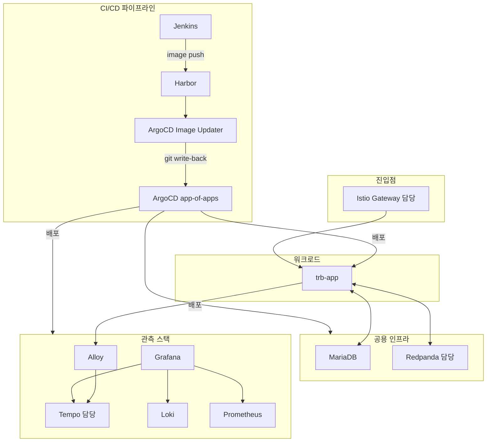

# 담당 외 태스크 참고

dev-3.0.5.1p 환경 구축에는 총 10개 태스크가 있다. 그중 Redpanda(01)·Tempo(07)·Istio(08,09,10)가 내 담당이고, 나머지는 다른 사람 또는 공용 인프라 담당자가 처리한다. 다만 담당이 아니더라도 같은 클러스터에서 돌아가기 때문에 의존성·실패 신호를 알아둘 필요가 있다. 각 항목은 "한 줄 정의 → 이 환경에서의 역할 → 내 담당과의 접점 → 원본 plan 링크" 순으로 짧게 정리한다.

## 02. MariaDB 설치 (Galera 클러스터)

**한 줄 정의**: `trb-app` 마이크로서비스가 JDBC로 접속하는 OLTP 데이터베이스. MariaDB Operator가 CRD 기반으로 Galera 다중 노드 클러스터를 관리한다.

**이 환경에서의 역할**: TPS/config/PMS 세 개 데이터베이스가 떠 있고, backend-common-cm ConfigMap에 JDBC URL이 박혀 있다. 새 환경에서는 `helm-charts/tps-helm/values/values-dev.yaml`의 `TRB_DATASOURCE_JDBC_URL`, `CONFIG_DATASOURCE_JDBC_URL`, `PMS_DATASOURCE_JDBC_URL`을 새 네임스페이스로 교체하는 것이 핵심 작업이다. NodePort 30306/30307/30308이 외부 접속용으로 열린다.

**내 담당과의 접점**: Tempo와 Redpanda는 독립 스토리지(PVC/hostPath)를 쓰므로 MariaDB와 직접 의존이 없다. 다만 `trb-app`이 MariaDB 접속에 실패하면 OTLP trace가 아예 뜨지 않아 Tempo 쪽 검증이 막힐 수 있으니 "앱이 안 떠서 trace가 없는 것"과 "Tempo 파이프라인 자체 문제"를 구분할 때 MariaDB 상태를 먼저 본다.

**원본 plan**: `~/okestro/tps_manifest/tasks/dev-3.0.5.1p/02-mariadb-install-plan.md`

## 03. Jenkins Agent 이관

**한 줄 정의**: 기존 정적 Jenkins agent를 Kubernetes 동적 Pod 에이전트로 전환한다. JNLP inbound-agent + Kaniko 사이드카 조합으로 컨테이너 이미지까지 빌드한다.

**이 환경에서의 역할**: `values-dev.yaml`의 `agent.enabled`를 `false`에서 `true`로 바꾸고 BOK 환경(`values-bok.yaml`)의 패턴을 참고한다. 파이프라인은 `agent { kubernetes { label 'k8s-agent' } }` 블록으로 동적 Pod를 요청한다. `containerCap: 2`라 동시 빌드 상한은 두 개다.

**내 담당과의 접점**: Istio Gateway에 `jenkins-vs.yaml` 라우팅이 포함되어 있어, Jenkins가 에이전트 구조를 바꿔도 Gateway 설정은 그대로다. 단 Jenkins UI가 `jenkins.<DOMAIN>`으로 접속되지 않는다면 Gateway 문제인지 Jenkins Pod 문제인지 구분해야 한다. agent Pod는 JNLP 포트(50000)로 컨트롤러에 붙으므로 Istio 사이드카 주입 대상이 아니다.

**원본 plan**: `~/okestro/tps_manifest/tasks/dev-3.0.5.1p/03-jenkins-agent-migration-plan.md`

## 04. ArgoCD Image Updater 설치

**한 줄 정의**: Harbor 레지스트리에서 새 이미지 태그를 폴링해 ArgoCD Application의 Helm values를 자동으로 업데이트하고 Git에 write-back하는 컨트롤러.

**이 환경에서의 역할**: `trb-app`의 12개 모듈(auth-api, common-api, pipeline-api 등)마다 4개 어노테이션이 붙어 있고, Harbor에 `YYYYMMDD-HHMMSS` 형식 태그가 올라오면 자동으로 `values-dev.yaml`을 업데이트한다. `tokenInit.enabled: true`로 post-upgrade Job이 `image-updater` 계정 토큰을 자동 생성한다. `bitbucket-creds`와 `harbor-creds` 두 시크릿이 필수.

**내 담당과의 접점**: Tempo와 Redpanda도 ArgoCD Application으로 관리되지만 Image Updater 대상은 아니다(인프라 이미지는 수동으로 Harbor에 올린 뒤 values의 `tag` 필드를 고정한다). 따라서 Image Updater가 꺼져 있어도 내가 담당하는 컴포넌트에는 영향이 없다. 앱 이미지 자동 배포의 전제 조건이라는 정도만 알고 있으면 된다.

**원본 plan**: `~/okestro/tps_manifest/tasks/dev-3.0.5.1p/04-argocd-image-updater-install-plan.md`

## 05. Jenkins 파이프라인 생성

**한 줄 정의**: `trb-app` 모듈별 CI 파이프라인을 Jenkins에 등록한다. backend(Gradle Jib), frontend(Docker), SSE, all-backend 네 종류.

**이 환경에서의 역할**: `TROMBONE-CICD/backend`, `frontend`, `sse`, `all-backend` 폴더 구조로 파이프라인을 만들고, Jenkins Credentials로 `harbor-credentials`·`bitbucket-credentials`를 등록한다. 빌드 결과물은 `<HARBOR_URL>/trb/<모듈>:YYYYMMDD-HHMMSS` 태그로 Push된다. Shared Library(`cicd/shared-lib/`)를 등록하면 환경별 설정이 재사용된다.

**내 담당과의 접점**: 내 담당 컴포넌트(Tempo/Redpanda/Istio)는 인프라 쪽이라 이 CI 파이프라인의 산출물을 받지 않는다. 다만 파이프라인이 돌아가야 04(Image Updater)가 감지할 이미지가 생기고, 결과적으로 `trb-app`이 배포되어 OTLP trace·Kafka produce·Gateway 라우팅 검증이 가능해지는 시작점이다.

**원본 plan**: `~/okestro/tps_manifest/tasks/dev-3.0.5.1p/05-jenkins-pipeline-creation-plan.md`

## 06. TRB-app App-of-Apps 등록

**한 줄 정의**: ArgoCD에 세 개 루트 Application(`trb-app`, `trb-mgm`, `trb-oss`)을 등록해, 각 루트가 하위 Application들을 Helm 템플릿으로 생성하는 app-of-apps 패턴의 엔트리포인트.

**이 환경에서의 역할**: `argocd-apps/app-of-apps/dev/`의 세 Application YAML을 `kubectl apply`로 ArgoCD에 등록한다. `trb-oss`가 Harbor/Jenkins/GitLab/Nexus/MinIO/LDAP/SonarQube를 낳고, `trb-mgm`이 Prometheus/Loki/Tempo/Alloy를 낳고, `trb-app`이 마이크로서비스를 낳는다. 등록 순서는 `trb-oss → trb-mgm → trb-app` 권장.

**내 담당과의 접점**: 내 **Tempo**는 `trb-mgm`의 하위 Application으로 자동 생성된다. 따라서 03-tempo.md의 "ArgoCD 경로" 검증은 여기 `argocd-apps/app-of-apps/charts/trb-mgm/values-dev.yaml`의 `tempo.enabled: true`로 이어진다. **Redpanda**는 현재 `trb-oss` 차트에 포함되어 있지 않아 Helm 직접 설치 경로가 주가 된다. **Istio**는 `istio-system`이 app-of-apps 밖에 있어 별도로 관리된다.

**원본 plan**: `~/okestro/tps_manifest/tasks/dev-3.0.5.1p/06-trb-app-app-of-apps-plan.md`

## 전체 관계도

한 장으로 보면 이 환경은 다음과 같이 엮여 있다.

내가 담당하는 네 개 박스(Redpanda·Tempo·Istio·Istio의 09/10 후속)를 볼 때, 배포의 "물줄기"는 CI/CD(03~05) → App-of-Apps(06) → 공용 인프라(02) → 관측·메시징(07, 01) → 진입점(08)으로 흐른다는 감각을 갖고 있으면 어느 한 박스가 안 뜰 때 어디부터 봐야 할지 판단이 빠르다.

## 추가로 살필 만한 원본 문서

- `~/okestro/tps_manifest/tasks/dev-3.0.5.1p/00-new-env-setup-index.md`: 전체 태스크 인덱스와 진행 순서
- `~/okestro/tps_manifest/tasks/dev-3.0.5.1p/env-config.md`: 모든 변수 한 자리에 모아둔 시트
- `~/okestro/tps_manifest/tasks/dev-3.0.5.1p/trombone-cicd-install-guide.md`: Confluence와 연결된 CI/CD 설치 가이드(링크만 존재할 수 있음)
