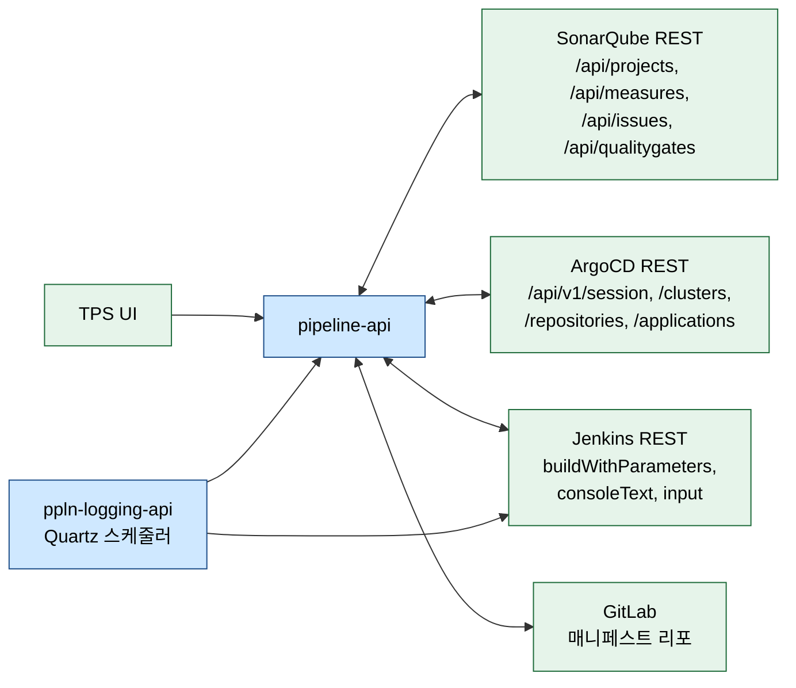

# SonarQube · ArgoCD 문서 인덱스

---

> 목적: pipeline-api와 ppln-logging-api의 정적분석/배포 관련 유스케이스 문서를 한자리에서 찾기 위한 내비게이션.
> 작성일: 2026-04-18
> 대상 독자: 두 모듈의 SonarQube/ArgoCD 흐름을 처음 접하는 개발자.

## 1. 읽는 순서

처음 읽는다면 01 → 02 → 03 → 04 → 05 → 06 → 07 → 08 → 09 순서를 권장한다. SonarQube와 ArgoCD를 각각 "정의 → 실행 → 결과 → 조회/관리" 순으로 따라가는 편이 자연스럽다. 특정 기능만 급히 파악해야 한다면 아래 유스케이스 매핑에서 바로 해당 문서로 이동한다.

## 2. 문서 목록

| # | 파일 | 다루는 내용 | 핵심 클래스 |
|---|------|-------------|-------------|
| 01 | `01_시스템_개요와_책임_분담.md` | 두 모듈 + 외부 시스템 통합도, 책임 경계 | - |
| 02 | `02_소나큐브_프로젝트_생명주기.md` | 생성/수정/삭제 (UC-S1·S2·S3) | `AnalysisManagementService` |
| 03 | `03_소나큐브_분석_실행_흐름.md` | 수동/트리거 실행 (UC-S4) | `PipelineProcessor.executeJenkinsTestPipeline` |
| 04 | `04_소나큐브_분석_결과_수집_경로.md` | Jenkins 로그 파싱 → pipeline-api 통지 | `LogWriterImpl`, `PipelineApiFeignClient` |
| 05 | `05_소나큐브_결과_조회와_이슈_관리.md` | 메트릭/품질 게이트/이슈 (UC-S5·S6) | `AnalysisService`, `AnalysisV3Controller` |
| 06 | `06_ArgoCD_연동_기반.md` | 세션/클러스터/리포지토리 (UC-A1·A2) | `ArgoCdClusterService`, `ArgoCdFeignClient` |
| 07 | `07_ArgoCD_Application_동기화_배포.md` | sync + syncDeploy 콜백 (UC-A3) | `ArgoCdApplicationServiceImpl.syncApplication` |
| 08 | `08_ArgoCD_Manifest_관리.md` | 매니페스트 CRUD (UC-A4) | `ManifestServiceImpl` |
| 09 | `09_ArgoCD_롤백_흐름.md` | conveyFailToDeploy → 매니페스트 복원 (UC-A5) | `ManifestWriterImpl.rollbackManifest` |
| 10 | `10_SonarQube_API_레퍼런스.md` | 사용 중 SonarQube API 17개 전수 표 + 미사용 공식 API 후보 | `SonarQubeFeignClient`, `SonarQubeFeignEnum` |
| 11 | `11_ArgoCD_API_레퍼런스.md` | 사용 중 ArgoCD API 18개 전수 표 + 미사용 공식 API 후보 | `ArgoCdFeignClient` |

## 3. 유스케이스 ↔ 문서 매핑

SonarQube(정적분석)는 6개 유스케이스, ArgoCD(배포)는 5개 유스케이스를 다룬다.

| UC | 이름 | 모듈 | 문서 | 대표 엔드포인트 |
|----|------|------|------|------------------|
| UC-S1 | 소나큐브 프로젝트 생성 | pipeline-api | 02 | `POST /analysis_mng/v3/create` |
| UC-S2 | 소나큐브 프로젝트 수정 | pipeline-api | 02 | `POST /analysis_mng/v3/update` |
| UC-S3 | 소나큐브 프로젝트 삭제 | pipeline-api | 02 | `POST /analysis_mng/v3/delete_list` |
| UC-S4 | 소나큐브 수동 실행 | pipeline-api | 03 | `POST /analysis_mng/v3/manual/execute/{intgrtdMngSn}` |
| UC-S4b | 소나큐브 트리거 실행 | pipeline-api | 03 | `POST /analysis/v3/execute` |
| UC-S4c | 단위테스트·정적분석 결과 수집 | ppln-logging-api → pipeline-api | 04 | Quartz `LogCollectorV2Job` → `/jUnit/v3/update/history`, `/analysis/v3/update/history`, `/analysis/v3/update/manual/history` |
| UC-S5 | 메트릭·품질 게이트 조회 | pipeline-api | 05 | `POST /analysis/v3/select_list/measure/result`, `GET /select_measures/component/{key}/{branch}` |
| UC-S5b | 분석 결과 목록 조회 | pipeline-api | 05 | `GET /analysis/v3/select_list/analysis/result` |
| UC-S6 | 이슈 상태 변경 4종 | pipeline-api | 05 | `POST /update_issues/set_type|set_severity|set_status|set_assignee` |
| UC-A1 | ArgoCD 클러스터 연결 | pipeline-api | 06 | `POST /argocd/v1/cluster/...` |
| UC-A2 | ArgoCD 리포지토리 연결 | pipeline-api | 06 | `POST /argocd/v1/repository/...` |
| UC-A3 | Application 동기화 배포 | pipeline-api + ppln-logging-api | 07 | `POST /pipeline/api/manifest/v3/update/deploy` (콜백), 내부 `syncApplication` |
| UC-A4 | 매니페스트 관리 | pipeline-api | 08 | `POST/GET/DELETE /argocd/v1/manifest/...` |
| UC-A5 | 배포 실패 자동 롤백 | pipeline-api + ppln-logging-api | 09 | `POST /pipeline/api/manifest/v3/rollback` (콜백) |

## 4. 외부 시스템 매핑

SonarQube/ArgoCD/Jenkins/GitLab 네 외부 시스템과 얽혀 있고, pipeline-api가 네 곳 모두를 호출하는 허브다. ppln-logging-api는 Jenkins 로그만 주로 긁어서 pipeline-api에 통지하는 전용 관찰자 역할이다.

## 5. 코드 주 진입점 요약

| 모듈 | 역할 | 주 파일 |
|------|------|---------|
| pipeline-api | SonarQube 도메인 전체 (v3) | `v3/presentation/sonarqube/api/*`, `v3/application/sonarqube/*`, `v3/domain/sonarqube/*` |
| pipeline-api | ArgoCD 도메인 (v2) | `v2/application/argocd/v2/*`, `v2/domain/argocd/v2/*`, `v2/infrastructure/config/argocd/v2/ArgoCdFeignClient.java` |
| pipeline-api | 매니페스트 롤백 (v3) | `v3/domain/manifest/impl/ManifestWriterImpl.java` |
| ppln-logging-api | 로그 수집/파싱 (v3) | `v3/domain/log/service/impl/LogWriterImpl.java` |
| ppln-logging-api | 트리거 감시 (v3) | `v3/domain/trigger/service/impl/TriggerWriterImpl.java` |
| ppln-logging-api | pipeline-api 콜백 | `v3/infrastructure/external/client/PipelineApiFeignClient.java` |

## 6. 읽을 때 주의할 모호점

- **v2/v3 공존** — SonarQube는 v3, ArgoCD는 v2가 현행이다. 같은 이름의 클래스가 두 패키지에 있으면 어느 쪽이 현재 쓰이는지 먼저 확인한다.
- **환경코드** — `DEV/TST/PRD/ETC/SQA/JNT/STG` 등 코드 값에 따라 흐름이 여러 군데에서 분기한다. `EnvironmentCode`, `JenkinsConstant`의 상수를 함께 본다.
- **조회 API의 side effect** — 05 문서에서 다룬 `selectSonarQubeAnalysisResultList`처럼 조회 메서드가 상태 업데이트를 겸하는 경우가 있다. 순수 조회로 보면 안 된다.
- **TPS200 응답 계약** — 롤백(`/manifest/v3/rollback`)과 sync 콜백(`/manifest/v3/update/deploy`)은 내부 실패와 무관하게 TPS200을 돌려준다. 실제 상태는 DB 컬럼(`recovrySttsCd`, `logCollectSttsCd`, `chckSttsCd`)으로 확인한다.

## 7. 관련 문서

- 같은 상위 폴더의 `tps_pipeline/` — TPS 파이프라인 생성·실행 전반 기준 문서. 이 문서는 그 연장선에서 SonarQube/ArgoCD 축을 분리해 다룬다.
- `executor/` — Redpanda Playground executor 학습 자료. 본 문서와 직접적 연관은 없으나 작성 스타일 참고용.
