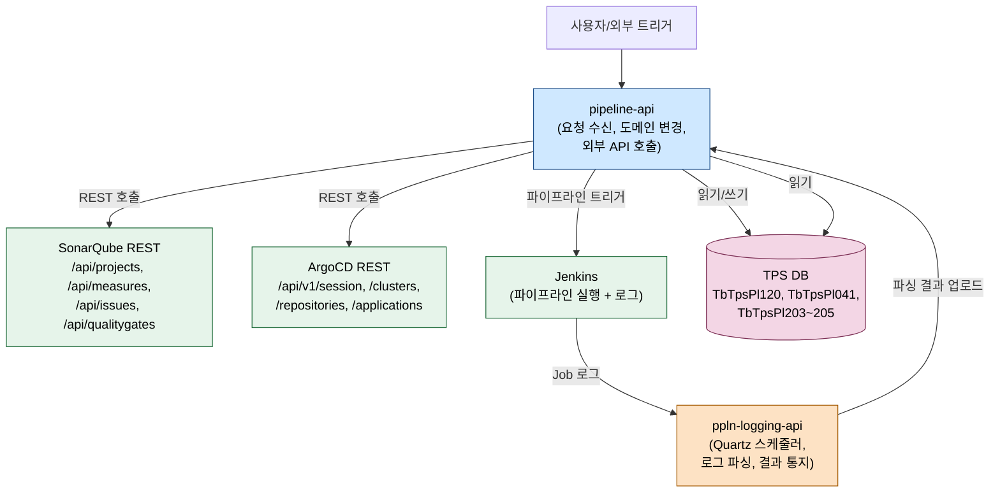
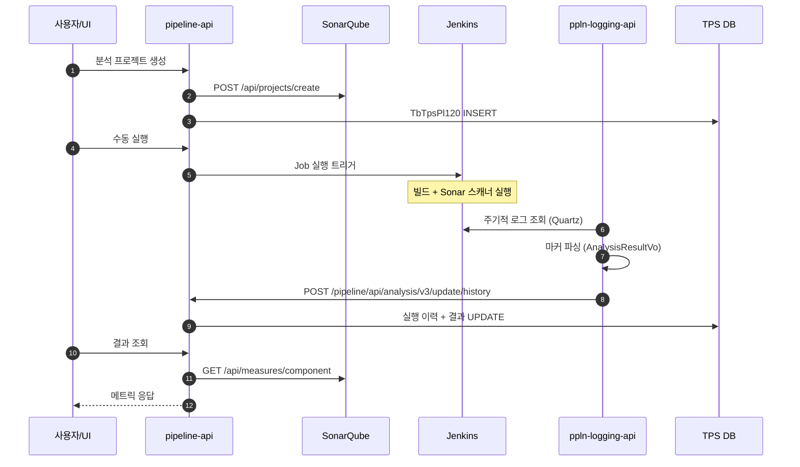

# 시스템 개요와 책임 분담

---

> 목적: pipeline-api와 ppln-logging-api 두 모듈이 SonarQube와 ArgoCD를 다룰 때 어떻게 역할을 나누는지 한 장으로 정리한다.
> 작성일: 2026-04-18
> 대상 코드: `pipeline-api/src/main/java/org/okestro/tps/pipeline/`, `ppln-logging-api/src/main/java/.../`

## 1. 결론

정적분석(SonarQube)과 배포(ArgoCD)는 두 모듈이 함께 처리한다. pipeline-api는 사용자 요청을 받아 도메인 상태를 바꾸고, 외부 시스템(SonarQube REST, ArgoCD REST)을 직접 호출한다. ppln-logging-api는 Quartz 스케줄러로 Jenkins 로그를 긁어서 분석/배포 결과를 파싱한 뒤, pipeline-api로 다시 결과를 통지한다. 둘 사이는 OpenFeign 기반 HTTP 호출로 묶여 있고, 단일 진실 공급원(source of truth)은 pipeline-api 쪽 DB에 모인다.

## 2. 두 모듈의 위치



## 3. 책임 경계

| 영역 | pipeline-api | ppln-logging-api |
|------|--------------|-------------------|
| HTTP 진입 | 사용자/UI 요청, REST 컨트롤러 다수 | 내부 콜백, 컨트롤러 최소 |
| 도메인 소유 | SonarQube 프로젝트(`TbTpsPl120`), ArgoCD 매니페스트, 트리거/파이프라인 정의 | 실행 이력 보강, 결과 텍스트 파싱 결과 |
| 외부 시스템 호출 | SonarQube REST, ArgoCD REST 직접 호출 | Jenkins 로그 조회, pipeline-api 콜백만 호출 |
| 스케줄링 | 없음(요청 기반) | Quartz Job 다수(`PipelineSyncV2Job`, `TriggerSyncV2Job`, `LogCollectorV2Job`) |
| DB 쓰기 | 도메인 상태 일체 | 직접 쓰지 않음, 콜백으로 위임 |

핵심 원칙은 분명하다. pipeline-api 쪽이 "쓰는 사람", ppln-logging-api 쪽이 "관찰하고 알리는 사람"이다. 결과 데이터가 두 곳에 흩어지는 일을 막기 위해 ppln-logging-api는 자체 DB에 결과를 적재하지 않고 곧바로 pipeline-api에 위임한다.

## 4. 외부 시스템 연동 요약

SonarQube는 Basic Auth로 호출한다. 메트릭 키 목록은 `SonarQubeFeignEnum`에 고정돼 있고, 신규 메트릭이 필요하면 enum을 갱신해야 한다. ArgoCD는 `/api/v1/session`으로 발급받은 Bearer 토큰을 헤더에 실어 호출한다. Jenkins는 Job 실행 트리거와 로그 조회 두 가지 용도로 쓰이며, 분석 결과는 Job 로그 본문에 다음과 같은 마커로 기록된다.

```text
##@#UNIT_TEST_RESULT##@#TOTAL##@#SUCCESS##@#FAIL##@#...
##@#SONAR_RESULT##@#...
```

이 마커를 ppln-logging-api가 정규식으로 파싱한다.

## 5. 모듈 내부 패키지 구조

pipeline-api는 v3로 전환하는 중이라 두 버전이 공존한다. SonarQube는 v3 위주, ArgoCD는 v2가 사실상 현행이다. 이 차이가 코드 탐색 시 가장 큰 함정이다.

```text
pipeline-api/
├─ v3/  (현행 SonarQube)
│  ├─ presentation/sonarqube/api/         # AnalysisManagementV3Controller, AnalysisV3Controller
│  ├─ application/sonarqube/              # AnalysisManagementService, AnalysisService
│  ├─ domain/sonarqube/                   # AnalysisHandler, Reader/Writer 포트
│  └─ infrastructure/util/sonarqube/      # SonarQubeService, SonarQubeFeignEnum
└─ v2/  (현행 ArgoCD)
   ├─ application/argocd/controller/      # ArgoCdController
   ├─ domain/argocd/v2/{cluster,repository,application,manifest}/service/
   └─ infrastructure/config/argocd/v2/    # ArgoCdFeignClient
```

```text
ppln-logging-api/
├─ v3/
│  ├─ domain/log/service/impl/            # LogWriterImpl (분석/단위테스트 결과 파싱)
│  └─ infrastructure/external/client/     # PipelineApiFeignClient (콜백)
└─ v2/
   └─ domain/.../quartz/job/              # PipelineSyncV2Job, TriggerSyncV2Job, LogCollectorV2Job
```

## 6. 호출 시퀀스 한 장 요약



## 7. 데이터 모델 핵심

가장 자주 등장하는 테이블은 세 개다.

- `TB_TPS_PL_120` — SonarQube 프로젝트 메타. 프로젝트 키, 통합관리 일련번호(`intgrtdMngSn`), 분석명을 보관한다.
- `TB_TPS_PL_041` — 파이프라인 실행 이력. 수동/트리거 실행 한 건당 한 행이다.
- `TB_TPS_PL_203~205` (v3) / `TB_TPS_PL_003~005` (v2) — 트리거/워크플로우 실행/파이프라인 정의. v2는 워크플로우 기반 키, v3은 티켓 기반 키를 쓴다.

스키마 차이는 v2/v3 코드를 옮기거나 비교할 때 매번 부딪히는 부분이다. 자세한 컬럼 매핑은 각 UC 문서의 "데이터 모델" 섹션에 적었다.

## 8. 해석과 주의점

ppln-logging-api는 결과 텍스트 파싱이라는 단일 책임에 갇혀 있어야 한다. 코드 안에 ArgoCD/SonarQube 도메인 객체가 보이면, 의심하고 pipeline-api로 옮길 후보로 본다. 반대로 pipeline-api는 Jenkins 로그 본문을 직접 파싱하지 않는다. 한 쪽이 다른 쪽 책임을 침범하면 결과 적재 경로가 두 갈래로 갈라져 데이터 불일치가 생긴다.

v2와 v3 모듈은 같은 폴더 트리에 공존하므로 클래스 이름이 비슷해도 패키지가 다르다. 새 코드를 짤 때는 SonarQube는 v3, ArgoCD는 v2 패키지에 추가한다. ArgoCD v3 도메인을 새로 만들 계획이라면 별도 설계 문서가 먼저 필요하다.
