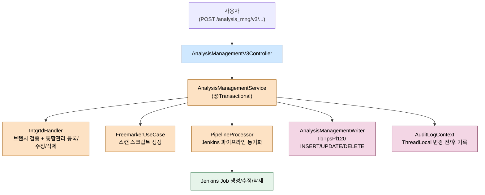
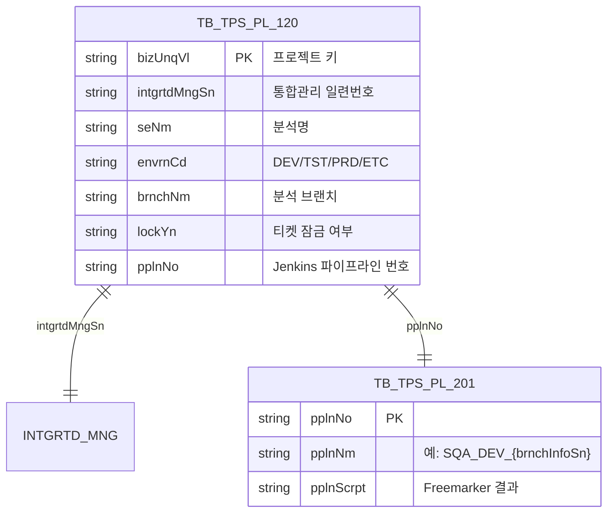

# 소나큐브 프로젝트 생명주기

---

> 목적: pipeline-api에서 SonarQube 프로젝트가 어떻게 생성·수정·삭제되는지, 외부 통합관리/Jenkins 파이프라인과 어떤 순서로 묶이는지 정리한다.
> 작성일: 2026-04-18
> 대상 코드: `pipeline-api/src/main/java/.../v3/{presentation,application,domain}/sonarqube/`

## 1. 결론

SonarQube 프로젝트 한 개는 단독으로 존재하지 않는다. "프로젝트 정의(`TbTpsPl120`) + 통합관리 정보 + Jenkins 파이프라인" 세 가지가 한 단위로 함께 만들어지고, 함께 갱신되고, 함께 사라진다. 진입점은 `AnalysisManagementV3Controller`(`/analysis_mng/v3`) 한 곳이고, 실제 오케스트레이션은 `AnalysisManagementService`가 맡는다. 트랜잭션 한 개 안에서 외부 통합관리 호출과 파이프라인 동기화, DB 적재가 모두 묶여 있어 중간에 한 단계가 실패하면 전체가 롤백된다.

## 2. 전체 흐름



## 3. 계층별 책임

| 계층 | 클래스/포트 | 역할 |
|------|-------------|------|
| Presentation | `AnalysisManagementV3Controller` | 요청 검증, `userId` 헤더 추출, `@AuditTarget` 부착 |
| Application | `AnalysisManagementService implements AnalysisManagementUseCase` | 트랜잭션, 통합관리/파이프라인/DB 호출 순서 보장 |
| Domain | `AnalysisHandler`, `AnalysisManagementWriter`, `AnalysisManagementReader`, `IntgrtdHandler`, `PipelineProcessor`, `PipelineWriter` | 도메인 규칙(키 생성, 중복 검증, 파이프라인 동기화) |
| Infrastructure | `FreemarkerUseCase`, `ToolchainDao`, `GitProjectDao`, `AnalysisApplicationMapper` | Freemarker 템플릿, 도구/Git 리포 메타 조회, DTO ↔ VO 매핑 |

`Reader`/`Writer`는 헥사고날 포트로, MyBatis 어댑터 구현체가 인프라스트럭처 패키지에 따로 있다.

## 4. UC-S1 프로젝트 생성

엔드포인트는 `POST /analysis_mng/v3/create`다. 컨트롤러는 인증 헤더 검증과 위임만 하고, 본 흐름은 `AnalysisManagementService.createSonarQubeProject`에 있다.

```java
// AnalysisManagementService.java:118-204
@Transactional
public void createSonarQubeProject(CreateSonarQubeProjectRequest request, String userId) {
    String brnchInfoSn = intgrtdHandler.validationBranch(
            request.getTaskCd(), request.getBizMngCd(), request.getBrnchNm(), userId);
    String projectKey = analysisHandler.generateProjectKey();
    String projectName = request.getTaskCd() + "_" + request.getBizNm() + "_" + brnchInfoSn;
    request.setSeNm(projectName);

    // 분석 브랜치에 따라 개발 환경 변경 (DEV/TST/PRD/ETC)
    String envrnCd = EnvironmentCode.resolveByBranch(request.getBrnchNm()).name();
    request.setEnvrnCd(envrnCd);
    ...
    boolean isManual = "ETC".equals(envrnCd);
    if (isManual) {
        pipelineUpsertVo.setBizNm(intgrtdResponseVo.getMotionTrgtSeCd() + "_" + request.getBizNm() + "_" + brnchInfoSn);
        pipelineProcessor.syncManualTestPipeline(pipelineUpsertVo, userId);
    } else {
        pipelineProcessor.syncTestPipeline(pipelineUpsertVo, userId);
    }
    ...
    analysisManagementWriter.createSonarQubeProject(
            sonarQubeMapper.createToSonarQubeProjectVo(request, projectKey, intgrtdMngSn, userId));
}
```

핵심 단계는 다섯 개다.

1. **브랜치 검증** — `IntgrtdHandler.validationBranch`로 브랜치 정보 일련번호(`brnchInfoSn`)를 받는다. 이 단계에서 외부 Git 리포 존재 여부까지 확인한다.
2. **프로젝트 키 생성** — `AnalysisHandler.generateProjectKey`가 SonarQube에 보낼 고유 키를 만든다.
3. **환경코드 결정** — `EnvironmentCode.resolveByBranch`가 브랜치명으로 `DEV/TST/PRD/ETC` 중 하나를 고른다. `ETC`는 "수동 분석" 의미를 갖는다.
4. **스캔 스크립트 생성** — Freemarker 템플릿 `processSonarqubeScript`가 Jenkinsfile 본문(`script`)을 만든다. 이미지 URL, 자격증명 ID, 리포 URL, 명령어가 모두 들어간다.
5. **파이프라인 + DB 등록** — `PipelineProcessor.syncTestPipeline`(또는 수동이면 `syncManualTestPipeline`)이 Jenkins 쪽에 Job을 만들고, `AnalysisManagementWriter.createSonarQubeProject`가 `TbTpsPl120`에 행을 적재한다. 마지막으로 `AuditLogContext`에 변경 전/후 JSON을 기록한다.

`@Transactional`로 묶여 있어 어느 한 단계라도 예외를 던지면 통합관리 호출까지 같이 롤백된다. 단 외부 호출(Jenkins, IntgrtdHandler) 중 일부는 자체 보상 로직이 없으므로, 호출 실패 시 외부 시스템에 잔재가 남을 수 있다는 점은 별도 운영 이슈다.

## 5. UC-S2 프로젝트 수정

엔드포인트는 `POST /analysis_mng/v3/update`다. 흐름은 생성과 거의 같지만 두 가지 차이가 있다.

```java
// AnalysisManagementService.java:212-294
@Transactional
public void updateSonarQubeProject(UpdateSonarQubeProjectRequest request, String userId) {
    SelectSonarQubeProjectDetailResponse bfData =
            Optional.ofNullable(analysisManagementReader.selectSonarQubeProjectDetail(request.getBizUnqVl()))
                    .orElseThrow(() -> {
                        log.error("######UPDATE SONARQUBE PROJECT FAILED###### : [DATA NOT FOUND]");
                        return new TpsException(ErrorCodeGeneral.DATA_NOT_FOUND);
                    });
    ...
    IntgrtdResponseVo intgrtdResponseVo = intgrtdHandler.updateIntgrtdInfo(
            IntgrtdServiceMapper.fromSonarQubeUpdateRequest(request, script, userId));
    ...
    analysisManagementWriter.updateSonarQubeProject(
            sonarQubeMapper.updateToSonarQubeProjectVo(request, intgrtdMngSn, userId));
}
```

먼저 변경 전 데이터(`bfData`)를 조회해 둔다. 감사로그에 변경 전/후를 모두 남기기 위해서다. 두 번째로 `intgrtdHandler.updateIntgrtdInfo`를 부른다. 신규 프로젝트는 `createIntgrtdInfo`이지만 수정은 `updateIntgrtdInfo`가 통합관리 일련번호를 그대로 유지하면서 메타만 갱신한다. 분기는 동일하게 `isManual` 여부로 `syncManualTestPipeline` / `syncTestPipeline` 둘 중 하나를 호출한다.

## 6. UC-S3 프로젝트 삭제

엔드포인트는 `POST /analysis_mng/v3/delete_list`다. 단건이 아니라 **리스트**를 받아 한 트랜잭션에서 처리한다.

```java
// AnalysisManagementService.java:302-338
@Transactional
public void deleteSonarQubeProjectList(List<DeleteSonarQubeProjectRequest> request, String userId) {
    List<SelectSonarQubeProjectDetailResponse> bfList = new ArrayList<>();
    for (DeleteSonarQubeProjectRequest deleteSonarQubeProject : request) {
        SelectSonarQubeProjectDetailResponse sonarQubeProject =
                analysisManagementReader.selectSonarQubeProjectDetail(deleteSonarQubeProject.getBizUnqVl());

        if (ObjectUtils.isEmpty(sonarQubeProject)) {
            throw new TpsException(ErrorCodeGeneral.DATA_NOT_FOUND);
        }
        if ("Y".equals(sonarQubeProject.getLockYn())) {
            throw new TpsException(ErrorCodePipelineApi.LOCKED_PROJECT_WITH_TICKET);
        }
        intgrtdHandler.deleteIntgrtdInfo(IntgrtdServiceMapper.fromSonarQubeDeleteRequest(
                sonarQubeProject.getIntgrtdMngSn(), userId));
        pipelineWriter.deletePipeline(sonarQubeProject.getPplnNo(), userId);
        bfList.add(sonarQubeProject);
    }
    analysisManagementWriter.deleteSonarQubeProject(
            sonarQubeMapper.deleteToSonarQubeProjectVoList(request), userId);
}
```

삭제는 두 단계 가드가 있다. 첫째, 대상 프로젝트가 존재해야 하고(`DATA_NOT_FOUND`), 둘째 `lockYn`이 `Y`면 거부한다(`LOCKED_PROJECT_WITH_TICKET`). `lockYn`은 티켓이 잠가둔 프로젝트라는 뜻이고, 운영 중인 분석을 지우지 못하게 막는 안전장치다. 통과하면 통합관리 → 파이프라인 → DB 순으로 지운다. 삭제는 외부 SonarQube 서버에서 프로젝트를 제거하지 않는다는 점이 함정이다. SonarQube 본체에는 잔존 프로젝트가 남으므로, 운영자는 별도 정리 절차가 필요하다.

## 7. 외부 시스템 호출

프로젝트 생명주기 전체에서 호출되는 외부 시스템은 네 곳이다.

- **통합관리 API** — `IntgrtdHandler` 경유. 분석 외 다른 도구(Harbor 등)와 동일한 키 체계를 보장한다.
- **Jenkins** — `PipelineProcessor.syncTestPipeline`/`syncManualTestPipeline`이 내부적으로 Jenkins Feign 클라이언트를 사용한다. Job 생성/수정/삭제 모두 이 경로다.
- **Git/Harbor 메타 DB** — `gitProjectDao`, `toolChainDao`로 리포 URL과 이미지 레지스트리 URL을 가져와 스크립트에 끼워 넣는다.
- **SonarQube 본체** — 생성/수정/삭제 시점에는 호출하지 않는다. 실제 SonarQube에 프로젝트가 만들어지는 시점은 Jenkins Job이 실행될 때 스캐너가 호출하는 시점이다. 이 비대칭이 삭제 시 SonarQube 잔존 프로젝트가 남는 원인이다.

## 8. 데이터 모델



`pplnNm` 명명 규칙(`SQA_{envrnCd}_{brnchInfoSn}`)은 운영 중 파이프라인 분류 기준이 되므로 임의로 바꿔서는 안 된다.

## 9. 해석과 주의점

`isManual = "ETC".equals(envrnCd)` 분기는 코드 전반에 반복된다. 신규 환경 코드를 추가할 때 이 한 줄만 바꾸면 안 되고, `EnvironmentCode` enum과 Freemarker 템플릿 변수까지 함께 검토해야 한다. 또 환경코드는 `EnvironmentCode.resolveByBranch(브랜치명)`이 결정하므로 브랜치 네이밍 규약 변경이 환경 분류에 영향을 준다.

`@AuditTarget(type = ExcnType.CREATE/UPDATE/DELETE)` 어노테이션과 `AuditLogContext.set(...)` 호출이 짝을 이룬다. 둘 중 하나라도 빠지면 감사로그에 변경 내역이 남지 않는다. 신규 메서드를 추가할 때 이 짝을 유지하는 게 가장 자주 빠지는 항목이다.

마지막으로, 수동 분석 분기의 `pplnUpsertVo.setBizNm(...)`는 운영 환경 분기와 다른 `bizNm`을 만들어 다른 Job 이름을 갖게 한다. 즉 같은 프로젝트라도 환경이 달라지면 Jenkins 쪽에서는 별도 Job으로 동작한다. 모니터링/대시보드를 만들 때 이 차이를 인식하지 못하면 "왜 같은 프로젝트가 두 개로 보이지?"라는 질문이 반복된다.
