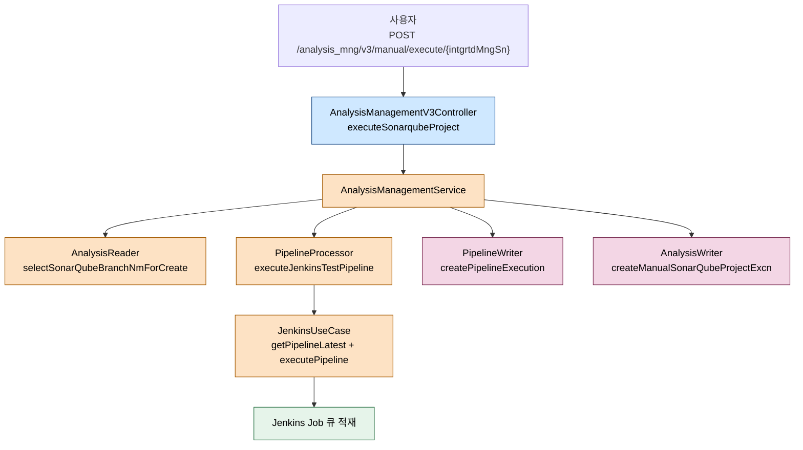
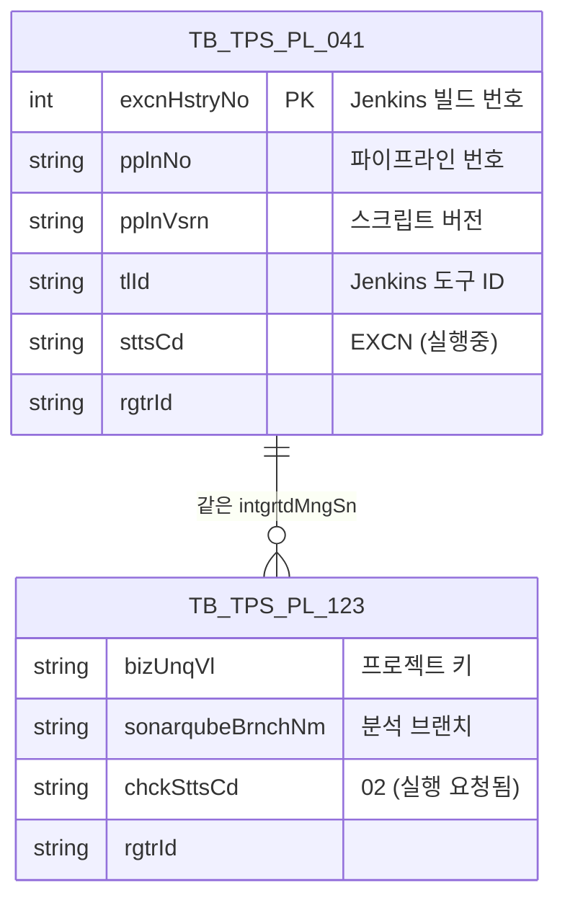

# 소나큐브 분석 실행 흐름

---

> 목적: 등록된 SonarQube 프로젝트가 수동/자동 트리거로 실행될 때 pipeline-api → Jenkins → SonarQube 경로가 어떻게 이어지는지 정리한다.
> 작성일: 2026-04-18
> 대상 코드: `pipeline-api/.../v3/application/sonarqube/AnalysisManagementService.java:344-365`, `PipelineProcessorImpl.java:184-201`, `AnalysisWriterImpl.java:103-133`

## 1. 결론

분석 실행은 세 줄로 요약된다. 파이프라인 번호와 통합관리 일련번호로 Jenkins Job 메타를 찾고, 빌드 번호를 미리 계산한 뒤 Jenkins에게 실행을 명령하고, 실행 이력 두 건(파이프라인 실행 이력 + 수동 분석 이력)을 DB에 적재한다. 실행 명령 자체는 비동기로, 응답은 "Job이 큐에 들어갔다"까지만 보장한다. 실제 스캔 결과는 ppln-logging-api의 로그 수집 흐름(04 문서)이 돌아와야 확정된다.

## 2. 전체 흐름



## 3. 계층별 책임

| 계층 | 클래스 | 역할 |
|------|--------|------|
| Presentation | `AnalysisManagementV3Controller` | `intgrtdMngSn`을 경로 변수로 수신, `userId` 헤더 주입 |
| Application | `AnalysisManagementService.executeSonarqubeProject` | 실행 브랜치 이름 조회, Jenkins 호출, 이력 적재를 순차 실행 |
| Domain | `PipelineProcessorImpl`, `AnalysisWriterImpl`, `AnalysisReaderImpl` | Jenkins 파라미터 세팅, 빌드 번호 선계산, 이력 DTO 변환 |
| Infrastructure | `JenkinsUseCase`, `SonarQubeDao`, `TbTpsPl123CommandMapper` | Jenkins REST 호출, `TB_TPS_PL_123` 쓰기 |

## 4. 진입점과 전체 메서드

```java
// AnalysisManagementService.java:344-365
@Override
public void executeSonarqubeProject(String intgrtdMngSn, String userId) {
    // 소나큐브 브랜치 생성
    String sonarqubeBrnchNm = analysisReader.selectSonarQubeBranchNmForCreate();

    // 1. 파이프라인 실행 요청
    PipelineExecuteResultVo executeResult =
            pipelineProcessor.executeJenkinsTestPipeline(intgrtdMngSn, sonarqubeBrnchNm);

    // 2. 실행 이력 생성
    PipelineExcnHistoryVo pipelineExcnHistoryVo = PipelineExcnHistoryVo.builder()
            .excnHstryNo(executeResult.getJobBuildNo())
            .pplnNo(executeResult.getJenkinsJobVo().getTbTpsPl201Response().getPplnNo())
            .pplnVsrn(executeResult.getJenkinsJobVo().getScriptVersion())
            .tlId(executeResult.getJenkinsToolVo().getToolId())
            .sttsCd("EXCN")
            .userId(userId)
            .build();
    pipelineWriter.createPipelineExecution(pipelineExcnHistoryVo);

    // 3. 수동 실행 정보 적재
    analysisWriter.createManualSonarQubeProjectExcn(intgrtdMngSn, sonarqubeBrnchNm, userId);
}
```

주목할 점은 이 메서드에 `@Transactional`이 없다는 것이다. Jenkins 호출과 DB 두 번 쓰기가 별도 트랜잭션 경계에 있다. Jenkins가 성공하고 DB 쓰기가 실패하면 분석은 실행됐지만 이력이 비는 상태가 될 수 있다. 일반적으로 Jenkins 자체가 Job 큐에 넣는 데까지만 동기 처리하기 때문에 장애 영역이 제한된다는 전제를 따르는 것으로 읽힌다.

## 5. Jenkins 호출 상세

`PipelineProcessorImpl.executeJenkinsTestPipeline`이 실제 Jenkins API를 때린다.

```java
// PipelineProcessorImpl.java:184-201
@Override
public PipelineExecuteResultVo executeJenkinsTestPipeline(String intgrtdMngSn, String sonarqubeBrnchNm) {
    JenkinsJobVo jenkinsJobVo = getJenkinsJobVoByIntgrtdMngSn(intgrtdMngSn);
    jenkinsJobVo.changeParamValue("SEPARATE_ID", sonarqubeBrnchNm);

    // 실행될 번호 추출을 위해 +1
    int buildNo = getJenkinsLatestBuildNo(jenkinsJobVo) + 1;

    JenkinsToolVo jenkinsToolVo = convertJenkinsToolVo(
            jenkinsJobVo.getPipelineStructVo().getTaskCd(),
            jenkinsJobVo.getPipelineStructVo().getEnvrnCd());
    resultProcess(jenkinsUseCase.executePipeline(jenkinsToolVo, jenkinsJobVo));

    return PipelineExecuteResultVo.builder()
            .jobBuildNo(buildNo)
            .jenkinsJobVo(jenkinsJobVo)
            .jenkinsToolVo(jenkinsToolVo)
            .build();
}
```

핵심은 `SEPARATE_ID` 파라미터 교체와 "실행 전 +1"이다. SonarQube 쪽은 같은 프로젝트라도 브랜치별로 결과를 분리해야 하므로, `SEPARATE_ID`에 `sonarqubeBrnchNm`을 집어넣어 Jenkins 파이프라인이 스캔 시 다른 브랜치 명의로 업로드하게 만든다. 빌드 번호는 실행 직전에 Jenkins의 `nextBuildNumber`를 읽어 +1로 예측한다. 실행 이력에 넣을 번호는 이 예측값이다. Jenkins가 동시에 두 개를 받으면 이 예측이 어긋날 수 있다는 한계가 있지만, 수동 실행 특성상 실무에서 충돌은 드물다.

## 6. 트리거 기반 실행과의 차이

트리거(자동)로 분석이 실행될 때는 `AnalysisManagementService.executeSonarqubeProject`가 아니라 트리거 쪽 서비스가 `PipelineProcessor.executeTriggerPipeline` 계열을 부른다. 차이는 다음과 같다.

- 트리거는 `TriggerPipelineVo` 단위로 실행되고, `SEPARATE_ID`가 아닌 트리거 파라미터를 그대로 사용한다.
- 실행 이력 적재가 트리거 모듈(`TriggerWriterImpl`)에서 이뤄진다.
- `TB_TPS_PL_123`(수동 분석 실행 이력)은 기록되지 않는다. 수동 실행 고유 테이블이다.

이 차이를 잊으면 "트리거 실행했는데 왜 수동 실행 이력에 없어?"라는 질문이 반복된다.

## 7. 실행 이력 두 건

수동 실행에는 두 테이블에 이력이 들어간다.



`TB_TPS_PL_041`은 모든 파이프라인 실행이 공유하는 공통 이력이고, `TB_TPS_PL_123`은 수동 분석 전용이다. 상태 코드(`sttsCd`, `chckSttsCd`)는 실행 시점에 각각 `EXCN`, `02`로 시작한다. 이후 ppln-logging-api가 로그 파싱 결과를 콜백할 때 업데이트된다.

## 8. 외부 시스템 호출

- **Jenkins** — `jenkinsUseCase.getPipelineLatest`로 다음 빌드 번호를 조회하고, `jenkinsUseCase.executePipeline`으로 실행을 명령한다. Jenkins REST의 `/job/{name}/buildWithParameters`를 사용한다.
- **SonarQube** — 직접 호출하지 않는다. Jenkins 파이프라인 스크립트 안에서 Sonar 스캐너가 호출한다.

## 9. 예외와 실패 처리

`resultProcess(jenkinsUseCase.executePipeline(...))`가 Jenkins 응답 코드를 확인해 2xx가 아니면 `TpsException`을 던진다. 이 예외는 컨트롤러까지 전파돼 사용자에게 500 응답으로 돌아간다. 빌드 번호 조회(`getPipelineLatest`)가 실패해도 동일하게 실행이 중단된다. DB 적재 두 건은 서로 다른 트랜잭션이지만 `createManualSonarQubeProjectExcn` 쪽은 `@Transactional`로 묶여 있어 mapper 호출 실패 시 내부 try-catch로 `INTERNAL_ERROR`를 던지는 이중 방어가 있다.

## 10. 해석과 주의점

`selectSonarQubeBranchNmForCreate()`가 리턴하는 브랜치 이름은 `TB_TPS_PL_123`의 기존 이력을 조회해 새 이름을 만드는 로직이다(예: `manual-001`, `manual-002`). 구현을 보면 단조 증가를 DB 조회로 계산하므로, 동시 실행 시 같은 이름이 나올 가능성이 이론상 존재한다. 실무에서 수동 실행이 동시에 들어오는 경우가 거의 없어 문제로 보고된 적은 없지만, 병렬화하려면 유니크 제약을 추가로 고려해야 한다.

`chckSttsCd`의 코드 값(`02`)은 DevConstant에 이름이 붙어 있지 않고 문자열 리터럴로 박혀 있다. 상태 확장이 필요하면 enum화를 먼저 해야 한다. 실행 요청만 완료된 상태와 실제 스캔이 끝난 상태를 구분하려는 의도가 분명해 보이므로, 04 문서(결과 수집) 흐름과 붙여서 봐야 상태 전이가 이해된다.

마지막으로 `excnHstryNo = getJenkinsLatestBuildNo + 1`이 그대로 DB 키로 들어간다. Jenkins 재시작이나 Job 재생성으로 빌드 번호가 리셋되면 이력 중복이 생긴다. 운영 중 Job을 삭제·재생성하는 작업은 이력 보존 관점에서 금기다.
