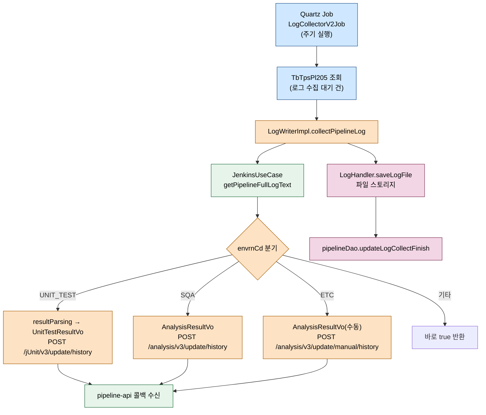
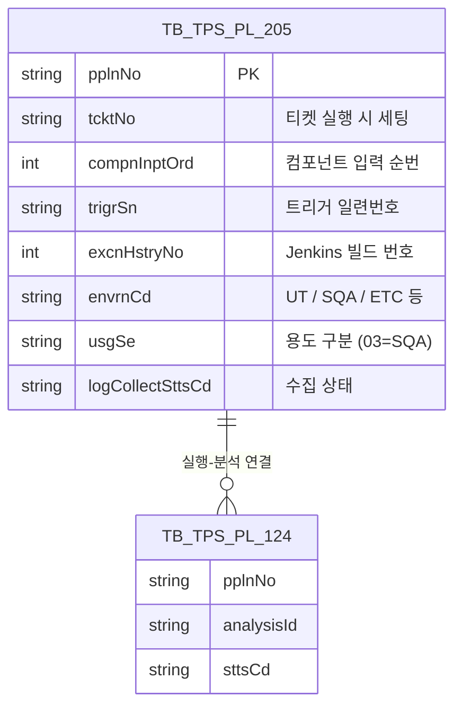

# 소나큐브 분석 결과 수집 경로

---

> 목적: Jenkins가 실행한 SonarQube 스캔 결과가 ppln-logging-api를 거쳐 pipeline-api로 어떻게 되돌아오는지 전체 경로를 정리한다.
> 작성일: 2026-04-18
> 대상 코드: `ppln-logging-api/src/main/java/.../v3/domain/log/service/impl/LogWriterImpl.java`, `.../v3/infrastructure/external/client/PipelineApiFeignClient.java`

## 1. 결론

결과 수집은 ppln-logging-api의 `LogWriterImpl.collectPipelineLog`가 시작점이다. Quartz 스케줄러가 "아직 로그 수집이 안 된 파이프라인 실행"을 꺼내 이 메서드에 넘긴다. 메서드는 Jenkins에서 전체 로그 텍스트를 받아오고, 환경코드에 따라 세 갈래(단위테스트 / 정적분석 / 수동 정적분석)로 나뉜다. 단위테스트와 정적분석은 로그 안의 마커(`##@#...##@#`)를 정규식으로 파싱해 결과 VO를 만들고, pipeline-api의 Feign 엔드포인트 세 개 중 하나로 업로드한다. pipeline-api는 그 호출로 실행 이력과 분석 결과 테이블을 최종 상태로 옮긴다.

## 2. 전체 흐름



## 3. 계층별 책임

| 계층 | 클래스 | 역할 |
|------|--------|------|
| Scheduler | `LogCollectorV2Job` (v2) | 주기적으로 수집 대상 조회 후 `LogWriter`에 넘김 |
| Domain | `LogWriterImpl` | 전체 로그 수집, 환경코드 분기, 결과 파싱, Feign 호출, 저장 확정 |
| Infrastructure (외부) | `JenkinsUseCase`, `PipelineApiFeignClient` | Jenkins REST + pipeline-api Feign 호출 |
| Infrastructure (내부) | `LogHandler`, `PipelineDao` | 로그 파일 저장, `TB_TPS_PL_205` 수집 완료 UPDATE |

## 4. 진입점 메서드 전체

```java
// LogWriterImpl.java:39-76
@Override
public void collectPipelineLog(TbTpsPl205Extended target) {
    try {
        JenkinsToolVo toolVo = createJenkinsToolVo(target);
        JenkinsStructVo structVo = createJenkinsStructVo(target);
        String fullLogText = jenkinsUseCase.getPipelineFullLogText(toolVo, structVo);

        if (!StringUtils.isEmpty(fullLogText)) {
            if (requestToTestPipelineEnd(target, fullLogText)) {
                boolean saveResult = logHandler.saveLogFile(target, fullLogText);
                if (saveResult) {
                    pipelineDao.updateLogCollectFinish(target);
                    log.info("[LOG] COLLECT_PIPELINE_LOG_SUCCESS pplnNo={}, logSize={}",
                            target.getPplnNo(), fullLogText.length());
                } else {
                    log.warn("[LOG] COLLECT_PIPELINE_LOG_SAVE_FAILED pplnNo={}", target.getPplnNo());
                }
            }
        } else {
            log.warn("[LOG] COLLECT_PIPELINE_LOG_EMPTY pplnNo={}", target.getPplnNo());
        }
    } catch (Exception e) {
        log.error("[LOG] COLLECT_PIPELINE_LOG_ERROR pplnNo={}, error={}", target.getPplnNo(), e.getMessage(), e);
    }
}
```

이 메서드가 따르는 순서는 네 단계다. Jenkins에서 로그 본문을 받고 → pipeline-api로 결과를 통지하고 → 파일 스토리지에 로그를 저장하고 → `TB_TPS_PL_205`의 수집 완료 플래그를 올린다. `requestToTestPipelineEnd`가 `false`를 내면 파일 저장과 완료 처리는 건너뛴다. 즉 결과 통지에 실패하면 해당 건은 다음 Quartz 실행에서 재시도된다.

## 5. 환경코드 분기

결과 처리는 `envrnCd` 값으로 세 갈래로 나뉜다. 분기 기준은 `JenkinsConstant` 상수에 있다.

```java
// LogWriterImpl.java:81-129 (발췌)
if(StringUtils.equals(target.getEnvrnCd(), PPLN_ENVRN_CD_UNIT_TEST)){
    UnitTestResultParseVo parsed = this.resultParsing(fullLogText);
    UnitTestResultVo vo = new UnitTestResultVo();
    vo.setTcktNo(target.getTcktNo());
    vo.setCompnInptOrd(target.getCompnInptOrd());
    vo.setTrigrSn(target.getTrigrSn());
    vo.setPplnNo(target.getPplnNo());
    vo.setPrgrsSttsCd(parsed.getSttsCd());
    vo.setTnocs(parsed.getTnocs());
    vo.setScsNocs(parsed.getScsNocs());
    vo.setFailNocs(parsed.getFailNocs());
    testPplnResponse = pipelineApiFeignClient.endJunitTest(vo);
} else if (StringUtils.equals(target.getEnvrnCd(), PPLN_ENVRN_CD_SONARQUBE)) {
    AnalysisResultVo vo = new AnalysisResultVo();
    vo.setTcktNo(target.getTcktNo());
    vo.setCompnInptOrd(target.getCompnInptOrd());
    vo.setTrigrSn(target.getTrigrSn());
    vo.setPplnNo(target.getPplnNo());
    vo.setUsgSe(target.getUsgSe());
    testPplnResponse = pipelineApiFeignClient.endAnalysisTest(vo);
} else if (StringUtils.equals(target.getEnvrnCd(), PPLN_ENVRN_CD_ETC)) {
    AnalysisResultVo vo = new AnalysisResultVo();
    vo.setPplnNo(target.getPplnNo());
    vo.setUsgSe(target.getUsgSe());
    testPplnResponse = pipelineApiFeignClient.endManualAnalysisTest(vo);
} else {
    return true;
}
return !testPplnResponse.getStatusCode().is4xxClientError() && !testPplnResponse.getStatusCode().is5xxServerError();
```

`SQA`와 `ETC`를 구분하는 이유는 수동 실행(ETC)에 `tcktNo`, `compnInptOrd`, `trigrSn`이 없기 때문이다. 티켓과 무관한 단건 실행이라 키가 `pplnNo`와 `usgSe`만 실린다. 수신 쪽 pipeline-api도 별도 엔드포인트(`/analysis/v3/update/manual/history`)로 경로를 분리했다.

## 6. 단위테스트 결과 파싱

단위테스트 결과는 Jenkinsfile 안에서 다음과 같은 마커로 에코된다.

```text
##@#UNIT_TEST_RESULT##@#{total}##@#{success}##@#{fail}##@#{...}##@#{failedCheck}
```

`resultParsing`은 이 라인을 찾아 숫자 세 개를 뽑고, 7번째 필드(`failedCheck`)가 `true`면 실패로 판정한다. 숫자만으로는 실패를 판단하기 애매한 경우(예: 모든 케이스가 skip되어 fail=0인데 정작 실패)를 잡기 위한 이중 체크다.

```java
// LogWriterImpl.java:131-193 (핵심 발췌)
String resultOrg = dataLines.stream().filter(line -> line.contains("##@#UNIT_TEST_RESULT##@#")).findFirst().get();
String[] resultOrgList = resultOrg.split("##@#");
Integer tnocs = Integer.parseInt(resultOrgList[2]);
Integer scsNocs = Integer.parseInt(resultOrgList[3]);
Integer failNocs = Integer.parseInt(resultOrgList[4]);
String failedCheck = "false";
if (resultOrgList.length > 6) {
    if (StringUtils.equals(resultOrgList[6].trim(), "true")) failedCheck = "true";
}
if (resultOrgList.length > 6) {
    String status = (failNocs > 0 || "true".equals(failedCheck)) ? "FAIL" : "CMPTN";
    return UnitTestResultParseVo.builder().sttsCd(status)
            .tnocs(tnocs).scsNocs(scsNocs).failNocs(failNocs).build();
}
```

상태 코드는 `CMPTN`(완료) 또는 `FAIL` 두 가지다. SonarQube 결과는 단위테스트와 달리 숫자 파싱이 없다. pipeline-api 쪽이 SonarQube REST를 다시 쳐 메트릭을 받아오는 방식이므로, ppln-logging-api는 "실행이 끝났다"는 신호만 보내면 된다.

## 7. pipeline-api 쪽 Feign 엔드포인트

`PipelineApiFeignClient`가 선언한 결과 통지 엔드포인트는 세 개다.

| 용도 | 메서드 | 엔드포인트 | 요청 바디 |
|------|--------|------------|-----------|
| 단위테스트 결과 | `endJunitTest` | `POST /pipeline/api/jUnit/v3/update/history` | `UnitTestResultVo` |
| 정적분석(티켓) | `endAnalysisTest` | `POST /pipeline/api/analysis/v3/update/history` | `AnalysisResultVo` |
| 정적분석(수동) | `endManualAnalysisTest` | `POST /pipeline/api/analysis/v3/update/manual/history` | `AnalysisResultVo` (pplnNo+usgSe만) |

Feign URL은 `${trb.services.pipeline-api.url}`로 주입된다. 운영/개발 환경별 값은 `application-{profile}.yml`에서 갈라진다.

## 8. 수집 대상 데이터 모델



`TbTpsPl205Extended`는 `TB_TPS_PL_205`에 Jenkins 도구 메타(`tlUrl`, `tlCntnId`, `tlSgnl`)를 조인한 뷰다. Quartz Job이 수집 대상을 조회할 때 이 확장 모델을 그대로 VO로 받아 `LogWriter`에 전달한다.

## 9. 외부 시스템 호출

- **Jenkins** — `jenkinsUseCase.getPipelineFullLogText(toolVo, structVo)`가 Job의 `buildNumber/consoleText`를 GET으로 읽어 문자열로 돌려준다. 로그가 비어 있으면 `[LOG] COLLECT_PIPELINE_LOG_EMPTY`를 찍고 빠진다.
- **pipeline-api** — Feign으로 결과 통지. 4xx/5xx면 파일 저장과 완료 처리를 건너뛰어 다음 주기에 재시도되게 한다.

## 10. 예외와 재시도

`collectPipelineLog`는 try-catch로 감싸져 있고, 어떤 예외가 나도 전체 흐름이 무너지지 않는다. Quartz가 Job 하나를 대상으로 실패해도 다음 주기에 같은 `pplnNo`가 다시 조회되는 구조이기 때문이다. 재시도가 무한 반복되지 않으려면 pipeline-api 쪽이 "성공 통지를 받으면 수집 대상에서 제외하도록" `logCollectSttsCd`를 전진시켜야 한다. 이 상태 전이가 양쪽 모듈의 계약 포인트다.

## 11. 해석과 주의점

파싱 로직이 Jenkinsfile 템플릿과 강하게 결합돼 있다. Freemarker가 찍는 마커(`##@#`)가 한 글자라도 바뀌면 전부 `FAIL`로 떨어진다. 템플릿을 수정할 때는 반드시 `resultParsing`의 정규식/인덱스와 같이 맞춰야 한다. 7번째 필드(`failedCheck`)는 구 버전 템플릿에는 존재하지 않으므로 `resultOrgList.length > 6` 체크가 필수다. 이 조건을 무시하고 리팩터링하면 구 템플릿 Job이 영구 `FAIL` 처리된다.

`ETC` 분기는 "SonarQube 단건 실행" 전용이다. 주석에도 명시돼 있다. 수동 실행은 티켓과 무관하므로 `tcktNo`/`compnInptOrd`/`trigrSn`을 비운 채 보낸다. 수신 쪽 pipeline-api가 이 세 필드로 이력을 찾으려 들면 실패하므로, 수동 전용 엔드포인트가 별도 경로로 갈라져 있다. 새 환경을 추가할 때는 이 세 경로 중 어디에 속할지 먼저 결정해야 한다.

마지막으로 `pipelineDao.updateLogCollectFinish(target)`는 Feign 호출 성공 + 파일 저장 성공이 모두 맞물려야 호출된다. 운영 중 특정 `pplnNo`가 반복 수집되는 현상이 보이면, 세 단계 중 어느 지점에서 실패하는지 로그 키워드(`COLLECT_PIPELINE_LOG_EMPTY`, `COLLECT_PIPELINE_LOG_SAVE_FAILED`, `COLLECT_PIPELINE_LOG_ERROR`)로 원인을 특정한다.
