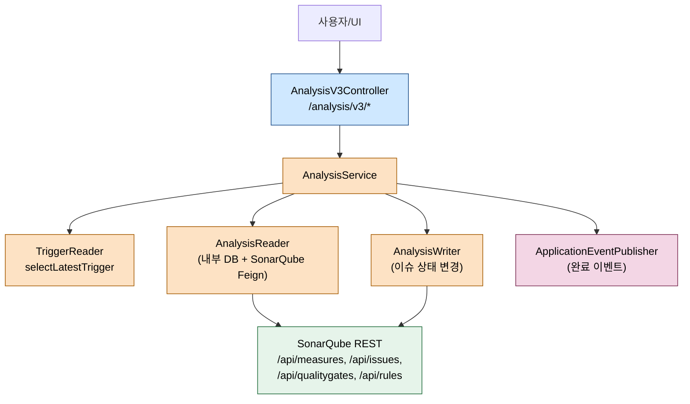
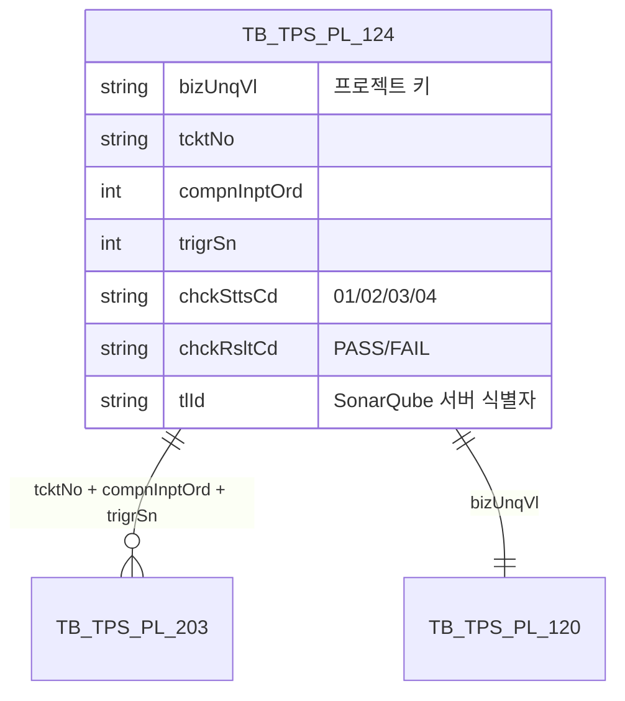

# 소나큐브 결과 조회와 이슈 관리

---

> 목적: 분석이 끝난 뒤 사용자가 메트릭·품질 게이트·이슈 상태를 조회하고 변경할 때 pipeline-api가 어떻게 SonarQube REST를 호출하는지 정리한다.
> 작성일: 2026-04-18
> 대상 코드: `pipeline-api/.../v3/presentation/sonarqube/api/AnalysisV3Controller.java`, `.../v3/application/sonarqube/AnalysisService.java`

## 1. 결론

조회는 세 종류다. 티켓 단위 다건 메트릭 조회, 단일 프로젝트/브랜치 상세 조회, 그리고 SonarQube 이슈 페이지네이션 조회다. 이슈 변경 API는 네 개(`setType`, `setSeverity`, `setStatus`, `setAssignee`)로 SonarQube의 `POST /api/issues/*` 엔드포인트를 그대로 프록시한다. pipeline-api는 대부분의 조회에서 **우선 트리거 정보를 찾아 `tlId`(도구 식별자)를 해석**하고, 그 `tlId`로 올바른 SonarQube 서버를 향해 호출한다. 다중 SonarQube 서버 환경을 지원하기 위한 해석 단계다.

## 2. 전체 흐름



## 3. 계층별 책임

| 계층 | 클래스 | 역할 |
|------|--------|------|
| Presentation | `AnalysisV3Controller` | `/analysis/v3/*` 진입. 15개 엔드포인트(조회 11 + 이슈 변경 4) |
| Application | `AnalysisService` | 트리거 기반 `tlId` 해석, 실행 상태 업데이트, 완료 이벤트 발행 |
| Domain | `AnalysisReader`, `AnalysisWriter`, `AnalysisHandler` | SonarQube Feign 호출 + DB 상태 쓰기 |
| Infrastructure | `SonarQubeFeignClient`, `SonarQubeFeignEnum` | REST 호출 계약, 메트릭 키 상수 |

## 4. UC-S5 메트릭과 품질 게이트 조회

### 4.1 다건 메트릭 조회

`POST /analysis/v3/select_list/measure/result`는 티켓과 컴포넌트 입력 순번으로 최신 트리거를 찾고, 대상 프로젝트 키 목록을 돌면서 SonarQube `/api/measures/component`를 호출한다.

```java
// AnalysisService.java:64-95
public List<SelectSonarQubeMeasuresResultResponse> selectMeasuresComponentResultList(
        SelectSonarQubeAnalysisResultRequest request) {
    List<SelectSonarQubeMeasuresResultResponse> responses = new ArrayList<>();
    TbTpsPl203 model = triggerReader.selectLatestTrigger(request.getTcktNo(), request.getCompnInptOrd());
    if (ObjectUtils.isEmpty(model) || ObjectUtils.isEmpty(model.getTrigrSn())) {
        return new ArrayList<>();
    }
    int trigrSn = model.getTrigrSn();
    request.getProjectList().forEach(item -> {
        String brnchNm = analysisHandler.findBranch(request.getTcktNo(), request.getCompnInptOrd(), trigrSn);
        String projectKey = item.getProjectKey();
        try {
            SelectSonarQubeMeasuresResultResponse res =
                    analysisReader.selectSonarQubeMeasureResult(item.getTlId(), projectKey, brnchNm);
            responses.add(res);
        } catch (FeignException e) {
            log.error("[ERROR] STATUS={} PROJECT_KEY={} MSG={}", e.status(), projectKey, ErrorCodeGeneral.DATA_NOT_FOUND);
        }
    });
    return responses;
}
```

특기할 점은 `FeignException`을 삼킨다는 것이다. 스캔 결과가 없어서 SonarQube가 404를 돌려주면 빈 응답이 아니라 예외로 오기 때문에, 한 프로젝트가 비어 있어도 나머지 프로젝트 결과는 정상 응답해야 한다. 그래서 프로젝트별 try-catch로 감싸고 로그만 남긴다.

### 4.2 단건 상세 조회

`GET /analysis/v3/select_measures/component/{projectKey}/{brnchNm}`는 프로젝트 키 하나를 대상으로 한다. 이때 `tlId`가 요청에 없으므로 `resolveTlId`로 브랜치 이름에서 티켓 정보를 거슬러 찾는다.

```java
// AnalysisService.java:437-454
private String resolveTlId(String projectKey, String branch) {
    String[] tcktInfo = analysisHandler.findTcktInfo(branch);
    if (tcktInfo != null && tcktInfo.length == 3) {
        AnalysisVo sonarInfo = analysisReader.selectAnalysisSonarQubeTool(
                tcktInfo[0], Integer.parseInt(tcktInfo[1]),
                Integer.parseInt(tcktInfo[2]), projectKey);
        return sonarInfo.getTlId();
    }
    return analysisReader.selectAnalysisSonarQubeToolByBizUnqVl(projectKey);
}
```

브랜치 이름에서 티켓 정보를 파싱하지 못하면 프로젝트 키만으로 도구를 찾는 폴백이 따른다. 이 폴백은 수동 실행 프로젝트를 처리하기 위한 장치다.

## 5. 분석 결과 목록과 상태 갱신

`GET /analysis/v3/select_list/analysis/result`는 티켓 단위 전체 분석 결과 목록을 돌려준다. 여기에는 **상태 전이 로직이 섞여 있다**.

```java
// AnalysisService.java:117-170 (발췌)
List<PipelineExecuteVo> list = pipelineReader.selectPipelineWithTriggerList(tcktNo, compnInptOrd, trigrSn);
if (!CollectionUtils.isEmpty(list)) {
    for (PipelineExecuteVo pipelineExecuteVo : list) {
        if ("EXCN".equals(pipelineExecuteVo.getSttsCd())) {
            AnalysisProjectVo analysisProject = analysisManagementReader.selectSonarQubeProjectByPplnNo(
                    pipelineExecuteVo.getPplnNo());
            analysisWriter.updateSonarQubeProjectExcn(sonarQubeMapper.toAnalysisVo(
                    analysisProject.getBizUnqVl(), tcktNo, compnInptOrd, trigrSn, "02"));
        }
    }
}
List<AnalysisVo> analysisVoList = analysisReader.selectSonarQubeAnalysisList(tcktNo, compnInptOrd, trigrSn, pplnNoList);
analysisVoList.forEach(analysisVo -> analysisVo.setPendingYn(!"WAIT".equals(model.getSttsCd())));
```

조회 중 `sttsCd == "EXCN"`(실행 중)인 파이프라인이 있으면 해당 분석 이력을 `02`(진행 중) 상태로 갱신한다. 조회 메서드가 side effect를 갖는다는 점이 놀라운데, 의도는 "UI가 목록을 새로 고치는 시점에 상태 동기화까지 같이 해버린다"는 것이다. 순수 조회 API로 보기 힘드니 리팩터링 포인트로 남겨둘 만하다.

## 6. UC-S6 이슈 상태 변경

이슈 조회와 변경은 네 개씩 짝을 이룬다.

| 엔드포인트 | 대응 SonarQube API | 용도 |
|-----------|-----------------------|------|
| `GET /select_issues/search` | `GET /api/issues/search` | 이슈 목록 + 사이드 필터 |
| `GET /select_sources/issue-snippets` | `GET /api/sources/issue_snippets` | 이슈 스니펫 |
| `GET /select_sources/lines` | `GET /api/sources/lines` | 라인 단위 조회 |
| `GET /select_rules/show` | `GET /api/rules/show` | 이슈 룰 상세 |
| `POST /update_issues/set_type` | `POST /api/issues/set_type` | 이슈 type 변경 |
| `POST /update_issues/set_severity` | `POST /api/issues/set_severity` | 심각도 변경 |
| `POST /update_issues/set_status` | `POST /api/issues/do_transition` | 상태 전환 |
| `POST /update_issues/set_assignee` | `POST /api/issues/assign` | 담당자 할당 |

4종 변경 API는 `AnalysisService`에서 그냥 `analysisWriter.updateIssues*(request)`를 호출할 뿐 별다른 도메인 로직이 없다. 권한 검증과 감사 로그는 `AnalysisWriter` 구현체 레벨에서 처리한다. 즉 컨트롤러와 애플리케이션 서비스는 투명 프록시에 가깝다.

## 7. 분석 종료 업데이트 (콜백 엔드포인트)

ppln-logging-api가 로그 파싱 후에 호출하는 두 엔드포인트가 `/update/history`와 `/update/manual/history`다. 컨트롤러에는 `@Hidden`이 붙어 Swagger에서 감춰진다.

```java
// AnalysisService.java:240-292 (발췌)
public void updateAnalysisEnd(UpdateAnalysisEndRequest request) {
    if (!"03".equals(request.getUsgSe())) {
        throw new TpsException(ErrorCodeGeneral.BAD_REQUEST);
    }
    AnalysisProjectVo sonarQubeProjectVo =
            analysisManagementReader.selectSonarQubeProjectByPplnNo(request.getPplnNo());
    sonarQubeProjectVo.setTlId(
            analysisReader.selectAnalysisSonarQubeTool(
                    request.getTcktNo(), request.getCompnInptOrd(),
                    request.getTrigrSn(), sonarQubeProjectVo.getBizUnqVl()).getTlId());
    res = analysisWriter.updateSonarQubeProjectExcnEnd(sonarQubeMapper.toAnalysisVo(
            sonarQubeProjectVo, request.getTcktNo(),
            request.getCompnInptOrd(), request.getTrigrSn()));
    if (StringUtils.equals(sonarQubeProjectVo.getBizUnqVl(),
            analysisHandler.selectLastPipelineYn(request.getTcktNo(), ...))) {
        List<AnalysisVo> analysisVoList = selectSonarQubeAnalysisResultList(...);
        if (hasFailure(analysisVoList)) {
            eventPublisher.publishEvent(FailedTcktHstryEvent.builder()...build());
        } else {
            eventPublisher.publishEvent(DefaultTcktHstryEvent.builder()...build());
        }
    }
}
```

두 가지 핵심이 있다. 첫째, `usgSe == "03"`이 아니면 즉시 거부한다. 용도 구분값 03이 정적분석을 의미하므로 잘못된 엔드포인트로 들어온 호출을 걸러낸다. 둘째, "마지막 파이프라인인지" 판정해서 맞다면 티켓 히스토리 이벤트(`FailedTcktHstryEvent` 또는 `DefaultTcktHstryEvent`)를 발행한다. 실패 판정은 `hasFailure(analysisVoList)`가 담당하며, 기준은 `chckSttsCd == "04"` 또는 `chckRsltCd == "FAIL"`이다.

## 8. 데이터 모델과 외부 시스템 매핑



`chckSttsCd`는 "대기(01) → 진행(02) → 종료(03) → 장애(04)"로 전진한다. 조회 API가 중간에 02로 돌려놓는 동기화 로직이 있다는 점은 5절에서 설명했다.

SonarQube 호출 시 `tlId`는 `SonarQubeFeignClient`의 `@RequestHeader` 또는 url 파라미터로 실려 라우팅된다. 이 계약이 깨지면 다중 SonarQube 환경에서 엉뚱한 서버를 치게 된다.

## 9. 외부 시스템 호출 요약

- `GET /api/measures/component` — 메트릭 값. 키 목록은 `SonarQubeFeignEnum`에서 정의.
- `GET /api/qualitygates/project_status` — 품질 게이트 통과 여부.
- `GET /api/issues/search` — 이슈 목록. 페이지/필터/정렬 파라미터가 많음.
- `GET /api/sources/*`, `GET /api/rules/show` — 스니펫과 룰 상세.
- `POST /api/issues/set_type | set_severity | do_transition | assign` — 이슈 상태 변경.

모두 Basic Auth로 인증한다. 자격증명은 `TB_TPS_CM_150`(개발지원도구)에서 `tlId`로 찾는다.

## 10. 해석과 주의점

조회 API가 side effect(`updateSonarQubeProjectExcn`)를 갖는 설계는 UI 새로고침 동작에 맞춘 현실적 타협이다. 단위 테스트를 쓰기 힘들고 재귀 호출이 엉키기 쉬우므로, 새 기능을 추가할 때 추가 side effect를 올리지 않는 편이 안전하다. 필요하면 별도 명시적 동기화 엔드포인트를 신설한다.

`resolveTlId` 폴백(`selectAnalysisSonarQubeToolByBizUnqVl`)은 수동 실행 프로젝트 전용이다. 두 경로가 모두 실패하면 NPE가 날 수 있다. 신규 프로젝트를 만든 직후 분석이 돌기 전에 조회가 들어오는 타이밍 문제에 주의한다.

이슈 변경 4종(`setType/Severity/Status/Assignee`)은 SonarQube REST를 얇게 프록시할 뿐 내부 DB를 바꾸지 않는다. 즉 TPS에는 이슈 상태 사본이 없다. SonarQube가 응답하지 않으면 UI에서 상태 변경이 롤백되지 않는다는 점을 문서화/고지할 필요가 있다.

마지막으로 완료 이벤트(`DefaultTcktHstryEvent`, `FailedTcktHstryEvent`)는 티켓 히스토리 모듈에서 구독해 "자동화 테스트 완료" 이력을 남긴다. 새 비즈니스 이벤트를 추가하려면 이 이벤트 발행 지점을 변경 포인트로 잡고, 구독자가 추가됐을 때 기존 히스토리 생성 흐름이 깨지지 않는지 검증해야 한다.
