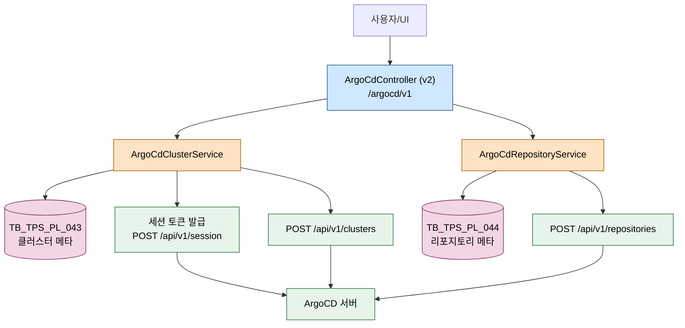
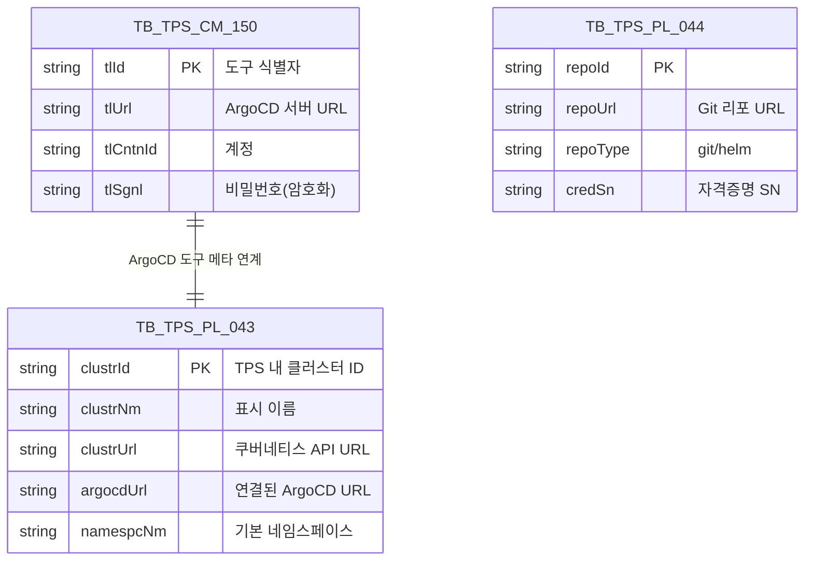

# ArgoCD 연동 기반

---

> 목적: pipeline-api가 ArgoCD REST를 호출하기 위해 준비해야 하는 기반(세션 토큰, 클러스터 등록, 리포지토리 등록)이 어떻게 짜여 있는지 정리한다.
> 작성일: 2026-04-18
> 대상 코드: `pipeline-api/.../v2/application/argocd/v2/`, `.../v2/domain/argocd/v2/cluster/service/`, `.../v2/infrastructure/config/argocd/v2/ArgoCdFeignClient.java`

## 1. 결론

ArgoCD 연동은 세 단계를 거친다. 첫째, `/api/v1/session`으로 Bearer 토큰을 받아온다. 둘째, 그 토큰으로 클러스터(`/api/v1/clusters`)와 리포지토리(`/api/v1/repositories`)를 pipeline-api 쪽 TPS DB(`TB_TPS_PL_043` 등)에 등록해 둔다. 셋째, 이후 Application 동기화·배포 시 DB에서 클러스터/리포 메타를 꺼내 Bearer 토큰을 붙여 호출한다. 모든 Feign 호출은 `URI baseUrl`을 첫 인자로 받는 특이한 시그니처를 쓰는데, ArgoCD 서버가 여러 대일 수 있기 때문에 런타임에 URL을 주입한다.

## 2. 전체 흐름



## 3. 계층별 책임

| 계층 | 클래스 | 역할 |
|------|--------|------|
| Presentation | `ArgoCdController`, `ArgoCdClusterController` | 클러스터/리포지토리 관리 REST 진입. 대체로 `/argocd/v1` 접두 |
| Application | DTO 클래스들 (`application/argocd/v2/cluster/dto/*`) | 요청/응답 DTO, 검색·페이지네이션 파라미터 |
| Domain | `ArgoCdClusterService`, `ArgoCdRepositoryService` | 등록/해제 로직, 세션 토큰 발급 |
| Infrastructure | `ArgoCdFeignClient` | `@FeignClient(name="argocd-feign", url="argoCd-placeholder")`. URL은 런타임 주입 |

## 4. 세션 토큰 발급

ArgoCD는 Bearer 토큰으로 인증한다. 토큰은 아이디/패스워드로 `/api/v1/session`을 쳐서 받는다.

```java
// ArgoCdFeignClient.java:22-23
@PostMapping("/api/v1/session")
ResponseEntity<Map<String, String>> getApiToken(URI baseUrl, @RequestBody SelectArgoCdTokenRequest request);
```

`SelectArgoCdTokenRequest`는 `username`/`password` 두 필드만 가진다. 응답 Map에서 `token`을 꺼내 `Authorization: Bearer {token}` 헤더로 이후 호출에 붙인다. 토큰 TTL과 갱신 주기는 ArgoCD 서버 설정에 따르고, pipeline-api는 호출 시점마다 토큰을 발급받는 방식이 기본이다. 즉 토큰 캐싱이 없다.

## 5. 클러스터 등록과 해제

`ArgoCdFeignClient`가 클러스터 엔드포인트 세 개를 노출한다.

```java
// ArgoCdFeignClient.java:25-32
@GetMapping("/api/v1/clusters/{clusterUrl}")
ResponseEntity<Map<String, Object>> getCluster(URI baseUri, @RequestHeader("Authorization") String bearerAuth, @PathVariable String clusterUrl);

@PostMapping("/api/v1/clusters")
ResponseEntity<Map<String, Object>> connectCluster(URI baseUri, @RequestHeader("Authorization") String bearerAuth, @RequestBody Map<String, Object> request);

@DeleteMapping("/api/v1/clusters/{clusterUrl}")
ResponseEntity<Map<String, Object>> disconnectCluster(URI baseUri, @RequestHeader("Authorization") String bearerAuth, @PathVariable String clusterUrl, @RequestBody Map<String, Object> data);
```

호출 시점은 TPS에서 "클러스터 등록" 액션을 수행할 때다. 도메인 서비스 `ArgoCdClusterServiceImpl`이 먼저 이름/URL 중복을 검증하고, DB(`TB_TPS_PL_043`)에 메타를 넣기 전에 ArgoCD에도 연결을 만든다.

```java
// ArgoCdClusterServiceImpl.java:58-113 (발췌)
@Override
public PaginationResponse<List<SelectArgoCdClusterPagListResponse>> selectClusterPagList(SelectArgoCdClusterPagRequest request) {
    ColumnMapper.mapToDbColumnNames(ArgoCdClusterEnum.class, null, request.getSearchObj(), request.getSortObj());
    int totalCount = tbTpsPl043QueryService.selectClusterPagListCount(request);
    ...
}

@Override
public boolean selectClusterNmExists(String clustrNm) {
    return tbTpsPl043QueryService.selectClusterByClustrNm(clustrNm);
}

@Override
public boolean selectClusterUrlExists(String clustrUrl) {
    return tbTpsPl043QueryService.selectClusterByClustrUrl(clustrUrl);
}
```

등록(`createArgoCdCluster`) 구현은 위 조회/검증 뒤에 세션 토큰 발급 → `connectCluster` Feign 호출 → `TB_TPS_PL_043` insert를 순차 실행하는 구조다. 한 단계라도 실패하면 `@Transactional` 범위에서 롤백된다. 단, 외부 호출(세션+클러스터 연결)은 DB 롤백으로 되돌려지지 않으므로 잔재가 남을 가능성은 있다.

## 6. 리포지토리 등록과 해제

리포지토리 엔드포인트는 클러스터와 대칭 구조다.

```java
// ArgoCdFeignClient.java:34-44
@GetMapping("/api/v1/repositories/{encodeRepoUrl}")
ResponseEntity<Map<String, Object>> getRepository(URI baseUri, @RequestHeader("Authorization") String bearerAuth, @PathVariable String encodeRepoUrl);

@PostMapping("/api/v1/repositories")
ResponseEntity<Map<String, Object>> connectRepository(URI baseUri, @RequestHeader("Authorization") String bearerAuth, @RequestBody Map<String, Object> request);

@DeleteMapping("/api/v1/repositories/{encodeRepoUrl}")
ResponseEntity<Map<String, Object>> disConnectRepository(URI baseUri,
        @RequestHeader("Authorization") String bearerAuth,
        @PathVariable String encodeRepoUrl,
        @RequestBody Map<String, Object> data);
```

`encodeRepoUrl`은 URL 전체를 `URLEncoder.encode(repoUrl, UTF-8)`로 감싼 값이다. ArgoCD는 리포지토리 식별자로 URL을 쓰는데, 슬래시(`/`)와 콜론(`:`)이 경로 변수에 그대로 들어가면 라우팅이 깨진다. 그래서 경로에 넣기 전에 반드시 인코딩한다. 도메인 서비스도 URL 인코딩 유틸을 거쳐 Feign을 호출한다.

## 7. Feign URL 런타임 주입 패턴

`@FeignClient(name = "argocd-feign", url = "argoCd-placeholder")`는 URL 자리표시자만 둔다. 실제 URL은 메서드 첫 인자 `URI baseUrl`로 전달된다. 이 패턴을 쓰는 이유는 다중 ArgoCD 서버를 호출해야 하기 때문이다. TPS에 등록된 각 클러스터는 제각기 다른 ArgoCD 서버에 속할 수 있고, 쿨러스터 메타(`TB_TPS_PL_043`)에서 ArgoCD URL을 꺼내와 호출 시점마다 `URI`로 넘긴다.

호출자는 대략 다음과 같이 쓴다.

```java
URI argocdUrl = URI.create(clusterMeta.getArgocdUrl());
String token = "Bearer " + argoCdFeignClient.getApiToken(argocdUrl, tokenReq).getBody().get("token");
argoCdFeignClient.syncApplication(argocdUrl, token, appName, data);
```

`FeignConfig`는 요청 시 URL placeholder를 `baseUrl`로 교체하는 `Target` 처리를 포함한다.

## 8. 데이터 모델



`TB_TPS_CM_150`은 개발지원도구 공용 메타 테이블이다. ArgoCD만이 아니라 Jenkins, Harbor, SonarQube 등도 같은 테이블을 쓴다. `tlId` 하나가 ArgoCD 서버 한 대를 대표한다. 클러스터 메타는 `TB_TPS_PL_043`에서 ArgoCD 서버(`argocdUrl`)와 엮인다.

## 9. 외부 시스템 호출 요약

| 엔드포인트 | 용도 | 인증 |
|-----------|------|------|
| `GET /api/v1/settings` | 서버 헬스/버전 확인 | Bearer |
| `POST /api/v1/session` | 토큰 발급 | username/password body |
| `POST /api/v1/clusters` | 클러스터 연결 | Bearer |
| `DELETE /api/v1/clusters/{url}` | 클러스터 해제 | Bearer |
| `POST /api/v1/repositories` | 리포지토리 연결 | Bearer |
| `DELETE /api/v1/repositories/{url}` | 리포지토리 해제 | Bearer |

v1(레거시) `ArgoCdFeignClient`가 별도 패키지에 존재하지만 현행 코드는 v2만 쓴다.

## 10. 해석과 주의점

세션 토큰을 매 호출마다 발급하는 전략은 단순하지만 호출 비용이 크다. 짧은 시간 다수 작업(예: 대규모 Application 일괄 동기화)이 들어오면 ArgoCD `/session` 엔드포인트에 부담이 간다. 스프링 캐시로 TTL 기반 토큰 캐싱을 넣는 리팩터링 후보다.

`argoCd-placeholder`라는 placeholder URL은 `FeignConfig`의 `RequestInterceptor` 또는 `Target` 로직과 묶여 있다. 새 Feign 메서드를 추가할 때 `URI baseUrl`을 첫 인자로 받는 관례를 잊으면 호출 시 `argoCd-placeholder`가 그대로 호출돼 실패한다.

클러스터 등록·해제 시 ArgoCD 측 연결이 성공했는데 DB 쓰기에 실패하면 ArgoCD에는 잔재가 남는다. 반대로 DB에는 남아 있는데 ArgoCD에는 없으면 이후 동기화가 곧바로 실패한다. 운영 시 `GET /api/v1/clusters/{url}`로 상태를 확인하는 헬스 체크가 필요하다. 해제 시 같은 문제가 대칭으로 존재한다.

마지막으로 이 문서는 "연결 준비" 단계만 다룬다. 실제 Application 동기화/롤백/매니페스트 CRUD는 다음 문서(07~09)로 이어진다.
