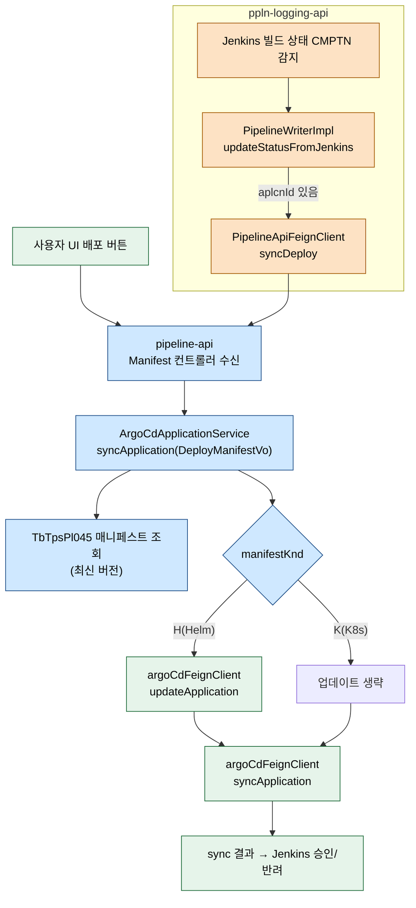
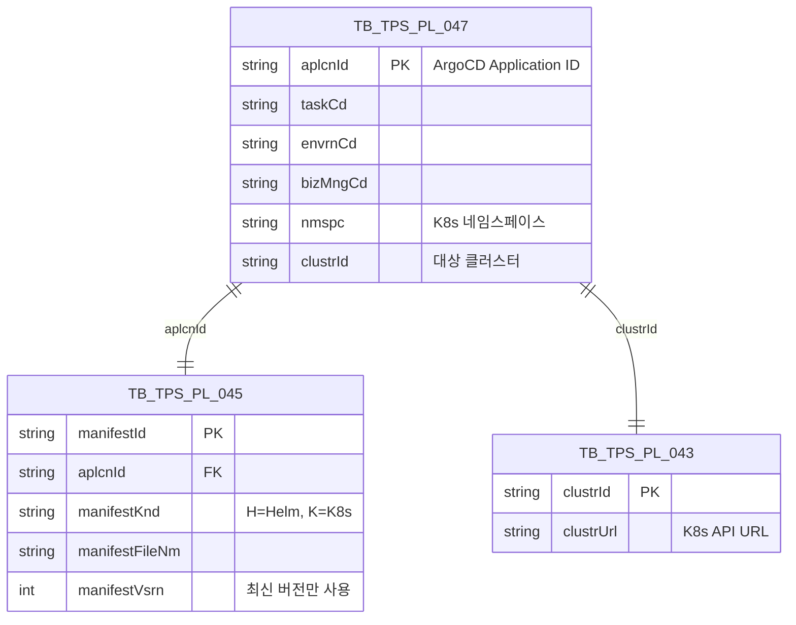
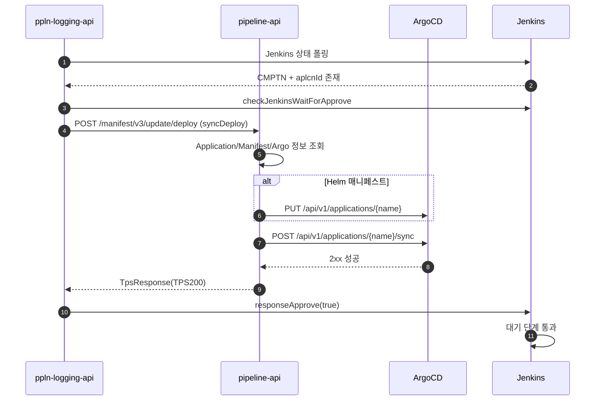

# ArgoCD Application 동기화 배포

---

> 목적: 파이프라인이 "배포" 단계까지 완료됐을 때 ArgoCD Application이 어떻게 동기화되는지, ppln-logging-api가 pipeline-api에 어떤 신호를 보내 이 흐름을 시작하는지 정리한다.
> 작성일: 2026-04-18
> 대상 코드: `pipeline-api/.../v2/domain/argocd/v2/application/service/impl/ArgoCdApplicationServiceImpl.java`, `ppln-logging-api/.../v3/domain/pipeline/service/impl/PipelineWriterImpl.java:150-200`

## 1. 결론

Application 동기화는 두 진입점이 있다. 사용자가 UI에서 "배포" 버튼을 누르면 pipeline-api의 `ArgoCdApplicationService.syncApplication(DeployManifestVo)`가 직접 실행된다. 트리거 파이프라인이 Jenkins 빌드를 끝내면 ppln-logging-api의 `PipelineWriterImpl`이 상태 전이를 감지해 pipeline-api Feign `syncDeploy(DeployManifestRequest)`를 호출하고, pipeline-api는 같은 메서드로 이어진다. 내부 로직은 "매니페스트 종류 확인 → (Helm이면) Application 업데이트 → ArgoCD `POST /api/v1/applications/{name}/sync` → 승인/반려 신호 반환" 순서다.

## 2. 전체 흐름



## 3. 계층별 책임

| 계층 | 클래스 | 역할 |
|------|--------|------|
| Trigger (ppln-logging-api) | `PipelineWriterImpl.updateStatusFromJenkins` | Jenkins 상태 감지, `syncDeploy` 콜백 호출 |
| Controller (pipeline-api) | Manifest/Application 컨트롤러 | `/manifest/v3/update/deploy`, `/argocd/v1/.../sync` 진입 |
| Application (pipeline-api) | `ArgoCdApplicationServiceImpl.syncApplication` | 매니페스트 조회, Application 업데이트, sync 호출 |
| Infrastructure | `ArgoCdFeignClient`, `ManifestDao`, `ToolChainDao` | ArgoCD REST, 매니페스트/도구 메타 조회 |

## 4. ppln-logging-api 쪽 트리거

`PipelineWriterImpl`은 Jenkins 상태를 폴링해 `CMPTN`(완료) 전이를 감지한다. `aplcnId`(ArgoCD Application ID)가 있으면 배포 흐름이 이어져야 한다는 신호다.

```java
// PipelineWriterImpl.java:150-186 (발췌)
case PPLN_STATUS_CMPTN:
    if (!StringUtil.isNullOrEmpty(target.getAplcnId())) {
        log.info("===========[ SYNC ARGO_CD APPLICATION ]=======");
        int trigrExcnNo = triggerDao.selectTriggerExecuteHistoryNo(
                target.getTcktNo(), target.getCompnInptOrd(), target.getTrigrSn());

        if (!jenkinsUseCase.checkJenkinsWaitForApprove(toolVo, structVo, trigrExcnNo)) return;

        ResponseEntity<TpsResponse> response = pipelineApiFeignClient.syncDeploy(
                DeployManifestRequest.builder()
                        .tcktNo(target.getTcktNo())
                        .compnInptOrd(target.getCompnInptOrd())
                        .trigrSn(target.getTrigrSn())
                        .taskCd(target.getTaskCd())
                        .envrnCd(target.getEnvrnCd())
                        .bizNm(target.getBizNm())
                        .build());
        boolean syncAt = Objects.requireNonNull(response.getBody()).getRsltCd().equals("TPS200");
        jenkinsUseCase.responseApprove(toolVo, structVo, trigrExcnNo, syncAt);
        if (!syncAt) skipAllPipelineAt = true;
    }
    break;
```

핵심은 **양방향 신호**다. pipeline-api에 sync 요청을 넣고, 결과(`TPS200` 성공)를 받아 Jenkins 대기 중인 파이프라인에 "승인" 또는 "반려"를 되돌린다. `responseApprove`가 Jenkins의 input 단계를 통과시키거나 실패 처리한다. sync 실패면 같은 트리거의 다른 파이프라인도 모두 스킵한다(`skipAllPipelineAt = true`).

## 5. pipeline-api 쪽 동기화 본체

`syncApplication(DeployManifestVo request)`는 입력 파라미터를 기반으로 Application과 매니페스트 메타를 조회한 뒤, 매니페스트 종류에 따라 분기한다.

```java
// ArgoCdApplicationServiceImpl.java:1218-1246 (발췌)
public String syncApplication(DeployManifestVo request) {
    String taskCd = request.getTaskCd();
    String envrnCd = request.getEnvrnCd();
    SelectApplicationWithWfInfoResponse applicationInfo =
            tbTpsPl047QueryService.selectApplicationWithWfInfo(...);
    TbTpsPl052 toolChainInfo = toolChainDao.getToolChain(taskCd);
    TbTpsCm150 argoInfo = toolChainDao.getSupportTool(taskCd, envrnCd, DevConstant.TOOL_TYPE_DEPLOY);
    if (ObjectUtils.isEmpty(applicationInfo) || ObjectUtils.isEmpty(toolChainInfo) || ObjectUtils.isEmpty(argoInfo)) {
        throw new TpsException(ErrorCodeGeneral.DATA_NOT_FOUND);
    }
    TbTpsPl045 manifestInfo = manifestDao.selectManifestInfoByMaxVersion(applicationInfo.getAplcnId());
    if (ObjectUtils.isEmpty(manifestInfo)) {
        throw new TpsException(ErrorCodeGeneral.DATA_NOT_FOUND);
    }
    ...
}
```

조회 단계에서 세 가지가 반드시 확인된다.

- `applicationInfo` — ArgoCD Application 메타(`aplcnId`, `bizMngCd`, `clustrId`, `nmspc`)
- `argoInfo` — ArgoCD 서버 접속 정보(`tlUrl`, `tlCntnId`, `tlSgnl`)
- `manifestInfo` — 최신 버전 매니페스트(`manifestKnd`, `manifestFileNm`)

세 중 하나라도 비어 있으면 `DATA_NOT_FOUND`로 끊는다. Application 메타가 없는 상황은 대부분 Application이 아직 ArgoCD에 생성되지 않았거나 TPS에서 삭제됐을 때 발생한다.

## 6. Helm 매니페스트 업데이트 분기

`manifestKnd == "H"`(Helm)면 Application의 `source`와 `spec`을 매번 업데이트한다. Helm 차트는 파일명/targetRevision이 자주 바뀌므로 sync 전에 Application 정의를 최신화해야 한다.

```java
// ArgoCdApplicationServiceImpl.java:1256-1307 (발췌)
if ("H".equals(manifestInfo.getManifestKnd())) {
    String[] fileArr = processingFileNm(manifestInfo.getManifestFileNm());
    source.put("repoURL", gitLabInfo.getTlUrl() + DevConstant.MANIFEST_REPO_PATH);
    source.put("path", StringUtils.hasText(fileArr[0]) ? fileArr[0] : ".");
    source.put("targetRevision", taskCd + "_" + request.getBizNm() + "_" + envrnCd);
    destination.put("server", clusterInfo.getClustrUrl());
    destination.put("namespace", applicationInfo.getNmspc());
    Map<String, Object> helm = new HashMap<>();
    List<String> valuesFiles = new ArrayList<>();
    valuesFiles.add(fileArr[1]);
    helm.put("valueFiles", valuesFiles);
    source.put("helm", helm);

    metadata.put("name", argoAppName);
    spec.put("project", "default");
    spec.put("source", source);
    spec.put("destination", destination);

    ResponseEntity<Map<String, Object>> response = argoCdFeignClient.updateApplication(
            getbaseUri(argoInfo.getTlUrl()),
            "Bearer " + getToken(argoInfo.getTlCntnId(), argoInfo.getTlSgnl(), argoInfo.getTlUrl()),
            argoAppName,
            ArgoCdApplicationRequest.builder().metadata(metadata).spec(spec).build());
}
```

`targetRevision`이 `{taskCd}_{bizNm}_{envrnCd}` 포맷이라는 점이 중요하다. 이 규약은 Git 리포 브랜치 네이밍 규칙과 묶인다. K8s 매니페스트(`manifestKnd == "K"`)는 파일 경로로 직접 지정하므로 Application 업데이트 단계를 건너뛴다.

## 7. sync 호출

매니페스트 종류와 무관하게 마지막에 `syncApplication`이 호출된다. ArgoCD의 `/api/v1/applications/{appName}/sync` 엔드포인트를 친다.

```java
// ArgoCdFeignClient.java:78-82
@PostMapping("/api/v1/applications/{appName}/sync")
ResponseEntity<Map<String, Object>> syncApplication(URI baseUri,
        @RequestHeader("Authorization") String bearerAuth,
        @PathVariable String appName,
        @RequestBody Map<String, Object> data);
```

`data` 바디에는 `appNamespace`, `revision`, `prune`, `dryRun`, `strategy`, `syncOptions` 필드가 들어간다. 기본값은 `prune=false`, `dryRun=false`, `strategy.hook`이다. sync 옵션 중 Prune은 Application에서 지워진 리소스를 K8s에서도 지울지 결정하는 플래그인데, 기본이 `false`라는 점은 "실수로 리소스가 사라지지 않게 막는다"는 안전 설정으로 읽힌다.

## 8. 데이터 모델



`TbTpsPl045`는 매니페스트 버전 이력이다. `syncApplication`은 `selectManifestInfoByMaxVersion`으로 **최신 버전만** 사용한다. 롤백 흐름은 별도 경로(09 문서)로 이전 버전을 지정해 동기화한다.

## 9. 호출 시퀀스



## 10. 외부 시스템 호출

- **ArgoCD** — `PUT /api/v1/applications/{name}` (Helm일 때만), `POST /api/v1/applications/{name}/sync` (항상).
- **Jenkins** — `checkJenkinsWaitForApprove`/`responseApprove`는 ppln-logging-api 쪽에서 Jenkins Input 스텝을 통과/실패시킨다.
- **GitLab** — 매니페스트 리포 URL을 Application source에 실어 보낸다. 직접 호출하지는 않음.

## 11. 해석과 주의점

"왜 ppln-logging-api가 pipeline-api 쪽으로 sync 요청을 보내는 구조인가?"라는 의문이 생길 수 있다. 답은 **트리거 파이프라인이 여러 단계(Build → Deploy → Approval)를 Jenkins 안에서 돌리는데, Deploy 단계가 Jenkins 외부(ArgoCD)에서 끝나야 하기 때문**이다. ppln-logging-api는 Jenkins 관찰자 역할을 맡고, pipeline-api는 도메인 액션을 수행한다. 둘이 Feign으로 연결돼 한 흐름을 이어간다.

매니페스트 종류가 Helm일 때만 `updateApplication`을 먼저 호출하는 이유는 Helm 차트의 `valuesFiles`와 `targetRevision`이 자주 바뀌기 때문이다. K8s 매니페스트는 Application 정의 자체를 바꾸지 않고 Git에 푸시된 새 리소스를 보기만 한다. 새 매니페스트 종류(예: Kustomize)를 추가한다면 이 분기를 확장해야 한다.

`syncOptions`에 `ApplyOutOfSyncOnly=true` 같은 옵션을 넣으면 변경된 리소스만 동기화한다. 현재 코드는 기본값만 쓰는데, 대용량 Application에서 매번 전체 동기화가 무거우면 이 옵션을 고려해야 한다.

마지막으로 sync 실패 시 `responseApprove(false)`가 Jenkins의 input 단계를 반려한다. 동일한 트리거에 속한 다른 파이프라인도 `skipAllPipelineAt = true`로 전부 스킵된다. 즉 배포 실패 시 연쇄 실패가 의도된 동작이다. 한 파이프라인만 재시도하려면 TPS 쪽에서 수동 재실행이 필요하다.
