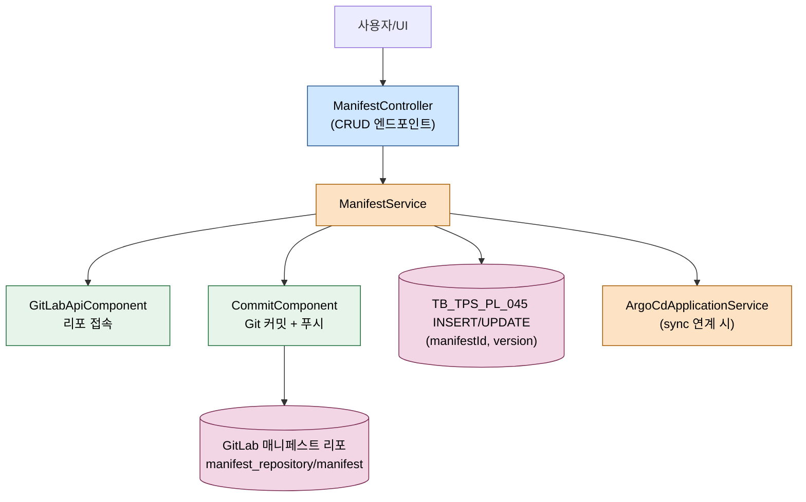
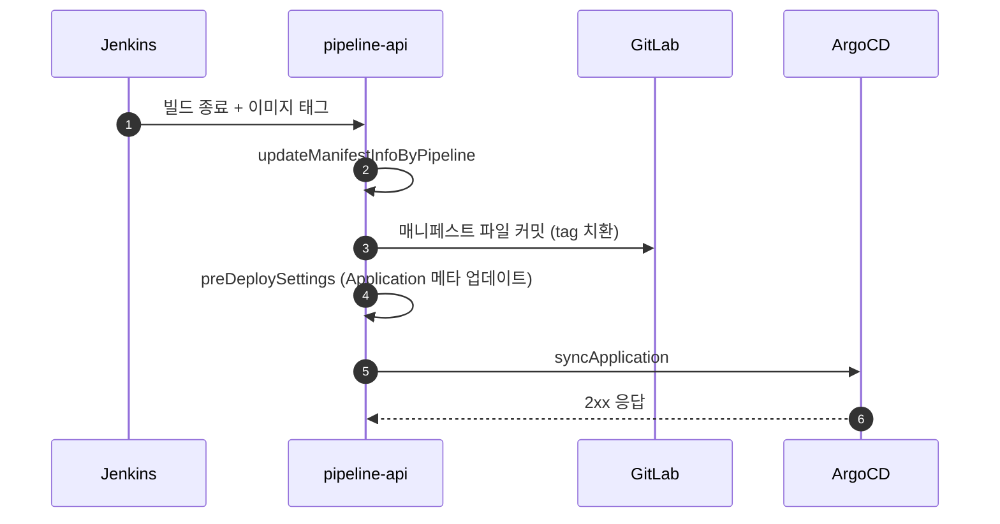
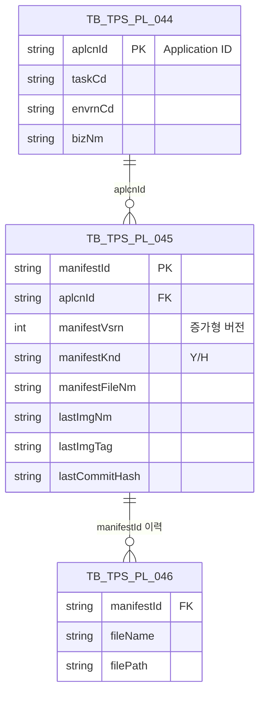

# ArgoCD Manifest 관리

---

> 목적: 배포 매니페스트(YAML/Helm)가 TPS와 GitLab, ArgoCD 사이에서 어떻게 생성·수정·조회·삭제되는지 흐름을 정리한다.
> 작성일: 2026-04-18
> 대상 코드: `pipeline-api/.../v2/domain/argocd/v2/manifest/service/impl/ManifestServiceImpl.java`, `.../v2/application/argocd/v2/manifest/controller/ManifestController.java`

## 1. 결론

매니페스트는 **TPS DB + GitLab 리포 두 곳에 쌍으로** 저장된다. TPS DB(`TB_TPS_PL_045`)에는 메타(종류/버전/이미지 태그)를 적재하고, 실제 파일 내용은 GitLab 매니페스트 리포에 커밋된다. ArgoCD는 이 GitLab 리포를 소스로 삼아 동기화하므로, pipeline-api가 매니페스트를 바꾼다는 것은 결국 GitLab 커밋 + DB 버전 증가의 두 동작을 묶어 실행한다는 뜻이다. 매니페스트 종류는 YAML(`Y`)과 Helm(`H`) 둘이고, 파일 명명/경로 규칙이 종류별로 다르다.

## 2. 전체 흐름



## 3. 계층별 책임

| 계층 | 클래스 | 역할 |
|------|--------|------|
| Presentation | `ManifestController` | `/argocd/v1/manifest/*` 진입 |
| Domain | `ManifestServiceImpl implements ManifestService` | 11개 메서드(조회 3, 쓰기 6, 배포 연계 2) |
| Infrastructure | `GitLabApiComponent`, `CommitComponent`, `ManifestDao`, `TbTpsPl044QueryService`, `TbTpsPl046QueryService` | GitLab 파일 조회/커밋, DB CRUD |
| 연계 | `ArgoCdApplicationService` | 매니페스트 변경 후 sync 재실행 연결 |

## 4. ManifestService 인터페이스

전체 공개 메서드는 11개다. 엔드포인트와 1:1로 매칭되진 않고 내부 재사용이 많다.

```java
// ManifestService.java
public interface ManifestService {
    TbTpsPl045 selectManifestInfoByMaxVersion(SelectManifestVo request);
    DetailManifestVo getManifestInfoWithScript(SelectManifestVo request);
    String getManifestFileContent(GetManifestFileContentVo request);
    void createManifestInfo(String requester, CreateManifestVo request);
    void updateManifestInfo(String requester, UpdateManifestVo request);
    void updateManifestInfoV2(String requester, UpdateManifestVo request);
    void deleteManifestInfo(String requester, DeleteManifestDto request);
    void deleteManifestFileByException(String requester, DeleteManifestDto request);
    void updateManifestInfoByPipeline(DeployManifestVo request);
    void preDeploySettings(PreDeployVo request);
    void rollbackManifest(RollbackManifestVo request);
}
```

카테고리로 묶으면 조회 3개(`selectMax`, `withScript`, `fileContent`), 등록/수정 3개(`create`, `update`, `updateV2`), 삭제 2개(`delete`, `deleteByException`), 파이프라인 연계 3개(`updateByPipeline`, `preDeploy`, `rollback`)다. `updateV2`는 매니페스트 스키마가 바뀐 뒤 추가된 신규 경로이고 `updateManifestInfo`는 레거시로 유지된다.

## 5. 매니페스트 종류 상수와 경로 규칙

```java
// ManifestServiceImpl.java:63-70
private static final String MANIFEST_REPOSITORY_PATH = "manifest_repository/manifest";
private static final String MANIFEST_KIND_YAML = "Y";
private static final String MANIFEST_KIND_HELM = "H";
```

매니페스트 종류는 두 가지다.

- **YAML(Y)** — 단일 YAML 파일. 파일명 규칙은 `{taskCd}-{bizNm}-{envrnCd}.yaml`. Application의 source.path는 `.`, source.target은 파일 하나.
- **Helm(H)** — Helm 차트 디렉토리. 여러 파일(`Chart.yaml`, `values.yaml`, `templates/*`)이 하나의 브랜치에 모여 있다. Application의 source.helm.valueFiles로 파일명을 지정한다.

파일명 규칙을 깨면 ArgoCD Application source가 빈 디렉토리를 보게 되므로 sync가 실패한다.

## 6. 상세 조회 예시

`getManifestInfoWithScript`는 DB 메타 + GitLab 파일 내용 두 가지를 합쳐 한 응답으로 돌려준다.

```java
// ManifestServiceImpl.java:96-135 (발췌)
public DetailManifestVo getManifestInfoWithScript(SelectManifestVo request) {
    SelectApplicationDetailResponse applicationInfo =
            tbTpsPl044QueryService.selectApplicationDetail(request.getAplcnId());
    ConnectionInfo connectionInfo = toolchainService.getConnectionInformation(
            applicationInfo.getTaskCd(), ToolCategory.VERSION_CONTROL, applicationInfo.getEnvrnCd());
    GitLabApiComponent gitLabApiComponent = GitLabApiComponent.login(connectionInfo);
    String branchNm = getBranchName(applicationInfo.getTaskCd(),
            applicationInfo.getBizNm(), applicationInfo.getEnvrnCd());
    Project manifestRepoInfo = gitLabApiComponent.getProjectByName(MANIFEST_REPOSITORY_PATH);
    TbTpsPl045 manifestDefaultInfo = manifestDao.selectManifestInfoByMaxVersion(applicationInfo.getAplcnId());
    ...
    if (StringUtils.equals(manifestDefaultInfo.getManifestKnd(), MANIFEST_KIND_YAML)) {
        String fileName = getYamlFileName(applicationInfo.getTaskCd(),
                applicationInfo.getBizNm(), applicationInfo.getEnvrnCd());
        RepositoryFile fileInfo = gitLabApiComponent.getFile(manifestRepoInfo.getId(), fileName, branchNm);
        String fileContents = fileInfo.getDecodedContentAsString();
        return DetailManifestVo.builder()
                .manifestId(manifestDefaultInfo.getManifestId())
                .manifestKnd(manifestDefaultInfo.getManifestKnd())
                .manifestFileNm(manifestDefaultInfo.getManifestFileNm())
                .lastImgInfo(imgNm + ":" + imgTag)
                .script(fileContents)
                .build();
    } else if (StringUtils.equals(manifestDefaultInfo.getManifestKnd(), MANIFEST_KIND_HELM)) {
        List<TreeItem> fileTree = gitLabApiComponent.selectRepoAllFileTree(
                manifestRepoInfo.getId(), "", branchNm);
        ...
    }
}
```

YAML은 단일 파일이므로 파일명을 계산해 바로 내용을 읽는다. Helm은 전체 파일 트리를 훑어 `fileList`를 만들고, `valueFiles`에 해당하는 파일 내용만 `script`로 돌려준다. 즉 DB 한 번, GitLab 두 번(트리 + 파일)의 왕복이 일어난다. 대형 Helm 차트는 파일 트리 호출이 느려질 수 있다.

## 7. 생성·수정·삭제

생성(`createManifestInfo`)은 `@Transactional`로 묶여 다음 순서를 따른다.

1. `TB_TPS_PL_045`에 `manifestId` 발급 + 초기 버전(`manifestVsrn = 1`) 인서트.
2. `CommitComponent.commitAndPush`로 GitLab 브랜치에 새 파일을 커밋.
3. 커밋 해시를 `TB_TPS_PL_045`에 다시 UPDATE(`lastCommitHash`).

커밋 실패 시 `@Transactional` 롤백으로 DB 인서트도 되돌아간다. GitLab 브랜치에는 부분 커밋이 남을 수 있어, 실패 시 `deleteManifestFileByException`으로 수동 정리 경로를 제공한다.

수정(`updateManifestInfo`/`updateManifestInfoV2`)은 새 버전(`manifestVsrn + 1`)을 인서트하고 GitLab에 새 커밋을 남긴다. **기존 행을 UPDATE하지 않고 행을 추가하는 버전 이력 방식**이다. 롤백(`rollbackManifest`)이 "과거 버전을 선택해 sync"하는 식으로 동작하므로 히스토리를 지워서는 안 된다.

삭제(`deleteManifestInfo`)는 DB를 논리 삭제(`deleteYn = 'Y'`)하고 GitLab 파일은 유지한다. 즉 GitLab 리포에는 누적된 파일이 계속 쌓인다. 운영 시 Git 리포 정리는 별도 절차다.

## 8. 파이프라인 연계 흐름

Jenkins 빌드가 새 이미지를 만들면 `updateManifestInfoByPipeline`이 호출돼 이미지 태그만 업데이트한다. 사용자가 직접 매니페스트를 수정하는 경로와 다르게 **파일 본문을 정규식으로 치환**해 새 이미지 태그를 심는다. 이어 `preDeploySettings`가 Application source의 `targetRevision`과 파일 경로를 확정짓고, 앞에서 다룬 `ArgoCdApplicationService.syncApplication`이 sync를 친다.



## 9. 데이터 모델



`TB_TPS_PL_046`은 Helm 차트의 복수 파일 이름을 보관한다. YAML은 파일이 한 개이므로 046에 넣지 않을 때도 있다. 046이 비어 있어도 정상 동작하도록 `getManifestInfoWithScript`가 트리 전체 스캔으로 대체하는 로직을 둔다.

## 10. 외부 시스템 호출 요약

- **GitLab** — `gitLabApiComponent.getFile`, `selectRepoAllFileTree`, `CommitComponent.commitAndPush`.
- **ArgoCD** — 매니페스트 변경 자체는 호출하지 않음. 이어지는 sync에서만 호출.

## 11. 해석과 주의점

매니페스트를 버전 이력 방식(새 행 추가)으로 관리하는 이유는 롤백과 추적이 쉽기 때문이다. 단, 이력이 수백 개 쌓이면 `selectManifestInfoByMaxVersion`이 느려질 수 있다. `aplcnId`에 인덱스가 있어도 정렬 비용이 누적된다. 오래된 이력을 아카이빙하는 운영 배치가 필요하다.

Helm 차트 상세 조회에서 전체 파일 트리를 매번 가져오는 동작은 대형 차트(수백 파일)에 부담이 된다. 새 기능을 추가할 때 `fileTree` 재사용을 고려하고, 굳이 전체 트리가 필요 없으면 `valueFiles` 경로만 직접 조회하도록 조건을 넣는다.

`deleteManifestInfo`가 GitLab 파일을 지우지 않는 정책은 "삭제해도 히스토리가 남아야 한다"는 의도로 보인다. 하지만 동일 브랜치에 새 파일을 만들다가 이름이 충돌하는 시나리오가 실무에서 가끔 보고된다. 이름 규칙(`{taskCd}-{bizNm}-{envrnCd}.yaml`)이 동일한데 `envrnCd`만 달라지는 케이스에서 혼동이 생긴다. 신규 기능 추가 시 파일명 규약을 먼저 확인한다.

마지막으로 `updateManifestInfoByPipeline`이 정규식 치환으로 이미지 태그를 바꾸는 방식은 파일 포맷(공백, 주석)에 민감하다. Helm `values.yaml`에 사용자가 수동으로 주석을 넣은 케이스가 들어오면 치환이 빗나갈 수 있다. 장기적으로는 YAML 파서로 바꾸는 리팩터링이 안전하다.
