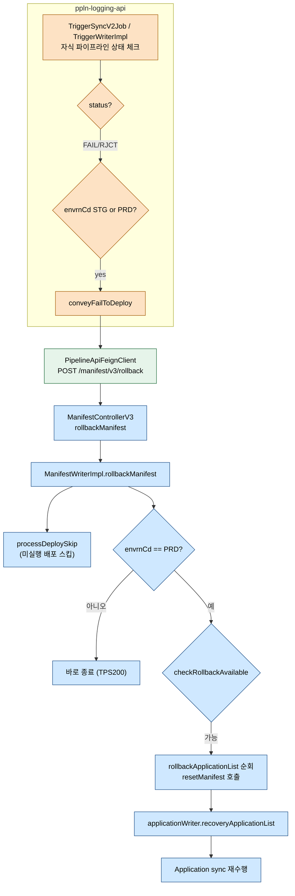
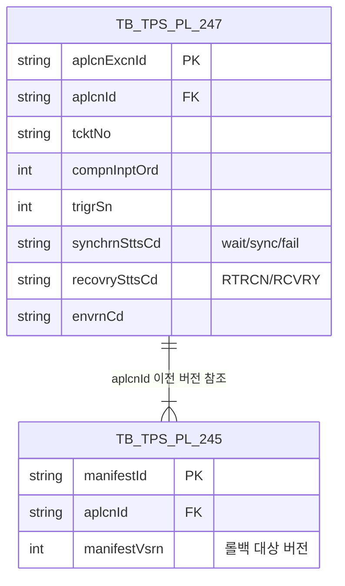
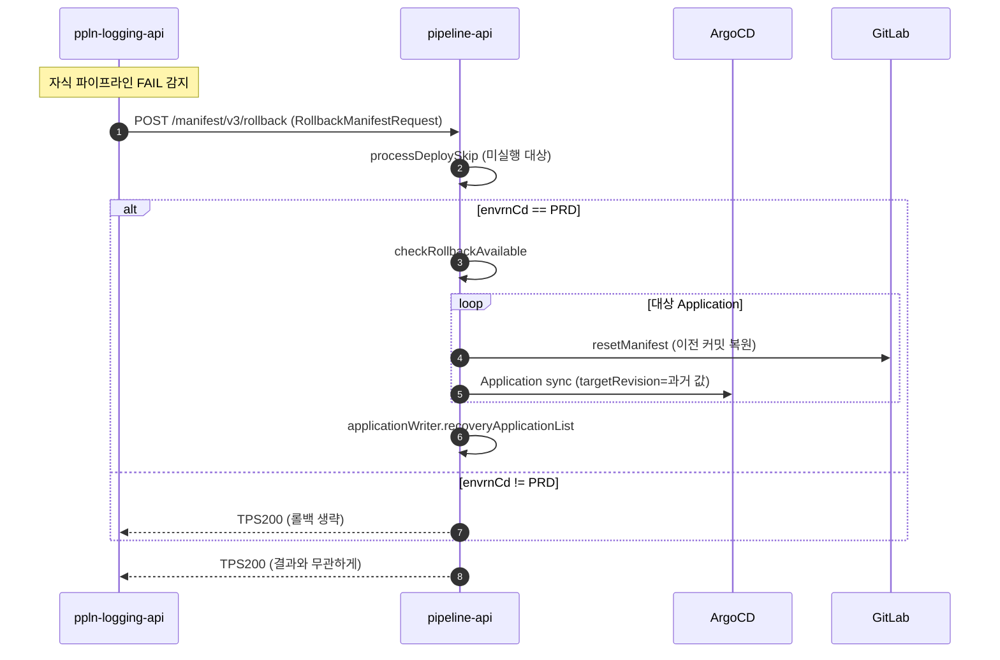

# ArgoCD 롤백 흐름

---

> 목적: 파이프라인이 실패하거나 취소됐을 때 pipeline-api가 Application 매니페스트를 이전 버전으로 되돌리는 경로를 정리한다.
> 작성일: 2026-04-18
> 대상 코드: `pipeline-api/.../v3/domain/manifest/impl/ManifestWriterImpl.java:300-384`, `ppln-logging-api/.../v3/domain/trigger/service/impl/TriggerWriterImpl.java:140-257`

## 1. 결론

롤백 트리거는 두 가지다. 첫째, 트리거 파이프라인 감시 중 운영(PRD)/검증(STG) 자식 파이프라인이 `FAIL` 또는 `RJCT` 상태가 되면 ppln-logging-api가 pipeline-api에 `conveyFailToDeploy(RollbackManifestRequest)`를 호출한다. 둘째, 사용자가 UI에서 롤백을 요청하면 `ManifestControllerV3`가 같은 `rollbackManifest` 경로로 들어간다. 실제 동작은 **PRD 환경일 때만** 이전 매니페스트 버전(`targetRevision`)을 찾아 Git에 되돌린 뒤 Application sync를 트리거하는 구조다. STG 환경은 알림만 받고 롤백 자체는 건너뛴다. 호출 결과는 pipeline-api가 항상 `TPS200`으로 응답해 호출자(ppln-logging-api/Jenkins) 흐름을 막지 않는다.

## 2. 전체 흐름



## 3. 계층별 책임

| 계층 | 클래스 | 역할 |
|------|--------|------|
| Trigger (ppln-logging-api) | `TriggerWriterImpl` | 자식 파이프라인 상태 감지, 실패 시 `conveyFailToDeploy` |
| Feign 경계 | `PipelineApiFeignClient.conveyFailToDeploy` | `POST /pipeline/api/manifest/v3/rollback` |
| Controller (pipeline-api) | `ManifestControllerV3.rollbackManifest` | 진입점 하나, `manifestUseCase`로 위임 |
| Domain | `ManifestWriterImpl.rollbackManifest`, `resetManifest` | 롤백 대상 조회, 매니페스트 복원, 스킵/실패 처리 |
| Infrastructure | `ApplicationDao`, `applicationWriter`, `TriggerReader` | DB CRUD, Application 회복 처리 |

## 4. ppln-logging-api 쪽 신호 발행

`TriggerWriterImpl`은 트리거 자식 파이프라인 상태를 주기적으로 확인한다. STG/PRD 환경에서 `FAIL`/`RJCT`가 감지되면 `conveyFailToDeploy`를 호출한다.

```java
// TriggerWriterImpl.java:140-156 (발췌)
case PPLN_STATUS_FAIL, PPLN_STATUS_RJCT -> {
    if (selectNormalPplnVo.getEnvrnCd().equals(PPLN_ENVRN_CD_STG)
            || selectNormalPplnVo.getEnvrnCd().equals(PPLN_ENVRN_CD_PRD)) {
        return conveyFailToDeploy(tbTpsPl203);
    }
}

// TriggerWriterImpl.java:243-257
private boolean conveyFailToDeploy(TbTpsPl203Extended target) {
    log.info("[ TRIGGER_SCHEDULER ] :: CONVEY FAIL TRIGGER TO DEPLOY : tcktNo > {}", target.getTcktNo());
    RollbackManifestRequest request = RollbackManifestRequest.builder()
            .tcktNo(target.getTcktNo())
            .compnInptOrd(target.getCompnInptOrd())
            .trigrSn(target.getTrigrSn())
            .taskCd(target.getTaskCd())
            .envrnCd(target.getEnvrnCd())
            .build();
    ResponseEntity<TpsResponse> response = pipelineApiFeignClient.conveyFailToDeploy(request);
    return Objects.requireNonNull(response.getBody()).getRsltCd().equals("TPS200");
}
```

주석이 중요하다. "배포에서는 본인이 롤백을 수행할지 수행하지 않을지 결정하며, 해당 처리는 결과와 무관하게 TPS200으로 응답한다". 즉 호출자 입장에서는 응답 값으로 롤백 성공 여부를 알 수 없다. 응답은 그저 "신호가 전달됐다"는 의미다.

## 5. pipeline-api 쪽 본체

`ManifestWriterImpl.rollbackManifest`가 실제 롤백 로직을 수행한다. 크게 세 단계다.

```java
// ManifestWriterImpl.java:300-384 (발췌)
public void rollbackManifest(RollbackManifestRequest request) {
    ApplicationExcnVo currentManifest = null;
    String errorMessage;
    boolean rollbackAt = false;
    String targetRevision;

    List<ApplicationExcnVo> skipApplicationList =
            applicationDao.selectApplicationSkipList(applicationMapper.toEntity(request));
    List<ApplicationExcnVo> rollbackApplicationList =
            applicationDao.selectRollbackApplicationByWorkflow(applicationMapper.toEntity(request));
    List<ApplicationExcnVo> filterRollbackApplicationList = new ArrayList<>();

    try {
        if (!skipApplicationList.isEmpty()) {
            applicationWriter.processDeploySkip(skipApplicationList);
        }
        if (request.getEnvrnCd().equals("PRD")) {
            rollbackAt = triggerReader.checkRollbackAvailable(
                    ManifestDomainMapper.toReservationTriggerVo(
                            request.getTcktNo(), request.getCompnInptOrd(), request.getTrigrSn()));
        } else {
            return;
        }
        if (rollbackAt) {
            if (rollbackApplicationList.isEmpty()) {
                return;
            } else {
                for (ApplicationExcnVo application : rollbackApplicationList) {
                    currentManifest = application;
                    targetRevision = resetManifest(request, application);
                    if (targetRevision != null) {
                        application.setTargetRevision(targetRevision);
                        filterRollbackApplicationList.add(application);
                    }
                }
            }
        }
    } catch (Exception e) {
        if (currentManifest == null) {
            errorMessage = String.format("failed to rollback manifest | cause : %s", e.getMessage());
        } else {
            errorMessage = String.format("aplcnId : %s | failed to rollback manifest | cause : %s",
                    currentManifest.getAplcnId(), e.getMessage());
        }
        applicationWriter.failRecoveryApplicationList(rollbackApplicationList, errorMessage);
        return;
    }
    applicationWriter.recoveryApplicationList(filterRollbackApplicationList);
}
```

단계 요약은 다음과 같다.

1. **스킵 처리** — 아직 실행되지 않은 배포 대상(`SYNCHRN_STTS_CD = 'wait'`)을 추려 `processDeploySkip`으로 스킵 상태로 전환. 예외와 무관하게 먼저 실행한다.
2. **환경 체크** — `envrnCd == "PRD"`가 아니면 즉시 `return`. STG 단계 실패는 정보만 전달하고 자동 롤백하지 않는다.
3. **롤백 판정 + 실행** — `checkRollbackAvailable`로 롤백 허용 여부를 다시 확인한다. 허용되면 실행이 완료된 Application(`RECOVRY_STTS_CD != 'RTRCN'`) 목록을 돌며 `resetManifest`로 이전 버전 커밋을 복원하고, 성공한 것만 `filterRollbackApplicationList`에 모은다.

예외가 나면 `failRecoveryApplicationList`가 전체 목록을 실패 상태로 기록하고, 정상 흐름은 `recoveryApplicationList`가 회복 큐로 넘긴다. 둘 다 비동기 처리로, 호출자에게는 영향을 주지 않는다.

## 6. resetManifest 동작

`resetManifest`는 개별 Application의 매니페스트 커밋을 되돌린다. 구현 요약은 다음과 같다.

- Application 상세(`selectApplicationDetail`)로 aplcnId/bizMngCd/envrnCd/repo 정보를 얻는다.
- 배포 전 상태로 저장해 두었던 커밋 해시 또는 이전 버전(`TbTpsPl046`의 버전 이력)을 찾는다.
- GitLab에 해당 커밋을 `targetRevision`으로 참조하는 새 커밋을 만든다.
- 성공 시 새 `targetRevision`을 문자열로 돌려주고, 실패 시 예외를 던진다.

`targetRevision`이 반환돼야 상위 루프가 해당 Application을 `filterRollbackApplicationList`에 추가한다. null이 돌아오면 회복 대상에서 조용히 빠진다. 이 경로로 "일부 Application만 롤백 성공"한 부분 회복이 가능하다.

## 7. 응답 계약 — 항상 TPS200

pipeline-api는 롤백 성공/실패와 무관하게 최종 응답을 `TPS200`으로 돌려준다. catch 블록에서도 `return`으로 정상 종료한다. 이 계약이 있기 때문에 ppln-logging-api는 롤백 지시만 내리고 다음 처리를 자기 큐에서 이어갈 수 있다. 실제 롤백 성공 여부는 TPS DB의 `RECOVRY_STTS_CD`, `SYNCHRN_STTS_CD`를 UI에서 조회해 확인한다.

## 8. 데이터 모델



`TB_TPS_PL_247`은 Application 실행 이력이고, `recovrySttsCd`(회복 상태 코드)가 롤백 진행 상태의 단일 근거다. `RTRCN`(취소·회수 완료) 이면 이미 처리된 것으로 보고 롤백 대상에서 제외한다.

## 9. 시퀀스 전체



## 10. 외부 시스템 호출 요약

- **GitLab** — `resetManifest` 내부에서 커밋 조회·생성. 이전 매니페스트 파일 내용을 꺼내 새 커밋으로 기록.
- **ArgoCD** — 롤백 커밋이 GitLab에 올라간 뒤 `ArgoCdApplicationService.syncApplication`이 새 `targetRevision`으로 sync를 친다. 07 문서 경로를 그대로 재사용한다.
- **pipeline-api 내부 이벤트** — 회복 성공/실패 시 `applicationWriter.*`가 별도 큐(트랜잭션 외부)에 넣어 후처리한다.

## 11. 해석과 주의점

STG가 자동 롤백 대상에서 빠진 설계는 **검증 환경은 문제가 생겨도 그대로 두고 확인한다**는 운영 정책에서 온다. STG 실패는 알림만 받고 수동으로 처리한다. PRD만 자동 복구하는 게 규칙이다. 이 정책이 바뀌면 `if (request.getEnvrnCd().equals("PRD"))` 분기를 수정해야 한다.

`rollbackManifest`가 try-catch로 모든 예외를 삼키고 `TPS200`을 돌려주는 동작은 호출자 흐름을 보호하지만, 호출자가 롤백 실패를 인지하지 못하게 만든다. 실제 상태는 DB(`recovrySttsCd`)로만 알 수 있으므로 대시보드에 이 컬럼을 띄우는 것이 필수다. 운영 중 "왜 자동 롤백이 안 됐지?"라는 질문은 이 컬럼을 먼저 확인한다.

`checkRollbackAvailable`가 false를 반환하면 롤백이 스킵된다. 이 플래그는 예약(reservation) 도메인에서 계산하는데, 동일 트리거의 특정 상태(예: 이미 롤백 시도 중)일 때 중복 롤백을 막는다. 새 기능을 추가해 여러 번 롤백을 강제로 시도할 때 이 가드를 우회하지 않도록 주의한다.

마지막으로 `resetManifest`가 개별 Application 단위로 실행되므로, 한 트리거에 Application이 여러 개인 경우 일부만 롤백되는 상태가 생길 수 있다. 이 상태는 설계 의도("가능한 것만 되돌린다")에 부합하지만 운영자가 혼란을 겪을 여지가 있으므로 UI에서 "일부 롤백됨" 표시를 명확히 해 두는 편이 안전하다.
