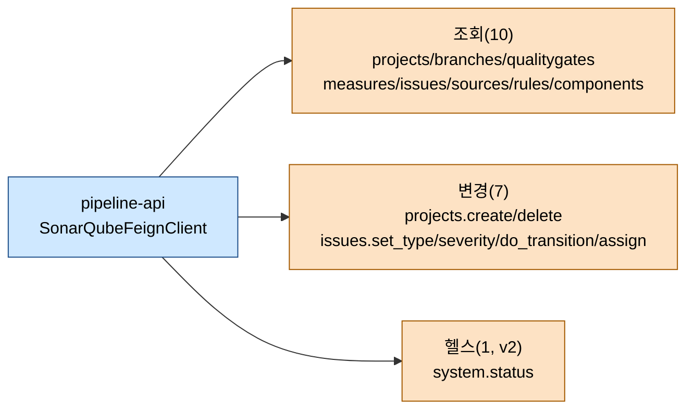

# SonarQube API 레퍼런스

---

> 목적: TPS pipeline-api가 호출하는 SonarQube REST 엔드포인트를 한 장에 묶어 용도·파라미터·응답 구조·연관 API를 정리한다.
> 작성일: 2026-04-18
> 대상 코드: `pipeline-api/.../v3/infrastructure/external/client/SonarQubeFeignClient.java`, `.../v2/infrastructure/config/sonarqube/SonarQubeFeignClient.java`, `.../v3/infrastructure/util/sonarqube/SonarQubeFeignEnum.java`

## 1. 결론

TPS가 SonarQube에서 쓰는 API는 **총 17개**(v3 기준 16개 + v2 전용 1개)다. 모두 Basic Auth(`Authorization: Basic {base64(user:token)}`)로 호출한다. 조회 계열이 10개, 변경 계열이 7개이고, 조회는 Measures/Issues/QualityGate 세 축이 중심이다. 변경 계열은 프로젝트 생성·삭제 2개와 이슈 상태 전환 4개(type/severity/status/assignee)로 단출하다. 메트릭 키는 코드에 상수로 고정돼 있어, 지표를 늘리려면 enum을 갱신해야 한다.

## 2. 전체 API 한눈에



## 3. 조회 계열 (GET)

| # | 엔드포인트 | Feign 메서드 | 목적 | 주요 파라미터 |
|---|-----------|--------------|------|---------------|
| 1 | `GET /api/system/status` *(v2 only)* | `healthCheck` | SonarQube 서버 상태(UP/DOWN) 확인. 등록 전 헬스 체크용 | 없음 |
| 2 | `GET /api/projects/search` | `getProject` | 프로젝트 키 단건 존재/상세 확인 | `projects` |
| 3 | `GET /api/project_branches/list` | `selectProjectBranchesList` | 프로젝트가 스캔한 브랜치 목록 | `project` |
| 4 | `GET /api/qualitygates/project_status` | `selectQualitygates` | 품질 게이트 통과 여부(OK/WARN/ERROR) | `projectKey`, `branch` |
| 5 | `GET /api/measures/component` | `selectMeasuresComponent` | 프로젝트 단위 메트릭 다건. 05 문서의 메인 조회 | `component`, `branch`, `metricKeys` |
| 6 | `GET /api/measures/component_tree` | `selectMeasuresComponentTree` | 파일/폴더 단위 메트릭 정렬·페이지네이션. 드릴다운용 | `component`, `metricSort`, `ps`, `s`, `strategy`, … |
| 7 | `GET /api/issues/search` | `selectIssuesSearch` | 이슈 목록 조회. facets/사이드 필터 포함 | `componentKeys`, `branch`, `ps`, `p`, `facets`, `additionalFields`, `sideFilter` |
| 8 | `GET /api/sources/issue_snippets` | `selectIssueSnippets` | 이슈 주변 코드 스니펫 | `issueKey` |
| 9 | `GET /api/sources/lines` | `selectIssueLines` | 특정 파일의 라인 범위 원본 조회 | `key`, `branch`, `from`, `to` |
| 10 | `GET /api/rules/show` | `selectIssueRule` | 이슈에 걸린 룰의 상세(설명, 심각도) | `key` |
| 11 | `GET /api/components/show` | `selectComponentInfo` | 컴포넌트(프로젝트/파일) 메타 | `component`, `branch` |

Measures API 세 개(`/component`, `/component_tree`, `/issues/search`)가 거의 모든 UI 조회 화면을 커버한다. 스니펫·라인·룰 3종(8~10)은 이슈 상세 모달을 그리는 용도로만 쓴다.

## 4. 변경 계열 (POST)

| # | 엔드포인트 | Feign 메서드 | 목적 | 주요 파라미터 |
|---|-----------|--------------|------|---------------|
| 12 | `POST /api/projects/create` | `createProject` | 분석 대상 프로젝트 생성. 02 문서 UC-S1에서는 Jenkins 스캐너가 대신 생성하므로 호출 빈도는 낮음 | `project`, `name` |
| 13 | `POST /api/projects/delete` | `deleteProject` | 프로젝트 제거 | `project` |
| 14 | `POST /api/issues/set_type` | `updateIssuesSetType` | 이슈 type 변경(CODE_SMELL/BUG/VULNERABILITY) | `issue`, `type` |
| 15 | `POST /api/issues/set_severity` | `updateIssuesSetSeverity` | 이슈 심각도(BLOCKER/CRITICAL/…/INFO) | `issue`, `severity` |
| 16 | `POST /api/issues/do_transition` | `updateIssuesSetStatus` | 상태 전이(confirm/resolve/reopen/falsepositive/wontfix) | `issue`, `transition` |
| 17 | `POST /api/issues/assign` | `updateIssuesSetAssignee` | 담당자 할당/해제 | `issue`, `assignee` |

이슈 변경 4종은 pipeline-api가 TPS DB에 사본을 남기지 않고 SonarQube 본체에 바로 반영한다. 05 문서 "해석과 주의점" 참고.

## 5. Measures 메트릭 키

`SonarQubeFeignEnum`에 정의된 상수가 `metricKeys` 파라미터 값으로 사용된다. 두 개의 묶음이 있다.

### 5.1 MEASURE_METRIC_KEYS (프로젝트 요약용)

```
alert_status, bugs, reliability_rating, vulnerabilities, security_rating,
security_hotspots_reviewed, security_review_rating, code_smells, sqale_rating,
duplicated_lines_density, coverage, ncloc, ncloc_language_distribution,
projects, security_hotspots, sqale_index, lines_to_cover, tests,
duplicated_lines, duplicated_blocks
```

### 5.2 MEASURE_COMPONENT_METRIC_KEYS (프로젝트 상세용, `new_*` 포함)

신규 코드(`new_*` 접두 메트릭)까지 포함한 확장 목록이다. 35개 내외. Sonar의 "New Code" 기간 개념을 쓰기 위한 지표로, `new_bugs`, `new_coverage`, `new_vulnerabilities` 등이 포함된다.

| 축 | 대표 키 | 의미 |
|----|---------|------|
| 신뢰성 | `bugs`, `new_bugs`, `reliability_rating` | 버그 수와 등급(A~E) |
| 보안 | `vulnerabilities`, `security_hotspots`, `security_rating` | 취약점/핫스팟 |
| 유지보수성 | `code_smells`, `sqale_index`, `sqale_rating` | 기술 부채 시간(분), 등급 |
| 커버리지 | `coverage`, `new_coverage`, `lines_to_cover` | 전체/신규 커버리지 |
| 중복 | `duplicated_lines_density`, `duplicated_lines`, `duplicated_blocks` | 중복 비율과 절대량 |
| 크기 | `ncloc`, `lines`, `tests` | 코드 라인 수, 테스트 수 |
| 품질 게이트 | `alert_status` | OK/ERROR/WARN |

## 6. 인증과 호출 규약

Feign은 `URI baseUrl`을 첫 인자로 받는다. 다중 SonarQube 서버 대응이다.

```java
// v3/infrastructure/external/client/SonarQubeFeignClient.java:17-25 (발췌)
@FeignClient(name = "sonarqube-feign", url = "sonarqube-placeholder", configuration = FeignConfig.class)
public interface SonarQubeFeignClient {
    @GetMapping("/api/projects/search")
    ResponseEntity<Map<String, Object>> getProject(URI baseUrl,
            @RequestHeader("Authorization") String basicAuth,
            @RequestParam("projects") String projects);
}
```

`basicAuth` 값은 `"Basic " + Base64(tlCntnId + ":" + tlSgnl)` 형태로 조립된다. `TB_TPS_CM_150`에서 도구 자격증명을 조회해 그때그때 헤더를 만든다. 토큰 기반 인증으로 바꾸려면 호출 유틸(`SonarQubeService`) 쪽을 수정하면 된다.

## 7. 응답 구조 요약

SonarQube가 돌려주는 JSON은 엔드포인트별로 고정 구조다. pipeline-api는 대부분 `Map<String, Object>`로 받아 필요한 필드만 꺼낸다.

| 엔드포인트 | 응답 주요 키 |
|-----------|--------------|
| `/api/projects/search` | `components[]`, `paging` |
| `/api/qualitygates/project_status` | `projectStatus.status`(OK/WARN/ERROR), `conditions[]` |
| `/api/measures/component` | `component.measures[].metric/value` |
| `/api/measures/component_tree` | `components[].measures[]`, `metrics[]`, `paging` |
| `/api/issues/search` | `issues[]`, `facets[]`, `components[]`, `rules[]`, `paging` |
| `/api/rules/show` | `rule{key,name,severity,type,htmlDesc}` |

## 8. 유사/연관 공식 API (TPS 미사용)

다음은 동일 네임스페이스 아래 같이 묶이는 API다. 현재 TPS에서는 호출하지 않지만 기능 확장 시 가장 먼저 검토할 후보다.

| 네임스페이스 | 미사용 엔드포인트 | 용도 | 도입 시 고려점 |
|--------------|-------------------|------|----------------|
| Projects | `GET /api/projects/export_findings` | 이슈 일괄 내보내기 | 대용량 응답 — 배치용 |
| Projects | `POST /api/projects/update_key`, `update_visibility` | 프로젝트 키 변경, 공개/비공개 | 통합관리 키와 충돌 주의 |
| Branches | `POST /api/project_branches/delete`, `rename` | 브랜치 정리 | 02 문서의 프로젝트 삭제가 브랜치를 남기는 문제 해결 후보 |
| Issues | `POST /api/issues/add_comment`, `edit_comment`, `delete_comment` | 이슈 댓글 | 현재는 댓글 UI 없음 |
| Issues | `POST /api/issues/bulk_change` | 대량 상태 변경 | 4종 변경 API를 한 번에 대체 |
| Measures | `GET /api/measures/search_history` | 메트릭 시계열 | 대시보드 그래프용 |
| Quality Gates | `GET /api/qualitygates/list`, `show`, `search_users` | 게이트 정의/소유자 | 게이트 자체 관리는 SonarQube UI 일임 |
| Rules | `GET /api/rules/search`, `tags` | 룰 목록·태그 | 커스텀 룰셋 도입 시 |
| Webhooks | `POST /api/webhooks/create`, `list`, `update`, `delete` | 완료 웹훅 | 04 문서의 Jenkins 로그 파싱 대신 웹훅 전환 후보 |
| CE (Compute Engine) | `GET /api/ce/activity`, `task`, `component` | 스캔 태스크 상태 | 스캔 진행/실패 원인 파악 |
| Authentication | `POST /api/authentication/login`, `logout` | 세션 기반 인증 | 현재 Basic Auth 대체 가능 |
| Users / Permissions | `/api/users/*`, `/api/permissions/*` | 사용자·권한 관리 | SSO 연동 시 |
| Settings | `GET /api/settings/values`, `POST /api/settings/set` | 서버 설정 | 관리자 UI에서 직접 처리 중 |

특히 **Webhooks**는 04 문서의 "Jenkins 로그 마커 파싱" 의존을 줄이는 정공법이다. SonarQube가 분석 종료 직후 `POST {pipeline-api}/hook`으로 상태를 보내주면 Freemarker 마커와 정규식 파싱이 필요 없어진다.

## 9. 해석과 주의점

17개 API는 Sonar 10.x 기준 공식 스펙과 호환된다. SonarQube 메이저 업그레이드 시 `/api/measures/component_tree`의 `metricSortFilter` 같은 선택 파라미터가 deprecated로 떨어지는 경우가 있으니, 업그레이드 전 체인지로그를 `SonarQubeFeignClient`의 `@RequestParam` 목록과 대조해야 한다.

`additionalFields` 파라미터는 서버가 기본으로 주지 않는 필드를 요청하는 스위치다. `/api/issues/search`에서 `rules,comments,users` 등을 추가해 응답 크기를 늘릴 수 있지만, 호출 빈도가 높으면 대역폭 비용이 무시 못할 수준으로 커진다. UI가 실제로 쓰는 필드만 남기는 걸 권장한다.

마지막으로 Basic Auth 자격증명은 `TB_TPS_CM_150.tlSgnl`에 암호화돼 저장된다. 로그에 `basicAuth` 변수를 찍는 실수를 하면 복호화된 자격증명이 로그에 남으므로, 디버그 로그 레벨 조정 시 주의한다.
