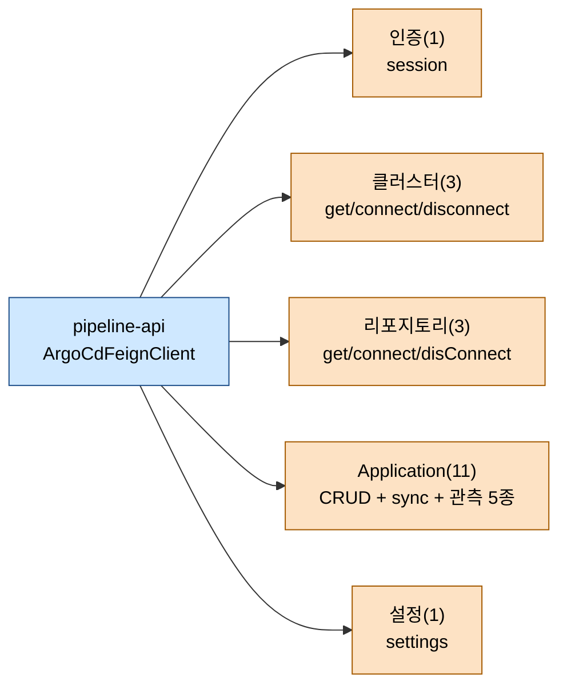

# ArgoCD API 레퍼런스

---

> 목적: TPS pipeline-api가 호출하는 ArgoCD REST 엔드포인트를 한 장에 묶어 용도·파라미터·응답 구조·연관 API를 정리한다.
> 작성일: 2026-04-18
> 대상 코드: `pipeline-api/.../v2/infrastructure/config/argocd/v2/ArgoCdFeignClient.java`

## 1. 결론

TPS가 ArgoCD에서 쓰는 API는 **총 18개**다. 인증 1개, 클러스터 3개, 리포지토리 3개, Application 11개로 Application 영역이 가장 크다. 모든 호출은 `/api/v1/session`으로 받은 Bearer 토큰을 `Authorization` 헤더에 실어 간다. Feign 인터페이스가 `URI baseUrl`을 첫 인자로 받는 관례는 SonarQube와 동일하다. TPS는 Application의 "만들고, 고치고, 동기화하고, 모니터링하고, 지우는" 표준 라이프사이클에 맞춰 API를 묶었다. ApplicationSet, Project, GPG 키 같은 ArgoCD 상위 기능은 현재 사용하지 않는다.

## 2. 전체 API 한눈에



## 3. 인증·설정

| # | 엔드포인트 | Feign 메서드 | 목적 | 비고 |
|---|-----------|--------------|------|------|
| 1 | `POST /api/v1/session` | `getApiToken` | username/password로 Bearer 토큰 발급 | 호출마다 재발급 (캐싱 없음) |
| 2 | `GET /api/v1/settings` | `selectArgoCdSettingInfo` | 서버 설정(기본 네임스페이스 등) 조회 | 사전 점검, Application 기본값 세팅 |

토큰은 응답 JSON `{"token":"..."}`에서 꺼내 `"Bearer " + token` 문자열로 조립해 이후 모든 호출의 `Authorization` 헤더에 넣는다.

## 4. 클러스터

| # | 엔드포인트 | Feign 메서드 | 목적 | 파라미터 |
|---|-----------|--------------|------|----------|
| 3 | `GET /api/v1/clusters/{clusterUrl}` | `getCluster` | 등록 클러스터 상태/메타 조회 | path `clusterUrl` |
| 4 | `POST /api/v1/clusters` | `connectCluster` | K8s 클러스터 연결 등록 | 바디 `Map<String,Object>` (server, config, …) |
| 5 | `DELETE /api/v1/clusters/{clusterUrl}` | `disconnectCluster` | 연결 해제 | path + body |

`clusterUrl`은 K8s API 서버의 URL 전체를 경로 변수로 넣는다. 슬래시/콜론이 포함되므로 `URLEncoder.encode(clusterUrl, UTF-8)`로 반드시 먼저 인코딩한다. 이 관례는 06 문서에서 설명했다.

## 5. 리포지토리

| # | 엔드포인트 | Feign 메서드 | 목적 | 파라미터 |
|---|-----------|--------------|------|----------|
| 6 | `GET /api/v1/repositories/{encodeRepoUrl}` | `getRepository` | 등록 리포 상태/자격증명 확인 | path `encodeRepoUrl` |
| 7 | `POST /api/v1/repositories` | `connectRepository` | 리포지토리 연결(Git/Helm) | 바디 `Map<String,Object>` (repo, username, password, …) |
| 8 | `DELETE /api/v1/repositories/{encodeRepoUrl}` | `disConnectRepository` | 연결 해제 | path + body |

Git 리포뿐 아니라 Helm 차트 리포도 같은 엔드포인트로 관리된다. `type: git` 또는 `type: helm` 필드로 구분한다.

## 6. Application 라이프사이클

Application 영역이 가장 크고, 11개 엔드포인트가 CRUD·sync·관측 세 무리로 나뉜다.

### 6.1 CRUD (4개)

| # | 엔드포인트 | Feign 메서드 | 목적 |
|---|-----------|--------------|------|
| 9 | `POST /api/v1/applications` | `createApplication` | Application 생성 (manifests, source, destination) |
| 10 | `GET /api/v1/applications/{appName}` | `getApplication` | 상세 상태 + spec 조회 |
| 11 | `PUT /api/v1/applications/{appName}` | `updateApplication` | source/spec 수정 (07 문서 Helm 분기에서 호출) |
| 12 | `DELETE /api/v1/applications/{appName}` | `deleteApplication` | Application 제거 (cascade 옵션은 body에 지정) |

### 6.2 Sync (1개)

| # | 엔드포인트 | Feign 메서드 | 목적 |
|---|-----------|--------------|------|
| 13 | `POST /api/v1/applications/{appName}/sync` | `syncApplication` | 매니페스트 → K8s 반영 트리거 |

`sync` 바디 주요 필드는 `revision`, `prune`, `dryRun`, `strategy`(apply/hook), `syncOptions[]`, `resources[]`다. 07 문서에서 다뤘듯이 기본값은 `prune=false`, `dryRun=false`, `strategy.hook`이다.

### 6.3 관측 (6개)

| # | 엔드포인트 | Feign 메서드 | 목적 |
|---|-----------|--------------|------|
| 14 | `GET /api/v1/applications/{appName}/resource-tree` | `selectApplicationResourceTree` | Application이 소유한 K8s 리소스 트리 |
| 15 | `GET /api/v1/applications/{appName}/resource` | `selectApplicationManifestResource` | 특정 리소스의 manifests JSON |
| 16 | `GET /api/v1/applications/{appName}/events` | `selectApplicationEventsResource` | 리소스 이벤트 로그 |
| 17 | `GET /api/v1/applications/{appName}/managed-resources` | `selectApplicationManagedResources` | 관리 중 리소스 전체 목록 |
| 18 | `GET /api/v1/applications/{appName}/managed-resources` | `selectApplicationManagedResourcesDiff` | 동일 경로에 `fields`만 다르게 — Diff 전용 뷰 |
| 19 | `GET /api/v1/applications/{appName}/resource/links` | `selectApplicationLinks` | 리소스 링크(ingress, service 등) |

관측 API는 파라미터가 많다(`namespace`, `resourceName`, `version`, `group`, `kind`, `appNamespace`, `project`). UI의 리소스 상세 페이지가 화면 구성 요소별로 각자 호출한다.

## 7. 호출 규약과 시그니처

Feign 선언부 예시는 다음과 같다.

```java
// ArgoCdFeignClient.java:78-82 (발췌)
@PostMapping("/api/v1/applications/{appName}/sync")
ResponseEntity<Map<String, Object>> syncApplication(URI baseUri,
        @RequestHeader("Authorization") String bearerAuth,
        @PathVariable String appName,
        @RequestBody Map<String, Object> data);
```

모든 메서드가 `URI baseUri`(또는 `baseUrl`) + `Authorization` 헤더를 공통 앞자락으로 쓴다. `@FeignClient(url = "argoCd-placeholder")` 값은 자리표시자이고 실제 URL은 `URI` 인자로 런타임에 주입된다. 새 API를 추가할 때 이 관례를 어기면 호출 시 placeholder 문자열이 그대로 DNS 조회 대상이 된다.

## 8. 응답 구조 요약

| 엔드포인트 | 응답 주요 키 |
|-----------|--------------|
| `/session` | `token` |
| `/clusters/{url}` | `server`, `name`, `config`, `info.connectionState.status` |
| `/repositories/{url}` | `repo`, `type`, `connectionState.status` |
| `/applications/{name}` | `metadata`, `spec.source`, `spec.destination`, `status.sync.status`(Synced/OutOfSync), `status.health.status`(Healthy/Degraded) |
| `/applications/{name}/sync` | `metadata`, `operation.sync`, `status.operationState.phase`(Running/Succeeded/Failed) |
| `/resource-tree` | `nodes[]` — K8s 리소스 트리 (kind/name/namespace/health/status) |

`status.sync.status`와 `status.operationState.phase` 두 필드가 동기화 결과 판정의 핵심이다.

## 9. 유사/연관 공식 API (TPS 미사용)

ArgoCD는 API 범위가 매우 넓다. 아래 표는 현재 TPS에서 호출하지 않지만 기능 확장 시 검토 1순위다.

| 네임스페이스 | 미사용 엔드포인트 | 용도 | 도입 시 고려점 |
|--------------|-------------------|------|----------------|
| AppProject | `/api/v1/projects` (CRUD) | Application 그룹핑, 네임스페이스/클러스터 화이트리스트 | 다중 프로젝트 운영 시 보안/격리 향상 |
| ApplicationSets | `/api/v1/applicationsets` (CRUD) | Application 동적 생성 템플릿 (PullRequest, Git, List generator) | 다수 Application 자동화 후보 |
| Accounts | `/api/v1/account/{name}/token`, `/can-i` | 계정별 토큰 발급, 권한 체크 | 사용자 단위 토큰으로 Basic 대체 |
| GPG keys | `/api/v1/gpgkeys` | 서명된 매니페스트 검증 | 공급망 보안 도입 시 |
| Certificates | `/api/v1/certificates` | 사설 Git/Helm 서버 CA 인증서 | 보안 인증 체인 관리 |
| Repository Credentials | `/api/v1/repocreds` | 자격증명 템플릿(여러 리포 공용) | 자격증명 재사용 |
| ApplicationSync Windows | `/api/v1/applications/{name}/resource-actions` | Pod restart 등 액션 | 운영 중 즉시 재기동 |
| Application Rollback | `POST /api/v1/applications/{name}/rollback` | ArgoCD 네이티브 롤백 | 09 문서의 Git 기반 수동 롤백 대체 후보 |
| Notifications | `/api/v1/stream/applications` (SSE) | 상태 변경 스트리밍 | 폴링 방식 대체 |
| Version | `/api/version` | 서버 버전 | 업그레이드 호환성 확인 |
| Audit | `/api/v1/applications/{name}/events` *(부분 사용)* | 이벤트 감사 | 장애 원인 추적 |

특히 **Application Rollback** 엔드포인트(`POST /applications/{name}/rollback`)는 09 문서의 "Git 매니페스트를 되감아 sync"하는 방식보다 훨씬 단순하다. 단, 이 API는 `deploymentHistory` 레코드가 있어야만 쓸 수 있고 보관 기간이 짧다. TPS의 "과거 N일 이상 전 버전으로도 롤백" 요구에는 Git 기반이 유리한 측면이 있어 현재 방식이 선택된 것으로 보인다.

**ApplicationSets**는 Application을 수백 개 생성해야 하는 상황에서 템플릿 하나로 묶는 기능이다. 현재 TPS는 업무/환경별 1:1 Application을 쓰므로 필요성이 낮지만, 멀티 테넌트 고객사 대응 시 재검토할 만하다.

**AppProject**는 도입 효과가 가장 큰 미사용 영역이다. 네임스페이스·클러스터·리포지토리 화이트리스트를 AppProject에 묶어두면 잘못된 target cluster로 배포되는 실수를 서버 단에서 차단할 수 있다. 현재는 Application 단위 검증만으로 방어한다.

## 10. 인증·보안 관점

| 항목 | 현재 구현 | 공식 권장 |
|------|-----------|-----------|
| 인증 | `/api/v1/session` + username/password | API 토큰(`/api/v1/account/{name}/token`) 또는 OIDC |
| 토큰 캐싱 | 호출마다 재발급 | TTL 기반 캐시 |
| 네임스페이스 격리 | Application spec에 직접 명시 | AppProject로 허용 네임스페이스 제한 |
| 매니페스트 서명 | 미사용 | `configManagementPlugins` + GPG 검증 |

운영 규모가 커지면 토큰 캐싱과 AppProject 도입이 가장 큰 개선 포인트다.

## 11. 해석과 주의점

`managed-resources` 엔드포인트(#17, #18)가 같은 URL을 공유하는 이유는 ArgoCD 서버가 `fields` 쿼리 파라미터로 응답 모양을 바꾸기 때문이다. Feign에서 둘을 별도 메서드로 분리한 건 `fields=..`만 넣을 때와 `namespace/name/kind`까지 넣을 때의 요구 파라미터 집합이 완전히 달라서다. 한 메서드로 합치려면 모든 파라미터를 옵셔널로 만들어야 해서 현재 구조가 실용적이다.

`createApplication`은 `updateApplication`과 바디 스키마(`ArgoCdApplicationRequest`)가 같다. Application 이름이 이미 존재하면 409를 돌려준다. TPS는 생성 전에 `getApplication`으로 존재 여부를 먼저 확인하지 않고 바로 POST를 날리는 경로가 일부 있는데, 운영 환경에서 경쟁 조건(동시에 두 클라이언트가 같은 이름을 만들려는 상황)이 드물어 문제가 되지 않았다. 멀티 테넌트로 늘리면 선행 조회가 필요하다.

마지막으로 18개 API는 ArgoCD 2.x 공식 스펙과 호환된다. 3.x로 업그레이드 시 `/api/v1/` 경로 일부가 `/api/v2/`로 이동하거나 응답 필드가 재구성될 수 있으므로, `Map<String, Object>` 의존 구간이 깨지지 않는지 통합 테스트 환경에서 전 엔드포인트를 한 번씩 호출해 확인하는 게 안전하다.
