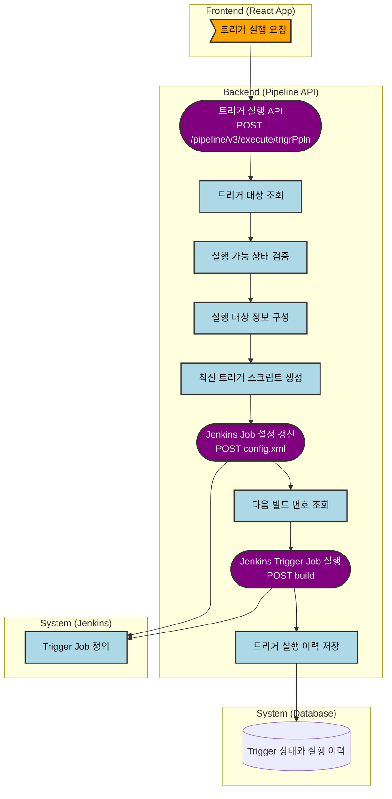

# 트리거 실행 시 Jenkins 수정 여부
---
> 이 문서는 `pipeline-api` 기준으로 트리거 실행 시점에 Jenkins Job 정의가 실제로 수정되는지 확인하는 목적의 문서다.

## 1. 결론
결론은 **예**다. 다만 트리거를 생성하는 시점이 아니라 **트리거를 실행하는 시점**에 Jenkins Job 정의를 다시 올린다.

트리거 실행 경로는 실행 요청을 받은 뒤 최신 트리거 스크립트를 생성하고, Jenkins `config.xml`을 업데이트한 다음 Jenkins build를 호출한다. 따라서 "실행 시 Jenkins 파이프라인을 수정하는 형식"이 존재한다고 보는 것이 맞다.

## 2. 프로세스 흐름도

## 3. 핵심 코드 흐름
핵심 흐름은 다음 순서다:

- `TriggerV3Controller`가 `/pipeline/v3/execute/trigrPpln` 요청을 받는다.
- `TriggerService.executeTriggerPipeline()`가 트리거 레코드를 읽고 실행 가능 여부를 검증한다.
- `PipelineProcessorImpl.executeTriggerPipeline()`가 `TriggerPipelineVo`를 Jenkins 실행용 `TriggerJobVo`로 변환한다.
- `JenkinsService.executeTriggerPipeline()`가 내부에서 `upsertTriggerPipeline()`를 먼저 호출한다.
- `upsertTriggerPipeline()`가 Freemarker로 최신 스크립트를 만든 뒤 `updatePipeline()`을 호출한다.
- `updatePipeline()`가 Jenkins `config.xml`을 갱신한다.
- Jenkins build 요청이 성공하면 실행 이력을 `IN_PROGRESS`로 저장한다.

## 4. 코드 근거
| 단계 | 코드 위치 | 의미 |
| :--- | :--- | :--- |
| 실행 API 진입점 | `pipeline-api/.../TriggerV3Controller.java:75-81` | 트리거 실행 요청을 받는다. |
| 실행 본체 | `pipeline-api/.../TriggerService.java:157-219` | 트리거 조회, 검증, Jenkins 실행, 결과 저장을 처리한다. |
| Jenkins 실행 위임 | `pipeline-api/.../PipelineProcessorImpl.java:229-235` | 트리거 정보를 Jenkins 유틸 계층으로 넘긴다. |
| 실행 전 upsert | `pipeline-api/.../JenkinsService.java:252-268` | 실행 전에 먼저 `upsertTriggerPipeline()`를 호출한다. |
| 스크립트 생성과 update | `pipeline-api/.../JenkinsService.java:382-401` | 최신 스크립트를 만들고 `updatePipeline()`을 호출한다. |
| Jenkins config 수정 | `pipeline-api/.../JenkinsService.java:115-156` | Jenkins `config.xml`을 갱신한다. |
| Jenkins API | `pipeline-api/.../JenkinsFeignClient.java:91-99` | `config.xml` 업데이트 API가 정의되어 있다. |
| 트리거 생성 경로 | `pipeline-api/.../TriggerWriterImpl.java:63-155` | 생성은 DB upsert 중심이며 Jenkins 직접 수정이 아니다. |

## 5. 해석
트리거 실행은 단순히 기존 Job을 build 하는 흐름이 아니다. 실행 직전에 최신 스크립트를 다시 계산해 Jenkins Job 정의를 갱신하므로, 운영 관점에서는 "실행 시점 동적 동기화 후 실행" 구조다.

이 점 때문에 "트리거를 실행하면 Jenkins Job이 수정되느냐"라는 질문에는 예라고 답할 수 있다. 다만 Jenkins 수정 책임은 트리거 생성 API가 아니라 트리거 실행 로직에 들어 있다.

## 6. 변경 이력
| 날짜 | 작성자 | 내용 | 비고 |
| :--- | :--- | :--- | :--- |
| 2026-04-12 | Codex | 트리거 실행 시 Jenkins 수정 여부 문서 분리 작성 | - |
