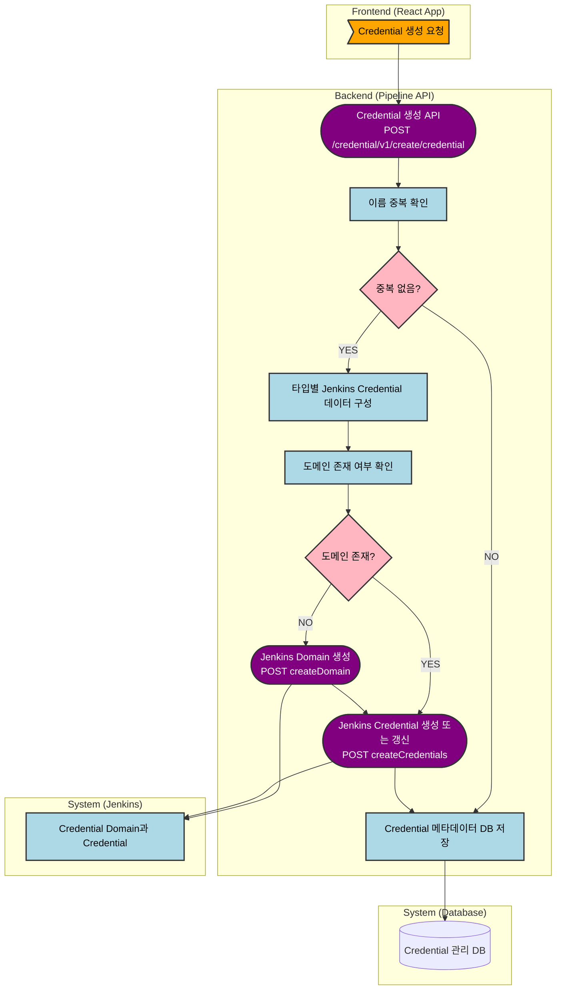

# 파이프라인 생성 시 Credential 연계 여부
---
> 이 문서는 `pipeline-api` 기준으로 파이프라인 생성 시 credential이 자동으로 함께 생성되는지 확인하는 목적의 문서다.

## 1. 결론
결론은 **아니오**다. 파이프라인 생성·수정 흐름과 credential 생성 흐름은 분리되어 있다.

credential 기능 자체는 존재한다. 하지만 별도 REST API와 별도 도메인 서비스에서 독립적으로 처리된다. 파이프라인 생성, 일반 실행, 트리거 생성, 트리거 실행 경로에서는 credential 생성 서비스 호출이 확인되지 않았다.

## 2. 프로세스 흐름도

## 3. 핵심 코드 흐름
credential 생성은 다음 순서다:

- `CredentialManagementController`가 생성 요청을 받는다.
- `CredentialAdapter.createCredential()`가 타입 코드 유효성과 이름 중복 여부를 확인한다.
- 타입별로 username/password, SSH private key, secret text 중 하나의 Jenkins payload를 만든다.
- Jenkins domain이 없으면 먼저 생성한다.
- 기존 credential이 있으면 update, 없으면 create 한다.
- Jenkins 반영이 끝나면 DB 메타데이터를 저장한다.

반대로 파이프라인 생성·수정이나 트리거 실행 쪽에서는 이 경로가 호출되지 않는다.

## 4. 코드 근거
| 구분 | 코드 위치 | 의미 |
| :--- | :--- | :--- |
| Credential API | `pipeline-api/.../CredentialManagementController.java:52-80` | 생성, 수정, 삭제가 별도 API로 분리되어 있다. |
| 생성 오케스트레이션 | `pipeline-api/.../CredentialAdapter.java:83-112` | 중복 검사 후 Jenkins 반영과 DB 저장을 수행한다. |
| 타입별 분기 | `pipeline-api/.../CredentialAdapter.java:150-189` | 타입별 Jenkins payload를 만든다. |
| Domain 확인과 생성 | `pipeline-api/.../JenkinsService.java:622-685` | domain 조회 후 없으면 생성한다. |
| Sync 로직 | `pipeline-api/.../JenkinsService.java:723-768` | 기존 credential이 있으면 update, 없으면 create 한다. |
| 실제 create | `pipeline-api/.../JenkinsService.java:772-808` | Jenkins `createCredentials` 호출로 등록한다. |
| Jenkins credential API | `pipeline-api/.../JenkinsFeignClient.java:164-233` | domain/credential 조회·생성·수정·삭제 엔드포인트가 있다. |
| 파이프라인·트리거 경로 내 호출 부재 | `pipeline-api`의 `application/trigger`, `application/ticket`, `domain/pipeline`, `domain/trigger` 검색 결과 | credential 관련 호출이 없다. |

## 5. 파이프라인 생성과의 관계
파이프라인 생성에서 보이는 흐름은 "통합관리 생성 -> 요청 검증 -> Jenkins Job 생성 -> DB 저장"이다. 이 경로에는 credential 관련 API 호출이 없다.

따라서 현재 구조는 "파이프라인 정의 관리"와 "credential 관리"를 분리한 구조다. 운영 사용자는 별도 credential 관리 화면이나 API를 통해 먼저 credential을 만들어 두고, 이후 파이프라인 스크립트나 파라미터에서 이를 참조하는 방식으로 이해하는 것이 맞다.

## 6. 변경 이력
| 날짜 | 작성자 | 내용 | 비고 |
| :--- | :--- | :--- | :--- |
| 2026-04-12 | Codex | 파이프라인 생성 시 Credential 연계 여부 문서 분리 작성 | - |
