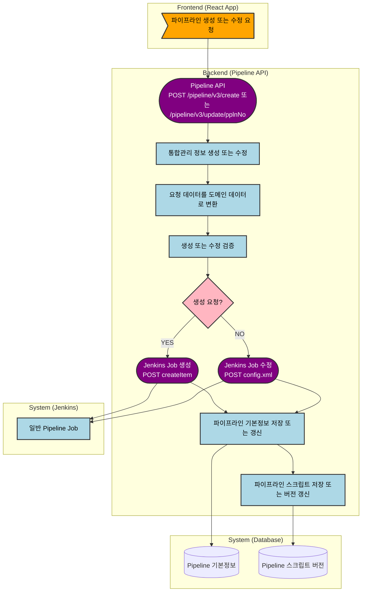

# 일반 파이프라인 생성·수정 흐름
---
> 이 문서는 `pipeline-api` 기준으로 일반 파이프라인의 생성과 수정이 Jenkins와 DB에 어떤 순서로 반영되는지 정리한 문서다.

## 1. 결론
일반 파이프라인 생성과 수정은 둘 다 **Jenkins 반영이 먼저, DB 저장이 나중**이다.

생성은 Jenkins `createItem`을 먼저 호출하고, 성공하면 파이프라인 기본정보와 스크립트를 DB에 저장한다. 수정은 Jenkins `config.xml`을 먼저 갱신하고, 성공하면 파이프라인 기본정보와 스크립트 버전을 DB에 반영한다.

## 2. 프로세스 흐름도

## 3. 생성 흐름
생성 흐름은 다음과 같다:

- `PipelineV3Controller`가 `/pipeline/v3/create` 요청을 받는다.
- `PipelineService.createPipeline()`가 통합관리 정보를 먼저 만든다.
- 요청을 `PipelineUpsertVo`로 변환하고 생성 검증을 수행한다.
- `PipelineProcessor.createJenkinsPipeline()`가 Jenkins Job 생성 API를 호출한다.
- Jenkins 생성이 성공하면 `PipelineWriter.createPipeline()`가 DB 기본정보와 최초 스크립트를 저장한다.

## 4. 수정 흐름
수정 흐름은 다음과 같다:

- `PipelineV3Controller`가 `/pipeline/v3/update/{pplnNo}` 요청을 받는다.
- `PipelineService.updatePipeline()`가 기존 데이터를 조회하고 통합관리 정보를 수정한다.
- 요청을 `PipelineUpsertVo`로 변환하고 수정 검증을 수행한다.
- `PipelineProcessor.updateJenkinsPipeline()`가 Jenkins Job 설정을 갱신한다.
- Jenkins 수정이 성공하면 `PipelineWriter.updatePipeline()`가 DB 기본정보를 갱신하고 스크립트 새 버전을 저장한다.

## 5. 코드 근거
| 단계 | 코드 위치 | 의미 |
| :--- | :--- | :--- |
| 생성·수정 API | `pipeline-api/.../PipelineV3Controller.java:69-91` | 생성과 수정의 진입점이다. |
| 생성 서비스 | `pipeline-api/.../PipelineService.java:111-139` | 통합관리 생성 -> 검증 -> Jenkins 생성 -> DB 저장 순서다. |
| 수정 서비스 | `pipeline-api/.../PipelineService.java:144-170` | 기존 데이터 조회 -> 통합관리 수정 -> 검증 -> Jenkins 수정 -> DB 갱신 순서다. |
| Jenkins 생성/수정 위임 | `pipeline-api/.../PipelineProcessorImpl.java:143-155` | Jenkins 반영을 유틸 계층으로 위임한다. |
| Jenkins 생성/수정 구현 | `pipeline-api/.../JenkinsService.java:61-156` | `createItem`과 `config.xml` 기반으로 Job을 반영한다. |
| DB 저장/갱신 | `pipeline-api/.../PipelineWriterImpl.java:35-57` | 파이프라인 기본정보와 스크립트 정보를 반영한다. |
| Jenkins API 정의 | `pipeline-api/.../JenkinsFeignClient.java:79-99` | 생성과 수정 API가 분리되어 있다. |

## 6. 생성과 수정의 차이
| 항목 | 생성 | 수정 |
| :--- | :--- | :--- |
| 통합관리 처리 | `createIntgrtdInfo()` | `updateIntgrtdInfo()` |
| Jenkins 반영 | `createPipeline()` | `updatePipeline()` |
| DB 기본정보 | 신규 저장 | 기존 데이터 갱신 |
| 스크립트 처리 | 최초 저장 | 새 버전 갱신 |
| 감사로그 | before 없음 | before/after 모두 기록 |

## 7. 해석
이 구조는 Jenkins를 최종 진실 원천처럼 먼저 다루고, 애플리케이션 DB는 그 결과를 뒤따라 기록하는 방식이다. 따라서 Jenkins 반영이 실패하면 DB와 Jenkins의 불일치를 줄일 수 있다.

운영 관점에서는 "생성/수정 API를 호출하면 곧바로 Jenkins Job 정의가 변경된다"라고 이해하면 된다. 이 흐름은 트리거 생성과는 다르며, 일반 파이프라인은 요청 시점에 바로 Jenkins에 반영된다.

## 8. 변경 이력
| 날짜 | 작성자 | 내용 | 비고 |
| :--- | :--- | :--- | :--- |
| 2026-04-12 | Codex | 일반 파이프라인 생성·수정 흐름 문서 분리 작성 | - |
